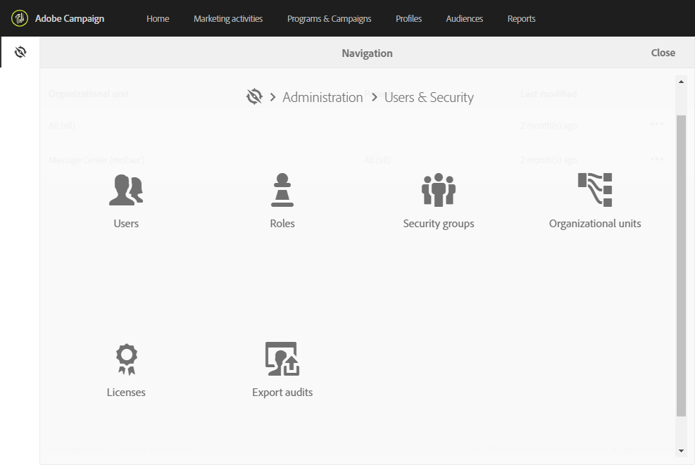
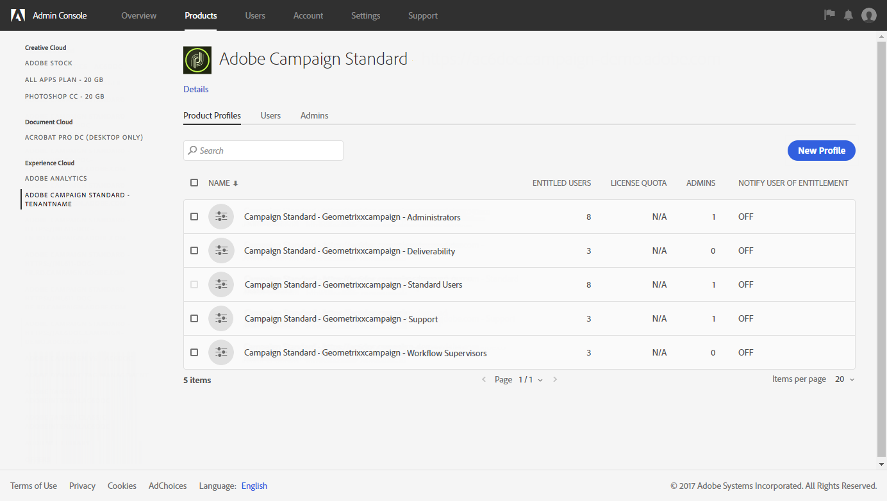

# Sobre gerenciamento de acesso{#about-access-management}

O Adobe Campaign permite definir e gerenciar as permissões atribuídas a usuários diferentes. As permissões são um conjunto de direitos e restrições que autorizam ou negam acesso a determinadas funcionalidades ou objetos na interface. Essas permissões se baseiam em dois conceitos:

* **Unidades organizacionais**: permitem definir uma hierarquia de permissões nos diferentes objetos da plataforma (emails, fluxos de trabalho, modelos, usuários, perfis etc.). Consulte a seção [Unidades organizacionais](../../administration/using/organizational-units.md).
* **Funções**: um conjunto de direitos unitários que permitem definir as autorizações atribuídas a usuários e grupos de usuários. Consulte a seção [Lista de funções](../../administration/using/list-of-roles.md).

  Combinadas com as unidades organizacionais, as funções exibem uma visualização filtrada da interface e definem o acesso dos usuários aos diferentes recursos. Para saber mais, consulte a [Tabela de autorizações](../../administration/using/list-of-roles.md).

>[!IMPORTANT]
>
>Observe que o recurso de unidade geográfica foi removido. Para obter mais informações, consulte esta [página](../../rn/using/deprecated-features.md).

As funções, os grupos e as unidades organizacionais podem ser gerenciadas pelo administrador funcional da plataforma, no menu **[!UICONTROL Administration > Users & Security]**.

Os usuários são gerenciados na Admin Console. Saiba mais na seção [Gerenciamento de grupos e usuários](../../administration/using/managing-groups-and-users.md) e na [documentação do Admin Console](https://helpx.adobe.com/br/enterprise/admin-guide.html).

>[!IMPORTANT]
>
>Somente os usuários com direitos administrativos têm acesso ao gerenciamento de usuários.

**Tópicos relacionados**

* [Unidades organizacionais](../../administration/using/organizational-units.md)
* [Lista de funções](../../administration/using/list-of-roles.md)
* [Gerenciamento de grupos e usuários](../../administration/using/managing-groups-and-users.md)
