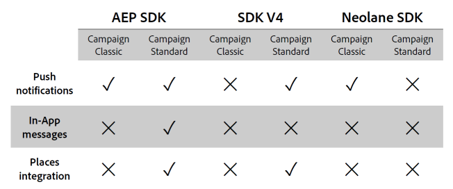

# Perguntas frequentes sobre a integração com o Experience Platform SDK {#aep-faq}

Para enviar notificações por push e mensagens no aplicativo com o aplicativo Experience Platform SDK, um aplicativo para dispositivos móveis deve ser configurado no Adobe Experience Platform SDK e no Adobe Campaign.

A seção abaixo lista perguntas comuns sobre essa sincronização.

Para obter mais informações sobre push ou no aplicativo, consulte as seguintes perguntas frequentes:

* [Perguntas frequentes sobre notificação por push](../../channels/using/about-push-notifications.md#push-faq)
* [Perguntas frequentes no aplicativo](../../channels/using/in-app-faq.md)
* [Perguntas frequentes sobre tags na sincronização da Adobe Experience Platform](../../administration/using/syncwithlaunch-faq.md)

## Recursos úteis antes de iniciar {#resource-mobile-property}

Confira os recursos abaixo para obter mais informações sobre a integração do Adobe Experience Platform SDK e do Campaign Standard:

* [Vídeo de visão geral](https://www.adobe.com/experience-platform/launch.html#acpl-mobile-video){target="_blank"} do Launch/Mobile
* [Guia de dicas e truques do Launch/Mobile](https://www.adobe.com/content/dam/dx/us/en/products/experience-platform/launch-tag-manager/pdfs/adobe-cloud-platform-launch-tips-and-tricks-sheet.pdf)

## A integração do Adobe Experience Platform SDK está disponível para o Adobe Campaign Standard e o Adobe Campaign Classic? {#aep-validity}

Sim, a integração do [!DNL Adobe Experience Platform SDK] está disponível para o Adobe Campaign Standard e o Adobe Campaign Classic. Você deve instalar o **[!UICONTROL Extension]** correspondente por meio do [!DNL Data Collection UI] para habilitar a integração.

Para obter mais informações, consulte esta [página](https://developer.adobe.com/client-sdks/documentation/adobe-campaign-standard){target="_blank"}.

## Quais recursos a integração do Adobe Experience Platform SDK facilita no Adobe Campaign? {#aep-capabilities}

Consulte a tabela abaixo para saber mais sobre esses recursos.

>[!NOTE]
>
>A integração do [!DNL Places] inclui eventos de locais como acionadores para mensagens no aplicativo (N/D para notificações por push), enriquecendo perfis com suporte a dados do [!DNL Places] e notificações locais. Consulte esta [página](../../channels/using/preparing-and-sending-an-in-app-message.md) para obter mais informações. A integração limitada  [!DNL Places] inclui o enriquecimento de perfis com dados [!DNL Places].

## Que caso de uso a integração do Adobe Experience Platform SDK facilita no Adobe Campaign Standard? {#aep-use-cases}

Os seguintes casos de uso são compatíveis:

* Adquirir um **[!UICONTROL Mobile Profile]** no Campaign (identificado pela ECID na guia **[!UICONTROL Administration]** > **[!UICONTROL Channels]** > **[!UICONTROL Mobile app (AEP SDK)]** > **[!UICONTROL Mobile Application subscribers]**)
* Enriquecer um **[!UICONTROL Mobile Profile]** no Adobe Campaign (requer **[!UICONTROL Custom resource Extension]** da tabela appSubscriberRcp)
* Adquirir um token de push para enviar mensagens de push (requer a aceitação do usuário para receber mensagens de push)
* Enviar mensagens de push e no aplicativo
* Rastrear a interação do usuário com mensagens de push e no aplicativo e fornecer relatórios sobre isso

## O que preciso fazer para adquirir um perfil móvel no Campaign? {#mobile-profile-campaign}

Para isso, siga as etapas abaixo:

1. Configurar um **[!UICONTROL Mobile property]** em [!DNL Launch].
1. Instale a extensão Adobe Campaign Standard. Observe que a extensão do Adobe Campaign Standard também requer extensões **[!UICONTROL Mobile Core]**, **[!UICONTROL Profile]** e **[!UICONTROL Lifecycle]** que são instaladas por padrão em [!DNL Launch].
   * Os usuários devem configurar o tempo limite da sessão na extensão **[!UICONTROL Mobile Core]**, que afeta a frequência de eventos do ciclo de vida.
   * Depois que a extensão é configurada, os usuários devem adicionar as dependências apropriadas no aplicativo móvel usando Cocoapods para iOS e Gradle para Android. Siga as instruções [aqui](https://developer.adobe.com/client-sdks/documentation/adobe-campaign-standard).
   * Use sempre as versões mais recentes das bibliotecas.
   * No Aplicativo Móvel, registre as extensões **[!UICONTROL Campaign]**, **[!UICONTROL UserProfile]**, **[!UICONTROL Identity]**, **[!UICONTROL Lifecycle]** e **[!UICONTROL Signal]**. Siga as instruções [aqui](https://developer.adobe.com/client-sdks/documentation/adobe-campaign-standard/#register-the-campaign-standard-extension-with-mobile-core).
   * Depois que as extensões forem registradas, inicie o ACPCore. Para o Android, certifique-se de setApplication onCreate(). Siga as instruções exatas fornecidas nas Instruções de instalação móvel para sua propriedade móvel no Launch.
   * As seguintes APIs do SDK também serão necessárias. Implemente as APIs de Início e Pausa do Ciclo de Vida conforme descrito [aqui](https://developer.adobe.com/client-sdks/documentation/mobile-core/lifecycle/android) para o Android e aqui para o iOS.
1. Configure um **[!UICONTROL Mobile Property]** no Adobe Campaign Standard. Siga o procedimento [aqui](../../administration/using/configuring-a-mobile-application.md#channel-specific-config).

## O que preciso fazer para enriquecer um perfil móvel no Campaign? {#enrich-mobile-profile}

Você deve configurar um postback CollectPII (consulte esta [página](../../administration/using/configuring-rules-launch.md#pii-postback)) e implementar a API CollectPII da SDK (consulte esta [página](https://developer.adobe.com/client-sdks/documentation/mobile-core/api-reference)).

## Com que frequência uma chamada CollectPII deve ser disparada? {#collect-pii}

O objetivo da chamada CollectPII é enriquecer o perfil móvel no Campaign. Ele deve ser acionado sempre que houver novas informações relevantes que os clientes gostariam de adicionar ao perfil, dependendo de seus casos de uso e necessidades comerciais.

## As chamadas CollectPII podem ser acionadas em resposta a vários eventos de acionador? {#collect-pii-calls}

Sim. Dependendo da sua necessidade comercial, você pode acionar chamadas CollectPII em resposta ao logon do usuário no aplicativo, à compra de algo, ao evento de ciclo de vida ou à entrada de um usuário em uma geofence etc. Resumindo, uma interação do usuário com o aplicativo que gera informações que você gostaria de usar para o enriquecimento do Perfil.

## Posso apenas disparar chamadas CollectPII em resposta a todos os eventos móveis? {#collect-pii-events}

A frequência e o design das chamadas CollectPII devem ser ditados pelas necessidades dos negócios e não devem ser disparados às cegas, pois criam carga extra no BD.

### Quando eu tento acessar os Aplicativos Adobe Experience Platform no Campaign ou no Launch, às vezes recebo um erro de propriedade não disponível. {#aep-error}

Esse é um problema conhecido e ocorre devido à expiração do token. Você deve tentar fazer logoff e logon.

## Quais seriam algumas recomendações de recursos úteis para saber mais sobre o Adobe Experience Platform SDK (conhecido anteriormente como SDK V5)?{#resource-aep}

Confira os recursos abaixo:

* Documentação [do Experience Platform SDK](https://developer.adobe.com/client-sdks/documentation/)
* Introdução à [documentação](https://developer.adobe.com/client-sdks/documentation/getting-started/create-a-mobile-property/) do Launch e Experience Platform SDK
* Atualizando para a [documentação](https://developer.adobe.com/client-sdks/resources/upgrade-platform-sdks/) do Experience Platform SDK
* Documentação [do Github Experience Platform SDK](https://github.com/Adobe-Marketing-Cloud/acp-sdks/)

## Estou recebendo o erro &quot;Você não tem acesso de gravação na entrega&quot; ao criar uma entrega de notificação por push. {#write-access-error}

Você deve verificar o seguinte:

* O aplicativo móvel deve ser mapeado para a unidade organizacional do usuário que precisa criar e enviar deliveries por push. O usuário de uma unidade organizacional secundária não pode criar uma entrega por push usando um aplicativo mapeado para a unidade organizacional principal.

* A campanha ou o programa no qual o delivery por push é criado deve ser mapeado para a unidade organizacional do usuário que precisa criar e enviar deliveries por push. O usuário da unidade organizacional secundária não pode criar uma entrega por push em uma campanha ou programa mapeado para a unidade organizacional principal.
