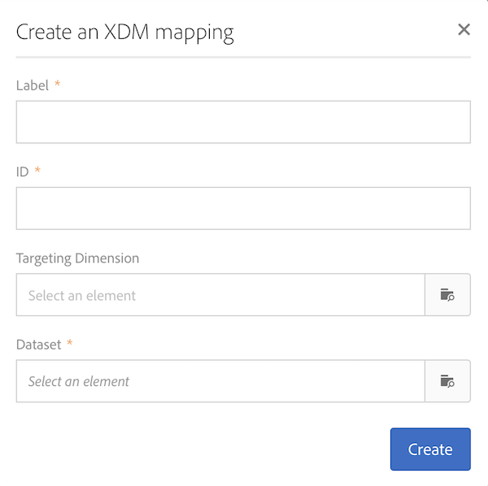

# Definição de mapeamento {#mapping-definition}

>[!IMPORTANT]
>
>O serviço de dados do Campaign Standard está atualmente em beta, o que pode estar sujeito a atualizações frequentes sem aviso prévio. Os clientes precisam estar hospedados no Azure (atualmente em beta somente para a América do Norte) para acessar esses recursos. Entre em contato com o Atendimento ao cliente da Adobe se desejar acessar.

Nesta seção, você descobrirá como mapear um campo do Campaign Standard com um campo do Modelo de dados de experiência (XDM).

Para executar essa tarefa, os pré-requisitos são:

* uma definição de Esquema XDM pela interface ou usando a REST API associada ao XDM
* uma criação de conjunto de dados com base na definição do esquema XDM

1. Vá até **[!UICONTROL Administration]**>**[!UICONTROL Development]** > **[!UICONTROL Platform]**e escolha a**[!UICONTROL Data mappings]** entrada.

1. Clique em **[!UICONTROL Create]**para iniciar um novo mapeamento XDM.

   

1. Preencha os campos obrigatórios e selecione:

   * uma dimensão **de** definição de metas: este é o esquema do Campaign Standard a ser mapeado
   * um **conjunto de dados**: este é o pacote de dados associado a um esquema XDM na Adobe Experience Platform.

>[!NOTE]
>
>Para que um lote seja ingerido no Perfil do cliente em tempo real ou no Serviço de identidade, o conjunto de dados deve ser [ativado para o Perfil](https://www.adobe.io/apis/experienceplatform/home/tutorials/alltutorials.html#!api-specification/markdown/narrative/tutorials/data_ingestion_tutorial/data_ingestion_tutorial.md)do cliente em tempo real.
>
>Se o conjunto de dados selecionado já estiver sendo usado em um mapeamento de dados existente, um aviso será exibido para informá-lo de que seus dados podem ser substituídos na Adobe Experience Platform. Isso pode ocorrer quando há destinatários comuns em aplicativos de dados usando um mesmo conjunto de dados.

A tela a seguir apresenta a **[!UICONTROL Field mappings]**seção na qual você pode criar um novo mapeamento para cada campo no esquema do Campaign Standard.

O **[!UICONTROL Create new field mapping]**botão permite selecionar o campo Padrão de campanha e a expressão do caminho do campo correspondente no esquema XDM.

Se você não conseguir localizar um campo do Campaign Standard, poderá usar o campo de pesquisa para pesquisar pelo campo. Atualmente, a pesquisa só funciona para campos que estão abertos na hierarquia.

Os recursos estendidos definidos no Campaign Standard são mapeados como todos os campos nativos. Eles são definidos na extensão _customer/default no XDM.

Você pode personalizar a extensão XDM por meio da API e definir sua própria extensão, permitindo um melhor controle do mapeamento.

Consulte Tutorial [da API do Registro do](https://www.adobe.io/apis/experienceplatform/home/xdm/xdmservices.html#!api-specification/markdown/narrative/tutorials/schema_registry_api_tutorial/schema_registry_api_tutorial.md) Esquema para obter mais detalhes sobre a API XDM.

Para mapear um campo de enumeração, é necessário usar o editor de expressões para definir cada valor de enumeração correspondente ao valor XDM. Por exemplo, o postalAdressfield precisa ser definido como:

Se o valor XDM for definido como uma enumeração no Esquema XDM, você poderá usar a função EXDM nativa que substituirá automaticamente a sintaxe **lif** .

Para editar um mapeamento XDM, abra-o, modifique as informações desejadas e salve-as.

>[!IMPORTANT]
>
>Por enquanto, se você editar um valor na seção e clicar fora do campo, sua alteração não será exibida na interface até que você clique no **[!UICONTROL Field mappings]****[!UICONTROL Save]** botão. Esse comportamento ocorre apenas uma vez, quando a edição em **[!UICONTROL Field Mappings]**é a primeira edição na página.
