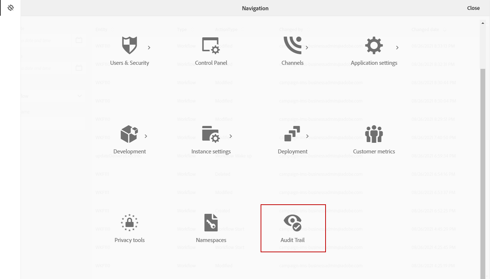

# Trilha de auditoria {#audit}

O **[!UICONTROL Audit trail]** O fornece acesso ao histórico completo das alterações feitas na instância.

**[!UICONTROL Audit trail]** A captura, em tempo real, uma lista abrangente de ações e eventos que ocorrem em sua instância do Adobe Campaign Standard. Ele inclui uma maneira de autoatendimento para acessar um histórico de dados que ajudam a responder perguntas como: o que aconteceu com seus workflows, recursos personalizados e opções, que os atualizaram pela última vez ou o que seus usuários fizeram na instância.

**[!UICONTROL Audit trail]** consiste em três componentes:

* **Trilha de Auditoria de Recursos Personalizados**: verifique a atividade e a última modificação feitas nos recursos personalizados.

   Para obter mais informações sobre **[!UICONTROL Custom resources]** consulte esta seção [página](../../developing/using/key-steps-to-add-a-resource.md).

* **Trilha de auditoria de workflow**: verifique a atividade e a última modificação feitas nos workflows e, além disso, o estado dos workflows, como:

   * Criado
   * Modificado
   * Excluído
   * Início do fluxo de trabalho
   * Pausa do fluxo de trabalho
   * Interrupção do fluxo de trabalho
   * Reinicialização do fluxo de trabalho
   * Limpeza de Fluxo de Trabalho
   * Simulação de fluxo de trabalho
   * Wakeup de workflow
   * Interrupção Imediata do Fluxo de Trabalho
   * Reinicialização do fluxo de trabalho com o mesmo usuário
   * comando Reiniciar fluxo de trabalho desconhecido

   Para obter mais informações sobre **[!UICONTROL Workflows]** consulte esta seção [página](../../automating/using/get-started-workflows.md).

* **Trilha de auditoria de opções**: verifique a atividade e a última modificação feita nas opções.

   Para obter mais informações sobre **[!UICONTROL Options]** consulte esta seção [página](../../administration/using/about-campaign-standard-settings.md).

Observe que, por padrão, o período de retenção é de 30 dias.

## Acessar a trilha de auditoria {#audit-access}

Para acessar a Trilha de auditoria da sua instância:

1. No Adobe Campaign Standard, no menu avançado, selecione **[!UICONTROL Administration]** > **[!UICONTROL Audit trail]**.

   

1. O **[!UICONTROL Audit trail]** será aberta com a lista de suas entidades. A Adobe Campaign Standard auditará as ações criar, editar e excluir ações de fluxos de trabalho, opções e recursos personalizados.

   No **[!UICONTROL Search]** você pode filtrar sua entidade em:

   * **[!UICONTROL Start date]**
   * **[!UICONTROL End date]**
   * **[!UICONTROL Type]**: Tipo de entidade entre Todos, Fluxo de trabalho, Recurso personalizado e Opção.
   * **[!UICONTROL Entity name]**: ID do fluxo de trabalho, opção ou recurso personalizado

   

1. Selecione uma das entidades para saber mais sobre as últimas modificações.

1. A janela Audit entity fornece informações mais detalhadas sobre a entidade escolhida, como:

   * **[!UICONTROL Entity]**: ID do fluxo de trabalho, opção ou recurso personalizado.
   * **[!UICONTROL Action]**: Última ação executada nesta entidade.
   * **[!UICONTROL Changed by]**: Nome de usuário da última pessoa que modificou esta entidade pela última vez.
   * **[!UICONTROL Changed date]**: Data da última ação executada nesta entidade.
   * **[!UICONTROL Content]**: Bloco de código que fornece mais informações sobre o que foi alterado exatamente na sua entidade.

   Neste exemplo, podemos ver que o workflow WKF110 foi iniciado em 26 de agosto pelo administrador comercial desta instância.

   

## Ativar/desativar Trilha de Auditoria {#enable-disable-audit}

>[!NOTE]
>
> Somente administradores funcionais podem ativar ou desativar a Trilha de auditoria. Para obter mais informações, consulte esta [página](../../administration/using/users-management.md#functional-administrators).

A trilha de auditoria pode ser facilmente ativada ou desativada para uma atividade específica.

Para fazer isso:

1. No Adobe Campaign Standard, no menu avançado, selecione **[!UICONTROL Administration]** > **[!UICONTROL Application settings]** > **[!UICONTROL Options]**.

   

1. Selecione uma das seguintes opções, dependendo da entidade que você deseja desativar:

   * **[!UICONTROL XtkAudit_Workflows]** para gerenciar a trilha de auditoria para fluxos de trabalho.
   * **[!UICONTROL XtkAudit_Option]** para gerenciar a Trilha de auditoria para opções.
   * **[!UICONTROL XtkAudit_CusResource]** para gerenciar a trilha de auditoria para recursos personalizados.
   * **[!UICONTROL XtkAudit_Enable_All]** para gerenciar a Trilha de auditoria para cada entidade.

      >[!NOTE]
      >
      >Se a variável **[!UICONTROL XtkAudit_Enable_All]** estiver definida como 0, a variável **[!UICONTROL Audit trail]** será totalmente desativado, independentemente de outros valores de opção individuais.
   

1. Em seu **[!UICONTROL Options]** , defina o **[!UICONTROL Value (integer)]** para 0 se você quiser desativar a variável **[!UICONTROL Audit trail]** ou para 1 para habilitá-lo.

   

1. Clique em **[!UICONTROL Save]**.
