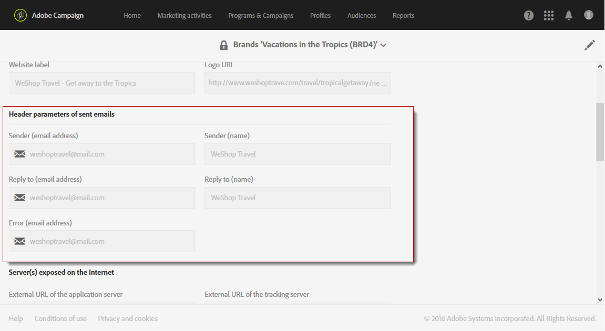

# Marca{#branding}

## Sobre a identidade da marca {#about-brand-identity}

Cada empresa tem diretrizes técnicas e visuais da marca. Com o Adobe Campaign, é possível definir um conjunto de especificações para apresentar uma marca consistente aos seus clientes, de logotipos a aspectos técnicos, como remetente de email, URL ou domínios.

Os administradores técnicos podem definir uma ou várias marcas para centralizar os parâmetros que afetam a identidade de uma marca. Isso inclui o logotipo da marca, o domínio do URL de acesso da landing page ou as configurações de rastreamento de mensagens. Com o Adobe Campaign, você pode criar essas marcas e vinculá-las a mensagens ou landing pages. Essa configuração é gerenciada em modelos.

## Configuração e uso de marcas {#configuring-and-using-brands}

O princípio principal de configurar e usar marcas é:

1. Criar e configurar a marca - essa operação requer permissões específicas e é realizada pelo administrador técnico da Adobe Campaign. As etapas para obter uma nova marca no Campaign são detalhadas [nesta seção](#creating-a-brand).
1. Criar um ou vários modelos de entrega e de landing pages para esta marca. Consulte a seção [Criação de um modelo](../../start/using/marketing-activity-templates.md).
1. Criar mensagens e landing pages com base nesse modelo. Consulte as seções [Criação de emails](../../channels/using/creating-an-email.md) e [Criação de uma landing page](../../channels/using/designing-a-landing-page.md).

>[!IMPORTANT]
>
>As marcas não podem ser criadas ou modificadas pelos usuários finais: essas operações têm de ser efetuadas pelo administrador técnico do Adobe Campaign. Para receber qualquer solicitação, entre em contato com o Atendimento ao cliente da Adobe.
>
>A multimarca não pode ser usada no contexto de mensagens transacionais. Para obter mais informações, consulte [Mensagens transacionais e Identidade visual](../../channels/using/transactional-messaging-limitations.md#permissions-and-branding).

As marcas podem ser encontradas no menu **[!UICONTROL Administration > Instance settings > Brand configuration]**.

Por padrão, uma marca recém-criada é visível somente para usuários atribuídos com os direitos correspondentes pelo administrador.

Uma **Marca** é definida pelas seguintes características:

* Uma **identidade** que define e personaliza sua marca. Esta seção contém os seguintes campos:

  

   * **Rótulo** visível na interface
   * **Nome da marca**
   * **URL do site** e **Rótulo do site** da marca
   * **Logotipo da marca**

* **[!UICONTROL Header parameters of sent emails]** que personaliza o que os destinatários das campanhas verão. Esta seção contém os seguintes campos:

  

   * **Remetente (endereço de email)** com o endereço de email da marca.
   * **Remetente (nome)** com o nome da marca.
   * **Responder a (endereço de email)** com o endereço de email ao qual o cliente pode responder.
   * **Responder a (nome)** com o nome da marca.
   * **Erro (endereço de email)** com o endereço de email que será usado em caso de erro.

  >[!IMPORTANT]
  >
  >Após atualizar os parâmetros de cabeçalho dos emails, caso o nome e o endereço de email do remetente não tiverem sido alterados no email criado a partir do modelo, verifique as configurações avançadas do modelo.

* O(s) **servidor(e)s exposto(s) na Internet** define(m) os servidores usados para rastreamento, mas também para acesso à landing page. Esta seção contém os seguintes campos:

  

   * **URL externo do servidor de aplicativos** usado para hospedar e acessar as diferentes landing pages criadas por você.
   * **URL externo do servidor de rastreamento** usado como o URL rastreado durante as entregas.
   * **URL externo do servidor de mirror pages** usado como mirror page padrão em suas entregas.

  >[!NOTE]
  >
  >Para exibir a pré-visualização da landing page e a renderização da mirror page na interface do usuário do Campaign, os URLs do servidor de aplicativos e de mirror pages devem estar protegidos. Nesse caso, use https:// em vez de http:// ao configurar esses URLs.

* **[!UICONTROL Tracking URL configuration (Web Analytics)]**, que define a configuração do rastreamento de URLs para sua marca.

  Os parâmetros adicionais que permitem que os links sejam rastreados em sistemas externos, como ferramentas do Web Analytics, como o Adobe Analytics ou o Google Analytics, estão definidos aqui.

  

## Criação de uma nova marca {#creating-a-brand}

Você pode adicionar novas entidades da organização no Campaign ou criar um novo tipo de email que deve ser enviado em um subdomínio diferente. Para fazer isso, siga as etapas abaixo:

1. **Configurar um novo subdomínio** - Para qualquer novo subdomínio ser usado pelo Adobe, a primeira etapa será configurá-lo. Você pode executar isso até [Painel de controle do Campaign](https://experienceleague.adobe.com/docs/control-panel/using/subdomains-and-certificates/subdomains-branding.html?lang=pt-BR) ou entre em contato com seu contato técnico da Adobe. Saiba mais sobre configuração de subdomínio [neste artigo](https://experienceleague.adobe.com/docs/deliverability-learn/deliverability-best-practice-guide/additional-resources/campaign/ac-domain-name-setup.html).

   >[!NOTE]
   >
   >O Painel de controle é acessível a todos os usuários administradores. As etapas para conceder acesso de Administrador a um usuário estão detalhadas [nesta página](https://experienceleague.adobe.com/docs/control-panel/using/discover-control-panel/managing-permissions.html?lang=pt-BR#discover-control-panel).

1. **Criar um tíquete** - Depois que o subdomínio for configurado, o Adobe o configurará no ambiente de produção. Para solicitar isso, [criar um tíquete para o Atendimento ao cliente](https://helpx.adobe.com/br/enterprise/using/support-for-experience-cloud.html) com as seguintes informações:

   * Assunto: ACS Nova marca criada

   * Conteúdo: um novo domínio foi configurado e gostaríamos de configurá-lo na nossa plataforma do Campaign

   * Domínio: XXX

   * URL de produção: XXX.campaign.adobe.com

1. **Criar um template do delivery** - Quando a nova marca estiver disponível, a prática recomendada é criar pelo menos um novo template do delivery em branco que faça referência a essa nova marca. [Saiba mais](#linking-a-brand-to-a-template).

1. **Verificar diretrizes de entrega** - Antes de começar a usar o novo domínio, a estratégia deve ser discutida com a equipe de avaliação do Adobe. Eles ajudarão a definir as práticas recomendadas, se uma nova afinidade deve ser criada para dividir os IPs entre domínios, por exemplo, e/ou se um plano de aumento deve ser definido. Saiba mais sobre as Práticas recomendadas de capacidade de entrega [nesta seção](../../sending/using/about-deliverability.md).

## Atribuição de uma marca a um email {#assigning-a-brand-to-an-email}

### Vincular uma marca a um modelo {#linking-a-brand-to-a-template}

Para usar os parâmetros definidos para uma marca, ele deve estar vinculado a um template da entrega ou de landing page. Para fazer isso, é necessário criar ou editar um template.

>[!NOTE]
>
>Para obter mais informações sobre como criar um template, consulte a seção [Criação de um template](../../start/using/marketing-activity-templates.md).

Depois que o modelo for criado, você pode vinculá-lo a uma marca. Para fazer isso:

1. Clique no botão **[!UICONTROL Edit properties]** para acessar as propriedades do template.

   

1. Use a lista suspensa para selecionar a marca que deseja vincular ao template.

   >[!NOTE]
   >
   >Por padrão, **[!UICONTROL Default brand (branding)]** está selecionada.

   

   Para exibir como a marca selecionada está configurada, clique no ícone **[!UICONTROL Navigate to the detail of the element selected]**.

   

1. Confirme a seleção e salve o template.

O modelo está vinculado à marca. No editor de email, elementos como **Endereço de email do remetente padrão**, **Nome do remetente padrão** ou **logotipo** usarão os dados da marca configurada.

### Caso de uso de marca {#branding-use-case}

Neste exemplo, vamos criar uma nova marca relacionada a viagens e usá-la em um email.

#### Etapa 1: configurar uma nova marca {#configure-a-new-brand}

>[!IMPORTANT]
>
>A configuração da marca é gerenciada pela Adobe somente porque requer permissões específicas e configurações técnicas.

1. Primeiro, o administrador do Adobe Campaign cria a marca a partir da **[!UICONTROL Administration > Instance settings > Brand configuration]** e adiciona a variável **Férias nos trópicos** e configura o **[!UICONTROL ID]** e a variável **[!UICONTROL Header parameters of sent emails]** da marca.

   

1. Em seguida, o administrador configura o URL do(s) **servidor(es) exposto(s) na Internet**, para que a landing page possa ser usada, e depois os URLs de rastreamento.

   Neste exemplo, a ferramenta **Web Analytics** usada é o **Google Analytics**. O administrador configura o URL de rastreamento da seguinte maneira:

   

A marca foi criada e configurada corretamente. Ela agora pode ser usada pelas equipes de marketing.

#### Etapa 2: implementar uma nova marca {#implement-a-new-brand}

Como gerente de entrega, você é responsável pela criação dos templates de entrega para usar a nova marca. Para fazer isso, siga as etapas abaixo:

1. No menu avançado **[!UICONTROL Resources > Templates > Delivery templates]**, duplique um template incorporado para configurar um novo template da entrega.

   

1. Para vincular esse template à marca **Férias nos trópicos**, edite as propriedades do modelo e selecione a marca na lista suspensa.

   

1. Configure esse template de email para refletir a identidade da marca.
1. Salve o template quando ele estiver concluído.

   

   Agora você pode usar o template da entrega para criar emails que serão enviados para um público.

#### Etapa 3: usar a nova marca em um delivery {#use-the-new-brand-in-a-delivery}

Para criar um email vinculado a uma marca, siga as etapas abaixo:

1. Clique no botão **[!UICONTROL Create]** do menu **[!UICONTROL Marketing activities]**.

   

1. Selecione a atividade **[!UICONTROL Email]** e escolha o template vinculado à nova marca.

   

1. O email já está configurado. Você pode verificar as informações antes de testá-las usando os perfis de teste e depois enviá-las para o público-alvo.

   
