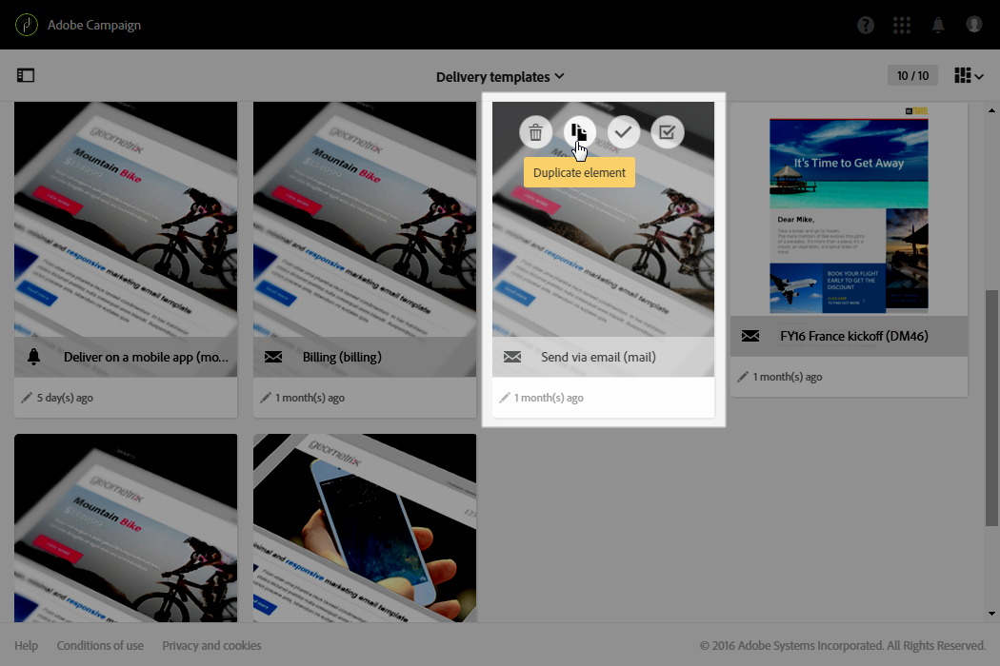
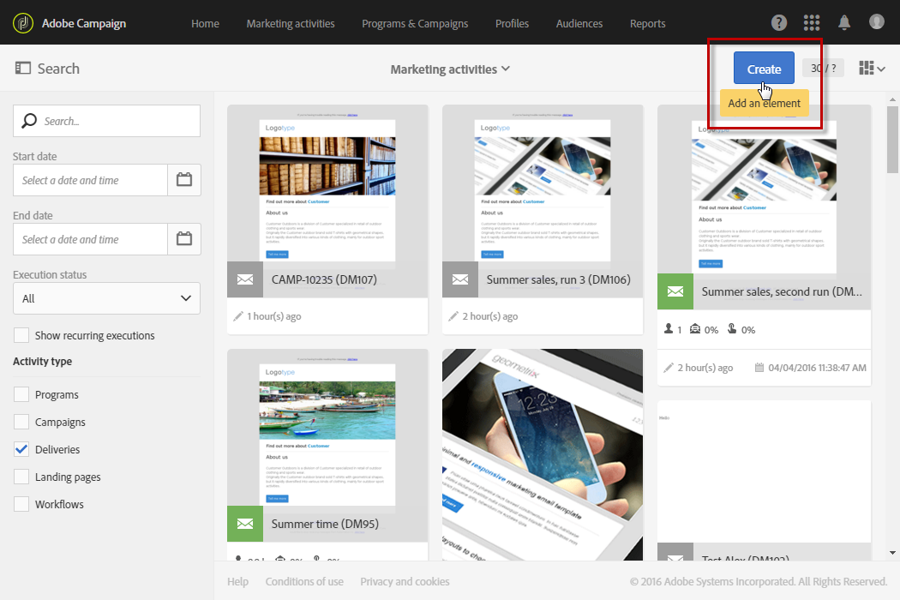

# Identidade visual{#branding}

## Sobre a identidade da marca {#about-brand-identity}

Cada empresa tem diretrizes técnicas e visuais da marca. Com o Adobe Campaign, é possível definir um conjunto de especificações para apresentar uma marca consistente aos seus clientes, de logotipos a aspectos técnicos, como remetente de email, URL ou domínios.

Os administradores técnicos podem definir uma ou várias marcas para centralizar os parâmetros que afetam a identidade de uma marca. Isso inclui o logotipo da marca, o domínio do URL de acesso da página de aterrissagem ou as configurações de rastreamento de mensagens. Com o Adobe Campaign, você pode criar essas marcas e vinculá-las a mensagens ou páginas de aterrissagem. Essa configuração é gerenciada em modelos.

## Configuração e uso de marcas {#configuring-and-using-brands}

O princípio principal de configurar e usar marcas é:

1. Criar e configurar a marca - essa operação requer permissões específicas e é feita pelo administrador técnico do Adobe Campaign. As etapas para obter uma nova marca no Campaign são detalhadas [nesta seção](#creating-a-brand).
1. Criar um ou vários modelos de delivery e de páginas de aterrissagem para esta marca. Consulte a seção [Criação de um modelo](../../start/using/marketing-activity-templates.md).
1. Criar mensagens e páginas de aterrissagem com base nesse modelo. Consulte as seções [Criação de emails](../../channels/using/creating-an-email.md) e [Criação de uma página de aterrissagem](../../channels/using/designing-a-landing-page.md).

>[!IMPORTANT]
>
>As marcas não podem ser criadas ou modificadas pelos usuários finais: essas operações têm de ser efetuadas pelo administrador técnico do Adobe Campaign. Para receber qualquer solicitação, entre em contato com o Atendimento ao cliente da Adobe.
>
>A multimarca não pode ser usada no contexto de mensagens transacionais. Para obter mais informações, consulte [Mensagens transacionais e Identidade visual](../../channels/using/transactional-messaging-limitations.md#permissions-and-branding).

As marcas podem ser encontradas no menu **[!UICONTROL Administration > Instance settings > Brand configuration]**.

Por padrão, uma marca recém-criada é visível somente para usuários atribuídos com os direitos correspondentes pelo administrador.

Uma **Marca** é definida pelas seguintes características:

* Uma **identidade** que define e personaliza sua marca. Esta seção contém os seguintes campos:

   

   * **Rótulo** visível na interface
   * **Nome da marca**
   * **URL do site** e **Rótulo do site** da marca
   * **Logotipo da marca**

* **[!UICONTROL Header parameters of sent emails]** que personaliza o que os recipients das campanhas verão. Esta seção contém os seguintes campos:

   

   * **Remetente (endereço de email)** com o endereço de email da marca.
   * **Remetente (nome)** com o nome da marca.
   * **Responder a (endereço de email)** com o endereço de email ao qual o cliente pode responder.
   * **Responder a (nome)** com o nome da marca.
   * **Erro (endereço de email)** com o endereço de email que será usado em caso de erro.

   >[!IMPORTANT]
   >
   >Após atualizar os parâmetros de cabeçalho dos emails, caso o nome e o endereço de email do remetente não tiverem sido alterados no email criado a partir do modelo, verifique as configurações avançadas do modelo.

* O(s) **servidor(e)s exposto(s) na Internet** define(m) os servidores usados para rastreamento, mas também para acesso à página de aterrissagem. Esta seção contém os seguintes campos:

   

   * **URL externo do servidor de aplicativos** usado para hospedar e acessar as diferentes páginas de aterrissagem criadas por você.
   * **URL externo do servidor de rastreamento** usado como o URL rastreado durante os deliveries.
   * **URL externo do servidor de mirror pages** usado como mirror page padrão em seus deliveries.

   >[!NOTE]
   >
   >Para exibir a pré-visualização da página de aterrissagem e a renderização da mirror page na interface do usuário do Campaign, os URLs do servidor de aplicativos e de mirror pages devem estar protegidos. Nesse caso, use https:// em vez de http:// ao configurar esses URLs.

* **[!UICONTROL Tracking URL configuration (Web Analytics)]**, que define a configuração do rastreamento de URLs para sua marca.

   Os parâmetros adicionais que permitem que os links sejam rastreados em sistemas externos, como ferramentas do Web Analytics, como o Adobe Analytics ou o Google Analytics, estão definidos aqui.

   

## Criação de uma nova marca {#creating-a-brand}

Você pode adicionar novas entidades de sua organização ao Campaign ou criar um novo tipo de email que deve ser enviado em um subdomínio diferente. Para fazer isso, siga as etapas abaixo:

1. **Configurar um novo subdomínio**  - para que qualquer novo subdomínio seja usado pelo Adobe, a primeira etapa será configurá-lo. Você pode fazer isso por meio do [Painel de controle do Campaign](https://docs.adobe.com/content/help/pt-BR/control-panel/using/subdomains-and-certificates/subdomains-branding.html) ou entrar em contato com o contato técnico do Adobe. Saiba mais sobre a configuração de subdomínio [neste artigo](https://helpx.adobe.com/campaign/kb/domain-name-delegation.html).

   >[!NOTE]
   >
   >O Painel de controle do Campaign é acessível a todos os usuários administradores. As etapas para conceder acesso de Administrador a um usuário estão detalhadas em [this page](https://experienceleague.adobe.com/docs/control-panel/using/discover-control-panel/managing-permissions.html?lang=en#discover-control-panel).

1. **Criar um tíquete**  - Depois que o subdomínio é configurado, o Adobe precisará configurá-lo no ambiente de produção. Para solicitar isso, [crie um ticket para o Atendimento ao cliente](https://helpx.adobe.com/br/enterprise/using/support-for-experience-cloud.html) com as seguintes informações:

   * Assunto: Configuração da nova marca ACS

   * Conteúdo: Um novo domínio foi configurado e gostaríamos de configurá-lo em nossa plataforma do Campaign

   * Domínio: XXX

   * URL de produção: XXX.campaign.adobe.com

1. **Criar um template do delivery**  - Quando a nova marca estiver disponível, a prática recomendada é criar pelo menos um novo template do delivery em branco que faça referência a essa nova marca. [Saiba mais](#linking-a-brand-to-a-template).

1. **Verificar diretrizes de deliverability**  - Antes de começar a usar o novo domínio, a estratégia deve ser discutida com a equipe de Deliverability do Adobe. Eles ajudarão a definir as práticas recomendadas, caso uma nova afinidade deva ser criada para dividir os IPs entre domínios, por exemplo, e/ou se um plano de aumento deve ser definido. Saiba mais sobre as Práticas recomendadas de capacidade de entrega [nesta seção](../../sending/using/about-deliverability.md).

## Atribuição de uma marca a um email {#assigning-a-brand-to-an-email}

### Associação de uma marca a um modelo {#linking-a-brand-to-a-template}

Para usar os parâmetros definidos para uma marca, ele deve estar vinculado a um template do delivery ou de página de aterrissagem. Para fazer isso, é necessário criar ou editar um template.

>[!NOTE]
>
>Para obter mais informações sobre como criar um template, consulte a seção [Criação de um template](../../start/using/marketing-activity-templates.md).

Depois que o modelo for criado, você pode vinculá-lo a uma marca. Para fazer isso:

1. Clique no botão **[!UICONTROL Edit properties]** para acessar as propriedades do template.

   

1. Use a lista suspensa para selecionar a marca que deseja vincular ao template.

   >[!NOTE]
   >
   >Por padrão, **[!UICONTROL Default brand (branding)]** está selecionada.

   

   Para exibir como a marca selecionada está configurada, clique no ícone **[!UICONTROL Navigate to the detail of the element selected]**.

   

1. Confirme a seleção e salve o template.

O modelo está vinculado à marca. No editor de email, elementos como **Endereço de email do remetente padrão**, **Nome do remetente padrão** ou **logotipo** usarão os dados da marca configurada.

### Caso de uso de identidade visual {#branding-use-case}

Neste exemplo, vamos criar uma nova marca relacionada a viagens e usá-la em um email.

#### Configuração de uma nova marca {#configure-a-new-brand}

>[!IMPORTANT]
>
>A configuração da marca é gerenciada pela Adobe somente porque requer permissões específicas e configurações técnicas.

1. O administrador do Adobe Campaign cria a marca em **[!UICONTROL Administration > Instance settings > Brand configuration]**. Ele acrescenta o elemento **Férias nos trópicos**, do menu avançado, e configura a **[!UICONTROL ID]** e os **[!UICONTROL Header parameters of sent emails]** da marca.

   

1. Em seguida, o administrador configura o URL do(s) **servidor(es) exposto(s) na Internet**, para que a página de aterrissagem possa ser usada, e depois os URLs de rastreamento.

   Neste exemplo, a ferramenta **Web Analytics** usada é o **Google Analytics**. O administrador configura o URL de rastreamento da seguinte maneira:

   

A marca foi criada e configurada corretamente. Ela agora pode ser usada pelas equipes de marketing.

#### Implementação de uma nova marca {#implement-a-new-brand}

Como gerente de delivery, você é responsável pela criação dos templates de delivery para usar a nova marca. Para fazer isso, siga as etapas abaixo:

1. No menu avançado **[!UICONTROL Resources > Templates > Delivery templates]**, duplique um template incorporado para configurar um novo template do delivery.

   

1. Para vincular esse template à marca **Férias nos trópicos**, edite as propriedades do modelo e selecione a marca na lista suspensa.

   

1. Configure esse template de email para refletir a identidade da marca.
1. Salve o template quando ele estiver concluído.

   

   Agora você pode usar o template do delivery para criar emails que serão enviados para um público.

#### Usar a nova marca em um delivery {#use-the-new-brand-in-a-delivery}

Para criar um email vinculado a uma marca, siga as etapas abaixo:

1. Clique no botão **[!UICONTROL Create]** do menu **[!UICONTROL Marketing activities]**.

   

1. Selecione a atividade **[!UICONTROL Email]** e escolha o template vinculado à nova marca.

   

1. O email já está configurado. Você pode verificar as informações antes de testá-las usando os perfis de teste e depois enviá-las para o público-alvo.

   

