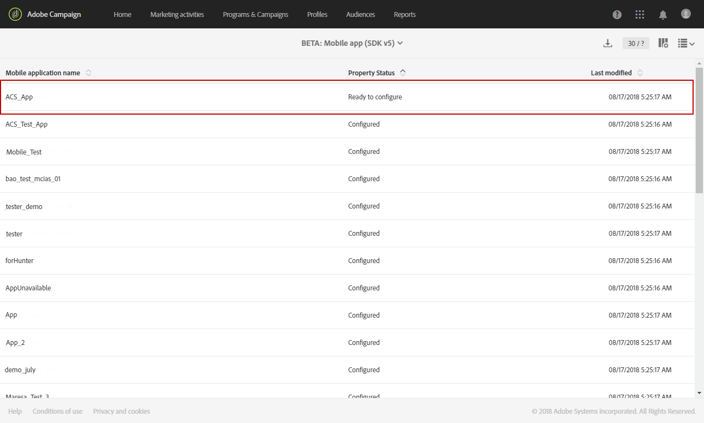

# Configurar um aplicativo para dispositivos móveis{#configuring-a-mobile-application}

## Configurar um aplicativo para dispositivos móveis usando SDKs do Adobe Experience Platform {#using-adobe-experience-platform-sdk}

>[!IMPORTANT]
>
> O Adobe Experience Platform Launch foi reformulado como um conjunto de tecnologias de coleção de dados na Adobe Experience Platform. Como resultado, várias alterações de terminologia foram implementadas na documentação do produto. Consulte a [seguinte documento](https://experienceleague.adobe.com/docs/experience-platform/tags/term-updates.html) para obter uma referência consolidada das alterações de terminologia.

Observe que as implementações de notificação por push e no aplicativo devem ser executadas por usuários especialistas. Para obter assistência, entre em contato com o executivo da sua conta Adobe ou com o parceiro de serviços Professional.

Para enviar notificações por push e mensagens no aplicativo com o aplicativo SDK do Experience Platform, um aplicativo para dispositivos móveis deve ser configurado na interface da Coleção de dados e no Adobe Campaign.

Depois que um aplicativo móvel é configurado, você pode recuperar os dados de PII coletados para criar ou atualizar perfis do banco de dados. Para obter mais informações, consulte esta seção: [Criação e atualização de informações de perfil com base em dados de aplicativo móvel](../../channels/using/updating-profile-with-mobile-app-data.md).

Para saber mais sobre os diferentes casos de uso de dispositivos móveis compatíveis com o Adobe Campaign Standard usando os SDKs da Adobe Experience Platform, consulte este [página](../../administration/using/supported-mobile-use-cases.md).

Para concluir a configuração, conclua as seguintes etapas:

1. No Adobe Campaign, acesse o seguinte:
   * **[!UICONTROL Push notification]**
   * **[!UICONTROL In-App message]**
   * **[!UICONTROL Adobe Places]**

   Caso contrário, entre em contato com a equipe de conta.

1. Verifique se o usuário tem as permissões necessárias no Adobe Campaign Standard e nas tags na Adobe Experience Platform.
   * No Adobe Campaign Standard, verifique se o usuário do IMS faz parte dos Perfis de usuário padrão e de produto de administrador. Essa etapa permite que o usuário faça logon no Adobe Campaign Standard, navegue até a página do aplicativo móvel do SDK do Experience Platform e visualize as propriedades do aplicativo móvel criadas na interface da Coleção de dados.

   * Na interface da Coleção de dados, verifique se o usuário do IMS faz parte de um perfil de produto Experience Platform Launch.
Esta etapa permite que o usuário faça logon na interface da Coleção de dados para criar e exibir as propriedades. Para obter mais informações sobre perfis de produto na interface da Coleção de dados, consulte [Crie seu perfil de produto](https://experienceleague.adobe.com/docs/experience-platform/tags/admin/manage-permissions.html#gain-admin-rights-for-a-tags-product-profile). No perfil do produto, não deve haver permissões definidas na empresa ou nas propriedades, mas o usuário ainda deve conseguir fazer logon.

   Para concluir tarefas adicionais, como instalar uma extensão, publicar um aplicativo, configurar ambientes e assim por diante, é necessário definir permissões no perfil do produto.

1. Na interface da Coleção de dados, crie uma **[!UICONTROL Mobile property]**. Para saber mais, consulte [Configurar uma propriedade móvel](https://developer.adobe.com/client-sdks/documentation/getting-started/create-a-mobile-property).

1. Na interface da Coleção de dados, clique na guia **[!UICONTROL Extensions]** , acesse **[!UICONTROL Catalog]** e pesquise por **[!UICONTROL Adobe Campaign Standard]** extensão. Para obter mais informações, consulte [Adobe Campaign Standard](https://developer.adobe.com/client-sdks/documentation/adobe-campaign-standard).

1. Para obter suporte a casos de uso de localização no Campaign Standard, instale o **[!UICONTROL Places]** na interface da Coleção de dados. Consulte esta [página](https://experienceleague.adobe.com/docs/places/using/places-ext-aep-sdks/places-extension/places-extension.html).

1. No Adobe Campaign Standard, configure a propriedade móvel que você criou na interface da coleção de dados. Consulte [Configuração do aplicativo Adobe Experience Platform Launch no Adobe Campaign](../../administration/using/configuring-a-mobile-application.md#set-up-campaign).

1. Adicione a configuração específica do canal à configuração do aplicativo móvel.
Para saber mais, consulte [Configuração do aplicativo específico do canal no Adobe Campaign](../../administration/using/configuring-a-mobile-application.md#channel-specific-config).

1. Se necessário, você pode excluir a propriedade da tag.
Para obter mais informações, consulte [Excluindo seu aplicativo](../../administration/using/configuring-a-mobile-application.md#delete-app).

## Sincronizar AEPSDK do aplicativo móvel a partir do fluxo de trabalho técnico do Launch {#aepsdk-workflow}

Depois de criar e configurar sua propriedade móvel na interface da Coleção de dados, a variável **[!UICONTROL Sync Mobile app AEPSDK from Launch]** o fluxo de trabalho técnico agora sincronizará as propriedades móveis de tag importadas no Adobe Campaign Standard.

Por padrão, o fluxo de trabalho técnico é iniciado a cada 15 minutos. Se necessário, ele poderá ser reiniciado manualmente:

1. No Adobe Campaign Standard, no menu avançado, selecione **[!UICONTROL Administration]** > **[!UICONTROL Application Settings]** > **[!UICONTROL Workflows]**.
1. Abra o **[!UICONTROL Sync Mobile app AEPSDK from Launch (syncWithLaunch)]** fluxo de trabalho.

   

1. Clique no link **[!UICONTROL Scheduler]** atividade.

1. Selecione **[!UICONTROL Immediate execution]**.

   

Seu fluxo de trabalho agora reiniciará e sincronizará as propriedades de dispositivos móveis de tag importadas no Adobe Campaign Standard.

## Configuração do aplicativo no Adobe Campaign {#set-up-campaign}

Para usar uma propriedade de tag móvel no Campaign, você também deve configurar essa propriedade no Adobe Campaign. No Adobe Campaign, verifique se o usuário do IMS faz parte dos Perfis de usuário padrão e de produto de administrador.

Aguarde até que o fluxo de trabalho técnico seja executado e sincronize a propriedade móvel da tag com a Adobe Campaign. Em seguida, você pode configurá-lo no Adobe Campaign.

Para obter mais informações sobre o aplicativo móvel de sincronização AEPSDK do fluxo de trabalho técnico do Launch, consulte este [seção](../../administration/using/configuring-a-mobile-application.md#aepsdk-workflow).

>[!NOTE]
>
>Por padrão, os administradores com a unidade organizacional definida como ALL podem editar o aplicativo móvel.

1. No menu avançado, selecione **[!UICONTROL Administration]** > **[!UICONTROL Channels]** > **[!UICONTROL Mobile app (AEP SDK)]**.

   

1. Selecione o aplicativo móvel criado na interface da coleção de dados.
Seus **[!UICONTROL Property Status]** deve ser **[!UICONTROL Ready to configure]**.

   >[!NOTE]
   >
   >Por padrão, para recuperar a lista de aplicativos móveis criados na interface da Coleção de dados, o Campaign Standard usa o valor definido na opção NmsServer_URL para procurar propriedades correspondentes.
   >
   >Em alguns casos, o endpoint do Campaign para um aplicativo móvel pode ser diferente daquele definido em NmsServer_URL. Nesse caso, defina o endpoint no `Launch_URL_Campaign` opção. O Campaign usará o valor dessa opção para procurar propriedades correspondentes na interface da Coleção de dados.

   

1. Você pode alterar a unidade organizacional do seu aplicativo móvel no **[!UICONTROL Access Authorization]** seção para limitar o acesso a este aplicativo móvel a unidades organizacionais específicas. Para obter mais informações, consulte esta página.

   Aqui, o administrador pode atribuir unidades sub-organizacionais selecionando-as na lista suspensa.

   

1. Para fazer a conexão entre o Campaign e as tags na Adobe Experience Platform, clique em **[!UICONTROL Save]**.

1. Verifique se o status do aplicativo móvel mudou de **[!UICONTROL Ready to Configure]** para **[!UICONTROL Configured]**.

   Quando a extensão do Campaign mostrar que a pkey foi configurada com êxito, você também poderá verificar se a propriedade foi configurada com êxito no Campaign.

   

1. Para que essa configuração tenha efeito, as alterações precisam ser publicadas na interface da Coleção de dados.

   Para obter mais informações, consulte [Publicar configuração](https://developer.adobe.com/client-sdks/documentation/getting-started/create-a-mobile-property/#publish-the-configuration)

## Configuração do aplicativo específico do canal no Adobe Campaign {#channel-specific-config}

Seu aplicativo móvel agora está pronto para ser usado na notificação por push ou nos deliveries no aplicativo do Campaign. Agora você pode configurá-lo ainda mais, se necessário, para criar eventos que acionarão suas mensagens no aplicativo e/ou carregarão certificados Push.

1. No menu avançado, selecione **[!UICONTROL Administration]** > **[!UICONTROL Channels]** > **[!UICONTROL Mobile app (AEP SDK)]**.

1. Selecione o aplicativo para dispositivos móveis criado e configurado na interface da Coleção de dados.

1. No **[!UICONTROL Mobile application properties]** você pode começar a adicionar eventos que estão disponíveis no aplicativo móvel para suas mensagens no aplicativo.

1. Para configurar os eventos, clique em **[!UICONTROL Create Element]**.

   

1. Digite um nome e uma descrição.

   

1. Clique em **[!UICONTROL Add]**.

   Seu evento agora está disponível na guia Acionadores ao criar uma mensagem no aplicativo. Para obter mais informações, consulte [Preparação e envio de uma mensagem no aplicativo](../../channels/using/preparing-and-sending-an-in-app-message.md).

1. No **[!UICONTROL Device-specific settings]** seção de um painel de aplicativo móvel, para cada dispositivo, forneça os detalhes do aplicativo, incluindo o certificado para o iOS e a chave do servidor para Android.

   Depois que o certificado for carregado, uma mensagem notificará que o upload foi bem-sucedido e exibirá a data de expiração do certificado.

   >[!NOTE]
   >
   >Depois de adicionar o certificado com êxito no Adobe Campaign Standard, você não poderá mais alterar as configurações novamente, pois somente uma plataforma APNS (produção ou sandbox) pode ser adicionada ao aplicativo MCPNS.

   

1. Clique em **[!UICONTROL Mobile application subscribers]** para ver uma lista de assinantes e outras informações sobre esses assinantes, por exemplo, se eles optaram por não participar das notificações.

## Excluindo seu aplicativo {#delete-app}

>[!CAUTION]
>
>A exclusão do aplicativo não pode ser revertida.

Para excluir o aplicativo, conclua as etapas em [Exclusão de propriedades móveis](https://developer.adobe.com/client-sdks/documentation/adobe-campaign-standard/#deleting-mobile-properties-in-the-data-collection-ui).

Depois que o aplicativo for excluído, no Adobe Campaign, verifique se o status da Propriedade do aplicativo foi atualizado corretamente para Excluído no Launch.

Ao clicar no aplicativo no Adobe Campaign, é possível optar por remover completamente esse aplicativo do Adobe Campaign clicando em Excluir do Campaign.

