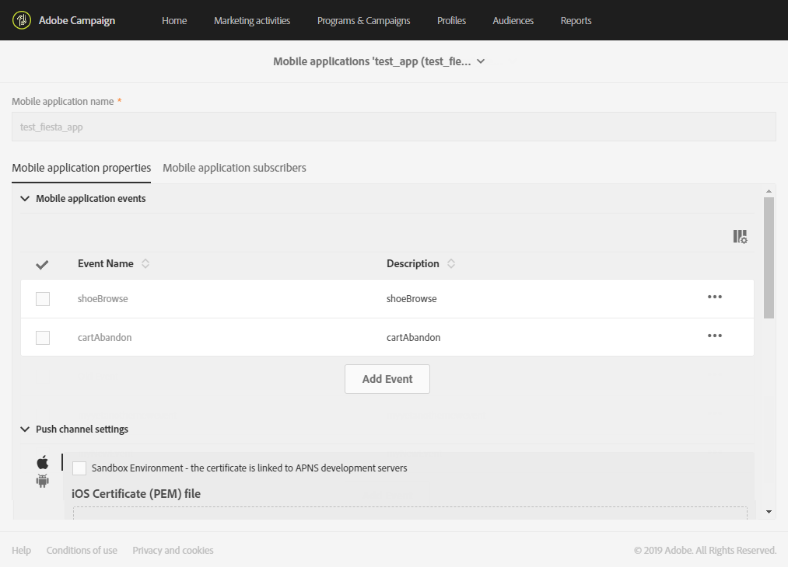

# Configurar um aplicativo móvel{#configuring-a-mobile-application}

Notificações por push ou mensagens no aplicativo são recebidas em aplicativos móveis que precisam ser configurados primeiro no Adobe Campaign Standard, dependendo do canal que você deseja usar.

* Para enviar mensagens no aplicativo e notificações por push, seus aplicativos móveis precisam ser configurados no Adobe Campaign, aproveitando os SDKs da plataforma Adobe Experience. Consulte [Uso do SDK](#using-adobe-experience-platform-sdk)da plataforma Adobe Experience.

* Para enviar somente notificações por push, é possível configurar a integração entre o Adobe Campaign e o Adobe Mobile Service usando o SDK V4. Consulte [Uso do SDK V4](#using-sdk-v4).

Depois que seus aplicativos móveis forem configurados no Adobe Campaign, aproveitando o SDK V4 do Experience Cloud Mobile ou o SDK da Experience Platform, eles precisarão ser configurados por um administrador no menu [!UICONTROL Administration] > [!UICONTROL Channels] > [!UICONTROL Mobile app] .

>[!CAUTION]
>
>A notificação por push e as implementações no aplicativo devem ser executadas por usuários especialistas. Se precisar de auxílio, entre em contato com seu executivo de conta da Adobe ou com os parceiros de serviços Professional.

Depois que um aplicativo móvel é configurado, você pode recuperar os dados de PII coletados para criar ou atualizar perfis do banco de dados. Para obter mais informações, consulte esta seção: [Criação e atualização de informações de perfil com base nos dados](../../channels/using/updating-profile-with-mobile-app-data.md)do aplicativo móvel.

Para obter diretrizes gerais para entregas móveis no Adobe Campaign Standard, consulte esta [página](https://helpx.adobe.com/campaign/kb/acs-mobile.html)

## Uso do SDK da plataforma Adobe Experience {#using-adobe-experience-platform-sdk}

>[!Nnota]
>
>Para saber mais sobre os diferentes casos de uso de dispositivos móveis suportados no Adobe Campaign Standard usando os SDKs da plataforma Adobe Experience, consulte esta [página](https://helpx.adobe.com/campaign/kb/configure-launch-rules-acs-use-cases.html).

Para enviar notificações por push e mensagens no aplicativo com o aplicativo Experience Platform SDK, um aplicativo móvel deve ser configurado no Adobe Experience Platform Experience Platform Experience Platform Launch e configurado no Adobe Campaign. Para obter as etapas detalhadas para configurar seu aplicativo móvel usando o Experience Platform SDK, consulte esta [página](https://helpx.adobe.com/campaign/kb/configuring-app-sdkv4.html).

Siga as etapas abaixo para iniciar a configuração:

1. Verifique se você pode acessar os **[!UICONTROL Mobile]**canais: Notificação por push e mensagem no aplicativo no Adobe Campaign. Caso contrário, entre em contato com a equipe de sua conta.

   

1. Crie o aplicativo móvel no Experience Platform Launch criando uma propriedade do tipo Mobile. Para obter mais informações, consulte a documentação do [Experience Platform Launch](https://aep-sdks.gitbook.io/docs/getting-started/create-a-mobile-property#create-a-new-mobile-property) .
1. Instale a **[!UICONTROL Adobe Campaign Standard]**extensão para seu aplicativo móvel no Experience Platform Launch:

   Para obter mais informações sobre extensões, consulte a documentação do [Experience Platform Launch](https://aep-sdks.gitbook.io/docs/using-mobile-extensions/adobe-campaign-standard) .

1. Configure regras para seu aplicativo no Adobe Launch, consulte [Configuração do aplicativo no Launch](https://helpx.adobe.com/campaign/kb/config-app-in-launch.html#Step1Createdataelements)
1. Configure seu aplicativo Adobe Launch no Adobe Campaign Standard, consulte [Configuração do aplicativo Adobe Launch no Adobe Campaign](https://helpx.adobe.com/campaign/kb/configuring-app-sdk.html#SettingupyourAdobeLaunchapplicationinAdobeCampaign).
1. Adicione a configuração específica do canal à configuração do aplicativo móvel. Consulte Configuração do aplicativo específica do [canal no Adobe Campaign](https://helpx.adobe.com/campaign/kb/configuring-app-sdk.html#ChannelspecificapplicationconfigurationinAdobeCampaign).

   

## Uso do SDK V4 {#using-sdk-v4}

A notificação por push é suportada pelo SDK V4 e pelos SDKs da plataforma Adobe Experience, ao contrário do In-App. Para obter as etapas detalhadas para usar notificações por push com seu aplicativo móvel, consulte esta [página](https://helpx.adobe.com/campaign/kb/configuring-app-sdkv4.html).

Os aplicativos móveis que recebem notificações por push devem ser configurados por um administrador na interface do Adobe Campaign. Ao configurar o Adobe Campaign e o Adobe Mobile Services, você poderá usar os dados do aplicativo móvel para suas campanhas.

Para poder enviar notificações por push, é necessário:

1. Verifique se você pode acessar o **[!UICONTROL Mobile app]**canal no Adobe Campaign.
1. Configure seu aplicativo móvel em:

   * [Adobe Campaign](https://helpx.adobe.com/campaign/kb/configuring-app-sdkv4.html#SettingupamobileapplicationinAdobeCampaign).
   * [Adobe Mobile Services](https://helpx.adobe.com/campaign/kb/configuring-app-sdkv4.html#ConfiguringamobileapplicationinAdobeMobileServices).

1. Execute a configuração específica do aplicativo móvel:

   * Compacte o arquivo de configuração baixado da interface do Adobe Mobile Services com o aplicativo móvel.
   * Integre o Experience Cloud Mobile SDK ao seu aplicativo móvel.

1. Defina os dados que deseja coletar dos assinantes do aplicativo. Os assinantes do aplicativo móvel que têm um perfil no banco de dados do Adobe Campaign são reconciliados com base nos critérios definidos.

   Para obter mais informações, consulte esta [página](https://helpx.adobe.com/campaign/kb/configuring-app-sdkv4.html#Collectingsubscribersdatafromamobileapplication).

1. Certifique-se de que a configuração foi concluída com êxito iniciando seu aplicativo móvel no dispositivo e fazendo logon. Certifique-se de aceitar receber notificações.
1. Em seguida, no menu avançado do Adobe Campaign, selecione **[!UICONTROL Administration]**>**[!UICONTROL Channels]** > **[!UICONTROL Mobile app]**.
1. Selecione seu aplicativo móvel na lista para exibir suas propriedades. Suas informações de assinatura são exibidas na lista de assinantes.

   

1. Para verificar os aplicativos móveis aos quais um perfil se inscreveu, no **[!UICONTROL Profiles & Audiences > Profiles]**menu, selecione um perfil e clique no**[!UICONTROL Edit profile properties]** botão à direita. Os aplicativos móveis são listados na **[!UICONTROL Mobile App Subscriptions]**guia.

   