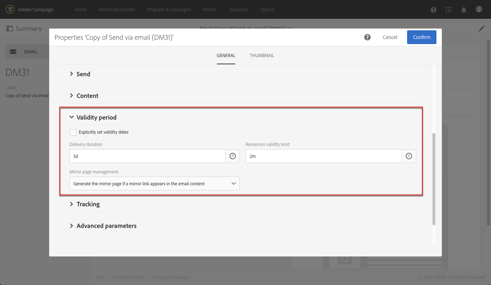

# Configuração do canal de email{#configuring-email-channel}

## Parâmetros de canal de email {#email-channel-parameters}

A tela de configuração de email permite definir os parâmetros do canal de email.

* **Parâmetros de cabeçalho de emails enviados**

   Nesta seção, você pode especificar o endereço autorizado **[!UICONTROL masks]** para o remetente e o endereço de erro. Se necessário, essas máscaras podem ser separadas por vírgulas. Essa configuração é opcional. Quando esses campos são inseridos, durante a fase de preparação da mensagem, o Adobe Campaign verifica se os endereços digitados são válidos. Esse modo operacional garante que não sejam usados endereços que possam causar problemas de entrega. Os endereços de entrega devem ser configurados no servidor de entrega.

* **Disponibilidade**

   Essa ID é fornecida pelo suporte. É necessário que os relatórios de entrega funcionem corretamente.

* **Parâmetros de entrega**

   O Adobe Campaign envia as mensagens que começam na data de início. O **[!UICONTROL Message delivery duration]** campo permite especificar a duração durante a qual as mensagens podem ser enviadas.

   The **[!UICONTROL Online resources validity duration]** field is used for uploaded resources, mainly for the mirror page and images. Os recursos desta página são válidos por um tempo limitado (para economizar espaço em disco).

* **Repetir**

   As mensagens temporariamente não entregues estão sujeitas a uma nova tentativa automática. Esta seção indica quantas tentativas devem ser executadas no dia seguinte ao início do envio (**Número de tentativas**) e o atraso mínimo entre as tentativas (período **de** tentativas).

   Por padrão, cinco tentativas são programadas para o primeiro dia com um intervalo mínimo de uma hora, distribuídas nas 24 horas do dia. One retry per day is programmed after that and until the delivery deadline, which is defined in the **[!UICONTROL Delivery parameters]** section.

* **Parâmetros de quarentena de email**

   No **[!UICONTROL Time between two significant errors]** campo, digite um valor para definir o tempo que o aplicativo aguarda antes de incrementar o contador de erros em caso de falha. Valor padrão: **&quot;1d&quot;**, por 1 dia.

   Quando o **[!UICONTROL Maximum number of errors before quarantine]** valor é atingido, o endereço de email é colocado em quarentena. Valor padrão: **&quot;5&quot;**: o endereço será colocado em quarentena no sexto erro. Isso significa que o contato será automaticamente excluído das entregas subsequentes.

**Tópico** relacionado:

[Noções básicas sobre gestão de quarentena](../../sending/using/understanding-quarantine-management.md)

## Contas de roteamento de email {#email-routing-accounts}

A conta **[!UICONTROL Integrated email routing]** externa é fornecida por padrão. Ele contém os parâmetros técnicos que permitem ao aplicativo enviar emails.

O tipo de conta deve ser sempre definido como **[!UICONTROL Routing]**, o canal como **[!UICONTROL Email]** e o modo de entrega definido como **[!UICONTROL Bulk delivery]**.

**Tópico** relacionado:

[Contas externas](../../administration/using/external-accounts.md)

## Regras de processamento de email {#email-processing-rules}

Os administradores **[!UICONTROL Email processing rules]** podem acessá-los pelo **[!UICONTROL Administration > Channels > Email]** menu.

Essas regras contêm a lista de cadeias de caracteres que podem ser retornadas por servidores remotos e que permitem que você qualifique o erro (**Grave**, **Suave** ou **Ignorado**).

As regras padrão são as seguintes:

### Mensagens de rejeição {#bounce-mails}

Quando um email falha, o servidor de mensagens remoto retorna uma mensagem de erro de rejeição para o endereço especificado nas configurações do aplicativo.

O Adobe Campaign compara o conteúdo de cada email de devolução nas cadeias de caracteres da lista de regras e atribui um dos três tipos de erro.

>[!IMPORTANT]
>
>Após a atualização para o MTA aprimorado, as qualificações de rejeição na tabela Campanha **[!UICONTROL Message qualification]** não são mais usadas. Para mensagens de erro de falha de entrega síncrona, o MTA aprimorado determina o tipo de rejeição e a qualificação e envia essas informações para o Campaign. As rejeições assíncronas ainda são qualificadas pelo processo do InMail.
>
>Para obter mais informações sobre o Adobe Campaign Enhanced MTA, consulte este [documento](https://helpx.adobe.com/campaign/kb/campaign-enhanced-mta.html).

O usuário pode criar suas próprias regras.

>[!IMPORTANT]
>
>When importing a package and when updating data via the **Update for deliverability** workflow, the user-created rules are overwritten.

### Gerenciamento de domínios de email {#managing-email-domains}

As regras de gestão de domínio são usadas para regular o fluxo de emails de saída para um domínio específico. Eles exemplificam as mensagens de devolução e bloqueiam o envio sempre que apropriado.

O servidor de mensagens do Adobe Campaign aplica regras específicas aos domínios e, em seguida, as regras do caso geral representado por um asterisco na lista de regras.

>[!IMPORTANT]
>
>Depois de atualizada para o MTA aprimorado, a assinatura de autenticação de email DKIM (DomainKeys Identified Mail) é feita pelo MTA aprimorado. A assinatura DKIM pelo MTA nativo do Campaign será desativada na **[!UICONTROL Domain management]** tabela como parte da atualização do MTA aprimorada.
>
>Para obter mais informações sobre o Adobe Campaign Enhanced MTA, consulte este [documento](https://helpx.adobe.com/campaign/kb/campaign-enhanced-mta.html).

Para configurar regras de gerenciamento de domínio, basta definir um limite e selecionar determinados parâmetros SMTP. Uma **cota** é um limite calculado como uma porcentagem de erro além do qual todas as mensagens em um domínio específico estão bloqueadas.

Os **parâmetros SMTP** atuam como filtros aplicados para uma regra de bloqueio.

* Você pode escolher se ativa ou não determinados padrões de identificação e chaves de criptografia para verificar o nome do domínio, como **ID fo remetente**, **DomainKeys**, **DKIM**, e **S/MIME**.
* **Retransmissão SMTP**: permite configurar o endereço IP e a porta de um servidor de retransmissão para um determinado domínio.

### Gestão MX {#mx-management}

Cada regra define uma máscara de endereço para o MX. Qualquer MX cujo nome corresponda a essa máscara é, portanto, elegível. A máscara pode conter &quot;*&quot; e &quot;?&quot; caracteres genéricos.

Por exemplo, os seguintes endereços:

* a.mx.yahoo.com
* b.mx.yahoo.com
* c.mx.yahoo.com

são compatíveis com as seguintes máscaras:

* *.yahoo.com
* ?.mx.yahoo.com

Essas regras são aplicadas na sequência: a primeira regra cuja máscara MX é compatível com o MX de destino é aplicada.

>[!IMPORTANT]
>
>Depois de atualizadas para o MTA aprimorado, as regras de throughput de entrega do gerenciamento **do Adobe Campaign** MX não são mais usadas. O MTA aprimorado usa suas próprias regras MX que permitem personalizar sua throughput por domínio com base na sua própria reputação histórica de email e no feedback em tempo real proveniente dos domínios em que você está enviando emails.
>
>Para obter mais informações sobre o Adobe Campaign Enhanced MTA, consulte este [documento](https://helpx.adobe.com/campaign/kb/campaign-enhanced-mta.html).

Os seguintes parâmetros estão disponíveis para cada regra:

* **[!UICONTROL Range of IDs]**: essa opção permite indicar os intervalos de identificadores (publicId) aos quais a regra se aplica. Você pode especificar:

   * Um número: a regra se aplica somente a essa publicId.
   * Um intervalo de números (número1-número2): a regra será aplicada a todas as publicIds entre esses dois números.
   Se o campo estiver vazio, a regra se aplica a todas as IDs.

* **[!UICONTROL Shared]**: essa opção indica que o maior número de mensagens por hora e de conexões se aplica a todas as MXs vinculadas a essa regra.
* **[!UICONTROL Maximum number of connections]**: número máximo de conexões simultâneas para um MX de um determinado endereço.
* **Número máximo de mensagens**: número máximo de mensagens que podem ser enviadas por uma conexão. Após esse valor, a conexão é fechada e uma nova é reaberta.
* **[!UICONTROL Messages per hour]**: número máximo de mensagens que podem ser enviadas em uma hora para um MX por meio de um endereço específico.

>[!IMPORTANT]
>
>* O servidor de delivery (MTA) deve ser reiniciado se os parâmetros forem alterados.
>* A modificação ou a criação de regras de gestão é somente para usuários avançados.
>

## Lista de propriedades de email {#list-of-email-properties}

Esta seção detalha a lista de parâmetros disponíveis na tela de propriedades de um modelo de email ou de email.

>[!NOTE]
>
>Alguns parâmetros estão disponíveis somente em modelos. Os parâmetros que você pode acessar [dependem de suas permissões](../../administration/using/users-management.md).

Para editar as propriedades de um email ou modelo de email, use o **[!UICONTROL Edit properties]** botão.

### Parâmetros gerais {#general-parameters}

Na parte superior da tela de parâmetros de email, identifique o email usando os campos **[!UICONTROL Label]** e **[!UICONTROL ID]** . Essas informações aparecem na interface, mas não são visíveis para os destinatários da mensagem.

>[!IMPORTANT]
>
>A ID deve ser exclusiva.

O **[!UICONTROL Brand]** campo permite selecionar a marca vinculada à entrega. Para obter mais informações sobre como usar e configurar marcas, consulte a seção [Marcas](../../administration/using/branding.md) .

O **[!UICONTROL Campaign]** campo permite que você insira a campanha vinculada ao email.

Você também pode adicionar uma imagem **[!UICONTROL Description]** no campo correspondente e editar a imagem exibida na miniatura do email nas listas.

### Enviando parâmetros {#sending-parameters}

A **[!UICONTROL Send]** seção está disponível somente para modelos de e-mail. Ele contém os seguintes parâmetros:

#### Repetir parâmetros {#retries-parameters}

As mensagens temporariamente não entregues estão sujeitas a uma nova tentativa automática. Esta seção indica quantas tentativas devem ser executadas no dia seguinte ao início do envio ( **[!UICONTROL Max. number of retries]** ) e o atraso mínimo entre as tentativas ( **[!UICONTROL Retry period]** ).

Por padrão, cinco tentativas são programadas para o primeiro dia com um intervalo mínimo de uma hora, distribuídas nas 24 horas do dia. One retry per day is programmed after that and until the delivery deadline, which is defined in the [Validity period parameters](#validity-period-parameters) section.

O número de tentativas pode ser alterado globalmente (entre em contato com o administrador técnico da Adobe) ou para cada entrega ou modelo de entrega

#### Parâmetros de formato de email {#email-format-parameters}

Você pode configurar o formato dos emails a serem enviados. Há três opções disponíveis:

* **Usar preferências** do destinatário (modo padrão): o formato de mensagem é definido de acordo com os dados armazenados no perfil do destinatário e armazenado por padrão no campo de formato **de** email (@emailFormat). Se um recipient deseja receber mensagens em determinado formato, esse será o formato enviado. Se o campo não estiver concluído, uma mensagem multipart-alternativo será enviada (consulte abaixo).
* **Deixe que o cliente de email do destinatário escolha o formato mais apropriado (multipart-alternativo)**: a mensagem contém ambos os formatos: text e HTML. O formato exibido na recepção depende da configuração do software de email do destinatário (multipart-alternativo).

   >[!IMPORTANT]
   >
   >Essa opção inclui ambas as versões da mensagem. Portanto, isso afeta o throughput de entrega, porque o tamanho da mensagem é maior.

* **Enviar todas as mensagens no formato** de texto: a mensagem é enviada em formato de texto. O formato HTML não será enviado, mas usado para a página espelhada somente quando o destinatário clicar no link na mensagem.

#### Modo de teste SMTP {#smtp-test-mode}

A **[!UICONTROL Enable SMTP test mode]** opção permite que você teste o envio de emails por uma conexão SMTP sem realmente enviar mensagens.
As mensagens são processadas até que a conexão com o servidor SMTP seja alcançada, mas não são enviadas.

Esta opção está disponível para e-mails e modelos de e-mail.

Se você ativar a opção de modo de teste SMTP para um modelo de email, todas as mensagens de email criadas a partir desse modelo terão essa opção ativada.

>[!IMPORTANT]
>
>Quando esta opção estiver ativada para um email, nenhuma mensagem será enviada até que ela seja desmarcada.
>Um aviso será exibido no painel de email ou modelo de email.

Para obter mais informações sobre como configurar o SMTP, consulte a seção [Lista de parâmetros](#list-of-email-smtp-parameters) SMTP de email.

### Parâmetros do período de validade {#validity-period-parameters}

A **[!UICONTROL Validity period]** seção contém os seguintes parâmetros:

* **[!UICONTROL Explicitly set validity dates]**: quando essa caixa estiver desmarcada, você deve inserir uma duração nos campos **[!UICONTROL Delivery duration]** e **[!UICONTROL Resource validity limit]** . Marque essa caixa se desejar definir datas e horários específicos.

   

* **[!UICONTROL Delivery duration]**:O Adobe Campaign envia as mensagens que começam na data de início. Esse campo permite especificar a duração durante a qual as mensagens podem ser enviadas.

   >[!IMPORTANT]
   >
   >Depois de atualizado para o MTA aprimorado, o **[!UICONTROL Delivery duration]** parâmetro nas entregas do Campaign é usado somente se definido para 3,5 dias ou menos. Se você definir um valor superior a 3,5 dias, ele não será considerado. Todos os impactos são detalhados no documento MTA [aprimorado do](https://helpx.adobe.com/campaign/kb/campaign-enhanced-mta.html) Adobe Campaign.

* **[!UICONTROL Resource validity duration]**: esse campo é usado para recursos carregados, principalmente para a página espelhada e imagens. Os recursos desta página são válidos por um tempo limitado (para economizar espaço em disco).
* **[!UICONTROL Mirror page management]**: a página espelhada é uma página HTML acessível on-line através de um navegador da Web. Seu conteúdo é idêntico ao conteúdo do email. Por padrão, a página espelhada é gerada se o link for inserido no conteúdo do email. Este campo permite modificar a forma como esta página é gerada:

   >[!IMPORTANT]
   >
   >Um conteúdo HTML deve ter sido definido para o email da página espelhada a ser criada.

   * **[!UICONTROL Generate the mirror page if a mirror link appears in the email content]** (modo padrão): a página espelhada será gerada se o link for inserido no conteúdo do email.
   * **Forçar a geração da página** espelhada: mesmo se nenhum link para a página espelhada for inserido nas mensagens, a página espelhada será criada.
   * **Não gerar a página** espelhada: nenhuma página espelhada é gerada, mesmo se o link estiver nas mensagens.
   * **Gerar uma página espelhada acessível usando apenas a ID** da mensagem: essa opção permite acessar o conteúdo da página espelhada, com informações de personalização, na janela do log de entrega.

>[!NOTE]
>
>O **[!UICONTROL Delivery duration]** parâmetro não se aplica a mensagens transacionais. Para obter mais informações sobre mensagens transacionais, consulte [esta seção](../../channels/using/about-transactional-messaging.md).

### Parâmetros de rastreamento {#tracking-parameters}

A **[!UICONTROL Tracking]** seção contém os seguintes parâmetros:

* **[!UICONTROL Activate tracking]**: permite ativar/desativar o rastreamento de URL da mensagem. Para gerenciar o rastreamento de cada URL de mensagem, use o **[!UICONTROL Links]** ícone na barra de ação do Designer de email. Consulte [Sobre URLs](../../designing/using/links.md#about-tracked-urls)acompanhados.
* **[!UICONTROL Tracking validity limit]**: permite definir a duração para a qual o rastreamento será ativado nos URLs.
* **[!UICONTROL Substitution URL for expired URLs]**: você pode inserir um URL para uma página da Web que será exibida depois que o rastreamento expirar.

### Parâmetros avançados {#advanced-parameters}

A **[!UICONTROL Advanced parameters]** seção contém vários parâmetros.

Os primeiros campos permitem que você insira as informações necessárias para elaborar cabeçalhos de mensagens de email. É possível gerenciar aqui o endereço de resposta e o texto, bem como o endereço do remetente (que preenche o campo &quot;De:&quot;). Essas informações podem ser personalizadas.

Clique no botão à direita do campo que será alterado e, em seguida, adicione o campo de personalização, o bloco de conteúdo ou o texto dinâmico.

A inserção e o uso do conteúdo de personalização são detalhados na documentação [Personalização do conteúdo](../../designing/using/personalization.md) de email.

#### Contexto de destino {#target-context}

O contexto de definição de metas permite definir um conjunto de tabelas que serão usadas para definição de metas de email (na tela de definição de público-alvo) e personalização (definindo campos de personalização no editor de conteúdo HTML).

#### Roteamento {#routing}

Este campo indica o modo de roteamento usado. Ele faz referência a uma conta externa. Por exemplo, isso pode ser usado se você quiser usar uma conta externa que contenha configurações específicas de marca.

>[!NOTE]
>
>As contas externas podem ser acessadas por meio do menu **Administração** > Configurações **de** aplicativo > Contas **** externas.

#### Preparação {#preparation}

A preparação de mensagens é detalhada na seção [Aprovando mensagens](../../sending/using/preparing-the-send.md) .

* **[!UICONTROL Typology]**: antes de qualquer envio, as mensagens devem ser preparadas para validar o conteúdo e a configuração. The verification rules applied during the preparation phase are defined in a **typology**. Por exemplo, para emails, a preparação envolve a verificação do assunto, URLs e imagens etc. Selecione a tipologia a ser aplicada neste campo.

   >[!NOTE]
   >
   >As tipologias, que podem ser acessadas pelo menu **[!UICONTROL Administration]** > **[!UICONTROL Channels]** > **[!UICONTROL Typologies]** , são apresentadas na seção [Tipologias](../../administration/using/about-typology-rules.md) .

* **[!UICONTROL Compute the label during delivery preparation]**: permite calcular o valor do rótulo do email durante a fase de preparação da mensagem usando campos de personalização, blocos de conteúdo e texto dinâmico.

   Também é possível personalizar o rótulo de entrega com variáveis de eventos que foram declaradas para a atividade de sinal externo do fluxo de trabalho. Para obter mais informações, consulte [esta seção](../../automating/using/calling-a-workflow-with-external-parameters.md).

* **[!UICONTROL Save SQL queries in the log]**: essa opção permite adicionar logs de consulta SQL no diário durante a fase de preparação.

### Lista de parâmetros SMTP de email {#list-of-email-smtp-parameters}

A **[!UICONTROL SMTP]** seção contém os seguintes parâmetros:

* **[!UICONTROL Character encoding]**: marque a **[!UICONTROL Force encoding]** caixa se desejar forçar a codificação de mensagens e selecione a codificação que deseja usar.
* **[!UICONTROL Bounce mails]**: por padrão, os e-mails de rejeição são recebidos na caixa de entrada de erro da plataforma (definida na tela **[!UICONTROL Administration]** > **[!UICONTROL Channels]** > **[!UICONTROL Email]** > **[!UICONTROL Configuration]** ). Para definir um endereço de erro específico para um email, insira o endereço no **[!UICONTROL Error address]** campo.
* **[!UICONTROL Additional SMTP headers]**: essa opção permite que cabeçalhos SMTP adicionais sejam adicionados às suas mensagens. O script inserido no **[!UICONTROL Headers]** campo deve fazer referência a um cabeçalho por linha, na forma de **name:value**. Os valores são codificados automaticamente se necessário.

   >[!IMPORTANT]
   >
   >Adicionar um script para inserir cabeçalhos SMTP adicionais é apenas para usuários avançados. A sintaxe desse script deve estar em conformidade com os requisitos desse tipo de conteúdo: não há espaço não utilizado, nenhuma linha vazia, etc.

### Lista de parâmetros de autorização de acesso {#list-of-access-authorization-parameters}

A **[!UICONTROL Access authorization]** seção contém os seguintes parâmetros:

* O **[!UICONTROL Organizational unit]** campo permite que você restrinja o acesso a esse email a determinados usuários. Os usuários associados à unidade especificada ou às unidades pai terão acesso de leitura e gravação a este email. Os usuários associados às unidades filhas terão acesso de leitura somente a este email.

   >[!NOTE]
   >
   >Você pode configurar unidades organizacionais por meio do menu **Administração** > **Usuários e segurança** .

* Os campos **[!UICONTROL Created by]**, **[!UICONTROL Created]** e **[!UICONTROL Modified by]** e **[!UICONTROL Last modified]** são automaticamente concluídos.

## Arquivamento de emails {#archiving-emails}

Você pode configurar o Adobe Campaign para manter uma cópia dos emails enviados da sua plataforma.

No entanto, o Adobe Campaign em si não gerencia arquivos arquivados. Ela permite que você envie as mensagens de sua escolha para um endereço dedicado, de onde elas podem ser processadas e arquivadas usando um sistema externo.

Quando ativado no modelo de entrega, esse recurso permite enviar uma cópia exata das mensagens enviadas correspondentes para um endereço de email Cco (invisível para os destinatários da entrega) que você deve especificar.

### Recomendações e limitações {#recommendations-and-limitations}

* Este recurso é opcional. Verifique seu contrato de licença e entre em contato com o executivo da sua conta para ativá-lo.
* O endereço Cco de sua escolha deve ser fornecido à equipe da Adobe que o irá configurar para você.
* Você só pode usar um endereço de email Cco.
* Somente emails enviados com êxito são levados em conta. Rejeições não são.
* Por motivos de privacidade, os emails CCO devem ser processados por um sistema de arquivamento capaz de armazenar informações de identificação pessoal (PII) seguras.
* Ao criar um novo modelo de entrega, o Email BCC não é ativado por padrão, mesmo se a opção foi adquirida. Você deve ativá-lo manualmente em cada modelo de entrega em que deseja usá-lo.

### Ativando o arquivamento de email {#activating-email-archiving}

A Cco de email é ativada no modelo [de](../../start/using/marketing-activity-templates.md)email por meio de uma opção dedicada:

1. Go to **Resources** > **Templates** > **Delivery templates**.
1. Duplique o modelo predefinido **[!UICONTROL Send via email]** .
1. Selecione o modelo duplicado.
1. Clique no **[!UICONTROL Edit properties]** botão para editar as propriedades do modelo.
1. Expanda a **[!UICONTROL Send]** seção.
1. Marque a **[!UICONTROL Archive emails]** caixa para manter uma cópia de todas as mensagens enviadas para cada entrega com base neste modelo.

   

>[!NOTE]
>
>If the emails sent to the BCC address are opened and clicked through, this will be taken into account in the **[!UICONTROL Total opens]** and **[!UICONTROL Clicks]** from the send analysis, which could cause some miscalculations.
