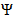

# Configuração do canal SMS{#configuring-sms-channel}

Para enviar mensagens SMS, uma ou várias contas externas devem ser configuradas por um administrador no menu **[!UICONTROL Administration]** > **[!UICONTROL Channels]** > **[!UICONTROL SMS]** > **[!UICONTROL SMS accounts]** .

As etapas para criar e modificar uma conta externa são detalhadas na seção [Conta externa](../../administration/using/external-accounts.md) . Você encontrará abaixo os parâmetros específicos das contas externas para enviar mensagens SMS.

## Definição de um Roteamento SMS {#defining-an-sms-routing}

A conta externa **[!UICONTROL SMS routing via SMPP]** é fornecida por padrão, mas pode ser útil adicionar outras contas.

Se quiser usar o protocolo SMPP, você também poderá criar uma nova conta externa. Para obter mais informações sobre o protocolo e as configurações SMS, consulte esta [nota técnica](https://helpx.adobe.com/br/campaign/kb/sms-connector-protocol-and-settings.html).

1. Crie uma nova conta externa de **[!UICONTROL Administration > Application settings > External accounts]**.
1. Defina o tipo de conta como **[!UICONTROL Routing]**, o canal como **[!UICONTROL Mobile (SMS)]** e o modo delivery como **[!UICONTROL Bulk delivery]**.

   

1. Defina as configurações de conexão.

   Para inserir as configurações de conexão específicas para enviar mensagens SMS, entre em contato com seu provedor de serviço SMS que explicará como preencher os diferentes campos de conta externa.

   

   The **[!UICONTROL Enable TLS over SMPP]** option allows you to encrypt SMPP traffic.

   **[!UICONTROL Enable verbose SMPP traces in the log file]** permite descarregar todo o tráfego SMPP em arquivos de registro. Essa opção deve ser habilitada para solucionar problemas no conector e comparar com o tráfego visto pelo provedor.

1. Entre em contato com a Adobe, que lhe dará o valor para entrar no **[!UICONTROL SMS-C implementation name]** campo, dependendo do provedor escolhido.
1. Defina as configurações do canal SMPP. Você pode saber mais na seção Codificação e formatos [de](#sms-encoding-and-formats) SMS.

   Ative o **[!UICONTROL Store incoming MO in the database]** se desejar que todo o SMS recebido seja armazenado na tabela inSMS. Para obter mais informações sobre como recuperar o SMS recebido, consulte esta [seção](../../channels/using/managing-incoming-sms.md#storing-incoming-sms).

   A **[!UICONTROL Enable Real-time KPI updates during SR processing]** opção permite que os KPIs **[!UICONTROL Delivered]** ou **[!UICONTROL Bounces + Errors]** KPIs sejam atualizados em tempo real após o envio do delivery. Esses KPIs podem ser encontrados na **[!UICONTROL Deployment]** janela e são recalculados diretamente do SR (Relatório de status) recebido do provedor.

   

1. Defina os **[!UICONTROL Throughput and timeouts]** parâmetros.

   Você pode especificar o throughput máximo de mensagens de saída (&quot;MT&quot;, Mobile Terminated) no MT por segundo. Se inserir &quot;0&quot; no campo correspondente, a taxa de transferência será ilimitada.

   Os valores de todos os campos correspondentes às durações precisam ser preenchidos em segundos.

1. Defina os parâmetros específicos do SMS-C caso precise definir um mapeamento de codificação específico. For more information, refer to the [SMSC specifics](#smsc-specifics) section.

   Ative a **[!UICONTROL Send full phone number (send characters other than digits)]** opção se não quiser respeitar o protocolo SMPP e transferir o **[!UICONTROL +]** prefixo para o servidor do provedor SMS (SMS-C).

   However, given that certain providers require the use of the **[!UICONTROL +]** prefix, it is advised that you check with your provider and they will suggest that you enable this option if necessary.

1. Se necessário, defina respostas automáticas para acionar ações com base no conteúdo de uma resposta. Para obter mais informações, consulte [esta seção](../../channels/using/managing-incoming-sms.md#managing-stop-sms).
1. Salve a configuração da conta externa do roteamento SMS.

Agora você pode usar seu novo roteamento para enviar mensagens SMS com o Adobe Campaign.

## Codificação e formatos de SMS {#sms-encoding-and-formats}

### Codificação, comprimento e transliteração do SMS {#sms-encoding--length-and-transliteration}

Por padrão, o número de caracteres em um SMS atende aos padrões GSM (Global System for Mobile Communications).

As mensagens SMS usando a codificação GSM são limitadas a 160 caracteres ou a 153 caracteres por SMS para mensagens enviadas em várias partes.

>[!NOTE]
>
>Alguns caracteres contam como dois (chaves, colchetes, o símbolo do euro, etc.). A lista dos caracteres GSM disponíveis é apresentada na seção [Tabela de caracteres - GSM Standard](#table-of-characters---gsm-standard) .

Você pode autorizar transliteração de caracteres marcando a caixa correspondente.

A transliteração consiste em substituir um caractere de um SMS por outro quando esse caractere não é considerado pelo padrão GSM.

* Se a transliteração for **authorized**, cada caractere que não for levado em consideração será substituído por um caractere GSM quando a mensagem for enviada. Por exemplo, a letra &quot;ë&quot; é substituída por &quot;e&quot;. Portanto, a mensagem é ligeiramente alterada, mas o limite de caracteres permanecerá o mesmo.
* Quando a transliteração é **not authorized**, cada mensagem que contém caracteres que não são levados em consideração é enviada em formato binário (Unicode): todos os caracteres são enviados como estão. No entanto, as mensagens SMS usando Unicode são limitadas a 70 caracteres (ou 67 caracteres por SMS para mensagens enviadas em várias partes). Se o número máximo de caracteres for excedido, várias mensagens serão enviadas, o que pode ocasionar custos adicionais.

>[!IMPORTANT]
>
>Inserir campos de personalização no conteúdo de sua mensagem SMS pode apresentar caracteres que não são considerados pela codificação GSM. Um exemplo de conteúdo é oferecido na seção [Personalizando mensagens](../../channels/using/personalizing-sms-messages.md) SMS.

Por padrão, a transliteração de caractere é desabilitada. Se você quiser que todos os caracteres em suas mensagens SMS sejam mantidos como estão, não altere nomes próprios, por exemplo, recomendamos que você não habilite essa opção.

No entanto, se as mensagens SMS contiverem muitos caracteres que geram mensagens Unicode, você poderá optar por habilitar essa opção para limitar os custos de envio de mensagens.

### Tabela de caracteres - Padrão GSM {#table-of-characters---gsm-standard}

Esta seção apresenta os caracteres considerados pelo padrão GSM. Todos os caracteres inseridos no corpo da mensagem, além daqueles mencionados abaixo, convertem toda a mensagem em formato binário (Unicode) e assim a limita a 70 caracteres. Para obter mais informações, consulte a seção de codificação, comprimento e transliteração [do](#sms-encoding--length-and-transliteration) SMS.

**Caracteres básicos**

<table> 
 <tbody> 
  <tr> 
   <td> @  </td> 
   <td>    </td> 
   <td> SP  </td> 
   <td> 0  </td> 
   <td> ¡  </td> 
   <td> P  </td> 
   <td> ¿  </td> 
   <td> P  </td> 
  </tr> 
  <tr> 
   <td> £  </td> 
   <td> _  </td> 
   <td> !  </td> 
   <td> 1  </td> 
   <td> A  </td> 
   <td> Q  </td> 
   <td> a  </td> 
   <td> q  </td> 
  </tr> 
  <tr> 
   <td> $  </td> 
   <td>    </td> 
   <td> "  </td> 
   <td> 2  </td> 
   <td> B  </td> 
   <td> R  </td> 
   <td> b  </td> 
   <td> r  </td> 
  </tr> 
  <tr> 
   <td> ¥  </td> 
   <td>    </td> 
   <td> #  </td> 
   <td> 3  </td> 
   <td> C  </td> 
   <td> S  </td> 
   <td> c  </td> 
   <td> s  </td> 
  </tr> 
  <tr> 
   <td> è  </td> 
   <td>    </td> 
   <td> ¤  </td> 
   <td> 4  </td> 
   <td> D  </td> 
   <td> T  </td> 
   <td> d  </td> 
   <td> t  </td> 
  </tr> 
  <tr> 
   <td> é  </td> 
   <td>    </td> 
   <td> %  </td> 
   <td> 5  </td> 
   <td> E  </td> 
   <td> U  </td> 
   <td> e  </td> 
   <td> u  </td> 
  </tr> 
  <tr> 
   <td> ù  </td> 
   <td>    </td> 
   <td> &amp;  </td> 
   <td> 6  </td> 
   <td> F  </td> 
   <td> V  </td> 
   <td> f  </td> 
   <td> v  </td> 
  </tr> 
  <tr> 
   <td> ì  </td> 
   <td>    </td> 
   <td> '  </td> 
   <td> 7  </td> 
   <td> G  </td> 
   <td> W  </td> 
   <td> g  </td> 
   <td> w  </td> 
  </tr> 
  <tr> 
   <td> ò  </td> 
   <td>    </td> 
   <td> (  </td> 
   <td> 8  </td> 
   <td> H  </td> 
   <td> X  </td> 
   <td> h  </td> 
   <td> x  </td> 
  </tr> 
  <tr> 
   <td> Ç  </td> 
   <td>    </td> 
   <td> )  </td> 
   <td> 9 </td> 
   <td> I  </td> 
   <td> Y  </td> 
   <td> i  </td> 
   <td> y  </td> 
  </tr> 
  <tr> 
   <td> LF  </td> 
   <td>    </td> 
   <td> *  </td> 
   <td> :  </td> 
   <td> J  </td> 
   <td> Z  </td> 
   <td> j  </td> 
   <td> z  </td> 
  </tr> 
  <tr> 
   <td> Ø  </td> 
   <td> ESC  </td> 
   <td> +  </td> 
   <td> ;  </td> 
   <td> K  </td> 
   <td> Ä  </td> 
   <td> k  </td> 
   <td> ä  </td> 
  </tr> 
  <tr> 
   <td> ø  </td> 
   <td> Æ  </td> 
   <td> ,  </td> 
   <td> &lt;  </td> 
   <td> L  </td> 
   <td> Ö  </td> 
   <td> l  </td> 
   <td> ö  </td> 
  </tr> 
  <tr> 
   <td> CR  </td> 
   <td> æ  </td> 
   <td> -  </td> 
   <td> = </td> 
   <td> M  </td> 
   <td> Ñ  </td> 
   <td> m  </td> 
   <td> ñ  </td> 
  </tr> 
  <tr> 
   <td> Å  </td> 
   <td> ß  </td> 
   <td> .  </td> 
   <td> &gt;  </td> 
   <td> N  </td> 
   <td> Ü  </td> 
   <td> n  </td> 
   <td> ü  </td> 
  </tr> 
  <tr> 
   <td> å  </td> 
   <td> É  </td> 
   <td> /  </td> 
   <td> ?  </td> 
   <td> O  </td> 
   <td> §  </td> 
   <td> o  </td> 
   <td> à  </td> 
  </tr> 
 </tbody> 
</table>

SP: espaço

ESC: escape

LF: alimentação de linha

CR: retorno

**Caracteres avançados (contados duas vezes)**

^ { } [ ~ ] | €

### Especificações do SMSC {#smsc-specifics}

>[!NOTE]
>
>Essas opções permitem adaptar o conector para funcionar com SMSC não padrão (isto é, não seguir exatamente a especificação SMPP 3.4) ou requisitos específicos de codificação e devem ser configurados apenas por usuários avançados.

Ao enviar uma mensagem SMS, o Adobe Campaign pode usar uma ou várias codificações de texto. Cada codificação tem seu próprio conjunto específico de caracteres e determina o número de caracteres que cabem em uma mensagem SMS.

O **[!UICONTROL DATA_CODING]** campo permite que a Adobe Campaign comunique-se com o SMS-C que a codificação é usada.

>[!NOTE]
>
>O mapping entre o valor **data_coding** e a codificação realmente usada é padronizado. Nevertheless, certain SMS-C have their own specific mapping: in this case, your **Adobe Campaign** administrator needs to declare this mapping. Consulte seu provedor para saber mais.

The **[!UICONTROL Define a specific mapping of encodings]** functionality allows you to declare **data_codings** and to force the encoding if necessary: to do this, specify a single encoding in the table.

**Configuração**

* Quando a **[!UICONTROL Define a specific mapping of encodings]** funcionalidade não está selecionada, o conector assume um comportamento genérico:

   * Ele tentará usar a codificação GSM para a qual atribui o valor **data_coding = 0**.
   * Se a codificação GSM falhar, ele usará a codificação **UCS2** para a qual atribui o valor **data_coding = 8**.

   

* Quando a **[!UICONTROL Define a specific mapping of encodings]** funcionalidade é selecionada, você pode definir as codificações que deseja usar, bem como os valores de **[!UICONTROL data_coding]** campo vinculados. Adobe Campaign tentará usar a primeira codificação na lista, depois o seguinte, se a primeira codificação se revelar impossível.

   A ordem da declaração é importante: é recomendável colocar a lista em ordem crescente **de custo** para favorecer as codificações que permitem usar o máximo possível de caracteres em cada mensagem SMS.

   Apenas declare as codificações que deseja usar. Se algumas das codificações fornecidas pelo SMS-C não corresponderem ao seu objetivo de uso, não as declare na lista.

   

### Resposta automática enviada ao MO {#automatic-reply-sent-to-the-mo}

Quando um perfil responde a uma mensagem SMS enviada por Campanha, você pode configurar mensagens que são automaticamente enviadas de volta a ele, bem como a ação a ser executada.

Para obter mais informações, consulte [esta seção](../../channels/using/managing-incoming-sms.md).

## Configuração de propriedades SMS {#configuring-sms-properties}

Esta seção detalha a lista de parâmetros exclusivos ao SMS na tela de propriedades de um delivery SMS ou de um modelo SMS.

Os parâmetros específicos para enviar mensagens SMS são agrupados nas seções **[!UICONTROL Send]** e nas **[!UICONTROL Advanced parameters]** .

Na **[!UICONTROL Advanced parameters]** seção:

* A **[!UICONTROL From]** opção permite que você personalize o nome do remetente da mensagem SMS usando uma sequência de caracteres. Esse é o nome que aparecerá como o nome do remetente da mensagem SMS no celular do destinatário.

   Se este campo estiver vazio, então será o número de origem fornecido na conta externa que será usado. Se nenhum número de origem for fornecido, será o código curto que será usado. A conta externa específica para o delivery SMS é apresentada na seção [Definindo um roteamento](#defining-an-sms-routing) SMS.

   

   >[!IMPORTANT]
   >
   >Verifique a legislação do seu país relativa à modificação do endereço do remetente. Você também deve verificar com seu provedor de serviço SMS se eles ofertas essa funcionalidade.

Na **[!UICONTROL Send]** seção de um modelo SMS:

* A **[!UICONTROL Maximum number of SMS per message]** opção permite definir o número de mensagens SMS a serem usadas para enviar uma mensagem. Se esse número for excedido, a mensagem não será enviada.

   >[!IMPORTANT]
   >
   >Se você tiver inserido campos de personalização ou texto condicional no conteúdo da sua mensagem SMS, o comprimento da mensagem e, como resultado, o número de mensagens SMS a serem enviadas, pode variar de um recipient para outro. Para obter mais informações, consulte a seção [Personalização de mensagens](../../channels/using/personalizing-sms-messages.md) SMS.

   

* O **[!UICONTROL Transmission mode]** campo permite determinar o método de delivery para mensagens SMS:

   * **[!UICONTROL Saved on SIM card]**: a mensagem é armazenada na placa SIM do telefone do recipient.
   * **[!UICONTROL Saved on mobile]**: a mensagem é armazenada na memória interna do telefone.
   * **[!UICONTROL Flash]**: a mensagem é exibida no telefone móvel do recipient como uma notificação e então desaparece sem ser salva.
