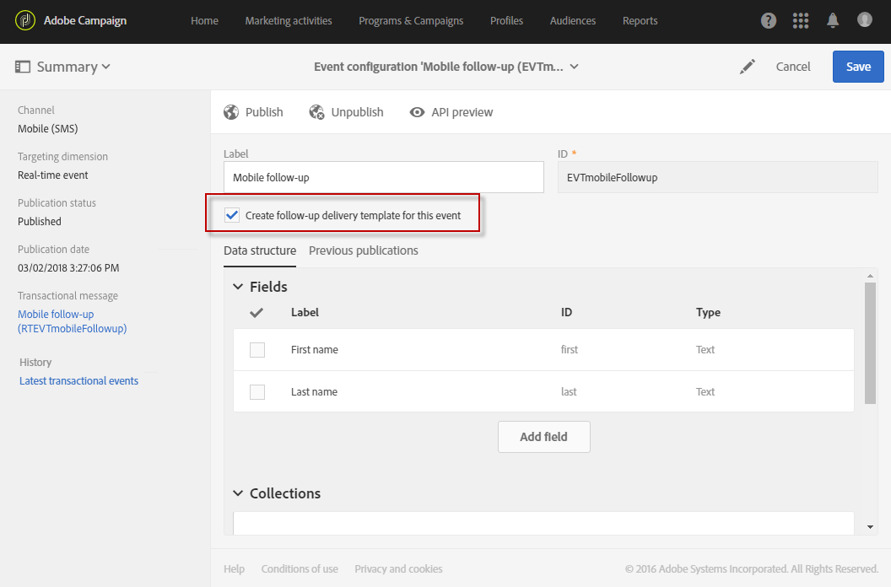

# Configuração de mensagens transacionais{#configuring-transactional-messaging}

Para enviar um mensagen transacional com a Adobe Campaign, primeiro é necessário descrever a estrutura dos dados do evento.

A configuração do evento deve ser executada por um [administrador](../../administration/using/users-management.md#functional-administrators) seguindo as etapas abaixo.

>[!NOTE]
>
>A configuração pode variar dependendo do tipo de mensagen transacional que você deseja enviar. Para obter mais informações, consulte [Configurações específicas do evento transacional](#transactional-event-specific-configurations).

Após a publicação do evento:

* A API que será usada pelo desenvolvedor do site é implantada e os eventos transacionais agora podem ser enviados. Consulte [Integrar o acionamento do evento em um site](#integrating-the-triggering-of-the-event-in-a-website).

* O mensagen transacional correspondente é criado automaticamente. Consulte [Introdução às mensagens transacionais](../../channels/using/getting-started-with-transactional-msg.md).

## Criação de um evento {#creating-an-event}

Para começar, crie o evento correspondente às suas necessidades.

>[!IMPORTANT]
>
>Somente os usuários que têm a função **[!UICONTROL Administration]** e que fazem parte da **[!UICONTROL All]** [unidade organizacional](../../administration/using/organizational-units.md) têm os direitos apropriados para criar uma configuração de evento.

1. Clique no logotipo **[!UICONTROL Adobe Campaign]**, no canto superior esquerdo, em seguida selecione **[!UICONTROL Marketing plans]** > **[!UICONTROL Transactional messages]** > **[!UICONTROL Event configuration]**.
1. Clique no botão **[!UICONTROL Create]**.
1. Dê um **[!UICONTROL Label]** e um **[!UICONTROL ID]** ao evento. O campo **[!UICONTROL ID]** é obrigatório e deve começar com o prefixo &quot;EVT&quot;. Se você não usar esse prefixo, ele será adicionado automaticamente quando você clicar em **[!UICONTROL Create]**.

   

   >[!IMPORTANT]
   >
   >A ID não deve exceder 64 caracteres, incluindo o prefixo EVT.

1. Selecione o canal que será usado para enviar seus mensagens transacionais **[!UICONTROL Email]**, **[!UICONTROL Mobile (SMS)]** ou **[!UICONTROL Mobile application]** (notificação por push).

   >[!NOTE]
   >
   >Somente um canal pode ser usado para cada configuração de evento. Depois que o evento é criado, não é possível alterar o canal.

1. Selecione o targeting dimension correspondente à configuração de evento desejada e clique em **[!UICONTROL Create]**.

   Dados de público alvo baseados em mensagens transacionais contidos no próprio evento, enquanto dados de público alvo baseados em perfis contidos no banco de dados Adobe Campaign. Para obter mais informações, consulte [Configurações específicas do evento transacional](#transactional-event-specific-configurations).

>[!NOTE]
>
>O número de eventos criados em tempo real pode afetar sua plataforma. Para garantir o desempenho ideal, exclua eventos em tempo real que não são mais necessários. Consulte [Excluindo um evento](#deleting-an-event).

## Definição dos atributos do evento {#defining-the-event-attributes}

Na seção **[!UICONTROL Fields]**, defina os atributos que serão integrados ao conteúdo do evento e poderão ser usados para personalizar o mensagen transacional.

As etapas para adicionar e modificar campos são as mesmas que para [recursos personalizados](../../developing/using/configuring-the-resource-s-data-structure.md#adding-fields-to-a-resource).

>[!NOTE]
>
>Se quiser criar um mensagen transacional multilíngue, defina um atributo de evento adicional com a ID **[!UICONTROL AC_language]**. Isso se aplica somente aos mensagens transacionais eventos. Depois que o evento é publicado, as etapas para editar o conteúdo de um mensagen transacional multilíngue são as mesmas de um email multilíngue padrão. Consulte [Criação de um email multilíngue](../../channels/using/creating-a-multilingual-email.md).

## Definindo coleções de dados {#defining-data-collections}

Você pode adicionar ao conteúdo do evento uma coleção de elementos, cada elemento incluindo vários atributos.

Essa coleção pode ser usada em um email transacional para adicionar [listas de produtos](../../channels/using/event-transactional-messages.md#using-product-listings-in-a-transactional-message) ao conteúdo da mensagem, por exemplo, uma lista de produtos - com o preço, o número de referência, a quantidade etc. para cada produto da lista.

1. Na seção **[!UICONTROL Collections]**, clique no botão **[!UICONTROL Create element]**.

   

1. Adicione um rótulo e uma ID para sua coleção.
1. Adicione todos os campos que deseja exibir no mensagen transacional para cada produto da lista.

   Neste exemplo, adicionamos os seguintes campos:

   

1. A guia **[!UICONTROL Enrichment]** permite enriquecer cada item da coleção. Isso permitirá que você personalize os elementos da lista de produtos correspondente com informações do banco de dados da Adobe Campaign ou de outros recursos criados.

>[!NOTE]
>
>As etapas para enriquecer os elementos de uma coleção são as mesmas descritas na seção [Enriquecendo o evento](#enriching-the-transactional-message-content). Observe que enriquecer o evento não permitirá enriquecer uma coleção: é necessário adicionar um enriquecimento à própria coleção na seção **[!UICONTROL Collections]**.

Depois que o evento e a mensagem forem publicados, você poderá usar essa coleção no mensagen transacional.

Esta é a pré-visualização de API para este exemplo:

**Tópicos relacionados:**

* [Visualização e publicação do evento](#previewing-and-publishing-the-event)
* [Uso de listas de produtos em uma mensagem transacional](../../channels/using/event-transactional-messages.md#using-product-listings-in-a-transactional-message)

## Enriquecendo o evento {#enriching-the-transactional-message-content}

Você pode enriquecer o conteúdo do mensagen transacional com informações do banco de dados Adobe Campaign para personalizar suas mensagens. A partir do sobrenome ou da ID do CRM de cada um dos recipient, por exemplo, você pode recuperar dados como o endereço ou a data de nascimento ou qualquer outro campo personalizado adicionado na tabela Perfil, para personalizar as informações enviadas a eles.

É possível aprimorar o conteúdo do mensagen transacional com informações de **[!UICONTROL Profile and services Ext API]** estendido. Para obter mais informações, consulte [Extensão da API: Publicar a extensão](../../developing/using/step-2--publish-the-extension.md)

Essas informações também podem ser armazenadas em novos recursos. Nesse caso, o recurso deve estar vinculado aos recursos **[!UICONTROL Profile]** ou **[!UICONTROL Service]** diretamente ou por meio de outra tabela. Por exemplo, na configuração abaixo, é possível aprimorar o conteúdo do mensagen transacional com informações do recurso **[!UICONTROL Product]** como a categoria ou ID do produto, se o recurso **[!UICONTROL Product]** estiver vinculado ao recurso **[!UICONTROL Profile]**.

Para obter mais informações sobre a criação e publicação de recursos, consulte [esta página](../../developing/using/key-steps-to-add-a-resource.md).

1. Na seção **[!UICONTROL Enrichment]**, clique no botão **[!UICONTROL Create element]**.

   

1. Selecione o recurso com o qual deseja vincular sua mensagem. Nesse caso, escolha o recurso **[!UICONTROL Profile]**.

   

1. Use o botão **[!UICONTROL Create element]** para vincular um campo do recurso selecionado a um dos campos adicionados anteriormente ao evento (consulte [Definição dos atributos do evento](#defining-the-event-attributes)).

   

1. Neste exemplo, reconciliamos os campos **[!UICONTROL Last name]** e **[!UICONTROL First name]** com os campos correspondentes no recurso **[!UICONTROL Profile]**.

   

   Você também pode enriquecer o conteúdo do mensagen transacional usando o recurso **[!UICONTROL Service]**. Para obter mais informações sobre serviços, consulte esta [seção](../../audiences/using/creating-a-service.md).

1. Se você estiver criando ou editando um evento baseado em perfis, na seção **[!UICONTROL Targeting enrichment]**, selecione o enriquecimento que será usado como público alvo de mensagem durante a execução do delivery.

   

   >[!NOTE]
   >
   >A seleção de um enriquecimento de definição de metas com base no recurso **[!UICONTROL Profile]** é obrigatória para eventos baseados em perfis.

Assim que o evento e a mensagem forem publicados, esse link permitirá que você aprimore o conteúdo do mensagen transacional.

**Tópicos relacionados:**

* [Visualização e publicação do evento](#previewing-and-publishing-the-event).
* [Personalização de uma mensagem transacional](../../channels/using/event-transactional-messages.md#personalizing-a-transactional-message).

## Visualização e publicação do evento {#previewing-and-publishing-the-event}

Antes de poder usar o evento, você deve pré-visualização e publicá-lo.

1. Clique no botão **[!UICONTROL API preview]** para ver uma simulação da REST API que será usada pelo desenvolvedor do seu site antes de ser publicada. Depois que o evento é publicado, esse botão também permite que você veja uma pré-visualização da API em produção. Consulte [Integrar o acionamento do evento em um site](#integrating-the-triggering-of-the-event-in-a-website).

   

   >[!NOTE]
   >
   >A API REST varia de acordo com o canal selecionado e o targeting dimension selecionado. Para obter mais detalhes sobre as várias configurações, consulte [Configurações específicas do evento transacional](#transactional-event-specific-configurations).

1. Clique em **[!UICONTROL Publish]** para start da publicação.

   

   A API que será usada pelo desenvolvedor do site é implantada e os eventos transacionais agora podem ser enviados.

1. Você pode visualização os logs de publicação na guia correspondente.

   

   >[!IMPORTANT]
   >
   >Sempre que modificar o evento, clique em **[!UICONTROL Publish]** novamente para gerar a REST API atualizada que será usada pelo desenvolvedor do site.

   Depois que o evento é publicado, um mensagen transacional vinculado ao novo evento é criado automaticamente.

1. Você pode acessar esse mensagen transacional diretamente pelo link localizado na área do lado esquerdo.

   

Para que o evento acione o envio de um mensagen transacional, é necessário modificar e publicar a mensagem que acabou de ser criada. Consulte [Mensagens transacionais de evento](../../channels/using/event-transactional-messages.md).

Você também precisa integrar esse evento de disparo ao seu site. Consulte [Integrar o acionamento do evento em um site](#integrating-the-triggering-of-the-event-in-a-website).

Depois que os start Adobe Campaign receberem eventos relacionados a essa configuração de evento, o link **[!UICONTROL Latest transactional events]** na seção **[!UICONTROL History]** permitirá que você acesse os eventos mais recentes enviados por seu serviço de terceiros e processados pela Adobe Campaign.

Os eventos (no formato JSON) são listados do mais recente ao mais antigo. Essa lista permite que você verifique dados como o conteúdo ou o status de um evento para fins de controle e depuração.

### Cancelamento de publicação de um evento {#unpublishing-an-event}

O botão **[!UICONTROL Unpublish]** permite cancelar a publicação do evento, que exclui da REST API o recurso correspondente ao evento criado anteriormente. Agora, mesmo que o evento seja acionado pelo seu site, as mensagens correspondentes não serão mais enviadas e não serão armazenadas no banco de dados.

>[!NOTE]
>
>Se você já tiver publicado o mensagen transacional correspondente, a publicação do mensagen transacional também será cancelada. Consulte [Cancelar publicação de um mensagen transacional](../../channels/using/event-transactional-messages.md#unpublishing-a-transactional-message).

Clique no botão **[!UICONTROL Publish]** para gerar uma nova REST API.

### Processo de publicação de mensagens transacionais {#transactional-messaging-pub-process}

O gráfico abaixo ilustra o processo de publicação de mensagens transacionais.

Para obter mais informações sobre como publicar, pausar e cancelar a publicação de um mensagen transacional, consulte [esta seção](../../channels/using/event-transactional-messages.md#publishing-a-transactional-message).

### Excluindo um evento {#deleting-an-event}

Depois que um evento for despublicado ou se um evento ainda não tiver sido publicado, você poderá excluí-lo da lista de configuração do evento. Para fazer isso:

1. Clique no logotipo **[!UICONTROL Adobe Campaign]**, no canto superior esquerdo, em seguida selecione **[!UICONTROL Marketing plans]** > **[!UICONTROL Transactional messages]** > **[!UICONTROL Event configuration]**.
1. Passe o mouse sobre a configuração do evento de sua escolha e selecione o botão **[!UICONTROL Delete element]**.

   

   >[!NOTE]
   >
   >Certifique-se de que a configuração do evento tenha o status **[!UICONTROL Draft]**; caso contrário, você não poderá excluí-la. O status **[!UICONTROL Draft]** se aplica a um evento que ainda não foi publicado ou que foi [não publicado](#unpublishing-an-event).

1. Clique no botão **[!UICONTROL Confirm]**.

   

>[!IMPORTANT]
>
>A exclusão de uma configuração de evento que tenha sido publicada e já usada também excluirá os mensagens transacionais correspondentes e seus logs de rastreamento e envio.

## Pesquisando eventos transacionais {#searching-transactional-events}

Para acessar e pesquisar os eventos transacionais já criados, siga as etapas abaixo.

1. Clique no logotipo **[!UICONTROL Adobe Campaign]**, no canto superior esquerdo, em seguida selecione **[!UICONTROL Marketing plans]** > **[!UICONTROL Transactional messages]** > **[!UICONTROL Event configuration]**.
1. Clique no botão **[!UICONTROL Show search]**.

   

1. Você pode filtrar no **[!UICONTROL Publication status]**. Isso permite que você exiba somente os eventos publicados, por exemplo.
1. Você também pode filtrar os eventos usando **[!UICONTROL Last event received]**. Por exemplo, se você digitar 10, somente as configurações de evento com o último evento recebido há 10 dias ou mais serão exibidas. Isso permite que você exiba quais eventos estiveram inativos por um determinado período.

   

   >[!NOTE]
   >
   >O valor padrão é 0. Todos os eventos são exibidos.

## Integração do acionamento do evento em um site {#integrating-the-triggering-of-the-event-in-a-website}

Depois de criar um evento, é necessário integrar o acionamento desse evento ao seu site.

No exemplo descrito na seção [Princípio operacional de mensagens transacionais](../../channels/using/getting-started-with-transactional-msg.md#transactional-messaging-operating-principle), você deseja que um evento de &quot;abandono do carrinho&quot; seja acionado sempre que um de seus clientes sair do site antes de comprar os produtos no carrinho. Para fazer isso, o desenvolvedor da Web do site deve usar a API REST da Adobe Campaign Standard.

Consulte a [Documentação da API REST](../../api/using/managing-transactional-messages.md).

## Configurações específicas do evento de transações {#transactional-event-specific-configurations}

A configuração do evento transacional pode variar dependendo do tipo de mensagen transacional que você deseja enviar (evento ou perfil) e do canal que será usado.

As seções a seguir detalham qual configuração específica deve ser definida de acordo com o mensagen transacional desejado. Para obter mais informações sobre as etapas gerais para configurar um evento, consulte [Criação de um evento](#creating-an-event).

### Mensagens transacionais baseadas em evento {#event-based-transactional-messages}

Para enviar um mensagen transacional baseado em eventos, primeiro é necessário criar e configurar um evento direcionando os dados contidos no próprio evento.
Para obter mais informações, consulte [Envolver-se com mensagens transacionais](https://helpx.adobe.com/br/campaign/kb/simplify-campaign-management.html#Managedatatofuelengagingexperiences).

1. Ao criar a configuração do evento, selecione o targeting dimension **[!UICONTROL Real-time event]** (consulte [Criação de um evento](#creating-an-event)).
1. Adicione campos ao evento para personalizar o mensagen transacional (consulte [Definição dos atributos do evento](#defining-the-event-attributes)).
1. Enriqueça o conteúdo do mensagen transacional se quiser usar informações adicionais do banco de dados Adobe Campaign (consulte [Enriquecendo o conteúdo do mensagen transacional](#enriching-the-transactional-message-content)).

   >[!NOTE]
   >
   >As mensagens transacionais baseadas em evento só devem usar os dados contidos no evento enviado para definir o recipient e a personalização do conteúdo da mensagem. No entanto, você pode enriquecer o conteúdo da mensagem transacional usando informações do banco de dados do Adobe Campaign.

1. Pré-visualização e publicação do evento (consulte [Visualizar e publicar o evento](#previewing-and-publishing-the-event)).

   Ao visualizar o evento, a REST API contém um atributo que especifica o endereço de email ou o telefone móvel de acordo com o canal selecionado.

   Depois que o evento é publicado, um mensagen transacional vinculado ao novo evento é criado automaticamente. Para que o evento dispare o envio de um mensagen transacional, você deve modificar e publicar a mensagem que acabou de ser criada, consulte [mensagens transacionais de Evento](../../channels/using/event-transactional-messages.md).

1. Integre o evento ao seu site (consulte [Integrar o acionamento do evento em um site](#integrating-the-triggering-of-the-event-in-a-website)).

### Mensagens transacionais baseadas em perfil {#profile-based-transactional-messages}

Para enviar um mensagen transacional baseado em perfis, primeiro é necessário criar e configurar os dados de direcionamento de eventos contidos no banco de dados da Adobe Campaign.

1. Ao criar a configuração do evento, selecione o targeting dimension **[!UICONTROL Profile event]** (consulte [Criação de um evento](#creating-an-event)).
1. Adicione campos ao evento para personalizar o mensagen transacional (consulte [Definição dos atributos do evento](#defining-the-event-attributes)). É necessário adicionar pelo menos um campo para criar um enriquecimento. Não é necessário criar outros campos, como **Nome** e **Sobrenome**, pois você poderá usar campos de personalização do banco de dados Adobe Campaign.
1. Crie um enriquecimento para vincular o evento ao recurso **[!UICONTROL Profile]** (consulte [Enriquecendo o conteúdo do mensagen transacional](#enriching-the-transactional-message-content)). A criação de um enriquecimento é obrigatória ao usar um targeting dimension **[!UICONTROL Profile]**.
1. Pré-visualização e publicação do evento (consulte [Visualizar e publicar o evento](#previewing-and-publishing-the-event)).

   Ao visualizar o evento, a REST API não contém um atributo que especifique o endereço de email ou o telefone móvel, como será recuperado do recurso **[!UICONTROL Profile]**.

   Depois que o evento é publicado, um mensagen transacional vinculado ao novo evento é criado automaticamente. Para que o evento dispare o envio de um mensagen transacional, você deve modificar e publicar a mensagem que acabou de ser criada, consulte [Envio de um mensagen transacional de perfil](../../channels/using/profile-transactional-messages.md#sending-a-profile-transactional-message).

1. Integre o evento ao seu site (consulte [Integrar o acionamento do evento em um site](#integrating-the-triggering-of-the-event-in-a-website)).

### Notificações por push transacionais baseadas em eventos {#event-based-transactional-push-notifications}

Para poder enviar notificações por push transacionais, é necessário configurar o Adobe Campaign de acordo. Consulte [Configuração de push](https://helpx.adobe.com/br/campaign/kb/configuring-app-sdkv4.html).

Para enviar uma notificação por push transacional anônima a todos os usuários que opt in receber notificações do seu aplicativo móvel, primeiro é necessário criar e configurar um evento direcionando os dados contidos no próprio evento. As etapas correspondentes são apresentadas abaixo.

O evento deve conter os três elementos seguintes:

* Um **token de registro**, que é a ID de usuário para um aplicativo móvel e um dispositivo. Pode não corresponder a nenhum perfil do banco de dados Adobe Campaign.
* Um **nome do aplicativo móvel** (um para todos os dispositivos - Android e iOS). Esta é a ID do aplicativo móvel configurado no Adobe Campaign que será usada para receber notificações por push nos dispositivos dos usuários. Para obter mais informações, consulte esta [página](https://helpx.adobe.com/campaign/kb/configuring-app-sdkv4.html)
* Uma **plataforma push** (&quot;gcm&quot; para Android ou &quot;apns&quot; para iOS).

1. Ao criar a configuração do evento, selecione o canal **[!UICONTROL Mobile application]** e o targeting dimension **[!UICONTROL Real-time event]** (consulte [Criação de um evento](#creating-an-event)).
1. Adicione campos ao evento para personalizar o mensagen transacional (consulte [Definição dos atributos do evento](#defining-the-event-attributes)).
1. Enriqueça o conteúdo do mensagen transacional se quiser usar informações adicionais do banco de dados Adobe Campaign (consulte [Enriquecendo o conteúdo do mensagen transacional](#enriching-the-transactional-message-content)).

   >[!NOTE]
   >
   >As mensagens transacionais baseadas em evento só devem usar os dados contidos no evento enviado para definir o recipient e a personalização do conteúdo da mensagem. No entanto, você pode enriquecer o conteúdo da mensagem transacional usando informações do banco de dados do Adobe Campaign.

1. Pré-visualização e publicação do evento (consulte [Visualizar e publicar o evento](#previewing-and-publishing-the-event)).

   Ao visualizar o evento, a REST API contém os atributos &quot;registrationToken&quot;, &quot;application&quot; e &quot;pushPlatform&quot; que serão usados para público alvo do delivery.

   

   Depois que o evento é publicado, uma notificação por push transacional vinculada ao novo evento é criada automaticamente. Para modificar e publicar a mensagem que acabou de ser criada, consulte [Envio de uma notificação por push transacional direcionada a um evento](../../channels/using/transactional-push-notifications.md#transactional-push-notifications-targeting-an-event).

1. Integre o evento ao seu site (consulte [Integrar o acionamento do evento em um site](#integrating-the-triggering-of-the-event-in-a-website)).

### Notificações por push transacionais baseadas em perfis {#profile-based-transactional-push-notifications}

Para enviar uma notificação por push transacional para os perfis Adobe Campaign que se inscreveram em seu aplicativo móvel, primeiro é necessário criar e configurar um evento direcionado ao banco de dados Adobe Campaign.

1. Ao criar a configuração do evento, selecione o canal **[!UICONTROL Mobile application]** e o targeting dimension **[!UICONTROL Profile]** (consulte [Criação de um evento](#creating-an-event)).

   Por padrão, a notificação por push transacional será enviada para todos os aplicativos móveis nos quais os recipient se inscreveram. Para enviar a notificação por push para um aplicativo móvel específico, selecione-o na lista. Os outros aplicativos móveis serão direcionados pela mensagem, mas serão excluídos do envio.

   

1. Adicione campos ao evento, se quiser personalizar o mensagen transacional (consulte [Definição dos atributos do evento](#defining-the-event-attributes)).

   >[!NOTE]
   >
   >É necessário adicionar pelo menos um campo para criar um enriquecimento. Não é necessário criar outros campos, como **Nome** e **Sobrenome**, pois você poderá usar campos de personalização do banco de dados Adobe Campaign.

1. Crie um enriquecimento para vincular o evento ao recurso **[!UICONTROL Profile]** (consulte [Enriquecendo o conteúdo do mensagen transacional](#enriching-the-transactional-message-content)). A criação de um enriquecimento é obrigatória ao usar um targeting dimension **[!UICONTROL Profile]**.
1. Pré-visualização e publicação do evento (consulte [Visualizar e publicar o evento](#previewing-and-publishing-the-event)).

   Ao visualizar o evento, a API REST não contém um atributo que especifique o token de registro, o nome do aplicativo e a plataforma de push, conforme serão recuperados do recurso **[!UICONTROL Profile]**.

   Depois que o evento é publicado, uma notificação por push transacional vinculada ao novo evento é criada automaticamente. Para modificar e publicar a mensagem que acabou de ser criada, consulte [Envio de uma notificação por push transacional direcionada a um perfil](../../channels/using/transactional-push-notifications.md#transactional-push-notifications-targeting-a-profile).

1. Integre o evento ao seu site (consulte [Integrar o acionamento do evento em um site](#integrating-the-triggering-of-the-event-in-a-website)).

### Configurar um evento para enviar uma mensagem de acompanhamento {#configuring-an-event-to-send-a-follow-up-message}

Uma mensagem de acompanhamento é um template do delivery de marketing predefinido que pode ser usado em um fluxo de trabalho para enviar mensagens aos recipient de um mensagen transacional específico. Para obter mais informações, consulte [Mensagens de acompanhamento](../../channels/using/follow-up-messages.md).

1. Use a mesma configuração de evento que você criou para enviar um mensagen transacional de evento. Consulte [mensagens transacionais baseados em Eventos](#event-based-transactional-messages).
1. Ao configurar seu evento, marque a caixa **[!UICONTROL Create follow-up delivery template for this event]** antes de publicar o evento.

   

1. Pré-visualização e publicação do evento (consulte [Visualizar e publicar o evento](#previewing-and-publishing-the-event)).

   Depois que o evento é publicado, um mensagen transacional e um template do delivery de acompanhamento vinculados ao novo evento são criados automaticamente. Para obter mais informações sobre como usar mensagens de acompanhamento, consulte [Enviar uma mensagem de acompanhamento](../../channels/using/follow-up-messages.md#sending-a-follow-up-message).

## Caso de uso: configuração de um evento para enviar um mensagen transacional {#use-case--configuring-an-event-to-send-a-transactional-message}

Neste exemplo, queremos configurar um evento para enviar mensagens de confirmação após cada compra em nosso site com os seguintes pré-requisitos:

Como queremos identificar nosso cliente por meio de sua ID do CRM, primeiro verifique se o recurso **[!UICONTROL Profile]** foi estendido com esse novo campo.

Da mesma forma, um recurso personalizado correspondente às compras deve ter sido criado e publicado e deve estar vinculado ao recurso **[!UICONTROL Profile]**. Dessa forma, você poderá recuperar informações desse recurso para enriquecer o conteúdo da mensagem.

Para obter mais informações sobre a criação e publicação de recursos, consulte [esta página](../../developing/using/key-steps-to-add-a-resource.md).

1. Crie um novo evento usando o canal **[!UICONTROL Email]** e o targeting dimension **[!UICONTROL Profile]** (consulte [Criação de um evento](#creating-an-event)).
1. Defina os atributos que estarão disponíveis para personalizar o mensagen transacional. Em nosso caso, adicione os campos &quot;ID do CRM&quot; e &quot;Identificador do produto&quot; (consulte [Definição dos atributos do evento](#defining-the-event-attributes)).

   

1. Para enriquecer o conteúdo da mensagem com informações relacionadas às compras anteriores do cliente, crie um enriquecimento direcionado ao recurso **[!UICONTROL Purchase]** (consulte [Enriquecendo o conteúdo do mensagen transacional](#enriching-the-transactional-message-content)).

   

1. Crie uma condição de junção entre o campo &quot;Identificador do produto&quot; que foi adicionado anteriormente à mensagem e o campo correspondente do recurso **[!UICONTROL Purchase]**.

   

1. Pré-visualização e publicação do evento (consulte [Visualizar e publicar o evento](#previewing-and-publishing-the-event)).
1. Integre o evento em seu site (consulte [Integrar o acionamento do evento em um site](#integrating-the-triggering-of-the-event-in-a-website)).

