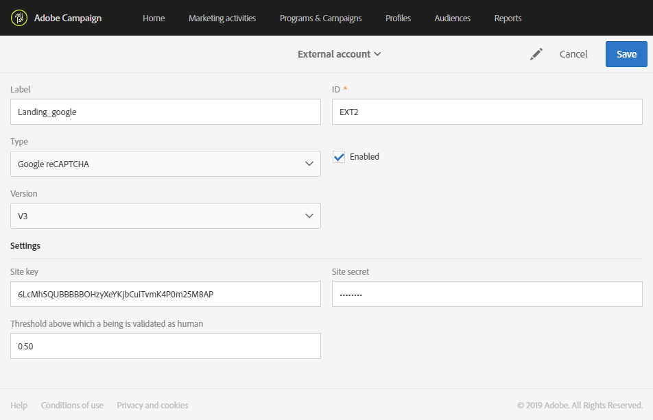

# Contas externas{#external-accounts}

Uma conta externa é uma configuração que permite configurar e testar o acesso a um servidor externo ao Adobe Campaign.

Essas contas externas podem ser usadas em workflows da campanha para acessar e gerenciar dados.

Você pode configurar os seguintes tipos de contas externas:

* SFTP. Para obter mais informações, consulte [esta seção](#sftp-external-account).
* Serviço de Armazenamentos da Amazon (S3). Para obter mais informações, consulte [esta seção](#amazon-s3-external-account).
* Adobe Experience Manager. Para obter mais informações, consulte [esta seção](#adobe-experience-manager-external-account).
* Adobe Analytics. Para obter mais informações, consulte [esta seção](../../integrating/using/configure-campaign-analytics-integration.md).
* Google reCAPTCHA. Para obter mais informações, consulte [esta seção](#google-recaptcha-external-account).
* armazenamento Blob do Microsoft Azure. Para obter mais informações, consulte [esta seção](#microsoft-azure-external-account).

>[!NOTE]
>
>Outros tipos de contas externas são usados pela Adobe durante o processo de provisionamento do produto. A partir da versão Campaign Standard 17.9, as contas externas FTP ainda podem ser definidas, mas não podem mais ser usadas nas novas atividades de fluxo de trabalho. Se você já tiver uma conexão configurada, ela ainda estará ativada.

As Contas externas podem ser configuradas pelos administradores no **[!UICONTROL Administration > Application settings > External accounts]** menu.

## Criação de uma conta externa {#creating-an-external-account}

O Adobe Campaign vem com um conjunto de contas externas predefinidas. Para configurar conexões com sistemas externos, como servidores FTP usados para transferir arquivos, você pode criar suas próprias contas externas.

As contas externas são usadas por processos técnicos, como workflows técnicos ou workflows da campanha. Ao configurar uma transferência de arquivos em um workflow ou uma troca de dados com qualquer outro aplicativo (Adobe Target, Experience Manager etc.), você precisa selecionar uma conta externa.

1. Clique no botão **[!UICONTROL Create]**.
1. Insira um rótulo. O rótulo e a ID serão usados ao selecionar contas externas em workflows.
1. Selecione o tipo de conta que deseja criar.
1. Configure o acesso à conta especificando credenciais, endereço do servidor, número da porta e ou chaves, quando relevante.

   As informações necessárias geralmente são fornecidas pelo provedor do servidor ao qual você está se conectando.

1. Salve sua conta.

A conta externa é criada e adicionada à lista da conta. Agora está disponível para suas transferências de dados/arquivos ou configurações de roteamento em atividades de workflow e propriedades de deliveries.

## Conta externa SFTP {#sftp-external-account}

Tipos de conta externa diferentes exigem informações diferentes para serem especificadas.

Para uma conta externa SFTP, forneça os seguintes detalhes:

* Endereço do servidor. Por exemplo, **ftp.domain.com**.
* Número da porta. For example, **22**.
* Credenciais do servidor SFTP: nome da conta e senha usados para conexão com o servidor.

### Recomendações do servidor SFTP hospedado pela Adobe {#adobe-hosted-sftp-server-recommendations}

Ao gerenciar arquivos e dados para fins de ETL, esses arquivos são armazenados em um servidor SFTP hospedado fornecido pela Adobe. Este SFTP foi projetado para ser um espaço de armazenamento temporário no qual você pode controlar a retenção e exclusão de arquivos.

Quando não for usado ou monitorado corretamente, esse espaço poderá preencher rapidamente o espaço físico disponível no servidor e causar problemas graves. Isso pode resultar em perda ou corrupção de dados na sua plataforma.

Para evitar esses problemas, a Adobe recomenda seguir as práticas recomendadas abaixo:

* Mantenha os dados mínimos possíveis.
* Use a autenticação baseada em chave para evitar a expiração da senha. Os formatos suportados são **OpenSSH** e **SSH2** apenas. Será necessário fornecer a chave pública para que a equipe de suporte da Adobe seja carregada no servidor de Campanha.
* Manter os dados apenas enquanto for necessário. 15 dias é o limite máximo de tempo.
* Use workflows para excluir corretamente os dados (gerencie a retenção de workflows consumindo os dados).
* Use em lotes em uploads de SFTP e em workflows.
* Manipule erros/exceções.
* Ocasionalmente, conecte-se no SFTP para verificar diretamente o que encontra-se lá.
* Lembre-se de que o gerenciamento de disco SFTP é predominantemente sua responsabilidade.

Além disso, observe que os IPs públicos dos quais você está tentando iniciar a conexão SFTP devem ser adicionados à lista de permissões na instância da Campanha. A adição de endereços IP à lista de permissões pode ser solicitada por meio de um ticket [de](https://helpx.adobe.com/br/enterprise/using/support-for-experience-cloud.html)suporte, junto com o fornecimento da chave pública a ser usada para autenticação.

Os servidores SFTP podem ser gerenciados a partir do Painel de controle. For more information, refer to the [Control Panel documentation](https://docs.adobe.com/content/help/pt-BR/control-panel/using/sftp-management/about-sftp-management.html).

>[!NOTE]
>
>O Painel de controle está disponível somente para usuários administradores de clientes hospedados no AWS.
Verifique se sua instância está hospedada no AWS [aqui](https://docs.adobe.com/content/help/pt-BR/control-panel/using/faq.html#ims-org-id).

## conta externa Amazon S3 {#amazon-s3-external-account}

O campo do servidor Amazon S3 deve ser preenchido da seguinte forma:

```
<S3 bucket name>.s3.amazonaws.com/<s3 object path>
```

Para armazenar o arquivo no modo criptografado S3, marque a **[!UICONTROL Keep files in S3 encrypted]** caixa.


As informações necessárias geralmente são fornecidas pelo provedor do servidor ao qual você está se conectando.

Especifique o **[!UICONTROL AWS Region]** associado ao terminal. Você pode verificar as regiões compatíveis e as versões de assinatura na documentação [oficial do](https://docs.aws.amazon.com/general/latest/gr/rande.html#s3_region)Amazon S3.

>[!NOTE]
>
>Sua região AWS **[!UICONTROL Receiver server]** deve ser inserida sem a região AWS, e posteriormente ela será adicionada automaticamente ao URL.

### Recomendações de conta do Amazon S3 {#amazon-s3-account-recommendations}

Para ajudá-lo a configurar sua conta Amazon S3, recomendamos que siga estas recomendações:

* Crie uma política de definição estrita para restringir o acesso a compartimentos S3. A política de bucket pode ser configurada ao criar um bucket. For more information, refer to the [Amazon S3 documentation](https://docs.aws.amazon.com/AmazonS3/latest/dev//example-bucket-policies.html).
* Ao criar uma conta externa, ative a criptografia para armazenar dados confidenciais no bucket S3 marcando a **[!UICONTROL Keep files in S3 encrypted]** caixa.
* Conceda permissões de bucket para especificar quem pode acessar o objeto em um bucket. Para obter mais informações sobre permissão de bucket, consulte a documentação [do](https://docs.aws.amazon.com/AmazonS3/latest/dev//access-control-overview.html)Amazon S3.

## Conta externa do Adobe Experience Manager.{#adobe-experience-manager-external-account}

contas externas Adobe Experience Manager são usadas ao integrar Campanha com Experience Manager.

O processo e os requisitos relacionados a essa integração estão disponíveis [neste documento](../../integrating/using/get-started-campaign-integrations.md).

Como você está configurando essa nova conta externa, é necessário fornecer os seguintes detalhes:

* Servidor: insira o URL do servidor Adobe Experience Manager. Por exemplo:

   ``` http://aem.domain.com:4502 ```

* Credenciais da conta AEM: use a conta que acessará a instância Adobe Experience Manager. Deve ser uma parte da conta do grupo campanha-remoto no Experience Manager.

## conta externa do Google reCAPTCHA {#google-recaptcha-external-account}

>[!NOTE]
>
>A configuração do Google reCAPTCHA requer uma conta do Google.

O mecanismo do Google reCAPTCHA permite proteger sua landing page contra spam e abuso causado por bots. Isso não é intrusivo para seus clientes, pois não requer nenhuma interação deles e se baseia em interações com seu site. Para registrar seu site, consulte esta [página](https://www.google.com/recaptcha/admin/create). É necessário escolher o tipo V3 reCAPTCHA.

Para adicionar o Google reCAPTCHA V3 à sua landing page, primeiro é necessário configurá-lo na sua conta externa. Para obter mais informações sobre como adicioná-lo à sua landing page, consulte esta [seção](../../channels/using/configuring-landing-page.md#setting-google-recaptcha).

Para uma conta externa do Google reCAPTCHA V3, forneça os seguintes detalhes:

* A **[!UICONTROL Label]** e **[!UICONTROL ID]** da sua conta externa
* **[!UICONTROL Type]**: Google reCAPTCHA
* Seu **[!UICONTROL Site key]** e **[!UICONTROL Site secret]**
* A **[!UICONTROL Threshold]** entre 0 e 1

   O **[!UICONTROL Threshold]** valor 0.0 significa que provavelmente é um bot e 1.0 provavelmente uma boa interação. Por padrão, você pode usar um limite de 0,5.



## conta externa de armazenamento Blob do Microsoft Azure {#microsoft-azure-external-account}

>[!NOTE]
>
>As informações necessárias para configurar sua conta externa no Adobe Campaign Standard podem ser encontradas no Portal do Azure selecionando **[!UICONTROL Settings]** > **[!UICONTROL Access keys]**.

O conector do armazenamento Blob do Azure pode ser usado para importar ou exportar dados para o Adobe Campaign usando uma atividade de **[!UICONTROL Transfer file]** fluxo de trabalho. Para obter mais informações, consulte esta [seção](../../automating/using/transfer-file.md#azure-blob-configuration-wf).

Para uma conta externa de armazenamento Blob do Microsoft Azure, forneça os seguintes detalhes:

* A **[!UICONTROL Label]** e **[!UICONTROL ID]** da sua conta externa
* **[!UICONTROL Type]**: armazenamento Blob do Microsoft Azure
* Seu **[!UICONTROL Account name]** e **[!UICONTROL Account key]**. To know where to find your account name and key, refer to this [page](https://docs.microsoft.com/en-us/azure/storage/common/storage-account-keys-manage).
* Seu **[!UICONTROL Endpoint suffix]**. Ele pode ser encontrado dentro **[!UICONTROL Connection string]** do seu **[!UICONTROL Access keys]** menu no Portal do Azure. Para obter mais informações, consulte esta [página](https://docs.microsoft.com/en-us/azure/storage/common/storage-account-keys-manage).
* Seu **[!UICONTROL Container]** nome. Se você estiver planejando usar mais de um container, será necessário criar tantas contas externas quanto container.
* A **[!UICONTROL Concurrency]** opção permite ajustar a velocidade das transferências de arquivos.


Depois de configurado, clique em **[!UICONTROL Test connection]** para vincular o Adobe Campaign ao armazenamento Blob do Microsoft Azure.

### Recomendações do armazenamento Blob do Microsoft Azure {#azure-blob-recommendations}

**Encryption**

O Adobe Campaign usa uma conexão segura (HTTPS) para acessar sua conta do armazenamento Blob do Microsoft Azure.

**Chave da conta**

Ao configurar sua conta externa, você deve usar um dos **[!UICONTROL Account key]** disponíveis no Portal do Azure. For more information on where to find your account keys, refer to this [page](https://docs.microsoft.com/en-us/azure/storage/common/storage-account-keys-manage#view-access-keys-and-connection-string).

**Otimizando a velocidade de transferência de arquivos**

A **[!UICONTROL Concurrency]** opção permite ajustar a velocidade das transferências de arquivos.
Representa o número de threads que serão usados para executar a transferência de arquivos. Cada um desses processos baixará uma parte de aproximadamente 1 MB do blob. Em seguida, serão enfileirados para serem gravados em disco. Observe que, ao aumentar o número de threads, você também aumentará a carga dos recursos usados pelo aplicativo durante a transferência do arquivo.

Após a conclusão da transferência de arquivos, você pode encontrar métricas de desempenho nos logs de fluxo de trabalho.

**Tentativas**

Por padrão, a transferência de arquivos para o Blob do Azure terá até quatro tentativas.  Se o serviço do Armazenamento do Azure retornar um código de erro, como 503 (servidor ocupado) ou 500 (tempo limite da operação), isso pode indicar que você está se aproximando ou excedendo a escalabilidade da sua conta do armazenamento. Isso pode ocorrer ao usar uma nova conta ou ao executar testes.

Se o erro persistir, você pode aumentar o número de tentativas criando uma opção no menu avançado **[!UICONTROL Administration]** > **[!UICONTROL Application Settings]** > **[!UICONTROL Options]**.

Se implementada, a opção deve ser criada da seguinte maneira:

```
ID:        AzureBlob_Max_Retries
Date type: Integer
Default:   <the number of retries needed>
```
