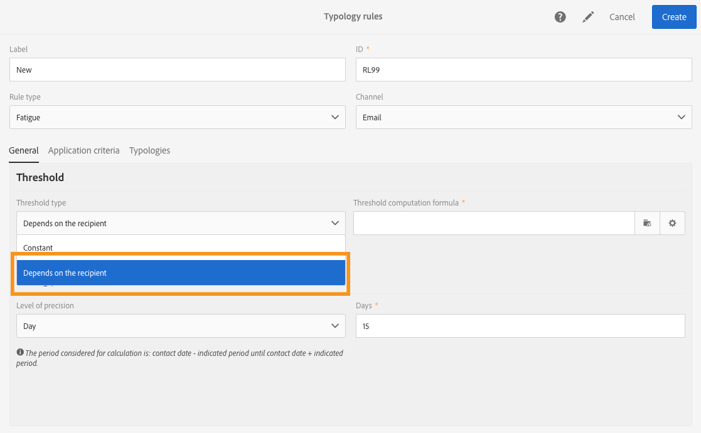
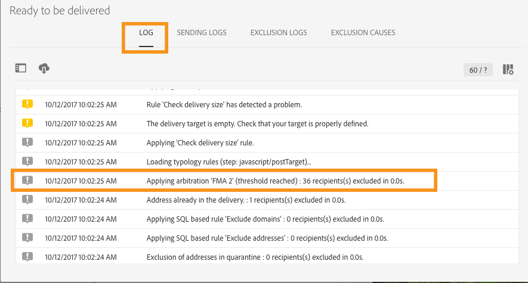
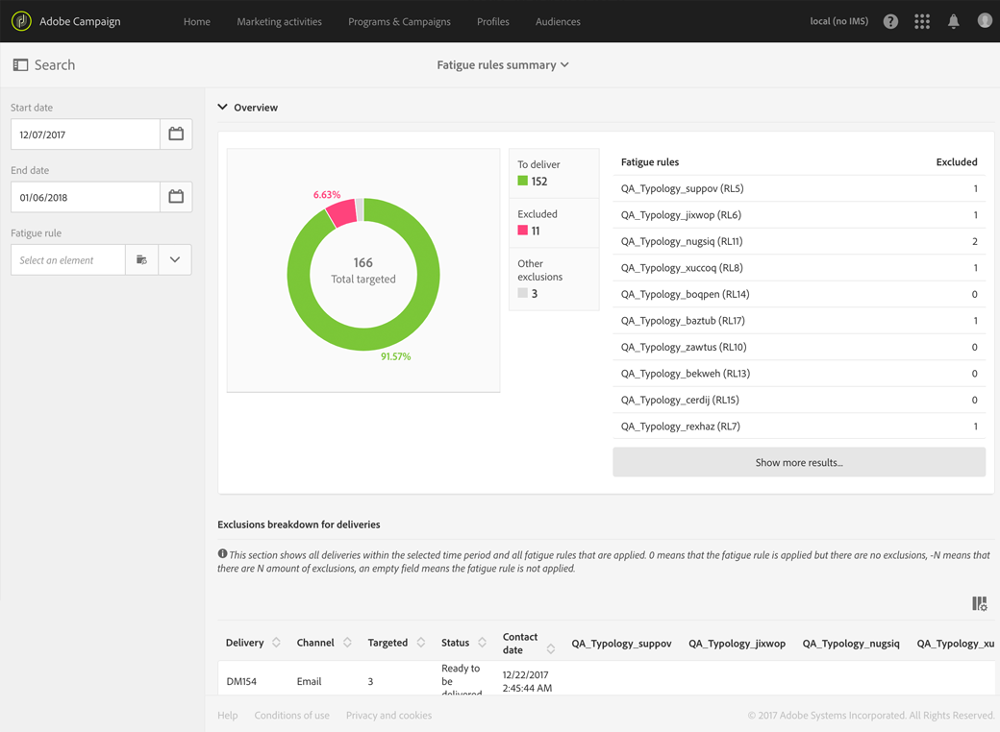
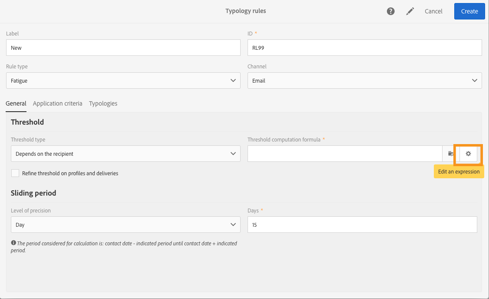

# Regras de esgotamento{#fatigue-rules}

## Sobre regras de esgotamento {#about-fatigue-rules}

As regras de esgotamento permitem que os profissionais de marketing definam regras de negócios entre canais globais que excluirão automaticamente perfis pré-solicitados das campanhas.

Para implementar regras de fadiga, você define um número máximo de mensagens por perfil e seleciona um período em que a regra será aplicada. Durante a preparação de entrega, os perfis são excluídos da entrega se aplicável, dependendo do número de mensagens que já foram enviadas a eles.

>[!NOTE]
>
>Para que regras de esgotamento sejam aplicadas, é necessário definir uma data de contato para sua entrega. Se você optar por enviar mensagens imediatamente, a regra de esgotamento não será aplicada.

Tópicos relacionados:

* [Preparação](../../administration/using/configuring-email-channel.md#preparation)
* [Gerenciamento de tipologias](../../administration/using/about-typology-rules.md#managing-typologies)
* [Regras de tipologia](../../administration/using/about-typology-rules.md#typology-rules)
* [Otimizar a frequência de comunicação para impedir o esgotamento do contato](https://helpx.adobe.com/campaign/kb/simplify-campaign-management.html#Engageyourcustomersateverystep)

## Criação de uma regra de esgotamento {#creating-a-fatigue-rule}

Para criar e configurar uma **[!UICONTROL Fatigue]** regra de tipologia, aplique as seguintes etapas:

1. Clique no logotipo do Adobe Campaign, no canto superior esquerdo da interface, e selecione **[!UICONTROL Administration]** &gt; **[!UICONTROL Channels]** &gt; **[!UICONTROL Typologies]****[!UICONTROL Typology rules]**&gt;.

   

1. Na lista de regras de tipologia, clique **[!UICONTROL Create]** em.

   

1. No **[!UICONTROL Rule type]** campo, selecione **[!UICONTROL Fatigue]**.

   

1. No **[!UICONTROL Channel]** campo, selecione em qual canal sua regra se aplica. Você pode selecionar um único canal (email, SMS, mala direta, aplicativo móvel) ou selecionar **[!UICONTROL All channels]**. Consulte [Escolher o canal](../../administration/using/fatigue-rules.md#choosing-the-channel).

   

1. Na **[!UICONTROL General]** guia, defina o método para calcular o número máximo de mensagens por perfil. Você pode escolher um limite constante ou uma variável. Você também pode refinar o limite em perfis e entregas. Para saber mais sobre isso, consulte [Definição do limite](../../administration/using/fatigue-rules.md#defining-the-threshold).

   

1. Escolha um **[!UICONTROL Sliding period]** em que a regra de typology será aplicada. Para saber mais sobre isso, consulte [Definir o período deslizante](../../administration/using/fatigue-rules.md#setting-the-sliding-period).

   

   Neste exemplo (consulte capturas de tela anteriores), optemos por enviar um número máximo de 4 mensagens ao longo de um período deslizante de 15 dias.

1. Na **[!UICONTROL Application criteria]** guia, você pode optar por aplicar esta regra a todos os entregas ou restringir a aplicabilidade da regra de acordo com a mensagem a ser enviada. A regra só será executada se a condição do aplicativo for cumprida. Por exemplo, você pode aplicar a regra somente em mensagens com uma etiqueta que começa com uma determinada palavra ou com uma ID com certas letras. Consulte [Restringir a aplicabilidade de uma regra de filtragem](../../administration/using/filtering-rules.md#restricting-the-applicability-of-a-filtering-rule).

   

1. Selecione a **[!UICONTROL Typologies]** guia e vincule a regra de tipologia à tipologia usada para suas entregas. Consulte [Gerenciamento de tipologias](../../administration/using/about-typology-rules.md#managing-typologies) e [regras de Tipologia](../../administration/using/about-typology-rules.md#typology-rules).

   

   >[!NOTE]
   >
   >A tipologia pode ser definida no modelo de entrega, a ser aplicada automaticamente a todas as entregas criadas usando este modelo.

Durante a preparação de entrega, os perfis são excluídos da entrega se aplicável, dependendo do número de entregas já enviadas a eles. Você pode visualizar os resultados da regra de fadiga nos registros de entrega. Consulte [Visualizar os resultados de fadiga](../../administration/using/fatigue-rules.md#viewing-the-fatigue-results).

>[!CAUTION]
>
>Para que as regras de esgotamento funcionem, você precisa definir uma data de contato para sua entrega. Se você optar por enviar mensagens imediatamente, a regra de esgotamento não será aplicada.

## Escolher o canal {#choosing-the-channel}

As regras de esgotamento estão disponíveis para vários canais. O canal é definido no **[!UICONTROL Channel]** campo das configurações da regra de tipologia. Você pode selecionar um único canal ou selecionar **[!UICONTROL All channels]**.

**Canais disponíveis**

Os seguintes canais estão disponíveis:

* Email
* Mobile (SMS)
* Mala direta
* Aplicativo móvel: este canal permite enviar notificações por push a perfis ou assinantes do aplicativo. Se optar por enviar notificações a perfis, elas serão compatíveis com as regras de esgotamento de multicanais.

   >[!CAUTION]
   >
   >As regras de esgotamento não são compatíveis com notificações por push enviadas para assinantes do aplicativo. Se você estiver enviando mensagens para assinantes do aplicativo, as regras de esgotamento não serão aplicadas.

* Todos os canais: essa opção permite aplicar a regra a todos os canais. Por exemplo, você pode decidir enviar um máximo de 3 mensagens por mês em qualquer canal. Se você enviou 2 emails para um perfil na semana passada e tentar enviar uma notificação por push hoje, o mesmo perfil será excluído.

**Tipos de entrega**

As regras de esgotamento são compatíveis com todos os tipos de entrega: entregas de uma captura, entregas recorrentes, entregas de fluxo de trabalho e mensagens transacionais.

**As mensagens transacionais** podem ser usadas para enviar mensagens de serviço direcionadas a um evento (rtevent) e também mensagens de marketing (perfis de direcionamento), por exemplo, uma mensagem de recomercialização. As regras de esgotamento são compatíveis apenas com mensagens de marketing (perfis de direcionamento). As mensagens transacionais de evento não contêm informações de perfil, portanto elas não são compatíveis com regras de fadiga (mesmo no caso de um enriquecimento com perfis). Com o suporte das mensagens de marketing nas mensagens transacionais, **você pode aplicar uma regra de esgotamento a todos os canais incluindo mensagens transacionais de marketing**.

## Definição do limite {#defining-the-threshold}

Cada regra de fadiga define um limite, ou seja, o número máximo de mensagens que podem ser enviadas para um perfil em determinado período. Quando o limite for atingido, não haverá mais entregas até o final do período considerado. Esse processo permite que você exclua automaticamente um perfil de uma entrega se uma mensagem exceder o limite definido, evitando isso.

Os valores de limite podem ser constantes ou variáveis. Isso significa que, durante determinado período, os limites podem variar de um perfil para outro ou até mesmo para o mesmo perfil.

**Uso de um limite de correção**

O limite representa o maior número de mensagens que podem ser enviadas para um perfil durante o período preocupado.

Por padrão, o limite é constante e é necessário indicar um número máximo de mensagens autorizadas pela regra.

**Uso de um limite de variável**

Para definir um limite de variável, selecione o **[!UICONTROL Depends on the recipient]** valor no **[!UICONTROL Threshold type]** campo.

Você tem duas opções:

* selecione um campo de perfil: o limite variará para cada perfil de acordo com o campo selecionado. Por exemplo, se você tiver estendido o recurso de perfis com um campo «Frequência de comunicação», clique no botão à direita do **[!UICONTROL Threshold computation formula]** campo e selecione o campo. Para cada perfil, o limite assumirá o valor do campo «Frequência de comunicação».

   

* defina uma fórmula: clique no segundo botão à direita do **[!UICONTROL Threshold computation formula]** campo para definir uma fórmula de cálculo de limite avançado. Por exemplo, é possível indexar o número de mensagens autorizadas de acordo com o segmento ao qual o perfil pertence. Isso significa que um perfil pertencente ao segmento "Web" pode receber mais mensagens do que outros perfis. Uma **[!UICONTROL Iif (@origin='Web', 5, 3)]** fórmula de tipo autoriza a entrega de 5 mensagens a perfis do segmento da Web e 3 para outros segmentos.

   

**Refinar o limite em perfis e entregas**

Por padrão, todas as mensagens são consideradas para o cálculo do limite. Marque a **[!UICONTROL Refine Threshold on profiles and deliveries]** caixa para filtrar os perfis e entregas para contar durante a preparação da entrega.

No exemplo a seguir, somente os perfis masculinos são contados e somente entregas com uma etiqueta começando com **Newsletters** são contadas.

Refinar o limite em entregas é diferente de restringir a aplicabilidade da regra inteira ( **[!UICONTROL Application criteria]** guia):

* **[!UICONTROL Application criteria]**: você optar por executar a regra ou não de acordo com critérios específicos. Por exemplo, se a condição do aplicativo for "Rótulo começa com Newsletter", a regra será aplicada somente a entregas que respeitam essa condição. Se o rótulo da entrega começar com «Promoção», a regra não será executada.
* **[!UICONTROL Refine threshold on profiles and deliveries > Deliveries to count]**: todas as entregas usando essa regra de typology executarão a regra, mas você decide, entre as entregas passadas e programadas, quais as que deseja contar. Por exemplo, se a sua restrição for "Rótulo começa com Newsletter", a regra será executada mesmo se a etiqueta de entrega começar com "Promo". Ele contará, durante o período de deslizamento selecionado, o número de entregas cujo rótulo começa com «Boletim».

## Definir o período deslizante {#setting-the-sliding-period}

As regras de esgotamento são definidas em períodos de acumulado de n dias. O período é configurado na **[!UICONTROL Sliding period]** seção, por exemplo, 2 semanas, 7 dias ou 5 horas.

Quando a regra é executada, as entregas passadas e entregas programadas são levadas em conta. Isso garante que, em um determinado período de controle deslizante, o limite nunca seja excedido.

Por exemplo, se você definir um período de 48 horas, o sistema terá looking 8 horas **antes da data de contato** e 48 horas **após a data do contato**. Assim, o período selecionado é duplicado para permitir a integração de entregas futuras, bem como as versões anteriores.

Para restringir as entregas levadas em conta a um período de 2 semanas, insira **Dia** e **7** ou uma semana na **seção Período** deslizante. As entregas enviadas para 7 dias antes da data de entrega e programadas até 7 dias após a data de entrega em que a regra é aplicada serão consideradas no cálculo.

## Como visualizar os resultados de fadiga {#viewing-the-fatigue-results}

Durante a preparação de entrega, os perfis são excluídos da entrega se aplicável, dependendo do número de entregas já enviadas a eles. Para exibir os resultados da execução da regra de fadiga, clique no botão no canto inferior direito do **[!UICONTROL Deployment]** bloco.

Há três guias disponíveis, mostrando os detalhes dos resultados da execução de fadiga, incluindo o nome da regra aplicada:

* Logs de entrega:

   

* Logs de exclusão:

   

* Causas de exclusão:

   

## Exibição do relatório resumido da regra de fadiga {#viewing-the-fatigue-rule-summary-report}

O Adobe Campaign apresenta um relatório dedicado em regras de esgotamento para ajudá-lo a entender como são aplicadas às suas campanhas. Isso permite que você saiba como suas campanhas afetam um e faça os ajustes corretos.

O **[!UICONTROL Fatigue rules summary]** relatório pode ser acessado do **[!UICONTROL Reports]** botão, no canto superior direito de cada programa, campanha e mensagem.

Na parte esquerda da tela, você pode filtrar os dados do relatório na data de contato das entregas. Por padrão, o período selecionado começa 15 dias antes da data atual e termina 15 dias depois. Também é possível filtrar uma regra de esgotamento específica.

O gráfico de pizza exibe as seguintes informações sobre o período selecionado:

* **[!UICONTROL Total targeted]**: o destino total antes da preparação da mensagem
* **[!UICONTROL Excluded]**: o número total de exclusões devido ao aplicativo de regra de esgotamento
* **[!UICONTROL Other exclusions]**: o número total de exclusões devido a outras regras de tipologia
* **[!UICONTROL To deliver]**: o número total das mensagens a serem entregues após a preparação da mensagem ( **[!UICONTROL To deliver]** = **[!UICONTROL Total targeted]** - **[!UICONTROL Excluded]** - **[!UICONTROL Other exclusions]** )

À direita do gráfico, você encontrará o número de exclusões, detalhadas por regra de esgotamento.

A tabela inferior exibe todas as entregas dentro do período selecionado. Para cada entrega, é possível ver as regras de esgotamento aplicadas e as exclusões correspondentes. Os envios que não possuem uma data de contato também são exibidos na tabela.

* **[!UICONTROL 0]** a regra de esgotamento aplicada, mas não havia exclusão.
* **[!UICONTROL -N]** significa que N exclusões ocorreram.
* um campo vazio significa que a regra de esgotamento não se aplica.

>[!NOTE]
>
>Os dados exibidos não são contextuais ao programa, à mensagem ou à campanha a partir da qual o relatório é acessado. Este relatório exibe todas as regras de esgotamento e entregas para todas as unidades organizacionais. Isso permite obter uma visão global de todas as entregas para compreender como as suas campanhas são influenciadas por outras pessoas.

## Exemplos {#examples}

Há muitas possibilidades em termos de implementação de gerenciamento de fadiga. Estes são alguns exemplos do que você pode fazer:

* Crie uma regra de esgotamento usando **um limite** constante que se aplica a **todos os canais**:

   Vamos supor que você crie uma regra de multicanal, com um limite constante de 3 em um período deslizante de 7 dias.

   Na semana passada, seus perfis premium recebiam um email promocional e um email de recomercialização transacional. Também programou um SMS que será enviado na semana seguinte. Hoje, você decide enviar uma notificação por push para todos os seus perfis. Os perfis premium serão excluídos do push de hoje porque o número máximo de mensagens durante um período de 2 semanas já foi atingido.

   

* Crie uma regra de esgotamento usando um limite **de variável** baseado em um campo **de perfil**:

   Você estendeu o recurso de perfis com um campo «Limite de comunicação» para definir um limite diferente para cada perfil. Na regra de esgotamento, defina um limite de variável com base neste campo e selecione um período deslizante de 2 dias. Vejamos dois exemplos de perfis: John tem um limite de comunicação de 1 e David tem um limite de 2. Ambos já receberam um email de boletim ontem. Você decide enviar outro email hoje. Somente David o receberá, pois John foi excluído do destino.

   

* Crie uma regra de esgotamento usando uma fórmula de cálculo **de limite**:

   Você deseja alterar o limite de acordo com a idade de seus perfis. Se um perfil estiver abaixo de 40, você deseja definir um limite de 4 e para perfis mais antigos, um limite de 2. Em vez de definir esse limite para cada perfil com um campo estendido, você pode criar uma fórmula diretamente na regra de esgotamento para calcular o limite de acordo com a idade dos perfis. Em nosso exemplo, a fórmula seria **[!UICONTROL Iif (@age<40, 4, 2)]**.

   

   >[!NOTE]
   >
   >Esta seção também inclui um exemplo passo a passo de uma regra de fadiga usando uma fórmula de cálculo de limite.

* Crie uma regra de esgotamento que **refina o limite** em perfis e entregas:

   Você estendeu o recurso de perfis com um campo «Pontuação» e também foi estendido o recurso de entregas com um campo «Tipo». Você deseja definir um limite constante de 3, mas deseja excluir da contagem todas as entregas do tipo "Alerta" ou "Black Friday" e todos os perfis com uma pontuação maior que 10. Quando a regra será executada, contará, entre as entregas passadas e programadas, todas as entregas que não sejam do tipo «Alert» ou «Black Friday» enviadas para perfis cuja pontuação é menor que 10.

   

Este é um exemplo passo a passo de uma regra de fadiga usando uma fórmula de cálculo de limite.

Neste caso de uso, queremos criar uma regra de tipologia para impedir a entrega de mais de 2 mensagens por semana para perfis premium e 2 mensagens por semana para perfis padrão.

Para identificar clientes e perspectivas, estendemos o recurso de perfis com **[!UICONTROL Status]** o campo, que contém 0 para perfis premium e 1 para perfis padrão.

Para criar a regra, aplique as seguintes etapas:

1. Crie uma nova **regra de digitação de** tipo de fadiga.
1. Na **[!UICONTROL Threshold]** seção, queremos criar uma fórmula para calcular o limite, dependendo de cada perfil. Selecione o **[!UICONTROL Depends on the recipient]** valor no **[!UICONTROL Threshold type]** campo e clique no ícone do segundo botão à direita do **[!UICONTROL Threshold computation formula]** campo.

   

1. Na **[!UICONTROL List of functions]** seção, clique duas vezes na função **Iif** no **[!UICONTROL Others]** nó.

   

1. Em seguida, selecione **o status** do perfil na **[!UICONTROL Available fields]** seção.

   

1. Digite os valores desejados para criar a seguinte fórmula: **Iif (@ status = 0,2,4)**

   

   Essa fórmula permite atribuir o valor 2 se o status for igual a 0 e o valor 4 para todos os outros status.

1. Clique **[!UICONTROL Confirm]** em para aprovar a fórmula.
1. Indique o **[!UICONTROL Sliding period]** em que a regra será aplicada: 7 dias neste caso, para restringir as entregas levadas em conta a um período de 2 semanas.

   

1. Agora, vincule a regra que acabou de criar para uma tipologia para aplicá-la às entregas. Para fazer isso, selecione a **[!UICONTROL Typologies]** guia, clique **[!UICONTROL Create element]** em e selecione a typology usada para as entregas.

   

1. Salve a regra para aprovar a criação.

A regra será aplicada a todas as entregas com base na tipologia.
