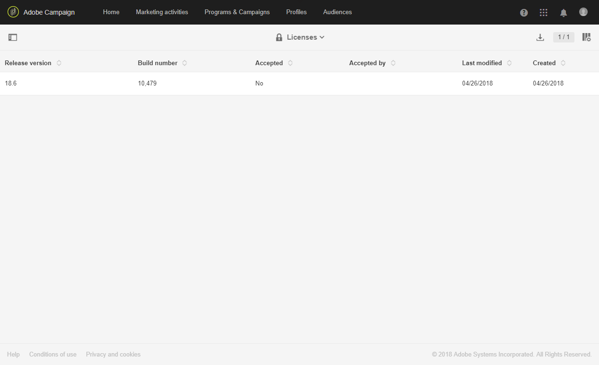
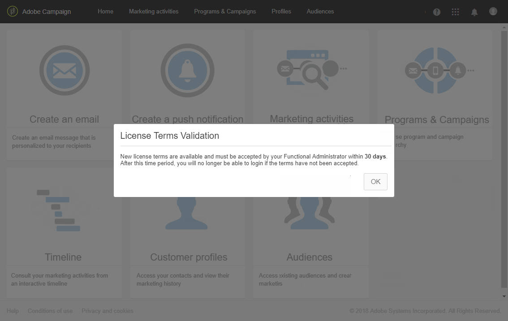
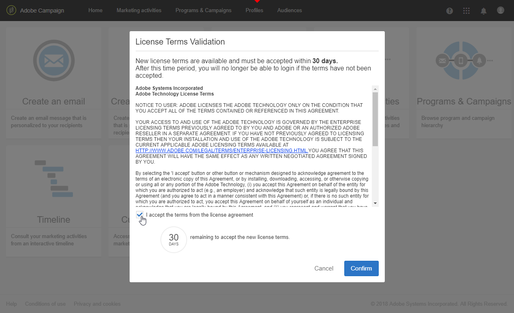
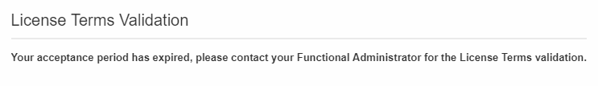

# Licenças{#licenses}

A janela **[!UICONTROL Licenses]** permite exibir as licenças instaladas em sua instância e informações diferentes sobre ela, como o número da compilação, a versão da versão ou se os termos do contrato foram aceitos e por quem.

Com uma nova build ou um novo recurso, os termos da licença podem mudar e devem ser aceitos por um administrador funcional da instância.

A janela a seguir será exibida para usuários padrão depois de fazer logon, nenhuma ação é necessária de sua parte. Eles ainda podem trabalhar no Adobe Campaign clicando no botão **[!UICONTROL OK]**.

Um administrador precisa ler e confirmar os novos termos do contrato nos 30 dias a seguir da instalação da compilação verificando **[!UICONTROL I accept the terms from the license agreement]** e clicando em **[!UICONTROL Confirm]**.

Passados esses 30 dias se o contrato não for aceito, nenhum usuário poderá usar essa instância. Os usuários padrão não poderão acessar as funcionalidades do Adobe Campaign e só verão a mensagem a seguir até que um administrador funcional aceite os termos do contrato.

