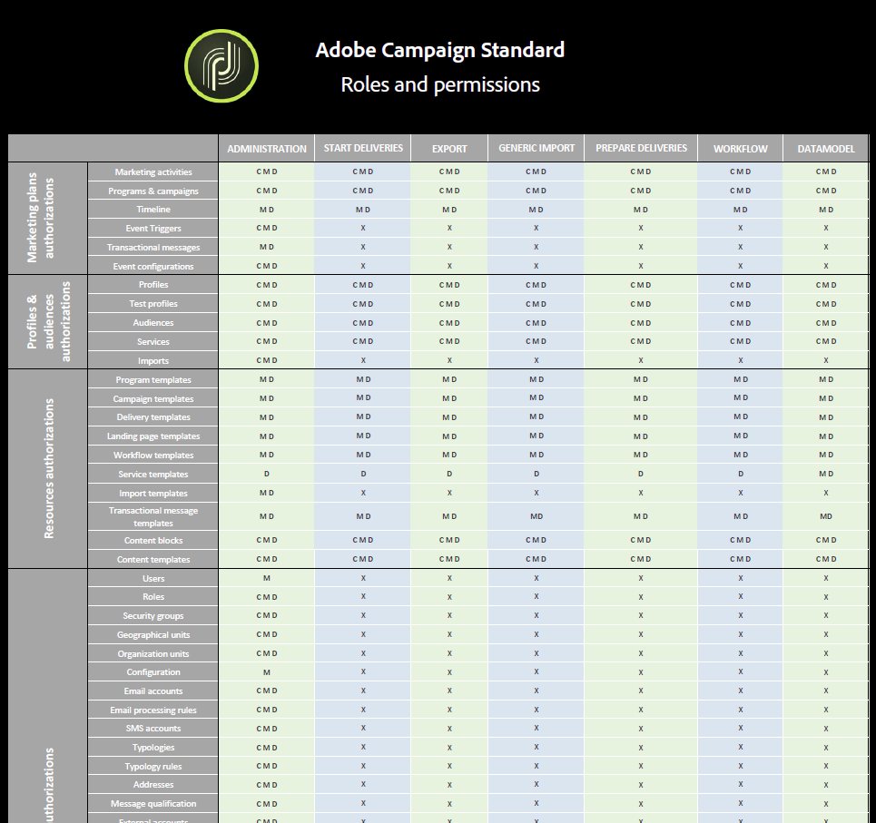

# Lista de funções{#list-of-roles}

Por padrão, o Adobe Campaign oferece um conjunto de funções que permite definir autorizações unitárias atribuídas a usuários e grupos de usuários.

Combinadas com as unidades organizacionais, as funções exibem uma visualização filtrada da interface e definem o acesso dos usuários aos diferentes recursos.

Funções podem ser gerenciadas no menu **[!UICONTROL Administration > Users & Security > Roles]**.

Os direitos padrão são:

* **[!UICONTROL Administration]**: Direito de administração genérico.

  >[!NOTE]
  >
  >Se você trabalhar com Acionadores da Experience Cloud, precisará do direito **[!UICONTROL Administration]** para acessar o menu Acionadores da Experience Cloud. Para obter mais informações sobre acionadores da Experience Cloud, consulte esta [página](../../integrating/using/about-adobe-experience-cloud-triggers.md).

* **[!UICONTROL Datamodel]**: Direito de executar publicações e criar recursos personalizados.
* **[!UICONTROL Generic import]**: Direito de executar uma importação genérica nos dados. Para que isso funcione, você deve vincular a função **[!UICONTROL Generic import]** à função **[!UICONTROL Workflow]**.
* **[!UICONTROL Prepare deliveries]**: Direito de criar, modificar, preparar e excluir entregas. Os usuários com essa função podem preparar a entrega, mas não podem enviá-la.
* **[!UICONTROL Start deliveries]**: Direito de criar, modificar, preparar, enviar e excluir a entrega.
* **[!UICONTROL Workflow]**: Direito de gerenciar a execução de fluxos de trabalho (início, parada, pausa etc.). Os usuários com essa função não podem enviar uma entrega mesmo em um fluxo de trabalho.

Para obter mais informações, consulte a tabela [Funções e permissões](/help/administration/using/assets/acs_rights.pdf), que detalha as funções disponíveis na interface, dependendo das autorizações selecionadas.

**Tópicos relacionados:**

* [Sobre gerenciamento de acesso](../../administration/using/about-access-management.md)
* [Gerenciamento de grupos e usuários](../../administration/using/managing-groups-and-users.md)
