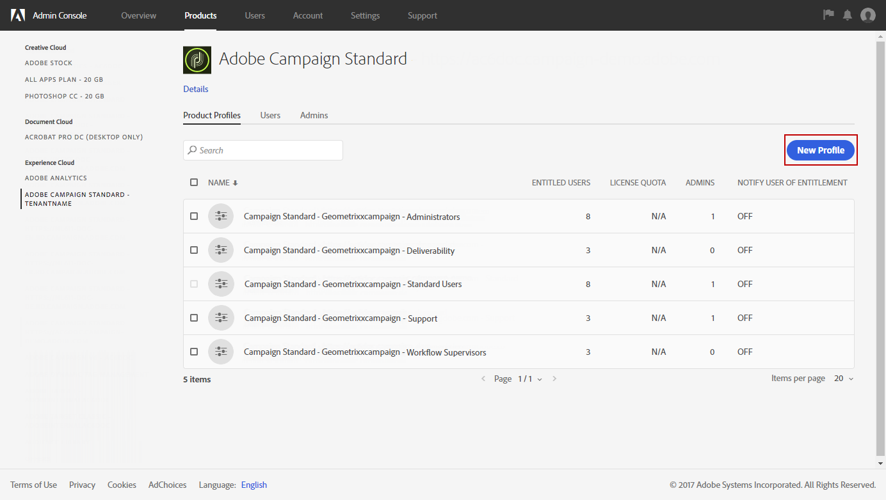
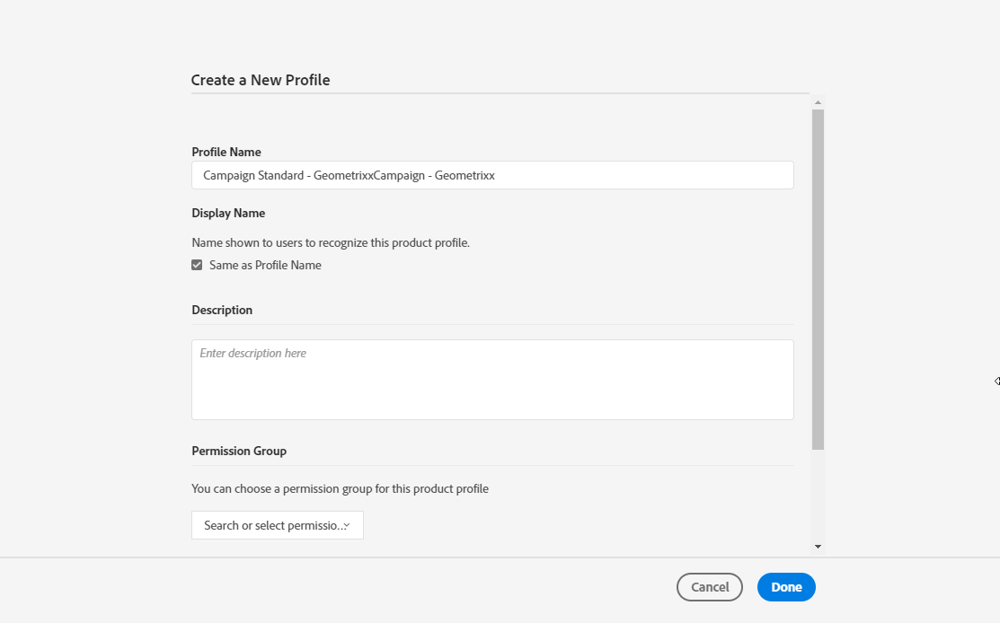
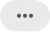
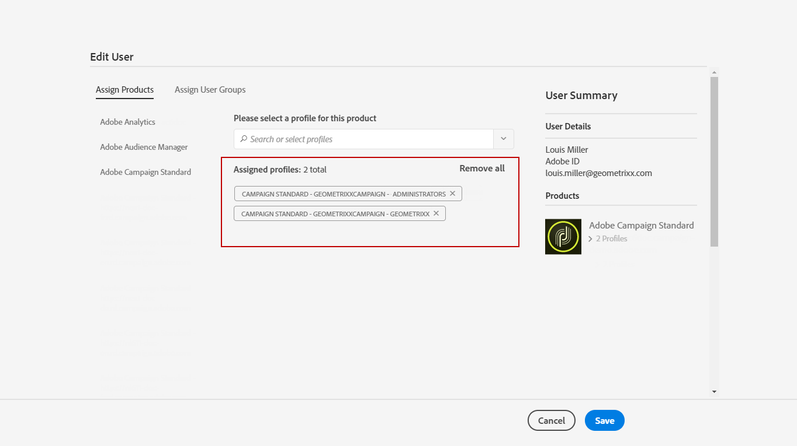

# Gerenciamento de grupos e usuários{#managing-groups-and-users}

## Sobre grupos de segurança {#about-security-groups}

>[!IMPORTANT]
>
>Os grupos de segurança **[!UICONTROL Access to the deliverability parameters (Deliverability)]** e **[!UICONTROL Message Center agents (mcExec)]** são somente internos da Adobe e não devem ser atribuídos a nenhum usuário.

Os grupos de segurança são conjuntos de usuários que compartilham as mesmas funções e direitos na organização.

Os usuários devem estar sempre vinculados a um grupo de segurança. Isso permitirá que você atribua a eles funções específicas e unidades organizacionais. Para restringir o acesso de um usuário, não o adicione ao grupo **[!UICONTROL Standard Users]** da Campanha, pois ele está vinculado à unidade organizacional **[!UICONTROL All]**.

Para obter mais informações sobre funções, a tabela na página a seguir apresenta possíveis operações disponíveis de acordo com as funções de um usuário: [autorizações do Adobe Campaign Standard](https://experienceleague.adobe.com/docs/campaign-standard/assets/acs_rights.pdf).

Os grupos de segurança padrão são:

* **[!UICONTROL Administrators]**
* **[!UICONTROL Delivery supervisors]**
* **[!UICONTROL Standard Users]**
* **[!UICONTROL Workflow supervisors]**

Observe que esses grupos de segurança incorporados são somente leitura e não podem ser modificados. Para criar seu próprio grupo de segurança com um conjunto de funções específicas, consulte a seção abaixo.

## Criação de um grupo de segurança e atribuição de usuários {#creating-a-security-group-and-assigning-users}

>[!IMPORTANT]
>
>Observe que no Admin Console, os grupos de segurança são chamados de perfis.

Você poderá criar grupos de segurança se os grupos predefinidos não forem suficientes para gerenciar seus usuários. Eles podem ser gerenciados por administradores que têm acesso aos menus de administração do Adobe Campaign e da Admin Console. Para obter mais informações sobre o Admin Console, consulte esta [documentação](https://helpx.adobe.com/br/enterprise/managing/user-guide.html).

Aqui, precisamos primeiro atribuir os dois grupos predefinidos Usuário padrão e Administrador aos nossos usuários. Esses grupos de segurança restringirão algumas funcionalidades do Adobe Campaign: o Usuário padrão tem acesso básico ao Adobe Campaign, enquanto o Administrador pode acessar os menus de administração, por exemplo.

Observe que qualquer alteração nos grupos de segurança no Admin Console será sincronizada assim que os usuários fizerem logon no Adobe Campaign.

Em seguida, criaremos um conjunto de grupos de segurança Geometrixx e Geometrixx Clothes que restringirão alguns acessos, dependendo das unidades organizacionais do nosso Usuário padrão e Administrador.

Primeiro, é necessário atribuir um dos grupos de segurança predefinidos aos usuários:

1. Na Admin Console, selecione sua instância e, em seguida, a guia **Usuários**.

   

1. Clique no botão **[!UICONTROL Add user]** e insira o endereço de email do usuário.
1. Na guia **[!UICONTROL Assign Products]**, selecione a instância e, em seguida, o grupo de segurança predefinido **[!UICONTROL Administrators]** na lista suspensa. Isso permitirá que o usuário tenha acesso aos menus de administração e crie os próximos grupos de segurança.

   

1. Clique em **[!UICONTROL Save]** e siga os mesmos procedimentos para atribuir o grupo de segurança predefinido **[!UICONTROL Standard Users]** ao novo usuário.

   

Assim que os dois usuários estiverem conectados aos grupos de segurança predefinidos **[!UICONTROL Administrators]** e **[!UICONTROL Standard users]** que atribuirão funções aos nossos usuários, o usuário Administrador poderá criar os dois grupos de segurança **Geometrixx** e **Geometrixx Clothes** que atribuirão unidades organizacionais aos usuários, além dos grupos de segurança predefinidos.

1. Na Admin Console, selecione sua instância e, em seguida, a guia **Produtos**.
1. Clique no botão **Novo perfil** para criar o grupo de segurança **Geometrixx**.

   

1. Digite o **[!UICONTROL Profile name]** seguindo esta sintaxe exata: **[!UICONTROL Campaign Standard- instance name - ID of the security group]** e clique em **[!UICONTROL Done]**.

   A ID escolhida será usada ao criar o grupo de segurança no Adobe Campaign.

   >[!NOTE]
   >
   >Se a sintaxe acima aparentemente não estiver funcionando com uma instância mais antiga, ela precisará ser substituída por **[!UICONTROL Campaign - instance name - ID of the security group]**.

   

1. Em seguida, siga os mesmos procedimentos para criar o grupo de segurança **Geometrixx Clothes**.
1. Atribua o grupo de segurança ao usuário selecionando a guia **[!UICONTROL Users]**.

   

1. Clique no usuário criado anteriormente e no ícone na categoria **[!UICONTROL Products]**.

   Selecione **[!UICONTROL Edit products assigned directly]** para começar a atribuir o novo grupo de segurança ao usuário.

   

1. Na guia **[!UICONTROL Assign Products]**, selecione a instância e, na lista suspensa, escolha os grupos de segurança criados anteriormente pelo Geometrixx para atribuí-la ao usuário Administrador.

   Clique em **[!UICONTROL Save]**.

   

   Se um usuário estiver em vários grupos:

   * As funções dos diferentes grupos são acumuladas. Aqui, os usuários estão em dois grupos diferentes: um que atuará em funções, e o outro, em unidades.
   * A unidade mais alta na hierarquia será usada (veja o exemplo na seção [Unidades organizacionais](../../administration/using/organizational-units.md)).
   * Se as unidades organizacionais atribuídas ao usuário estiverem em ramificações paralelas na hierarquia, ou seja, se elas não tiverem uma unidade pai atribuída comum, o sistema selecionará a unidade organizacional do usuário e o usuário terá acesso à unidade organizacional selecionada pelo sistema e seus filhos.

1. Siga os mesmos procedimentos para atribuir o grupo de segurança Geometrixx Clothes ao Usuário padrão.

   

Os grupos de segurança recém-criados agora estão criados no Admin Console. Para que eles sejam completamente sincronizados, você também precisa criá-los no Adobe Campaign.

O usuário Administrador precisa criar o conjunto de grupos de segurança que são usados para atribuir as unidades organizacionais Geometrixx e Geometrixx Clothes. Para saber como criar unidades organizacionais, consulte [Criação e gerenciamento de unidades](../../administration/using/organizational-units.md#creating-and-managing-units).

1. Clique no logotipo **Adobe**, no canto superior esquerdo, e selecione **[!UICONTROL Administration > Users & Security > Security groups]**.
1. Crie o novo grupo de segurança e especifique o **[!UICONTROL Label]** e a **[!UICONTROL ID]**.

   A ID precisa ser a mesma escolhida no Admin Console.

1. No campo **[!UICONTROL User access]**, atribua a unidade organizacional. Aqui, a unidade organizacional **[!UICONTROL All]** é atribuída ao grupo de segurança Geometrixx.

   >[!NOTE]
   >
   >Se você estiver atribuindo um grupo de segurança predefinido aos usuários, será necessário redefinir a unidade organizacional.

   

1. Você também pode atribuir funções ao seu grupo de segurança. No nosso caso, essa etapa não é necessária, pois os grupos de segurança predefinidos **[!UICONTROL Administrators]** e **[!UICONTROL Standard users]** são usados para atribuir funções.
1. Siga os mesmos procedimentos para criar a última segurança Geometrixx Clothes e atribuir a unidade organizacional Geometrixx Clothes.

   

Seus usuários agora estão atribuídos a um grupo de segurança e podem se conectar ao Adobe Campaign.

>[!IMPORTANT]
>
>Se os usuários forem removidos de um grupo de segurança na Admin Console, eles continuarão fazendo parte do grupo de segurança da Adobe Campaign e não poderão mais fazer logon no Adobe Campaign. Nesse caso, remova os endereços de email dos usuários no Admin Console para impedir que eles recebam informações confidenciais.
