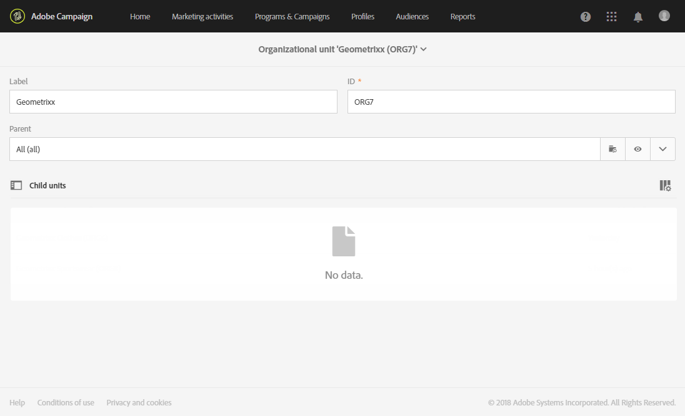
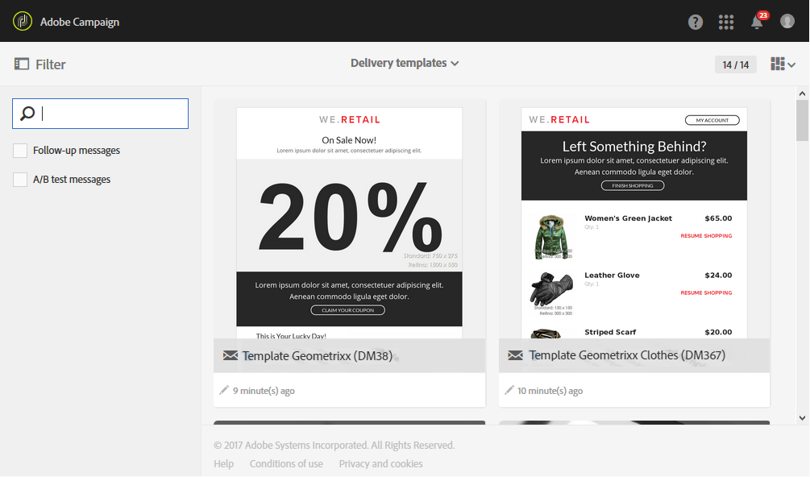

# Unidades organizacionais{#organizational-units}

## Sobre unidades {#about-units}

Cada objeto e usuário da plataforma está vinculado a uma unidade organizacional. Essa unidade permite que uma estrutura hierárquica seja definida para dar aos usuários uma visualização filtrada. Uma unidade do usuário define seu nível de acesso para diferentes objetos da plataforma.

>[!IMPORTANT]
>
>Se um usuário não estiver vinculado a nenhuma unidade, ele não poderá se conectar ao Adobe Campaign. Se você deseja restringir o acesso de um usuário ou grupo de usuários específico, não vincule-o à **[!UICONTROL All]** unidade.
>
>Por padrão, a unidade organizacional **[!UICONTROL All (all)]** está atribuída ao grupo de segurança **[!UICONTROL Administrators]**. Ela é somente leitura e não pode ser modificada.

Um usuário tem acesso somente leitura a todos os objetos nas unidades pai. Ele tem acesso de leitura e gravação a todos os objetos de sua unidade e unidades filhas. Um usuário não tem acesso a objetos em ramificações paralelas.

Por padrão, somente as **[!UICONTROL All]** unidades estão disponíveis.

Quando o usuário recebe uma unidade organizacional, essa unidade sempre será aplicada aos objetos criados pelo usuário.

>[!NOTE]
>
>Quando um usuário está em vários grupos vinculados a unidades diferentes, determinadas regras são aplicadas. Para obter mais informações, consulte a seção [Gerenciar grupos e usuários](../../administration/using/managing-groups-and-users.md) .

## Creating and managing units {#creating-and-managing-units}

As unidades organizacionais permitem que você filtre sua instância dependendo da organização à qual seus usuários estão vinculados. Essa unidade pode representar uma região, país ou até mesmo uma marca em seu caso.

Aqui, criamos anteriormente grupos de segurança com funções diferentes para dois usuários: um usuário recebe os grupos de segurança Administradores e Geometrixx, o outro usuário pertence aos grupos de segurança Usuário padrão e Roupas Geometrixx Consulte [Criando um grupo de segurança e atribuindo usuários](../../administration/using/managing-groups-and-users.md#creating-a-security-group-and-assigning-users) ao exemplo completo.

Precisamos agora criar as unidades organizacionais para as Roupas de Geometrixx e os grupos de segurança de Geometrixx:

1. No menu avançado Adobe campanha, selecione **[!UICONTROL Administration]** > **[!UICONTROL Users & security]** > **[!UICONTROL Organizational units]**.
1. Clique **[!UICONTROL Create]** para configurar sua unidade organizacional.

   

1. Altere o padrão **[!UICONTROL Label]** e **[!UICONTROL ID]** para Geometrixx.
1. Em seguida, vincule essa unidade a uma unidade pai. Aqui, escolhemos **[!UICONTROL All]**.

   

1. Por fim, clique em **[!UICONTROL Create]** para atribuir a nova unidade organizacional ao grupo de segurança.
1. Siga o mesmo procedimento para a unidade Roupas de Geometrixx, exceto que a unidade pai deve ser a unidade criada anteriormente, Geometrixx.

   

Para ver o impacto da atribuição de unidades diferentes a grupos de segurança diferentes, o usuário atribuído ao Administrador e grupos de Geometrixx criará dois modelos de email para ver o que o outro usuário atribuído ao Usuário padrão e às Roupas de Geometrixx pode ou não acessar.

1. No menu avançado, selecione **[!UICONTROL Resources]** > **[!UICONTROL Templates]** > **[!UICONTROL Delivery Templates]**.
1. Duplicado um modelo existente e personalize-o conforme necessário. Para obter mais informações, consulte a seção [Sobre templates](../../start/using/marketing-activity-templates.md)
1. Quando o modelo for criado, selecione o **[!UICONTROL Edit properties]** ícone para atribuir unidades ao modelo.

   

1. No menu **[!UICONTROL Access authorization]** suspenso, selecione a unidade organizacional.

   Aqui vamos criar um modelo com o Geometrixx de unidade organizacional criado anteriormente.

   

1. Siga os mesmos procedimentos para criar o segundo modelo atribuído à unidade organizacional de Roupas de Geometrixx criada anteriormente.

O usuário atribuído aos grupos Usuário padrão e Roupas de Geometrixx poderá ver ambos os modelos. Devido à estrutura hierárquica das unidades organizacionais, ele terá acesso de leitura e gravação ao modelo vinculado à unidade de Roupas de Geometrixx e somente acesso somente leitura ao modelo vinculado à unidade de Geometrixx.

Como a unidade Roupas de Geometrixx é uma unidade filho de Geometrixx, a seguinte mensagem é exibida quando o usuário tenta modificar o modelo do Geometrixx:

As unidades organizacionais podem restringir o acesso a diferentes recursos, como perfis. Por exemplo, se nosso usuário de Roupas de Geometrixx acessar a guia, ele poderá acessar e modificar completamente os perfis com a unidade organizacional Roupas de Geometrixx. **[!UICONTROL Profiles]**

Enquanto os perfis com a unidade organizacional do Geometrixx serão somente leitura, o seguinte erro aparecerá se o usuário tentar modificar um perfil: **[!UICONTROL You do not have the rights needed to modify the 'profile' resource of ID]**.

## Perfis de particionamento {#partitioning-profiles}

Se sua organização precisar isolar os perfis contatados por cada uma de suas diferentes marcas, você poderá particionar seus perfis por suas unidades organizacionais.

Por padrão, os campos da unidade organizacional não estão disponíveis em seus perfis e precisam ser adicionados.

Perfis sem unidades organizacionais não podem ser acessados pelos usuários.

>[!IMPORTANT]
>
>Recomendamos adicionar essa opção antes de importar qualquer perfil. Se você já tiver importado o banco de dados do cliente, será necessária uma atualização para definir os valores da unidade organizacional nos Perfis já importados.

1. No menu avançado, por meio do logotipo Adobe Campaign, selecione **Administração > Desenvolvimento > Recursos** personalizados.
1. Selecione **Perfil** ou crie um novo recurso personalizado para estender os perfis.
1. Marque a caixa **Adicionar campos** de gerenciamento de autorização de acesso para adicionar as unidades organizacionais na extensão do **Perfil** .

   

1. Clique em **[!UICONTROL Save]**.
1. Atualize a estrutura republicando os recursos personalizados. Para obter mais informações sobre o processo de publicação, consulte a seção [Atualização da estrutura](../../developing/using/data-model-concepts.md) .

O campo da unidade organizacional é adicionado aos seus perfis na **[!UICONTROL Access authorization]** seção.

**Tópicos relacionados**:

* [Sobre unidades](../../administration/using/organizational-units.md#about-units)
* [Sobre o gerenciamento de acesso](../../administration/using/about-access-management.md)

