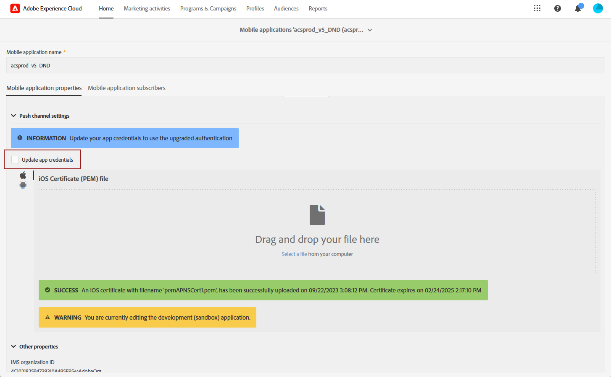

# Alterações no canal de notificação por push {#push-upgrade}

Você pode usar o Campaign para enviar notificações por push em dispositivos Android e iOS. Para fazer isso, o Campaign depende de serviços de assinatura específicos. Algumas alterações importantes no serviço Android Firebase Cloud Messaging (FCM) foram lançadas em 2024 e podem afetar sua implementação do Adobe Campaign. A configuração dos serviços de assinatura para mensagens por push do Android pode precisar ser atualizada para dar suporte a essa alteração.

Além disso, o Adobe recomenda mudar para a conexão baseada em token para APNs em vez de uma conexão baseada em certificado, que é mais segura e escalável.

Para garantir serviço ininterrupto, você deve atualizar os aplicativos móveis registrados no Adobe Campaign para incorporar os mecanismos de autenticação mais recentes para FCM (Android) e APNs (iOS).

[Saiba como configurar certificados de aplicativo para dispositivos móveis no Adobe Campaign Standard](configuring-a-mobile-application.md#channel-specific-config)

## Serviço Firebase Cloud Messaging (FCM) do Google Android {#fcm-push-upgrade}

### O que mudou? {#fcm-changes}

Como parte do esforço contínuo do Google para melhorar seus serviços, as APIs herdadas do FCM serão descontinuadas em **20 de junho de 2024**. Saiba mais sobre o protocolo HTTP do Firebase Cloud Messaging em [Documentação do Google Firebase](https://firebase.google.com/docs/cloud-messaging/http-server-ref){target="_blank"}.

Iniciando [versão 24.1](../../rn/using/release-notes.md), o Adobe Campaign Standard é compatível com APIs HTTP v1 para enviar mensagens de notificação por push do Android.

### Você será afetado? {#fcm-impact}

Se você já estiver usando o Adobe Campaign Standard para enviar notificações por push, sua implementação deverá ser atualizada.

A transição para as APIs mais recentes é obrigatória para evitar qualquer perturbação do serviço.

<!--To check if you are impacted, you can filter your **Services and Subscriptions** as per the filter below

* If any of your active push notification service uses the **HTTP (legacy)** API, your setup will be directly impacted by this change. You must review your current configurations and move to the newer APIs as described below.

* If your setup exclusively uses the **HTTP v1** API for Android push notifications, then you are already in compliance and no further action will be required on your part.-->

### Como atualizar? {#fcm-transition-procedure}

#### Pré-requisitos {#fcm-transition-prerequisites}

* O apoio do **API HTTP v1** O modo foi adicionado na versão 24.1. Se o ambiente estiver sendo executado em uma versão mais antiga, um pré-requisito para essa alteração será atualizar o ambiente para o [versão mais recente do Campaign Standard](../../rn/using/release-notes.md).

* O arquivo JSON da conta do serviço SDK de administrador do Firebase do Android é necessário para mover o aplicativo móvel para HTTP v1. Saiba como obter este arquivo no [Documentação do Google Firebase](https://firebase.google.com/docs/admin/setup#initialize-sdk){target="_blank"}.

* Se você ainda estiver usando essa versão herdada do SDK, deverá atualizar sua implementação com o Adobe Experience Platform SDK. Saiba como migrar para o SDK da Adobe Experience Platform em [este artigo](sdkv4-migration.md).

* Verifique se você tem o **Configuração do aplicativo móvel** no Adobe Experience Platform Data Collection Mobile antes de executar as etapas abaixo. [Saiba mais](https://experienceleague.adobe.com/docs/experience-platform/collection/permissions.html?lang=en#adobe-experience-platform-data-collection-permissions){target="_blank"}.

#### Procedimento de transição {#fcm-transition-steps}

Para mover seu ambiente para HTTP v1, siga estas etapas:

1. Navegue até **[!UICONTROL Administration]** > **[!UICONTROL Channels]** > **[!UICONTROL Mobile app (AEP SDK)]**.

   

1. Selecione o aplicativo para dispositivos móveis específico que requer a atualização do certificado.

1. Verifique a **[!UICONTROL Update app credentials]** caixa de seleção

   

1. Forneça a ID do aplicativo (nome do pacote do Android) do `build.gradle` arquivo. Por exemplo, `com.android.test.testApp`. Use IDs diferentes para ambientes de preparo e produção.

1. Faça upload do arquivo de chave JSON da chave privada do Android.

   

1. Clique no botão **Save**.

>[!NOTE]
>
>Depois que essas alterações forem aplicadas, todos os novos deliveries de notificação por push para dispositivos Android usarão a API HTTP v1. Os deliveries de push existentes em repetição, em andamento e em uso ainda usam a API HTTP (herdada).

## Serviço de notificação por push (APNs) do Apple iOS {#apns-push-upgrade}

### O que mudou? {#ios-changes}

Conforme recomendado pela Apple, você deve proteger suas comunicações com o serviço de notificação por push (APNs) da Apple usando tokens de autenticação sem estado.

A autenticação baseada em token oferece uma maneira sem estado de se comunicar com APNs. A comunicação sem estado é mais rápida do que a comunicação baseada em certificado porque não requer que APNs consultem o certificado ou outras informações relacionadas ao servidor do provedor. Há outras vantagens em usar a autenticação baseada em token:

* Você pode usar o mesmo token de vários servidores de provedores.

* Você pode usar um token para distribuir notificações para todos os aplicativos de sua empresa.

Saiba mais sobre Conexões baseadas em token para APNs em [Documentação do desenvolvedor do Apple](https://developer.apple.com/documentation/usernotifications/establishing-a-token-based-connection-to-apns){target="_blank"}.

O Adobe Campaign Standard oferece suporte a conexões baseadas em token e em certificado. Se sua implementação depende de uma conexão baseada em certificado, o Adobe recomenda que você atualize-a para uma conexão baseada em token.

### Você será afetado? {#ios-impact}

Se sua implementação atual depender de solicitações baseadas em certificado para se conectar a APNs, você será afetado. Recomenda-se a transição para uma conexão baseada em token.

<!--To check if you are impacted, you can filter your **Services and Subscriptions** as per the filter below:

* If any of your active push notification service uses the **Certificate-based authentication** mode (.p12), your current implementations should be reviewed and moved to a **Token-based authentication** mode (.p8) as described below.

* If your setup exclusively uses the **Token-based authentication** mode for iOS push notifications, then your implementation is already up-to-date and no further action will be required on your part.-->

### Como atualizar? {#ios-transition-procedure}

#### Pré-requisitos {#ios-transition-prerequisites}

* O apoio do **Autenticação baseada em token** foi adicionado em [versão 24.1](../../rn/using/release-notes.md). Se o ambiente estiver sendo executado em uma versão mais antiga, um pré-requisito para essa alteração será atualizar o ambiente para o [versão mais recente do Campaign Standard](../../rn/using/release-notes.md).

* Você precisa de uma chave de assinatura de token de autenticação APNs para gerar os tokens que seu servidor usa. Essa chave é solicitada na sua conta de desenvolvedor do Apple, conforme explicado em [Documentação do desenvolvedor do Apple](https://developer.apple.com/documentation/usernotifications/establishing-a-token-based-connection-to-apns){target="_blank"}.

#### Procedimento de transição {#ios-transition-steps}

Para mover seus aplicativos móveis da iOS para o modo de autenticação baseada em token, siga estas etapas:

1. Navegue até **[!UICONTROL Administration]** > **[!UICONTROL Channels]** > **[!UICONTROL Mobile app (AEP SDK)]**.

   

1. Selecione o aplicativo para dispositivos móveis específico que requer a atualização do certificado.

1. Verifique a **[!UICONTROL Update app credentials]** caixa de seleção

   

1. Forneça o **ID do aplicativo** (ID do pacote iOS). Você pode encontrar a iOS Bundle ID (App ID) no destino principal do seu aplicativo no Xcode.

1. Fazer upload do **Arquivo de certificado do iOS p8**.

1. Preencha as configurações de conexão APNs **[!UICONTROL Key Id]** e **[!UICONTROL iOS Team Id]**.

   

1. Clique em **[!UICONTROL Save]**.

Seu aplicativo iOS agora está sendo movido para o modo de autenticação baseado em token.

## Perguntas frequentes{#push-upgrade-faq}

+++É possível manter a mesma appID na instância de preparo e produção?

Para aplicativos móveis iOS, você pode usar a mesma ID do aplicativo, que é a ID do pacote de aplicativos iOS, para ambientes de preparo e produção. No entanto, no Android, a ID do aplicativo deve ser exclusiva para cada ambiente. Portanto, nossa sugestão é anexar &quot;preparo&quot; à ID do aplicativo criada no ambiente de preparo

+++

+++É possível apenas migrar o aplicativo Android?

Não, os aplicativos Android e iOS precisam ser migrados de acordo com as etapas descritas acima.

+++

+++Que tipo de verificação é necessário executar após a migração?

Nossa recomendação é realizar a validação funcional de todos os casos de uso relacionados a notificações por push.

+++

+++O que fazer ao obter o erro &quot;Não autorizado&quot; ao salvar o aplicativo móvel?

Parece ser um problema de permissão relacionado à Coleção de dados da Adobe Experience Platform. Para resolver isso, você deve adicionar permissões &quot;Dispositivo móvel&quot; e &quot;Configuração de aplicativo móvel&quot; no Adobe Admin Console, conforme descrito na seção Pré-requisitos deste artigo.

+++

+++As alterações são necessárias no código do aplicativo móvel?

Não, somente as alterações relacionadas à configuração no Firebase e na conta do desenvolvedor do aplicativo são necessárias. Não são necessárias alterações no aplicativo móvel do cliente.

+++

+++Precisamos atualizar o certificado do iOS todos os anos?

Não, após essa migração, não há necessidade de atualizar o certificado do iOS todos os anos.

+++

+++O que acontece se essa migração não for feita?

As mensagens de push do Android começarão a falhar após 20 de junho de 2024, de acordo com a notificação do Google. [Leia mais](https://firebase.google.com/docs/cloud-messaging/migrate-v1){target="_blank"}.

+++

+++Os clientes podem migrar de volta para o FCM após concluir a migração do FCMv1?

Sim, os clientes poderão voltar ao FCM até 20 de junho de 2024. Após essa data, a opção de migração não estará mais disponível.

+++

+++A migração da API HTTP v1 é compatível com o aplicativo para dispositivos móveis SDK V4?

Não, os clientes precisam primeiro migrar o aplicativo móvel para o V5 SDK e, em seguida, prosseguir com a migração acima. Eles precisam fazer isso como prioridade, pois o serviço de push começará a falhar a partir de junho de 2024, de acordo com a notificação da Google.

+++

+++As alterações na instância do estágio terão algum impacto na instância de produção?

Não, não há impacto de nenhuma alteração no aplicativo móvel de preparo na instância de produção.

+++