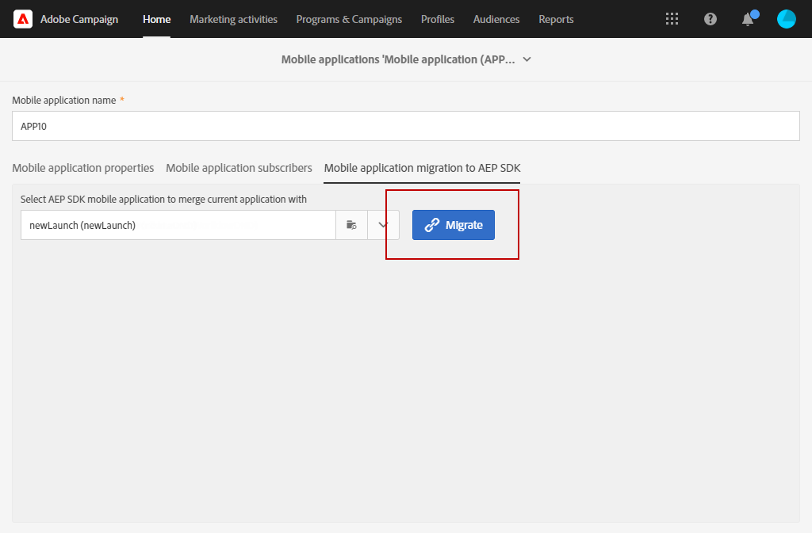
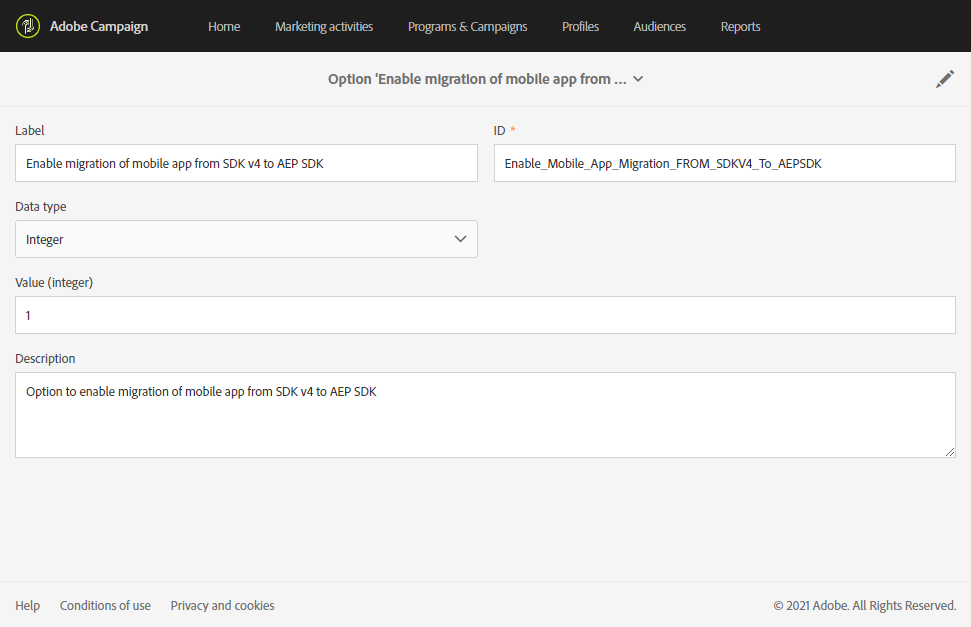

# Como migrar seu aplicativo para dispositivos móveis do SDK v4 para o SDK da Adobe Experience Platform {#sdkv4-migration}

>[!IMPORTANT]
>
> O processo de migração é irreversível.
>
> Leia o documento cuidadosamente antes de iniciar a migração do aplicativo móvel do SDK V4 para o SDK do Adobe Experience Platform.

## Sobre a migração do SDK V4

A Adobe Campaign Standard processa aplicativos móveis usando o SDK V4 como aplicativos separados daqueles que usam o Adobe Experience Platform SDK.
Depois de atualizar a versão do SDK do Adobe da v4 para o Adobe Experience Platform, os aplicativos móveis precisam continuar usando os dados e campanhas atuais do assinante do aplicativo: por conseguinte, é necessária uma migração.

>[!NOTE]
>
> Esta página documenta a migração de um aplicativo móvel SDK v4 para um aplicativo SDK do Adobe Experience Platform recém-criado. Seus aplicativos móveis SDK v4 não serão mesclados com um aplicativo móvel SDK do Adobe Experience Platform com um **[!UICONTROL Configured]** **[!UICONTROL Property status]**.

| O que não mudará após a migração |
|:-:|
| Não haverá efeito nos deliveries e campanhas existentes usando o aplicativo SDK V4 migrado. |
| O nome do aplicativo móvel permanecerá o mesmo. |
| As credenciais da plataforma para iOS e Android serão mantidas. |
| Todos os assinantes do aplicativo e seus dados serão retidos. |
| O aplicativo móvel SDK v4 existente continuará enviando dados (dados PII, Informações do assinante e do token) para o Adobe Campaign Standard. |
| O **[!UICONTROL Organizational unit]** do aplicativo móvel permanecerá o mesmo. |

| O que mudará após a migração |
|:-:|
| O aplicativo móvel estará disponível em **[!UICONTROL Administration]** > **[!UICONTROL Channels]** > **[!UICONTROL Mobile app (Adobe Experience Platform SDK)]**. Antes da migração, ela estava disponível em **[!UICONTROL Administration]** > **[!UICONTROL Channels]** > **[!UICONTROL Mobile app (SDK V4)]**. |
| O **[!UICONTROL Collect PII Endpoint]** do aplicativo será alterado. O **[!UICONTROL Collect PII Endpoint]** mais antigo continuará a funcionar, os dados enviados não serão perdidos. |
| O aplicativo será vinculado a um Adobe Experience Platform Launch **[!UICONTROL Mobile Property]**. Ele será processado como um aplicativo móvel recém-criado. |
| O aplicativo Adobe Experience Platform SDK original usado na migração não existirá como um aplicativo separado. Somente o aplicativo SDK v4 migrado estará disponível. |

## Migrar seu aplicativo móvel do SDK v4 para o SDK do Adobe Experience Platform {#how-to-migrate}

Antes de migrar, você deve levar em conta as seguintes recomendações:

* O processo de migração é irreversível.
* Você não deve executar a migração de vários aplicativos ao mesmo tempo. Você também deve garantir que a migração de um mesmo aplicativo não seja acionada por várias janelas ao mesmo tempo.
* Antes da migração, verifique se você recebeu o **[!UICONTROL Organizational unit]** do aplicativo móvel que deseja migrar e do aplicativo Adobe Experience Platform que está usando para migração.
* Após a migração, o aplicativo se tornará um aplicativo SDK do Adobe Experience Platform. Suas alterações serão vinculadas ao **[!UICONTROL Mobile Property]** do Launch correspondente.

1. Crie um novo **[!UICONTROL Mobile property]** no Adobe Experience Platform Launch. Para obter mais informações, consulte a [documentação do Adobe Experience Platform Launch](https://aep-sdks.gitbook.io/docs/getting-started/create-a-mobile-property#create-a-mobile-property).

1. No Adobe Campaign Standard, no menu avançado, selecione **[!UICONTROL Administration]** > **[!UICONTROL Application Settings]** > **[!UICONTROL Workflows]** e abra o workflow **[!UICONTROL syncWithLaunch]**. Verifique se o workflow terminou sem erro.

1. Após a conclusão do workflow, no menu **[!UICONTROL Administration]** > **[!UICONTROL Channels]** > **[!UICONTROL Mobile app (Adobe Experience Platform SDK)]**, verifique se o aplicativo móvel está disponível no Adobe Campaign Standard e está no estado **[!UICONTROL Ready to Configure]**.

   

1. Em **[!UICONTROL Administration]** > **[!UICONTROL Channels]** > **[!UICONTROL Mobile app (SDK V4)]**, selecione o aplicativo SDK V4 que deseja migrar.

1. Selecione a guia **[!UICONTROL Mobile application migration to AEP SDK]**.

   

1. Na lista suspensa **[!UICONTROL Select AEP SDK mobile application to merge current application with]**, selecione o aplicativo móvel do SDK do Adobe Experience Platform criado anteriormente.

1. Clique em **[!UICONTROL Migrate]**.

   

1. Na janela **[!UICONTROL Migration application]**, clique em **[!UICONTROL Ok]**.

   

1. A janela de conclusão bem-sucedida é exibida. Clique em **[!UICONTROL Go to Adobe Experience Platform SDK Channel list]**.

1. Na página da lista de canais do SDK do Adobe Experience Platform, verifique se o aplicativo móvel V4 anterior está definido como **[!UICONTROL Ready To Configure]**.

1. Selecione seu aplicativo móvel e clique em **[!UICONTROL Save]** para concluir a migração.

Após essa migração, os assinantes coletados pela versão V4 do aplicativo móvel e os novos assinantes coletados pela versão AEP do aplicativo móvel estarão disponíveis no aplicativo migrado.

Para distinguir os dois tipos diferentes de assinantes, é possível adicionar um novo campo personalizado do tipo **[!UICONTROL Text]** ao estender o recurso personalizado **[!UICONTROL Subscriptions to an application (appSubscriptionRcp)]** como `sdkversion` ou `appVersion`, por exemplo. Para obter mais informações sobre como estender um recurso personalizado, consulte esta [página](../../developing/using/creating-or-extending-the-resource.md).
Em seguida, será necessário configurar o Launch associado **[!UICONTROL Mobile property]** para enviar esse valor de campo personalizado na chamada Collect PII e alterar a configuração do aplicativo móvel de acordo.

## Perguntas frequentes {#faq}

### P: No aplicativo móvel SDK v4, a migração do aplicativo móvel para a guia Adobe Experience Platform SDK não está visível. {#tab-not-visible}

A: No menu avançado **[!UICONTROL Administration]** > **[!UICONTROL Application Settings]** > **[!UICONTROL Options]**, marque o valor da opção **[!UICONTROL Enable migration of mobile app from SDK v4 to Adobe Experience Platform SDK option]**. Deve ser definido como 1 e ativado por padrão. O administrador pode ter desativado manualmente.

### P: Na guia Mobile application migration to Adobe Experience Platform SDK , a mensagem No data é exibida. {#no-data}

A: Somente a aplicação elegível de seu **[!UICONTROL Organizational unit]** é mostrada na lista. Certifique-se de ter o aplicativo Adobe Experience Platform correto para a migração. O **[!UICONTROL Property Status]** do aplicativo Adobe Experience Platform deve ser definido como **[!UICONTROL Ready to Configure]** e o **[!UICONTROL Mobile app migration status]** definido como **[!UICONTROL Not Migrated]**.

### P: Por que o aplicativo Adobe Experience Platform SDK com o Status da propriedade configurada não pode ser usado para migração? {#property-status}

A: O processo de migração retém os assinantes e atributos do SDK v4. Ela só mantém as informações relacionadas ao Launch do aplicativo SDK do Adobe Experience Platform. Os assinantes e outros dados do aplicativo SDK do Adobe Experience Platform serão perdidos. Para evitar perda de dados, somente os aplicativos SDK do Adobe Experience Platform com **[!UICONTROL Ready to Configure]** **[!UICONTROL Property Status]** são elegíveis para migração.

### P: Após a migração, onde posso encontrar meu aplicativo móvel SDK v4 anterior? {#v4-app-not-visible}

A: O aplicativo móvel após a migração estará visível no menu avançado **[!UICONTROL Administration]** > **[!UICONTROL Channels]** > **[!UICONTROL Mobile app (Adobe Experience Platform SDK)]**.

### P: Após a migração, onde posso encontrar meu aplicativo Adobe Experience Platform SDK recém-criado? {#aep-not-visible}

A: O aplicativo Adobe Experience Platform SDK recém-criado usado para a migração não existirá como um aplicativo separado. Somente o aplicativo SDK v4 migrado estará disponível.

### P: Se a unidade organizacional do aplicativo móvel SDK v4 estiver definida como A (um filho da unidade organizacional ALL) e o SDK do Adobe Experience Platform estiver definido como ALL. Como posso migrar meu aplicativo móvel? {#v4-org-unit}

A: Os administradores do **[!UICONTROL Organizational unit]** ALL terão os direitos de gerenciar ambos os aplicativos móveis e serão responsáveis pela migração.

### P: Se a unidade organizacional do aplicativo móvel SDK v4 estiver definida como A e o aplicativo SDK do Adobe Experience Platform estiver definido como B (um irmão da unidade organizacional A). Como posso migrar meu aplicativo móvel? {#aep-org-unit}

A: Sendo o aplicativo SDK do Adobe Experience Platform o ativo de um **[!UICONTROL Organizational unit]** irmão, o aplicativo móvel não estará visível para os usuários do **[!UICONTROL Organizational unit]** A. O aplicativo móvel estará disponível para os Administradores do **[!UICONTROL Organizational unit]** ALL, mas não recomendamos que esses administradores migrem o aplicativo móvel.
Nesse caso, você deve mover seus aplicativos móveis no mesmo **[!UICONTROL Organizational unit]** ou em um **[!UICONTROL Organizational unit]** com um link principal.
Para obter mais informações sobre **[!UICONTROL Organizational unit]**, consulte esta [seção](../../administration/using/organizational-units.md).

### P: Na página do aplicativo móvel do SDK do Adobe Experience Platform (migrado do aplicativo móvel v4), no menu suspenso Configurações do canal de push , nenhuma informação como data/nome carregado é exibida para a chave do Android ou certificado do iOS {#no-information-v5}

A: O sistema não armazena essas informações quando o aplicativo móvel SDK V4 é criado. Ao migrar seu aplicativo móvel SDK V4 para um aplicativo móvel SDK da Adobe Experience Platform, seu aplicativo móvel migrado também não terá esse tipo de informação. Assim que um usuário carregar um novo certificado do iOS ou uma chave do Android, os diferentes detalhes da chave ou certificado serão armazenados e exibidos corretamente na lista suspensa **[!UICONTROL Push channel settings]**.
