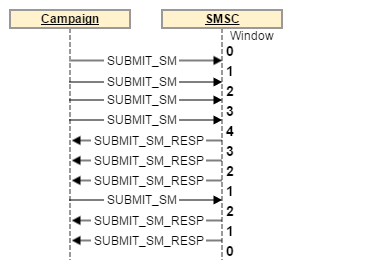

# Protocolo e configurações do conector de SMS {#sms-connector-protocol}

>[!NOTE]
>
>O **protocolo e as configurações do conector SMS** para Adobe Campaign Classic podem ser encontradas neste [page](https://experienceleague.adobe.com/docs/campaign-classic/using/sending-messages/sending-messages-on-mobiles/sms-protocol.html).
>
>Por meio desse documento, todas as referências a detalhes sobre o protocolo, nomes de campos e valores se referem à [especificação SMPP 3.4](https://smpp.org/SMPP_v3_4_Issue1_2.pdf).

## Visão geral {#overview}

O SMS pode limitar-se a enviar mensagens de texto curtas sem formatação, mas a sua simplicidade faz dele um canal de comunicação valioso.

Há duas formas principais de enviar um SMS:

* Enviá-lo manualmente por um telefone, a maneira habitual de se comunicar diretamente entre as pessoas.

* Enviá-lo pela Internet, da maneira como o Adobe Campaign envia mensagens. Para isso, você precisa de um provedor de serviço SMS que conecte a Internet à rede móvel.
O Adobe Campaign usa o protocolo SMPP para enviar SMS a um provedor de serviço.

Este documento o guiará pela configuração de conexão entre o Adobe Campaign e um provedor SMPP.

Às vezes, os provedores SMPP podem se desviar da especificação oficial, mas o conector SMS no Adobe Campaign oferece muitas opções para adaptar o comportamento a fim de que seja compatível com a maioria dos provedores.

>[!IMPORTANT]
>
>A configuração de uma conexão com um novo provedor pode exigir algumas habilidades técnicas, conhecimentos de TCP, representação binária e hexadecimal e codificações de texto. Exigirá também a cooperação ativa com o provedor.

### Tipos de SMS {#sms-types}

Ao enviar SMS em massa por um provedor SMS, você encontrará três tipos diferentes de SMS:

* **SMS MT (Terminado por dispositivo móvel)**: um SMS emitido pelo Adobe Campaign para telefones celulares por meio do provedor SMPP.

* **SMS MO (Originado por dispositivo móvel)**: um SMS enviado por um dispositivo móvel para o Adobe Campaign por meio do provedor SMPP.

* **SMS SR (Relatório de status) ou DR ou DLR (Recibo de delivery)**: um recibo de retorno enviado pelo dispositivo móvel ao Adobe Campaign por meio do provedor SMPP, indicando que o SMS foi recebido com êxito. O Adobe Campaign também pode receber um SR indicando que a mensagem não pôde ser entregue, geralmente com uma descrição do erro.

Você precisa distinguir entre confirmações (RESP PDU, parte do protocolo SMPP) e SR: SR é um tipo de SMS que é enviado através da rede de ponta a ponta, enquanto uma confirmação é apenas para indicar que uma transferência foi bem-sucedida.

As confirmações e o SR podem acionar erros. A diferenciação dos dois ajudará na solução de problemas.

### Informações transportadas por um SMS {#information-sms}

Um SMS transporta mais informações do que texto. Aqui está uma lista do que você pode encontrar em um SMS:

* O texto, que é limitado a 140 bytes, o que significa entre 70 e 160 caracteres, dependendo da codificação. Consulte [Codificação de texto SMS](../../administration/using/sms-protocol.md#sms-text-encoding) abaixo para ver os detalhes e as limitações.

* Um endereço de recipient, às vezes chamado de `ADC` ou `MSISDN`. Esse é o número do dispositivo móvel que receberá o SMS.

* Um endereço de remetente, que pode ser chamado de `oADC` ou, às vezes, `sender id`. Pode ser um número de telefone no dia a dia, um código curto quando enviado por um provedor ou um nome. O nome é um recurso opcional; nesse caso, você não pode responder ao SMS.

* Um sinalizador para indicar se essa é uma mensagem flash. Uma mensagem flash é um pop-up que não é armazenado na memória.

* Um sinalizador para indicar se um SR é esperado ou não.

* Uma data de validade, após a qual nenhum equipamento de rede poderá tentar novamente.

* Um campo `data_coding`, que indica a codificação do texto.

## Protocolo SMPP {#smpp-protocol}

O Adobe Campaign Standard oferece suporte ao protocolo SMPP versão 3.4. Esse é um protocolo amplo que permite enviar SMS para um provedor (SMSC) e receber SMS, bem como recebimentos. Para obter mais informações, consulte a [documentação do SMPP](https://smpp.org/SMPP_v3_4_Issue1_2.pdf).

O equipamento de rede do lado do provedor de serviço SMS é frequentemente chamado de SMSC.

### Conexões SMPP {#smpp-connections}

O Adobe Campaign se conecta ao equipamento de rede do provedor de serviço SMS via TCP. O protocolo SMPP define conexões TCP permanentes do Adobe Campaign para o provedor. As conexões TCP são sempre iniciadas pelo Adobe Campaign, mesmo para receber mensagens.
O SMPP abre uma ou duas conexões TCP, dependendo de seu modo. Todas as conexões são sempre iniciadas pelo Adobe Campaign.

O protocolo SMPP pode funcionar de dois modos:

* **Transmissor+receptor (ou TX+RX)**: duas conexões TCP separadas são usadas para transmitir e receber mensagens.
* **Transceptor (TRX de âncora)**: uma única conexão TCP é usada para transmitir e receber mensagens.

>[!NOTE]
>
>O TRX é preferido para o Adobe Campaign Standard, pois reduz o número de conexões e simplifica a recuperação de conexão em caso de falha.

### PDU SMPP {#smpp-pdu}

As unidades de transmissão SMPP (&quot;pacotes&quot;) são chamadas de PDUs. Uma **PDU** contém um comando, um status, um número de sequência e dados.

Cada PDU deve ser reconhecida por um `SMPP RESP PDU` (resposta síncrona). Os pedidos podem ser encaminhados: o remetente pode enviar vários comandos sem aguardar `RESP`. O número de solicitações que podem ser encaminhadas a qualquer momento é chamado de janela. `RESP PDU` pode chegar em qualquer ordem, independentemente da ordem da PDU do iniciador correspondente.

No modo separado **Transmissor+receptor**, a conexão usada depende do tipo de mensagem transmitida. A conexão do transmissor é usada para MT, e a conexão do receptor é usada para MO e SR. As solicitações e respostas para cada tipo de mensagem são enviadas pela mesma conexão TCP.

Por exemplo, ao enviar um MT, a conexão do transmissor é usada e o `RESP` que reconhece o MT também é enviado pelo canal do transmissor. Quando você recebe um MO (ou um SR), a conexão do receptor é usada para receber o MO e para enviar o `RESP` que reconhece o MO.


No Adobe Campaign Standard, a reconciliação MT e SR é nativa do MTA, portanto, não há processo SMS dedicado.

Um `SUBMIT_SM_RESP PDU` bem-sucedido aciona o status de mensagem &quot;enviado&quot; no log de envio, enquanto um `DELIVER_SM (SR) PDU` bem-sucedido aciona o status de mensagem &quot;recebido&quot;.

### Aspectos de segurança {#security-aspects}

O protocolo em si não está criptografado. A maioria dos provedores implementa uma variante de IP na lista de permissões para que os endereços IP do servidor do Adobe Campaign sejam declarados ao provedor.

O Adobe Campaign oferece suporte para a passagem de um logon e uma senha durante a fase de associação. Também dá suporte a SMPP sobre TLS. Observe que são necessários certificados para garantir a segurança adequada. Embora o conector SMPP permita ignorar verificações de certificados, ele deve ser usado apenas para testes, já que TLS sem certificados fornece um nível de segurança significativamente menor.

O conector usa os certificados padrão fornecidos pela biblioteca `openssl` do sistema. Normalmente, é fornecido pelo diretório `/etc/ssl/certs` no Debian. Esse diretório é fornecido pelo pacote &quot;ca-certificates&quot; por padrão, mas pode ser personalizado.

### Informações em cada tipo de PDU {#information-pdu}

Cada tipo de PDU tem campos distintos que transportam informações diferentes. Essas PDUs estão detalhadas na especificação [SMPP 3.4](https://smpp.org/SMPP_v3_4_Issue1_2.pdf).

Cada seção abaixo descreve a PDU e sua resposta síncrona (`*_RESP PDU`). Todas as PDUs devem ser reconhecidas por um `RESP` correspondente. Essa é uma parte obrigatória da especificação.

As PDUs podem ter campos opcionais. Somente os campos mais comuns são descritos aqui. Consulte a especificação [SMPP 3.4](https://smpp.org/SMPP_v3_4_Issue1_2.pdf) para obter mais informações.

#### BIND_TRANSMITTER / BIND_RECEIVER / BIND_TRANSCEIVER {#bind-transmitter}

Esta PDU é usada para iniciar uma conexão com o SMSC. **Os modos Transmissor**, **Receptor** e **Transceptor** só mudam o tipo de SMS que pode ser transferido através dessa conexão, especificamente:

| Modo | Tipos de SMS permitidos |
|:-:|:-:|
| Transmissor | MT |
| Receptor | MO + SR |
| Transceptor | MT + MO + SR |

Campos de destaque em `BIND_* PDU`:

* **system_id**: logon usado para autenticação. Definido na conta externa.

* **senha**: Senha usada para autenticação. Definido na conta externa.

* **system_type**: definição obrigatória com um valor específico para alguns provedores. Definido na conta externa. Disponível em todas as versões. Muitas vezes, distingue entre diferentes tipos de contratos, canais, países etc.

* **addr_ton** e **addr_npi**: exigido por alguns provedores. Definido pelas configurações `Bind TON` e `Bind NPI` na conta externa.

* **address_range**: exigido por alguns provedores. Na maioria das vezes, é uma lista de códigos de atalho permitidos nessa conexão. Definido na conta externa.

`BIND_*_RESP` não tem um campo específico. Confirma se a conexão foi bem-sucedida ou não.

#### UNBIND {#unbind}

Essa PDU deve ser enviada pelo sistema antes da desconexão. Deve aguardar a `UNBIND_RESP PDU` correspondente antes de fechar a conexão.

A conformidade com o SMSC não deve fechar a conexão. A conexão TCP é controlada pelo conector do Adobe Campaign.

#### SUBMIT_SM {#submit-sm}

Essa PDU envia um MT ao SMSC. A PDU de resposta fornece a ID do MT.

Campos de destaque em `SUBMIT_SM PDU`:

* **service_type**: exigido por alguns provedores. Definido nas propriedades do delivery.

* **source_addr_ton** e **source_addr_npi**: indica que tipo de endereço de origem é transmitido. O significado desses campos é padronizado, mas como alguns provedores o usam de forma diferente, você deve solicitar ao provedor o valor correto. Definido na conta externa.

* **source_addr**: o endereço de origem/oADC do MT. Será exibido no telefone celular. Definido na conta externa e no delivery, o valor no delivery tem precedência sobre o valor da conta externa.

* **dest_addr_ton** e **dest_addr_npi**: indica que tipo de endereço de destino é transmitido (por exemplo, formato local ou internacional). O significado desses campos é padronizado, mas como alguns provedores o usam de forma diferente, você deve solicitar ao provedor o valor correto. Definido na conta externa.

* **target_addr**: endereço, número de telefone ou MSISDN do recipient.

* **esm_class**: usado para informar se UDH é usado ou não no campo de texto. Ativado automaticamente pelo conector para SMS dividido se o modo `message_payload` não for usado.

* **priority_flag**: prioridade dessa mensagem sobre outras. É ligado à prioridade do próprio delivery.

* **valid_period**: carimbo de data e hora após o qual nenhuma nova tentativa deve ser feita. Definido no próprio delivery.

* **registered_delivery**: informa se um SR é solicitado ou não. O Adobe Campaign sempre define esse sinalizador, exceto para respostas automáticas. Para mensagens de várias partes, o sinalizador é definido somente para a primeira parte. Todas as versões têm o mesmo comportamento.

* **data_coding**: indica a codificação usada no campo de texto. Consulte a seção [codificação de texto SMS](../../administration/using/sms-protocol.md#sms-text-encoding) para obter mais informações.

* **short_message**: o texto da mensagem. Se UDH for usado, isso também conterá o cabeçalho UHD.

O Adobe Campaign é compatível com estes campos opcionais:

* **dest_addr_subunit**: usado para especificar o target do SMS: flash, dispositivo móvel ou cartão SIM. Definido nas propriedades do delivery.

* **message_payload**: quando ativado na conta externa, mensagens longas serão enviadas em uma única PDU, e o texto será transmitido nesse campo, em vez do campo `short_message`.

#### SUBMIT_SM_RESP {#submit-sm-resp}

Esta PDU conterá a ID do MT. Isso é útil para corresponder ao SR recebido.

>[!IMPORTANT]
>
>Muitos provedores transmitem a ID do MT em hexadecimal. Defina o formato de ID **na configuração da notificação da MT** corretamente na conta externa.

Alguns provedores enviam `SUBMIT_SM_RESP` depois de enviar o SR. Para levar em conta esse comportamento, o Adobe Campaign aguarda 30 segundos antes de responder com a **ID de mensagem inválida** a um SR com uma ID desconhecida.

#### DELIVER_SM {#delivery-sm}

Essa PDU é enviada pelo SMSC para o Adobe Campaign. Ela contém um MO ou um SR.

A maioria dos campos tem o mesmo significado que sua contraparte `SUBMIT_SM`. Esta é a lista de campos úteis:

* **source_addr**: endereço de origem do MO/SR. Geralmente, é um número de telefone.

* **target_addr**: código curto que recebeu o MO ou o SR.

* **esm_class**: usado para informar se a PDU é um MO ou um SR.

* **short_message**: texto da mensagem. No caso de SR, contém os dados descritos no apêndice B da especificação do protocolo SMPP. Consulte [Gerenciamento de erros do SR](../../administration/using/sms-protocol.md#sr-error-management) para obter mais detalhes.

O Adobe Campaign pode ler a ID da mensagem no campo opcional `receipted_message_id` com algum ajuste de configuração.

#### DELIVER_SM_RESP {#deliver-sm-resp}

Essa PDU é enviada pelo Adobe Campaign para reconhecer o SR e o MO.

O Adobe Campaign Standard envia `DELIVER_SM_RESP` somente após todas as etapas de processamento terem sido bem-sucedidas. Isso garante que nenhum SR ou MO seja reconhecido enquanto ainda houver risco de erros de processamento.

#### ENQUIRE_LINK {#enquire-links}

Essa PDU só é usada para verificar se a conexão está ativa. Sua frequência deve ser estabelecida de acordo com as necessidades do provedor.

Os 60 segundos padrão devem corresponder à maioria das configurações definidas na conta externa.

#### ENQUIRE_LINK_RESP {#enquire-links-resp}

Essa PDU reconhece que a conexão está ativa.

### SMS multiparte (SMS longo) {#multipart}

O SMS multiparte, ou SMS longo, consiste em um SMS enviado em várias partes. Devido a limitações técnicas no protocolo de rede móvel, um SMS não pode ter mais de 140 bytes. Caso contrário, precisará ser dividido. Consulte a seção [codificação de texto SMS](../../administration/using/sms-protocol.md#sms-text-encoding) para saber mais sobre o número de caracteres que um SMS pode conter.

Cada parte de uma mensagem longa é um SMS individual. Essas partes viajam independentemente na rede e são montadas pelo telefone celular receptor. Para lidar com tentativas e problemas de conectividade, o Adobe Campaign envia essas partes em ordem inversa e solicita um SR somente na primeira parte da mensagem, a última enviada. Como o telefone celular só exibe uma mensagem quando a primeira parte é recebida, as tentativas de partes adicionais não produzem duplicatas no telefone celular.

O número máximo de SMS por mensagem pode ser definido por delivery usando a configuração **Número máximo de SMS por mensagem** no **Template do delivery**. As mensagens que ultrapassarem esse limite terão falha durante o envio, com o motivo de falha de SMS muito longo.

Há duas maneiras de enviar SMS longos:

* **UDH**: a maneira padrão e recomendada de enviar mensagens longas. Nesse modo, o conector divide a mensagem em vários `SUBMIT_SM PDU`s que contêm informações UDH. Esse protocolo é o usado pelos próprios celulares. Isso significa que o Adobe Campaign tem mais controle sobre a geração de mensagem, tornando-a capaz de calcular exatamente quantas partes foram enviadas e como foram divididas.

* **message_payload**: o modo de enviar toda a mensagem longa em um único `SUBMIT_SM PDU`. O provedor terá que dividi-la, o que significa que é impossível para o Adobe Campaign saber exatamente quantas partes foram enviadas. Alguns provedores exigem esse modo, mas recomendamos que você o utilize apenas se eles não forem compatíveis com UDH.

Consulte a descrição dos campos `esm_class`, `short_message` e `message_payload` do [SUBMIT_SM PDU](../../administration/using/sms-protocol.md#information-pdu) para obter mais detalhes sobre o protocolo e os formatos.

### Captura de rendimento e janela {#throughput-capping}

A maioria dos provedores exige um limite de rendimento para cada conexão SMPP. Isso pode ser feito por meio da definição de um número de SMS na conta externa. Observe que a limitação de rendimento ocorre por conexão. O rendimento efetivo total é o limite por conexão multiplicado pelo número total de conexões. Isso é detalhado na seção [Conexões simultâneas](../../administration/using/sms-protocol.md#connection-settings).

Para atingir o máximo de rendimento possível, é necessário ajustar a janela de envio máxima. A janela de envio é o número de `SUBMIT_SM PDU`s que podem ser enviados sem esperar por um `SUBMIT_SM_RESP`. Consulte a seção [Configuração da janela de envio](../../administration/using/sms-protocol.md#throughput-timeouts) para obter mais detalhes.

### SR e gerenciamento de erros (&quot;Apêndice B&quot;) {#sr-error-management}

O protocolo SMPP define erros síncronos padrão em `RESP PDU`s, mas não define códigos de erro para SR. Cada provedor usa seus próprios códigos de erro com o respectivo significado.

Uma recomendação é feita na seção Apêndice B da [especificação do protocolo SMPP](https://smpp.org/SMPP_v3_4_Issue1_2.pdf) (página 167), mas isso não lista os códigos de erro reais nem seu significado.

Para se adaptar ao gerenciamento de erros, o sistema de mensagem de banda larga do Adobe Campaign foi aproveitado para provisionar adequadamente os erros e sua gravidade (hardware, software etc.).

Como mencionado acima, existem dois tipos diferentes de erros:

* respostas síncronas em `SUBMIT_SM_RESP` que ocorrem imediatamente após a mensagem ser enviada ao SMSC
* recebimentos que poderão vir muito mais tarde, quando o celular tiver recebido a mensagem ou quando a mensagem atingir o tempo limite. Nesse caso, o erro é encontrado em um SR.

Quando um SR é recebido, o status e o erro podem ser encontrados em seu campo `short_message` (exemplo para implementações em conformidade com o Apêndice B). O campo `short_message` da PDU é frequentemente chamado de **campo de texto**, pois contém texto no MT. No caso de SR, contém informações técnicas, mais um subcampo chamado **Texto**. Esses dois campos são diferentes e `short_message` na verdade contém o campo **Texto** e outras informações.

#### Formato de campo de texto SR {#sr-text-field-format}

A especificação recomenda o uso desse formato para o campo de texto SR. É uma lista de subcampos, separados por espaços com dois-pontos para separar o nome do campo e seu valor. Os nomes de campo não diferenciam maiúsculas de minúsculas.

Exemplo de um campo de texto SR que corresponde à recomendação do Apêndice B:

```
id:1234567890 sub:001 dlvrd:001 submit date:1608011415 done date:1608011417 stat:DELIVRD err:000 Text:Hello Adobe world
```

O campo id é a ID recebida em `SUBMIT_SM_RESP PDU`, a confirmação do MT.

`sub` e `dlvrd` devem contar a quantidade de partes e mensagens entregues, mas isso não é usado pelo Adobe Campaign, já que o sistema de transmissão fornece informações melhores e mais integradas.

Os campos`submit date` e `done date` são carimbos de data e hora indicativos do envio do MT e do envio do SR pelo dispositivo móvel. Espere alguns problemas com fusos horários ou até mesmo carimbos de data e hora errados fornecidos por dispositivos móveis com data definida incorretamente.

O campo stat é importante, pois informa o status da mensagem. Os únicos status importantes são `DELIVRD`, `UNDELIV` e `REJECTD`. O status `DELIVRD` indica sucesso. Os outros dois indicam erro. Outros valores são possíveis, mas normalmente são notificações intermediárias; por exemplo, o MT chegou à operadora de celular, mas não ao telefone celular. Essas notificações intermediárias são ignoradas pelo Adobe Campaign.

O campo err contém o código de erro específico do provedor. O provedor deve fornecer uma tabela de possíveis códigos de erro, juntamente com o respectivo significado, para que seja possível interpretar esse valor.

Finalmente, o campo de texto geralmente contém o início do texto do MT. Isso é ignorado pelo Adobe Campaign, e alguns provedores não o transmitem para evitar o vazamento de informações de identificação pessoal e o consumo de largura de banda da rede. Ele pode ser usado durante a solução de problemas para detectar o SR que corresponde a um MT de teste, mais facilmente lendo esse campo.

### Exemplo de processamento SR no Adobe Campaign Standard Extended generic SMPP {#sr-processing}

Este exemplo exibe o caso de uma implementação seguindo a recomendação do Apêndice B, os valores padrão na conta externa e um SMS MT bem-sucedido.

```
id:1234567890 sub:001 dlvrd:001 submit date:1608011415 done date:1608011417 stat:DELIVRD err:000 Text:Hello Adobe world
```

Primeiro, o regex `id extraction` é aplicado para extrair a ID e reconciliá-la com o MT correspondente.

Em seguida, os regex `status extraction` e `error code extraction` são aplicados para extrair esses campos e são anexados à sequência.

A mensagem de transmissão é criada com essas informações, e a sequência original inalterada é anexada para referência:

```
SR ExampleProvider DELIVRD 000|MESSAGE=id:1234567890 sub:001 dlvrd:001 submit date:1608011415 done date:1608011417 stat:DELIVRD err:000 Text:Hello Adobe world
```

A mensagem é então normalizada, removendo a parte da MENSAGEM para poder corresponder a várias mensagens com os mesmos códigos de estado e erro.

```
SR ExampleProvider DELIVRD 000|#MESSAGE#
```

Se a mensagem ainda não tiver sido provisionada na tabela de mensagens de transmissão, uma nova entrada será criada, usando a mensagem inteira como **firstText** e a mensagem normalizada. Em seguida, o conector usa o sucesso e o regex `error` para determinar se foi um sucesso ou uma falha:

* Se ele corresponder ao regex `success`, será considerado um sucesso.

* Se ele corresponder ao regex `error`, a mensagem será qualificada como um erro.

* Se nenhum desses dois regex for correspondente, o SR será ignorado. Pode ser uma notificação intermediária, que não é tratada pelo Adobe Campaign.

Por padrão, todos os erros são provisionados como erros leves. Isso significa que os erros graves devem ser provisionados manualmente.

### Codificação de texto SMS {#sms-text-encoding}

Você deve **sempre entrar em contato com o provedor de SMSC em caso de problemas de codificação**. Somente os provedores de SMSC têm conhecimento preciso da codificação que suportam e de regras especiais que podem ser aplicadas devido a limitações em sua plataforma técnica.

As mensagens SMS usam uma codificação especial de sete bits, geralmente chamada de codificação GSM7.

No protocolo SMPP, o texto GSM7 será expandido para oito bits por caractere para facilitar a solução de problemas. O SMSC o compactará em sete bits por caractere antes que seja enviado ao dispositivo móvel. Isso significa que o campo `short_message` do SMS pode ter até 160 bytes de comprimento no quadro SMPP, enquanto está limitado a 140 bytes quando enviado na rede móvel.

Em caso de problemas de codificação, veja alguns itens importantes a serem verificados:

* Saiba quais caracteres pertencem a qual codificação. O GSM7 não suporta totalmente marcas diacríticas (acentos). Especialmente em francês, em que &quot;é&quot; e &quot;è&quot; fazem parte do GSM7, mas &quot;ê&quot;, &quot;â&quot; ou &quot;ï&quot; não fazem parte. O mesmo se aplica ao espanhol.

* O cê-cedilha (ç) está presente apenas em maiúsculas no alfabeto GSM7, mas alguns telefones o renderizam em minúscula ou em maiúsculas e minúsculas &quot;inteligentes&quot;. A recomendação geral é evitá-lo completamente e remover a cedilha ou mudar para UCS-2.

* **Não utilize ASCII em** SMS, a menos que seja explicitamente solicitado pelo fornecedor de SMSC. Essa codificação desperdiça espaço porque tem caracteres de oito bits e menos cobertura do que o GSM7. Essa codificação pode ser necessária para redes CDMA, usadas na América do Norte.

* O Latin-1 nem sempre é compatível. Verifique a compatibilidade com seu provedor de SMSC antes de tentar usar o Latin-1.

* As tabelas de correspondência de idiomas nacionais não são compatíveis com o conector do Adobe Campaign. Em vez disso, você deve usar o UCS-2 ou outro `data_coding`.

* UCS-2 e UTF-16 são frequentemente misturados por telefones. Esse problema ocorre ao serem usados emojis e outros caracteres não presentes no UCS-2.

* A maioria dos telefones não tem glifos de fonte para todos os caracteres UCS-2. Os smartphones tendem a exibir caracteres raros com muita facilidade, mas os celulares convencionais geralmente têm suporte limitado ao que é útil na língua nativa do país em que foram comprados. Se você quiser usar emoji ou ASCII-art, teste-o em uma grande variedade de telefones antes de enviar. A visualização do Adobe Campaign não simula glifos ausentes e exibirá símbolos disponíveis no navegador da Web.

O campo `data_coding` informa qual codificação é usada. Um grande problema é que o valor 0 significa a codificação SMSC padrão na especificação, que geralmente se refere ao GSM7. Verifique com o parceiro de SMSC qual codificação está associada a `data_coding` = 0, que só é compatível com o Adobe Campaign. Outros valores `data_coding` tendem a seguir a especificação, mas a única maneira de ter certeza é verificar com o provedor de SMSC.

O tamanho máximo de uma mensagem depende de sua codificação. Esta tabela resume todas as informações relevantes:

| Codificação | data_coding comum | Tamanho da mensagem (caracteres) | Tamanho da parte para SMS multiparte | Caracteres disponíveis |
|:-:|:-:|:-:|:-:|:-:|
| GSM7 | 0 | 160 | 152 | Conjunto de caracteres básicos GSM7 + extensão (caracteres estendidos usam dois caracteres) |
| Latino-1 | 3 | 140 | 134 | ISO-8859-1 |
| UCS-2 <br>UTF-16 | 8 | 70 | 67 | Unicode (varia de telefone para telefone) |

## Parâmetros de conta externa SMPP {#SMPP-parameters-external}

Cada implementação do protocolo SMPP tem muitas variações. Para melhorar a compatibilidade e a adaptabilidade, há várias configurações disponíveis para alterar o comportamento do conector SMPP. Esta seção descreve cada parâmetro e seus efeitos no conector.

### Parâmetros gerais e roteamento {#general-parameters-routing}

**Limitar instâncias de MTA para esta conta**

É possível definir um limite para o número de instâncias de MTA permitidas para se conectar ao provedor de SMPP. Quando marcado, você pode especificar quantos MTAs podem ser usados no máximo.

Essa opção permite um controle mais fino sobre o número de conexões. Consulte [Conexões simultâneas](../../administration/using/sms-protocol.md#connection-settings).

Se você definir um valor maior que o número de MTAs em execução, todos os MTAs serão executados normalmente: essa opção é apenas um limite e não pode gerar MTAs adicionais.

Se você precisar controlar com precisão o número de conexões (por exemplo, o requisito do provedor), será recomendável sempre definir essa opção, mesmo se a implantação atual tiver o número correto de MTAs em execução. Se MTAs forem adicionados posteriormente, o limite de conexão continuará a ser respeitado.

### Configurações de conexão {#connection-settings}

#### Modo de conexão SMPP {#smpp-connection-mode}

Define a conexão no modo **transceptor** ou no modo **transmissor+receptor** separado. Quando você alternar para o modo **transmissor+receptor** separado, as configurações na seção **Modo de conexão SMPP** se aplicam ao transmissor e às configurações na seção **Configurações de conexão do destinatário** se você marcar a caixa de seleção **Usar parâmetros diferentes para o receptor**.

#### Nome da implementação SMSC {#smsc-implementation-name}

Define o nome da implementação SMSC. Ele deve ser definido com o nome do seu provedor. Entre em contato com o administrador ou com a equipe de avaliação do delivery para saber o que adicionar a esse campo. A função desse campo é descrita na seção [Gerenciamento de erro do SR](../../administration/using/sms-protocol.md#sr-error-management).

#### Servidor {#server}

O nome DNS ou o endereço IP do servidor ao qual se conectar.

#### Porta {#port}

A porta TCP à qual se conectar.

#### Conta {#account}

O logon da conexão. Passado no campo `system_id` da PDU BIND.

#### Senha {#password}

Senha da conexão SMPP. Passado no campo de senha da PDU BIND.

#### Tipo de sistema {#system-type}

Valor passado no campo `system_id` da PDU BIND. Alguns provedores precisam de um valor específico aqui.

#### Conexões simultâneas {#simultaneous-connections}

No Adobe Campaign Standard, ele define o número de conexões por thread SMS e por processo MTA.
O número de processos MTA é determinado pela implantação: geralmente há 2 MTAs e 1 thread. O número de threads pode ser alterado no arquivo config-instance.xml usando a configuração smppConnectorThreads. Geralmente há 1 processo MTA por contêiner e 1 thread por processo MTA.

Fórmula de conexões totais para Adobe Campaign Standard:

* **Total de conexões = Conexões simultâneas * número de threads * número de MTAs**

Conexões simultâneas são definidas na conta externa, o número de threads é definido no arquivo config-instance.xml (smppConnectorThreads) e o número de MTAs pode ser limitado na conta externa.

No modo **transmissor/receptor** separado, o número de conexões acima representa o número de pares **transmissor/receptor** significando que haverá o dobro do número de conexões no total.

#### Habilitar TLS em SMPP {#enable-TLS}

Use o TLS para se conectar ao provedor. A conexão será criptografada. A conexão TLS é gerenciada pela biblioteca OpenSSL. Qualquer item aplicável ao OpenSSL será verdadeiro para essa conexão.

#### Habilitar rastreamentos SMPP detalhados no arquivo de log {#enable-verbose-log-file}

Essa configuração descarta todo o tráfego SMPP no arquivos de log. Geralmente é necessário ajustar parâmetros durante a configuração inicial. Isso deve ser ativado ao solucionar problemas do conector e comparado ao tráfego visto pelo provedor.

### Configuração de conexão do receptor {#receiver-connection}

Essa seção só é visível no modo separado de **transmissor+receptor**.

#### Use parâmetros diferentes para o receptor {#receiver-parameters}

Quando a caixa está desmarcada, as mesmas configurações são usadas para transmissor e receptor.

Quando a caixa estiver marcada, as configurações na seção **Configurações de conexão** serão aplicadas ao transmissor e as configurações nas configurações **Conexão do receptor** serão aplicadas ao receptor.

**Servidor do receptor, porta, conta, senha, tipo de sistema**

Essas configurações se aplicam ao receptor quando ele está no modo **transmissor+receptor**. Elas funcionam como a parte transmissora. Veja mais detalhes acima.

### Configurações de canal de SMPP {#smpp-channel-settings}

#### Permitir transliteração de caracteres {#allow-character-transliteration}

A transliteração é o processo de encontrar caracteres equivalentes aos que faltam. Por exemplo, o caractere francês &quot;ê&quot; (e com acento circunflexo) está ausente da codificação GSM, mas pode ser substituído por &quot;e&quot; sem prejudicar a leitura.

Quando essa caixa estiver desmarcada, a codificação de texto falhará se não conseguir codificar a string exatamente como está.

Quando essa caixa estiver marcada, a codificação de texto tentará converter a sequência em uma versão aproximada em vez de falhar. Se alguns caracteres não tiverem equivalente na codificação de destino, a codificação do texto falhará.

Consulte [Definir um mapeamento específico das configurações de codificações](../../administration/using/sms-protocol.md#SMSC-specifics) para obter uma explicação mais geral do processo de codificação.

#### Armazenar o MO recebido no banco de dados {#incoming-mo-storing}

Quando ativado, o MO recebido será armazenado na tabela inSMS do banco de dados. Esta tabela pode ser consultada usando a atividade de query de qualquer fluxo de trabalho.

#### Ativar atualizações de KPI em tempo real durante o processamento de SR {#real-time-kpi}

Quando ativados, os KPIs serão atualizados em tempo real na página principal do delivery ao receber o SR do erro.

A desvantagem pode ser o baixo desempenho devido à contenção do banco de dados gerado. Se desativadas, as estatísticas são atualizadas pelo fluxo de trabalho **syncformexec**, em execução a cada 20 minutos.

#### Número de origem {#source-number}

Define o endereço de origem padrão das mensagens. Essa configuração só será aplicada se o número de origem for deixado vazio no delivery.

Por padrão, o campo de número de origem não é transmitido. Portanto, o provedor o substituirá pelo código curto.

Isso habilita o recurso de substituição de endereço/oADC do remetente.

#### Código curto {#short-code}

Indica o código curto principal da conta. Se vários códigos curtos forem usados para esta conta ou se o código curto for desconhecido, deixe este campo vazio.

A especificação de código curto é útil para dois recursos:

* A visualização exibirá o código curto se nenhum número de origem for fornecido. Isso refletirá o verdadeiro comportamento do dispositivo móvel.

* A configuração de lista de bloqueios do recurso de resposta automática só envia para a quarentena o usuário para um código curto específico.

#### TON/NPI de origem, TON/NPI de destino {#ton-npi}

O TON (Tipo de Número) e o NPI (Indicador do Plano de Numeração) são descritos na seção 5.2.5 da especificação [SMPP 3.4](https://smpp.org/SMPP_v3_4_Issue1_2.pdf) (página 117). Esses valores devem ser definidos de acordo com as necessidades do provedor.

Eles são transmitidos como estão nos campos `source_addr_ton`, `source_addr_npi`, `dest_addr_ton` e `dest_addr_npi` de `SUBMIT_SM PDU`.

#### Tipo de serviço {#service-type}

Esse campo é transmitido como está no campo `service_type` de `SUBMIT_SM PDU`. Defina isso de acordo com as necessidades do provedor.

### Tráfego e tempos limite {#throughput-timeouts}

Essas configurações controlam todos os aspectos de tempo do canal SMPP. Alguns provedores exigem controle muito preciso da taxa de mensagens, da janela e dos tempos de novas tentativas. Essas configurações devem ser definidas com valores que correspondam à capacidade do provedor e às condições indicadas no contrato.

#### Janela de envio {#sending-window}

A janela é o número de `SUBMIT_SM PDU`s que podem ser enviados sem esperar por um `SUBMIT_SM_RESP` correspondente.

Exemplo de uma transmissão com uma janela máxima de 4:



A janela ajuda a aumentar o rendimento quando o link da rede tem uma latência alta.  O valor da janela deve ser pelo menos o número de SMS/s multiplicado pela latência do link
em segundos, para que o conector nunca aguarde um `SUBMIT_SM_RESP` antes de enviar a próxima mensagem.
Se a janela for muito grande, você poderá enviar mais mensagens duplicadas em caso de problemas de conexão. Além disso, a maioria dos provedores tem um limite muito restrito para a janela e recusa mensagens que ultrapassam o limite.

Como calcular a fórmula ideal da janela de envio:

* Meça a latência máxima entre `SUBMIT_SM` e `SUBMIT_SM_RESP`.

* Multiplica esse valor em segundos para o rendimento máximo do MT. Isso fornecerá o melhor valor da janela de envio.

Exemplo: se você tiver 300 SMS/s definidos com rendimento máximo de MT e houver uma latência de 100 ms entre `SUBMIT_SM` e `SUBMIT_SM_RESP` em média, o valor ideal será `300×0.1 = 30`.

#### Rendimento máximo de tráfego de MT {#max-mt-throughput}

Número máximo de MT por segundo e por conexão. Essa configuração é estritamente imposta. O MTA nunca encaminhará mensagens mais rapidamente do que esse limite. É útil para provedores que exigem limitação precisa.

Para saber o limite de rendimento total, multiplique esse número pelo número total de conexões, conforme detalhado na fórmula acima.

0 significa sem limite. O MTA enviará o MT o mais rápido possível.

Geralmente, é recomendável manter essa configuração abaixo de 1000, pois é impossível garantir uma taxa de transferência precisa acima desse número, a menos que seja feito um referencial adequado na arquitetura final. Se você precisar de uma taxa de transferência acima de 1000, entre em contato com seu provedor. Talvez seja melhor aumentar o número de conexões para um valor acima de 1000 MT/s.

#### Tempo antes da reconexão {#time-reconnection}

Quando a conexão TCP for perdida, o conector aguardará esse número de segundos antes de tentar fazer uma conexão.

#### Período de validade do MT {#expiration-period}

Tempo limite entre `SUBMIT_SM` e o `SUBMIT_SM_RESP` correspondente. Se `RESP` não for recebido a tempo, a mensagem será considerada como tendo sofrido falha, e a política global de novas tentativas do MTA será aplicada.

#### Tempo limite da associação {#bind-timeout}

Tempo limite entre a tentativa de conexão TCP e a resposta `BIND_*_RESP`. Quando o tempo limite for atingido, a conexão será fechada pelo conector do Adobe Campaign e aguardará pelo tempo antes da reconexão antes de tentar novamente.

#### Período inquire_link {#enquire-link-period}

`enquire_link` é um tipo especial de PDU enviada para manter a conexão ativa. Esse período é em segundos. O conector do Campaign envia `enquire_link` somente quando a conexão está ociosa, para conservar a largura de banda. Se não for recebido nenhum RESP após o dobro desse período, a conexão será considerada inoperante, e um processo de reconexão será acionado.

### Especificações do SMSC {#SMSC-specifics}

Essas são configurações avançadas que adaptam o conector do Adobe Campaign à maioria das peculiaridades de implementação do SMPP.

#### Definir um mapeamento específico de codificações {#encoding-specific-mapping}

Consulte a seção [codificação de texto SMS](../../administration/using/sms-protocol.md#sms-text-encoding) para obter detalhes sobre codificação de texto.

Essa configuração permite definir um mapeamento de codificação personalizado, diferente da especificação. Você pode declarar uma lista de codificações, juntamente com o respectivo valor `data_coding`.

O MTA tentará codificar usando a primeira codificação na lista. Se falhar, tentará usar a próxima codificação na lista etc. Se nenhuma codificação puder ser usada para codificar a mensagem, ocorrerá um erro. Quando a codificação for encontrada, o MTA criará `SUBMIT_SM PDU` com o texto codificado e o campo `data_coding` definido com o valor especificado na tabela.

A ordem dos itens na tabela é importante: as codificações são tentativas de cima para baixo. Você deve colocar a codificação mais barata ou mais recomendada no topo da lista, seguida de codificações cada vez mais caras.

Observe que o UCS-2 nunca falhará, pois pode codificar todos os caracteres com suporte no Adobe Campaign, e o comprimento máximo de um SMS UCS-2 é muito menor: somente 70 caracteres.

Você também pode usar essa configuração para forçar uma codificação específica a ser sempre usada declarando apenas uma linha na tabela de mapeamento.

O mapeamento padrão usado quando a caixa de seleção não está marcada é equivalente à seguinte tabela:

| data_coding | Codificação |
|---|---|
| 0 | GSM |
| 9 | UCS-2 |

Isso significa que o MTA tentará codificar a mensagem no GSM. Se for bem-sucedido, ele o enviará com `data_coding` definido como 0.

Se a mensagem não puder ser codificada no GSM, será codificada em UCS-2 e definirá `data_coding` como 8.

#### Ativar message_payload {#enable-message-payload}

Quando desmarcada, o SMS longo será dividido pelo MTA e enviado em vários `SUBMIT_SM PDU`s com UDH. A mensagem será recomposta pelo telefone celular, seguindo os dados UDH.

Quando marcado, o SMS longo será enviado em uma PDU SUBMIT_SM, colocando o texto no campo opcional message_payload. Consulte a [especificação SMPP](../../administration/using/sms-protocol.md#ACS-SMPP-connector) para obter detalhes sobre isso.

Se esse recurso estiver ativado, o Adobe Campaign não poderá contar as partes do SMS individualmente: todas as mensagens serão contadas como enviadas em uma parte.

#### Enviar o número de telefone completo {#send-full-phone-number}

Quando essa caixa de seleção não está marcada, somente os dígitos do número de telefone são enviados para o provedor (campo `destination_addr` do campo `SUBMIT_SM`). Esse é o comportamento padrão, pois o indicador de número internacional, geralmente um prefixo +, é substituído pelos campos TON e NPI no SMPP.

Quando a caixa de seleção é marcada, o número de telefone é enviado como está, sem pré-processamento e espaços em potencial, prefixo + ou sinais de libra/cerquilha/asterisco.

Esse recurso também afeta o comportamento do recurso de lista de bloqueios de resposta automática: quando a caixa de seleção não estiver marcada, um prefixo + será adicionado aos números de telefone inseridos na tabela de quarentena para compensar a remoção do prefixo + do número de telefone pelo próprio protocolo SMPP.

#### Ignorar verificação de certificado TLS {#skip-tls}

Quando o TLS estiver ativado, ignorar todas as verificações de certificado.

Quando marcado, a conexão não é mais segura. Ela não deve ser ativada na produção.

Pode ser útil para depuração ou teste.

#### Vincular TON/NPI {#bind-ton-npi}

TON (Tipo de Número) e NPI (Indicador do Plano de Numeração) descritos na seção 5.2.5 da especificação [SMPP 3.4](https://smpp.org/SMPP_v3_4_Issue1_2.pdf) (página 117). Esses valores devem ser definidos para o que for necessário ao provedor.

Eles são transmitidos como estão nos campos `addr_ton` e `addr_npi` da PDU BIND.

#### Intervalo de endereços {#address-range}

Enviado como está no campo address_range da PDU BIND. Esse valor deverá ser definido de acordo com o que for necessário ao provedor.

#### Contagem de confirmação de ID inválida {#invalid-id}

Limita o número de **ID da Mensagem inválida** `DELIVER_SM_RESP` que pode ser enviado para um único SR.

**Deve ser usado apenas para fins de solução de problemas temporária** e definido como 0 em condições normais.

Por exemplo, ao definir como 2:

* O provedor envia um SR (`DELIVER_SM`) com a ID &quot;1234&quot;.

* A ID &quot;1234&quot; não foi encontrada no banco de dados.

* O conector conta 1 **Erro de ID inválido** para essa ID. Por isso, envia `DELIVER_SM_RESP` com o código de erro &quot;ID de mensagem inválida&quot; (comportamento normal).

* O provedor tenta novamente o mesmo SR com a ID &quot;1234&quot;.

* A ID &quot;1234&quot; ainda não foi encontrada no banco de dados.

* O conector conta o erro 2 **ID inválido** para essa ID. Portanto, envia `DELIVER_SM_RESP` &quot;OK&quot;, mesmo que não tenha sido processado corretamente.

* Esse recurso destina-se a liberar buffers SR no provedor quando o SR inválido bloqueia legitimamente o processamento de mensagens.

Definir esse campo como 0 desativa o mecanismo no qual a **ID da Mensagem inválida** é sempre retornada. Esse é um comportamento normal.

Definir esse campo como 1 faz com que o conector sempre responda &quot;OK&quot;, mesmo que a ID seja inválida. Isso deve ser definido como 1 somente sob supervisão, para solução de problemas e pelo período mínimo, por exemplo, para se recuperar de um problema do provedor.

#### Registro do regex da ID no SR {#regex-extraction}

O formato SR não é estritamente aplicado pela especificação do protocolo SMPP. É apenas uma recomendação descrita no [Apêndice B](../../administration/using/sms-protocol.md#sr-error-management) (página 167) da especificação. Alguns implementadores de SMPP formatam esse campo de forma diferente. Portanto, o Adobe Campaign precisa de uma maneira de extrair o campo correto.

Por padrão, captura até 10 caracteres alfanuméricos depois de `id:`.

O regex deve ter exatamente um grupo de captura com uma parte contida entre parênteses. A parte da ID deve estar entre parênteses. O formato do regex é PCRE.

Ao ajustar essa configuração, inclua o máximo de contexto possível para evitar acionadores falsos. Se houver prefixos específicos no padrão, como `id:`, inclua-os no regex. Também use o máximo possível de delimitadores de palavras (\b) para não capturar texto no meio de uma palavra.

Não incluir contexto suficiente no regex pode gerar uma pequena falha de segurança: o conteúdo real da mensagem pode ser incluído no SR. Se você só fizer a correspondência com um formato de ID específico sem contexto, por exemplo, um UUID, ele poderá analisar o conteúdo de texto real, por exemplo, um UUID incorporado no campo de texto, em vez da ID.

#### Regex aplicado para determinar o status de sucesso/erro {#regex-applied}

Quando mensagens com uma combinação desconhecida de campo de estado/erro são encontradas, esses regex são aplicados no campo de estado para determinar se o SR teve êxito ou se ocorreu um erro. Um SR com valores de estado que não correspondem a nenhum desses regex é ignorado.

Por padrão, valores de estado que começam com `DELIV`, por exemplo, `DELIVRD` no [Apêndice B](../../administration/using/sms-protocol.md#sr-error-management), são considerados entregues com êxito, e todos os valores de estado que correspondem a erros, por exemplo, `REJECTED`, `UNDELIV`, são considerados erros.

#### Formato de ID na confirmação MT {#id-format-mt}

Isso indica o formato da ID retornada no campo `message_id` de `SUBMIT_SM_RESP PDU`.

* **Não modificar**: a ID é armazenada como está no banco de dados, como texto codificado em ASCII. Não ocorre pré-processamento nem filtragem.

* **Número decimal**: espera-se que a ID seja um número decimal no formato ASCII. Espaços à esquerda e à direita e zeros à esquerda são removidos quando essa configuração é usada.

* **Número hexadecimal**: espera-se que a ID seja um número hexadecimal no formato ASCII, sem 0x à esquerda nem h à direita. A ID é convertida em um número decimal antes de ser armazenada no banco de dados.

* **Sequência hexadecimal**: espera-se que a ID seja um texto codificado em ASCII que seja uma sequência de bytes codificada como hexadecimal. Por exemplo, na PDU, você encontrará `0x34 0x31 0x34 0x32 0x34 0x33`, o que significa ASCII &quot;414243&quot;. Essa sequência é então decodificada como uma sequência hexadecimal de bytes, e você obtém &quot;ABC&quot; como resultado: você armazenará a ID &quot;ABC&quot; no banco de dados.

#### Formato de ID no SR {#id-format-sr}

Isso indica o formato da ID capturada pelo regex `Extraction` da ID no SR. Os valores têm o mesmo significado e o mesmo comportamento que o formato no MT acima.

**ID SR ou código de erro no campo opcional**

Se marcado, o conteúdo dos campos opcionais será anexado ao texto processado pelos regex acima. O texto terá o formato `0xTAG:VALUE`, `0xTAG` sendo o valor hexadecimal de quatro dígitos da tag em maiúsculas, por exemplo, `0x002E`.

Por exemplo, convém capturar a ID no campo `receipted_message_id`. Para isso, ative essa caixa de seleção. O seguinte texto será adicionado ao status:

```
0x001E:05e3299e-8d37-49d0-97c6-8e4fe60c7739
```

Neste exemplo, 0x001E é a tag do campo opcional, e o UUID é o valor do campo.

Para capturar esse valor, agora é possível definir o seguinte regex no regex de Extração da ID no campo SR:

```
\b0x001E:([0-9a-f]{8}-[0-9a-f]{4}-[0-9a-f]{4}-[0-9a-f]{4}-[0-9a-f]{12})\b
```

>[!IMPORTANT]
>
>Você só pode capturar campos opcionais que tenham valores de texto (ASCII/UTF-8). Especificamente, os campos binários não podem ser capturados de forma confiável pelo sistema de regex atual.

**ID SR ou código de erro no campo de texto**

Se marcado, o campo **Texto** será mantido durante o processamento do texto de status do SR.

Isso será útil se o provedor colocar dados importantes nesse campo, como a ID ou o status. Normalmente, esse campo pode ser descartado com segurança, pois pode conter texto com uma codificação não ASCII e prejudicar o processamento de regex.

Se essa opção for ativada, poderá ocorrer uma falha de segurança muito pequena se o regex `Extraction` da ID no campo SR não for suficientemente específico. O conteúdo do campo **Texto** pode ser analisado como uma ID, e um invasor pode usá-lo para injetar IDs forjadas, o que pode levar a uma situação de negação de serviço parcial.

**Tag de ID de serviço**

Permite adicionar um TLV personalizado. Esse campo define a parte da tag. O valor pode ser personalizado por delivery no valor **ID de serviço ou programa** nos parâmetros avançados do delivery.

Essa configuração permite adicionar apenas uma opção TLV por mensagem.

>[!NOTE]
>
>A partir da versão 21.1, agora é possível adicionar mais de um parâmetro opcional. Para obter mais informações, consulte esta [seção](../../administration/using/sms-protocol.md#automatic-reply-tlv).

### Resposta automática enviada ao MO {#automatic-reply}

Esse recurso permite responder rapidamente ao texto para o MO e processar o envio por código curto para a lista de bloqueios.

As colunas **Palavra-chave** e **Código curto** definem condições para acionar a resposta automática. Se ambos os campos forem correspondentes, o MO será enviado, e a ação adicional será acionada. Para especificar um curinga, deixe o campo vazio. A palavra-chave corresponde à primeira palavra alfanumérica no texto MO, ignorando a pontuação e os espaços à esquerda. Isso significa que o campo **Palavra-chave** não pode conter espaços e deve ser uma única palavra.

A configuração **Palavra-chave** é um prefixo. Por exemplo, se você especificar &quot;AD&quot;, ele corresponderá a &quot;AD&quot;, &quot;ADAPT&quot; e &quot;ADOBE&quot;. Se houver várias palavras-chave com um prefixo comum, será necessário prestar atenção à ordem, já que as palavras-chave são processadas de cima para baixo.

A coluna **Responder** é o texto a ser respondido. Nenhuma personalização está disponível nesse campo. Se você deixar esse campo vazio, nenhuma mensagem será respondida, mas a ação adicional será acionada mesmo assim.

A coluna **Ação adicional** fornece uma ação extra quando a **Palavra-chave** e o **Código curto** são correspondentes. Um código curto vazio corresponde a todos os códigos curtos. Você pode enviar para a quarentena ou remover da quarentena. O valor &quot;nenhum&quot; responde ao texto. Se você especificar uma **Ação adicional**, mas deixar o campo **Responder** vazio, a ação será executada, mas nenhuma resposta será enviada. A quarentena é aplicada somente ao código curto especificado, ou a todos os códigos curtos, se o campo está vazio.

>[!IMPORTANT]
>
>A configuração de envio de número de telefone completo afeta o comportamento do mecanismo de quarentena de resposta automática: se o número de telefone completo não estiver marcado, o número de telefone colocado em quarentena receberá um sinal de mais (&quot;+&quot;) para torná-lo compatível com o formato de número de telefone internacional.

Todas as entradas na tabela são processadas na ordem especificada, até que uma regra seja correspondente. Se várias regras corresponderem a um MO, somente a regra mais alta será aplicada.

### Parâmetros opcionais de resposta automática (TLV) {#automatic-reply-tlv}

A partir da versão 21.1, você pode adicionar parâmetros opcionais ao MT de resposta automática. São adicionados como parâmetros TLV opcionais ao `SUBMIT_SM PDU` da resposta, conforme descrito no ponto 5.3 da [especificação SMPP](https://smpp.org/SMPP_v3_4_Issue1_2.pdf)(página 131).

Para obter mais informações sobre parâmetros opcionais, consulte esta [seção](../../administration/using/sms-protocol.md#smpp-optional-parameters).

## Parâmetros de template do delivery do SMS {#sms-delivery-template-parameters}

Alguns parâmetros podem ser definidos por template do delivery.

### Do campo {#from-field}

Este campo é opcional. Permite substituir o endereço do remetente (oADC). O conteúdo desse campo é colocado no campo `source_addr` de `SUBMIT_SM PDU`.

O campo é limitado a 21 caracteres pela especificação SMPP, mas alguns provedores podem permitir valores mais longos. Observe também que restrições muito rigorosas podem ser aplicadas em alguns países; por exemplo, comprimento, conteúdo, caracteres permitidos.

### Parâmetros do delivery {#delivery-parameters}

#### Número máximo de SMS por mensagem {#maximum-sms}

Essa configuração só funcionará se a configuração **Carga da mensagem** estiver desativada. Para obter mais informações sobre essas operações, consulte esta [página](../../administration/using/configuring-sms-channel.md). Se a mensagem exigir mais SMS do que esse valor, um erro será acionado.

O protocolo SMS limita o SMS a 255 partes, mas alguns telefones celulares têm dificuldade em reunir mensagens longas com mais de 10 partes. O limite depende do modelo exato. Recomendamos que você não exceda cinco partes por mensagem.

Devido ao modo como as mensagens personalizadas funcionam no Adobe Campaign, o tamanho das mensagens pode variar. Ter uma grande quantidade de mensagens longas pode aumentar os custos de envio.

#### Modo de transmissão {#transmission-mode}

Esse campo indica o tipo de SMS que você deseja transferir: mensagens normais ou em flash, armazenando no celular ou no cartão SIM.

Essa configuração é transmitida no campo opcional `dest_addr_subunit` em `SUBMIT_SM PDU`.

* **Não especificado** não envia nenhum campo opcional na PDU.

* **Flash** define o valor como 1. Ele envia uma mensagem flash que é exibida no dispositivo móvel e não é armazenada na memória.

* **Normal** define o valor como 0. Envia uma mensagem normal.

* **Salvar no dispositivo móvel** define o valor como 2. Ele instrui o telefone a armazenar o SMS na memória interna.

* **Salvar no terminal** define o valor como 3. Ele instrui o telefone a armazenar o SMS no cartão SIM.

#### Período de validade {#validity-period}

O período de validade é transmitido no campo `validity_period` de `SUBMIT_SM PDU`. A data é sempre formatada como um formato de hora UTC absoluto (o campo de data terminará com &quot;00+&quot;).

#### Parâmetros opcionais SMPP (TLV) {#smpp-optional-parameters}

A partir da versão 21.1, você pode adicionar vários parâmetros opcionais a cada MT enviado para este delivery. Estes parâmetros opcionais são adicionados ao `SUBMIT_SM PDU` da resposta, conforme descrito no ponto 5.3 da [especificação SMPP](https://smpp.org/SMPP_v3_4_Issue1_2.pdf)(página 131).

Cada linha na tabela representa um parâmetro opcional:

* **Parâmetro**: Descrição do parâmetro. Não transmitido ao prestador.
* **ID da tag**: Tag do parâmetro opcional . Deve ser hexadecimal válido, usando o formato 0x1234. Valores inválidos levarão a um erro de preparação de delivery.
* **Valor**: Valor do campo opcional. Codificado como UTF-8 quando ele é transmitido ao provedor. O formato de codificação não pode ser alterado, não é possível enviar valores binários ou usar codificações diferentes, como UTF-16 ou GSM7.

Se qualquer parâmetro opcional tiver o mesmo **ID de tag** que o **Id de etiqueta de serviço** definido na conta externa, o valor definido nesta tabela prevalecerá.

## Conector SMPP {#ACS-SMPP-connector}


Setas representam o fluxo de dados.

O mais importante a ser observado aqui é que há vários threads de conector SMPP. Esses threads são idênticos e compartilham a mesma configuração. É por isso que o número de conexões é sempre multiplicado pelo número de threads.

O número de threads não pode ser alterado pelo cliente, pois requer a alteração de arquivos de configuração.

### Descrição do comportamento do conector SMPP {#behavior-smpp-connector}

#### Correspondência de MT, SR e entradas de catálogo {#matching-mt-sr}

No Adobe Campaign, uma mensagem é uma entrada de broadlog. No Adobe Campaign Standard, os conectores externos só precisam saber sobre a tabela de broadlog em funcionamento: `nmsBroadLogExec`. Um workflow é encarregado de copiar entradas de broadlog para seus targeting dimensions específicos (nmsBroadLogXXX).

Infelizmente, o SMPP não permite enviar uma ID junto com uma mensagem: o provedor fornece uma ID MT a cada MT e, em seguida, fornece uma ou mais ID com a mesma ID.

A ID fornecida pelo provedor é armazenada na coluna `sProviderId` da tabela `nmsBroadLogExec`. O SR sempre chega depois que o MT é enviado e confirmado com sucesso, mas às vezes pode chegar fora de ordem, conhecido no Adobe Campaign como SR excepcional. O thread de processamento armazena esse SR temporariamente na RAM até que as informações completas cheguem.

Quando um MT é confirmado (`SUBMIT_SM_RESP`), `sProviderId` é atualizado imediatamente no banco de dados.

Cada SR é processado individualmente por threads de processamento SMPP. Esse processo é pseudo-síncrono: é visto como síncrono de fora, mas implementado internamente com implementações orientadas por eventos. Os SR são reconhecidos somente quando broadlog foi atualizado com êxito, se um erro for encontrado, o SR será rejeitado.

Este é o processo aplicado a cada SR:

* A ID do SR é extraída usando um regex.
* A ID é pesquisada em `nmsBroadLogExec:sProviderId`.
* O status + código de erro é extraído do SR usando regexes.
* O mecanismo de mensagem broadlog é usado para qualificar o erro e encontrar a ID da mensagem broadlog.
* O broadlog é atualizado com todas as informações acima.
* O SR é reconhecido.

Para verificar as etapas acima, é necessário **Habilitar rastreamentos SMPP detalhados** para verificar manualmente se todas as etapas foram aplicadas corretamente. Isso é necessário sempre que o Adobe Campaign estiver conectado a um novo provedor SMPP.

## Antes de entrar em funcionamento {#checklist}

Esta lista de verificação fornece uma lista de itens que você deve verificar antes de entrar em funcionamento. Uma configuração incompleta pode levar a muitos problemas.

### Verifique se há conflitos de conta externa {#external-account-conflict}

Verifique se você não tem contas externas SMS antigas. Se você deixar a conta de teste desabilitada, correrá o risco de ela ser reativada no sistema de produção e gerar possíveis conflitos.

Verifique se nenhuma outra instância se conecta a essa conta. Em particular, verifique se o ambiente de preparo não se conecta à conta. Alguns provedores suportam isso, mas requer uma configuração muito específica tanto no Adobe Campaign quanto na plataforma do provedor.

Se você precisar ter várias contas na mesma instância do Adobe Campaign que se conectam ao mesmo provedor, entre em contato com o provedor para garantir que elas realmente distingam as conexões entre essas contas. Ter várias contas com o mesmo login requer configuração extra.

### Habilitar rastreamentos SMPP detalhados durante verificações {#enable-verbose}

Você deve sempre ativar rastreamentos SMPP detalhados durante as verificações.
Mesmo se você não conseguir verificar os registros sozinho, será mais fácil para o Suporte ajudá-lo.

### Testar seu SMS {#test}

* **Enviar SMS com todos os tipos de caracteres**
Se você precisar enviar SMS com caracteres não GSM ou não ASCII, tente enviar algumas mensagens com o maior número possível de caracteres diferentes. Se você configurar uma tabela de mapeamento de caracteres personalizada, envie pelo menos um SMS para todos os possíveis 
`data_coding` valores.

* **Verifique se o SR está corretamente processado**
O SMS deve ser marcado como recebido no log de delivery. O registro de delivery deve ser bem-sucedido e ter a seguinte aparência:

Verifique se você alterou o nome do provedor de delivery. O registro de delivery nunca deve conter    `SR yourProvider stat=DELIVRD err=000|#MESSAGE`
Verifique se você alterou o nome do provedor de delivery. O registro de delivery nunca deve conter **SR genérico** em ambientes de produção.

* **Verifique se o MO é processado**
Se você precisar processar o MO (respostas automáticas, armazenamento de MO no banco de dados etc.) tente fazer alguns testes. Envie alguns SMS para todas as palavras-chave de resposta automática e verifique se a resposta é rápida o suficiente, não mais do que alguns segundos.
Verifique no log se o Adobe Campaign responde com êxito 
`DELIVER_SM_RESP` (command_status=0).

### Verificar as PDUs {#check-pdus}

Mesmo que as mensagens pareçam bem-sucedidas, é importante verificar se as PDUs estão formatadas corretamente.

Esta etapa é necessária ao conectar-se a um provedor que antes não estava conectado ao Adobe Campaign.

#### VINCULAR {#bind}

Verifique se `BIND_* PDUs` foram enviados corretamente. O item mais importante a ser verificado é se o provedor sempre retorna `BIND_*_RESP PDUs` com êxito (command_status = 0).

Verifique se não há muitos `BIND_* PDU`s. Se houver muitos deles, isso poderá indicar que a conexão é instável. Consulte a seção [Problemas com conexões instáveis](../../administration/using/sms-protocol.md#issues-unstable-connection) para obter mais informações.

#### INQUIRE_LINK {#enquire-link-pdus}

Verifique se os `ENQUIRE_LINK PDU`s são trocados regularmente quando a conexão está ociosa.

#### SUBMIT_SM / DELIVER_SM {#submit-sm-deliver-sm}

Envie uma mensagem e, em seguida, pesquise nos registros os respectivos `SUBMIT_SM`, `SUBMIT_SM_RESP`, `DELIVER_SM` e `DELIVER_SM_RESP PDU`s.

Com `SUBMIT_SM PDU`:

* Verifique se `data_coding` está correto, 0 por padrão.
* Verifique se `short_message` está corretamente codificado. Experimente decodificá-la usando um conversor hexadecimal que suporte várias codificações.

Com `SUBMIT_SM_RESP PDU`:

* Verifique se foi bem-sucedido, command_status = 0.
* Verifique se o corpo contém uma ID formatada corretamente seguida de um byte &quot;0&quot;.

Com `DELIVER_SM PDU`:

* Decodifique o campo hexadecimal `short_message`.
* Verifique com uma ferramenta de verificação de regex se o regex definido no regex `Extraction` da ID no SR retorna exatamente um grupo de captura e se ele captura a ID inteira na mensagem.
* Verifique se a ID extraída corresponde à ID em `SUBMIT_SM_RESP`.
* Verifique se o regex definido no regex `Extraction` do status no SR retorna o conteúdo do campo stat.
* Verifique se o regex definido no regex `Extraction` do erro no SR retorna o conteúdo do campo err.

Com `DELIVER_SM_RESP PDU`:

* Verifique se ele foi enviado rapidamente depois de receber o `DELIVER_SM PDU`, normalmente menos de um segundo.
* Verifique se foi bem-sucedido, command_status = 0.

### Pergunte ao provedor se tudo está bem {#provider}

Mesmo se o SMS for bem-sucedido, entre em contato com o provedor para verificar se tudo está em ordem.

### Desabilitar rastreamentos de SMPP detalhados {#disable-verbose}

Quando todas as verificações forem concluídas, a última ação será **Desabilitar rastreamentos SMPP detalhados** para não gerar muitos logs. Você pode reativá-los para fins de solução de problemas mesmo em sistemas de produção.
