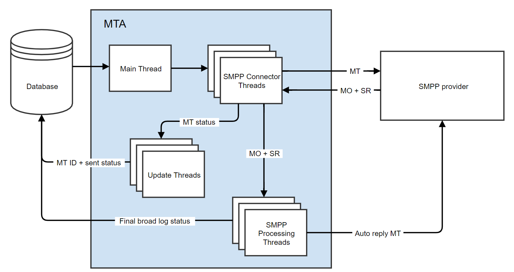

# Protocolo e configurações do conector SMS {#sms-connector-protocol}

>[!NOTE]
>
>O **protocolo e as configurações do conector SMS** para Adobe Campaign Classic podem ser encontrados nesta [página](https://experienceleague.adobe.com/docs/campaign-classic/using/sending-messages/sending-messages-on-mobiles/sms-protocol.htmln#sending-messages).
>
>Por meio desse documento, todas as referências a detalhes sobre o protocolo, nomes de campos e valores se referem à especificação [SMPP 3.4](https://smpp.org/SMPP_v3_4_Issue1_2.pdf).

## Visão geral {#overview}

O SMS pode limitar-se a enviar mensagens de texto curtas sem formatação, mas a sua simplicidade faz dele um canal de comunicação valioso.

Há duas formas principais de enviar um SMS:

* Mande-o manualmente de um telefone, a maneira habitual de se comunicar diretamente entre as pessoas.

* Envie-o da Internet, da forma como a Adobe Campaign envia mensagens. Para isso, você precisa de um provedor de serviço SMS que conecte a Internet à rede móvel.
A Adobe Campaign usa o protocolo SMPP para enviar SMS para um provedor de serviço.

Este documento o guiará pela configuração da conexão entre a Adobe Campaign e um provedor SMPP.

Os provedores SMPP podem às vezes se desviar da especificação oficial, mas o conector SMS na Adobe Campaign oferece muitas opções para adaptar seu comportamento para que seja compatível com a maioria dos provedores.

>[!IMPORTANT]
>
>A configuração de uma conexão com um novo provedor pode exigir algumas habilidades técnicas, conhecimentos de TCP, representação binária, hexadecimal e codificações de texto. Exigirá igualmente uma cooperação ativa com o prestador.

### Tipos de SMS {#sms-types}

Ao enviar SMS em massa por um provedor SMS, você encontrará três tipos diferentes de SMS:

* **SMS MT (Terminado por telefone celular)**: um SMS emitido pela Adobe Campaign para telefones celulares através do provedor SMPP.

* **SMS MO (Mobile Originated)**: um SMS enviado por um dispositivo móvel para a Adobe Campaign por meio do provedor SMPP.

* **SMS SR (Status Report) ou DR ou DLR (Delivery Receipt)**: um recibo de devolução enviado pelo celular à Adobe Campaign por meio do provedor SMPP, indicando que o SMS foi recebido com êxito. A Adobe Campaign também pode receber um SR indicando que a mensagem não pôde ser entregue, geralmente com uma descrição do erro.

Você precisa distinguir entre reconhecimentos (RESP PDU, parte do protocolo SMPP) e SR: SR é um tipo de SMS que é enviado através da rede de ponta a ponta, enquanto uma confirmação é apenas uma confirmação de que uma transferência foi bem sucedida.

Ambos os reconhecimentos e SR podem disparar erros, diferenciar os dois ajudará na solução de problemas.

### Informações transportadas por um SMS {#information-sms}

Um SMS traz mais informação do que texto. Aqui está uma lista do que você pode esperar encontrar em um SMS:

* O texto, que é limitado a 140 bytes, o que significa entre 70 e 160 caracteres, dependendo da codificação. Consulte [Codificação de texto SMS](../../administration/using/sms-protocol.md#sms-text-encoding) abaixo para obter detalhes e limitações.

* Um endereço de recipient, às vezes chamado `ADC` ou `MSISDN`. Esse é o número do celular que receberá o SMS.

* Um endereço de remetente, que pode ser chamado `oADC` ou às vezes `sender id`. Pode ser um número de telefone no dia a dia, um código curto quando enviado por um provedor ou um nome. O nome é um recurso opcional; nesse caso, você não pode responder ao SMS.

* Um sinalizador para indicar se a mensagem é uma mensagem flash. Uma mensagem flash é um pop-up que não está armazenado na memória.

* Um sinalizador para indicar se um SR é esperado ou não.

* Uma data de validade, após a qual nenhum equipamento de rede poderá tentar novamente.

* Um campo `data_coding`, que indica a codificação do texto.

## Protocolo SMPP {#smpp-protocol}

A Adobe Campaign Standard suporta o protocolo SMPP versão 3.4. Este é um protocolo generalizado que permite enviar SMS para um provedor (SMSC) e receber SMS, bem como recibos. Para obter mais informações, consulte a [documentação SMPP](https://smpp.org/SMPP_v3_4_Issue1_2.pdf).

O equipamento de rede do lado do provedor de serviço SMS é frequentemente chamado de SMSC.

### Conexões SMPP {#smpp-connections}

A Adobe Campaign se conecta ao equipamento de rede do provedor de serviço SMS via TCP. O protocolo SMPP define conexões TCP permanentes da Adobe Campaign para o provedor. As conexões TCP são sempre iniciadas pela Adobe Campaign, mesmo para receber mensagens.
O SMPP abre 1 ou 2 conexões TCP, dependendo de seu modo. Todas as conexões são sempre iniciadas pela Adobe Campaign.

O protocolo SMPP pode funcionar em dois modos:

* **Transmissor+receptor (ou TX+RX)**: duas conexões TCP separadas são usadas para transmitir e receber mensagens.
* **Transceptor (TRX de âncora)**: uma única conexão TCP é usada para transmitir e receber mensagens.

>[!NOTE]
>
>O TRX é preferido para o Adobe Campaign Standard, pois reduz o número de conexões e simplifica a recuperação da conexão em caso de falha.

### PDU SMPP {#smpp-pdu}

As unidades de transmissão SMPP (&quot;pacotes&quot;) são chamadas de PDUs. Um **PDU** contém um comando, um status, um número de sequência e dados.

Cada PDU deve ser reconhecida por um `SMPP RESP PDU` (resposta síncrona). Os pedidos podem ser encaminhados: o remetente pode enviar vários comandos sem aguardar `RESP`, o número de solicitações que podem ser encaminhadas a qualquer momento é chamado de janela. `RESP PDU` pode chegar em qualquer pedido, independentemente da ordem da PDU do iniciador correspondente.

No modo separado **Transmissor+receptor**, a conexão usada depende do tipo de mensagem transmitida. A conexão do transmissor é usada para MT e a conexão do receptor é usada para MO e SR. As solicitações e respostas para cada tipo de mensagem são enviadas pela mesma conexão TCP.

Por exemplo, ao enviar um MT, a conexão do transmissor é usada e o `RESP` que reconhece o MT também é enviado pelo canal do transmissor. Quando você recebe um MO (ou um SR), a conexão do receptor é usada para receber o MO e para enviar o `RESP` que reconhece o MO.


No Adobe Campaign Standard, a reconciliação MT e SR é nativa do MTA, portanto, não há processo de SMS dedicado.

Um `SUBMIT_SM_RESP PDU` bem-sucedido aciona o status de mensagem &quot;enviado&quot; no log de envio, enquanto um `DELIVER_SM (SR) PDU` bem-sucedido aciona o status de mensagem &quot;recebido&quot;.

### Aspectos de segurança {#security-aspects}

O protocolo em si não está criptografado. A maioria dos provedores implementa uma variante de IP na lista de permissões para que os endereços IP do servidor Adobe Campaign sejam declarados ao provedor.

A Adobe Campaign oferece suporte para a passagem de um logon e uma senha durante a fase de ligação. Também suporta SMPP sobre TLS. É de notar que os certificados são necessários para garantir uma segurança adequada. Embora o conector SMPP permita ignorar verificações de certificados, ele deve ser usado apenas para testes, já que TLS sem certificados fornece um nível de segurança significativamente menor.

O conector usa os certificados padrão fornecidos pela biblioteca `openssl` do sistema. Normalmente, é fornecido pelo diretório `/etc/ssl/certs` no Debian. Esse diretório é fornecido pelo pacote &quot;certificados ca&quot; por padrão, mas pode ser personalizado.

### Informações em cada tipo de PDU {#information-pdu}

Cada tipo de PDU tem campos distintos que levam informações diferentes. Essas PDUs estão detalhadas na especificação [SMPP 3.4](https://smpp.org/SMPP_v3_4_Issue1_2.pdf).

Cada seção abaixo descreve a PDU e sua resposta síncrona (`*_RESP PDU`). Todas as PDUs devem ser reconhecidas por um `RESP` correspondente, isso é uma parte obrigatória da especificação.

As PDUs podem ter campos opcionais. Somente os campos mais comuns são descritos aqui. Consulte a especificação [SMPP 3.4](https://smpp.org/SMPP_v3_4_Issue1_2.pdf) para obter mais informações.

#### BIND_TRANSMITTER / BIND_RECEIVER / BIND_TRANSCEIVER {#bind-transmitter}

Esta PDU é usada para iniciar uma conexão com o SMSC. **Os modos Transmissor**,  **** Receptor e  **** Transceptor só mudam o tipo de SMS que pode ser transferido através desta conexão, especificamente:

| Modo | Tipos de SMS permitidos |
|:-:|:-:|
| Transmissor | MT |
| Destinatário | MO + SR |
| Transceptor | MT + MO + SR |

Campos notáveis em `BIND_* PDU`:

* **system_id**: Logon usado para autenticação. Definido na conta externa.

* **senha**: Senha usada para autenticação. Definido na conta externa.

* **system_type**: Obrigatório para ser definido em um valor específico para alguns provedores. Definido na conta externa, disponível em todas as versões. Muitas vezes se distingue entre diferentes tipos de contratos, canais, países, etc.

* **addr_** tonand  **addr_npi**: Exigido por alguns provedores. Definido pelas configurações `Bind TON` e `Bind NPI` na conta externa.

* **address_range**: Exigido por alguns provedores. Na maioria das vezes, essa é uma lista de códigos de atalho permitidos nesta conexão. Definido na conta externa.

`BIND_*_RESP` não tem um campo específico, ele confirma se a conexão foi bem-sucedida ou não.

#### UNBIND {#unbind}

Esta PDU deve ser enviada pelo sistema antes de desconectar. Ele deve aguardar o `UNBIND_RESP PDU` correspondente antes de fechar a conexão.

A conformidade com o SMSC não deve fechar a conexão, a conexão TCP é controlada pelo conector Adobe Campaign.

#### SUBMIT_SM {#submit-sm}

Esta PDU envia um MT ao SMSC. A PDU de resposta fornece a ID do MT.

Campos notáveis em `SUBMIT_SM PDU`:

* **service_type**: exigido por alguns provedores. Definido nas propriedades do delivery.

* **source_addr_** tonand  **source_addr_npi**: indica que tipo de endereço de origem é transmitido. O significado desses campos é padronizado, mas como alguns provedores o usam de forma diferente, você deve solicitar ao provedor o valor correto. Definido na conta externa.

* **source_addr**: o endereço de origem / oADC do MT. Será exibido no telefone celular. Definido na conta externa e no delivery, o valor no delivery tem precedência sobre o valor da conta externa.

* **dest_addr_** tonand  **dest_addr_npi**: indica que tipo de endereço de destino é transmitido (por exemplo, formato local ou internacional). O significado desses campos é padronizado, mas como alguns provedores o usam de forma diferente, você deve solicitar ao provedor o valor correto. Definido na conta externa.

* **target_addr**: Endereço do recipient, número de telefone ou MSISDN.

* **esm_class**: usado para informar se UDH é usado ou não no campo de texto. Habilitado automaticamente pelo conector para SMS dividido se o modo `message_payload` não for usado.

* **priority_flag**: prioridade desta mensagem sobre outras. Isso está ligado à prioridade do próprio delivery.

* **valid_period**: carimbo de data e hora após o qual nenhuma nova tentativa deve ser feita. Definido no próprio delivery.

* **registration_delivery**: informa se um SR é solicitado ou não. A Adobe Campaign sempre define esse sinalizador, exceto para respostas automáticas. Para mensagens de várias partes, o sinalizador é definido somente para a primeira parte. Todas as versões têm o mesmo comportamento.

* **data_coding**: indica a codificação usada no campo de texto. Consulte a seção [codificação de texto SMS](../../administration/using/sms-protocol.md#sms-text-encoding) para obter mais informações.

* **short_message**: o texto da mensagem. Se UDH for usado, isso também conterá o cabeçalho UHD.

A Adobe Campaign suporta estes campos opcionais:

* **dest_addr_subunit**: usado para especificar o público alvo do SMS: flash, dispositivo móvel ou placa SIM. Definido nas propriedades do delivery.

* **message_payload**: quando ativado na conta externa, mensagens longas serão enviadas em uma única PDU e o texto será transmitido neste campo em vez do  `short_message` campo.

#### SUBMIT_SM_RESP {#submit-sm-resp}

Esta PDU conterá a ID do MT. Isso é útil para combinar com o SR recebido.

>[!IMPORTANT]
>
>Muitos provedores transmitem a ID MT em hexadecimal. Certifique-se de definir o formato **ID na configuração MT accept** corretamente na conta externa.

Alguns provedores enviam `SUBMIT_SM_RESP` depois de enviar o SR. Para levar em conta esse comportamento, a Adobe Campaign aguarda 30 segundos antes de responder **ID de mensagem inválida** a um SR com uma ID desconhecida.

#### DELIVER_SM {#delivery-sm}

Esta PDU é enviada pelo SMSC para a Adobe Campaign. Ele contém um MO ou um SR.

A maioria dos campos tem o mesmo significado que sua contrapartida `SUBMIT_SM`. Esta é a lista de campos úteis:

* **source_addr**: endereço de origem do MO/SR. Geralmente, este é um número de telefone.

* **target_addr**: código curto que recebeu o MO ou o SR.

* **esm_class**: usado para informar se a PDU é um MO ou um SR.

* **short_message**: texto da mensagem. Para SR, contém os dados descritos no apêndice B da especificação do protocolo SMPP. Consulte [Gerenciamento de erros do SR](../../administration/using/sms-protocol.md#sr-error-management) para obter mais detalhes.

A Adobe Campaign pode ler a ID da mensagem no campo opcional `receipted_message_id` com algum ajuste de configuração.

#### DELIVER_SM_RESP {#deliver-sm-resp}

Esta PDU é enviada pela Adobe Campaign para reconhecer o SR e o MO.

A Adobe Campaign Standard envia um `DELIVER_SM_RESP` somente depois que todas as etapas de processamento tiverem sido bem-sucedidas. Isso garante que nenhum SR ou MO seja reconhecido enquanto ainda houver risco de erros de processamento.

#### INQUIRE_LINK {#enquire-links}

Esta PDU só é usada para verificar se a conexão está ativa. A sua frequência deve ser estabelecida de acordo com as necessidades do prestador.

Os 60 segundos padrão devem corresponder à maioria das configurações definidas na conta externa.

#### INQUIRE_LINK_RESP {#enquire-links-resp}

Esta PDU reconhece que a conexão está ativa.

### SMS multiparte (SMS longo) {#multipart}

O SMS multiparte, ou SMS longo, são SMSs enviados em várias partes. Devido a limitações técnicas no protocolo de rede móvel, um SMS não pode ser maior que 140 bytes ou precisará ser dividido. Consulte a seção [codificação de texto SMS](../../administration/using/sms-protocol.md#sms-text-encoding) para saber mais sobre o número de caracteres que podem se ajustar a um SMS.

Cada parte de uma mensagem longa é um SMS individual. Essas partes viajam independentemente na rede e são montadas pelo telefone celular receptor. Para lidar com tentativas e problemas de conectividade, a Adobe Campaign envia essas peças em ordem inversa e solicita um SR somente na primeira parte da mensagem, a última enviada. Como o telefone celular só exibe uma mensagem quando a primeira parte é recebida, o tentativas em peças adicionais não produz duplicados no telefone celular.

O número máximo de SMS por mensagem pode ser definido por delivery usando a configuração **Número máximo de SMS por mensagem** na **Template do delivery**. Mensagens que ultrapassam esse limite falharão durante o envio com um motivo de falha muito longo do SMS.

Há duas maneiras de enviar SMS longos:

* **UDH**: a maneira padrão e recomendada de enviar mensagens longas. Nesse modo, o conector divide a mensagem em vários `SUBMIT_SM PDU`s com informações UDH neles. Este protocolo é o usado pelos próprios celulares. Isso significa que a Adobe Campaign tem mais controle sobre a geração de mensagens, tornando-a capaz de calcular exatamente quantas partes foram enviadas e como foram divididas.

* **message_payload**: o modo de enviar toda a longa mensagem em um único  `SUBMIT_SM PDU`. O provedor terá que dividi-lo, o que significa que é impossível para a Adobe Campaign saber exatamente quantas partes foram enviadas. Alguns provedores requerem este modo, mas recomendamos que você o use apenas se eles não suportarem UDH.

Consulte a descrição dos campos `esm_class`, `short_message` e `message_payload` do [SUBMIT_SM PDU](../../administration/using/sms-protocol.md#information-pdu) para obter mais detalhes sobre o protocolo e os formatos.

### Captura de throughput e janela {#throughput-capping}

A maioria dos provedores exige um limite de throughput para cada conexão SMPP. Isso pode ser feito através da definição de vários SMS na conta externa. Observe que a aceleração de throughput ocorre por conexão, a throughput efetiva total é o limite por conexão multiplicado pelo número total de conexões. Isso é detalhado na seção [Conexões simultâneas](../../administration/using/sms-protocol.md#connection-settings).

Para atingir o máximo de throughput possível, é necessário ajustar a janela de envio máxima. A janela de envio é o número de `SUBMIT_SM PDU`s que podem ser enviados sem esperar por um `SUBMIT_SM_RESP`. Consulte a seção [Configuração da janela de envio](../../administration/using/sms-protocol.md#throughput-timeouts) para obter mais detalhes.

### SR e gerenciamento de erros (&quot;Apêndice B&quot;) {#sr-error-management}

O protocolo SMPP define erros síncronos padrão em `RESP PDU`s, mas não define códigos de erro para SR. Cada provedor usa seus próprios códigos de erro com seu significado.

É feita uma recomendação na seção Apêndice B da [especificação do protocolo SMPP](https://smpp.org/SMPP_v3_4_Issue1_2.pdf) (página 167), mas isso não lista os códigos de erro reais nem o seu significado.

Para se adaptar ao gerenciamento de erros, o sistema de mensagens de banda larga da Adobe Campaign foi aproveitado para suprir erros e sua gravidade (hardware, software, etc.).

Como mencionado acima, existem dois tipos diferentes de erros:

* respostas síncronas em `SUBMIT_SM_RESP` que ocorrem imediatamente após a mensagem ser enviada ao SMSC
* recebimentos que podem vir muito mais tarde quando o celular recebeu a mensagem ou quando a mensagem atingiu o tempo limite. Nesse caso, o erro é encontrado em um SR.

Quando um SR é recebido, o status e o erro podem ser encontrados em seu campo `short_message` (exemplo para implementações em conformidade com o Apêndice B). O campo `short_message` da PDU é frequentemente chamado de **campo de texto**, uma vez que contém texto no MT. No caso de SR, contém informações técnicas mais um subcampo chamado **Texto**. Esses 2 campos são diferentes e `short_message` na verdade contêm o campo **Texto** e outras informações.

#### Formato de campo de texto SR {#sr-text-field-format}

A especificação recomenda o uso desse formato para o campo de texto SR. É uma lista de subcampos, separados por espaços com dois-pontos para separar o nome do campo e seu valor. Os nomes de campo não diferenciam maiúsculas de minúsculas.

Exemplo de um campo de texto SR que corresponde à recomendação do Apêndice B:

```
id:1234567890 sub:001 dlvrd:001 submit date:1608011415 done date:1608011417 stat:DELIVRD err:000 Text:Hello Adobe world
```

O campo id é a ID recebida em `SUBMIT_SM_RESP PDU`, a confirmação do MT.

`sub` e  `dlvrd` devem contar a quantidade de peças entregues e mensagens entregues, mas isso não é usado pela Adobe Campaign, já que o sistema de transmissão fornece informações melhores e mais integradas.

`submit date` e  `done date` os campos são carimbos de data e hora indicativos do envio do MT e do envio do SR pelo dispositivo móvel. Espere alguns problemas com fusos horários ou até mesmo carimbos de data e hora errados fornecidos por telefones com data definida incorretamente.

O campo state é importante, pois informa o status da mensagem. O único status importante é `DELIVRD`, `UNDELIV` e `REJECTD`. O status `DELIVRD` indica um sucesso, os outros dois indicam um erro. Outros valores são possíveis, mas normalmente são notificações intermediárias, por exemplo, o MT chegou à operadora de celular, mas não ao telefone celular. Essas notificações intermediárias são ignoradas pela Adobe Campaign.

O campo err contém o código de erro específico do provedor. O provedor deve fornecer um quadro de possíveis códigos de erro, juntamente com o seu significado, para poder interpretar esse valor.

Finalmente, o campo de texto geralmente contém o início do texto do MT. Isso é ignorado pela Adobe Campaign e alguns provedores não o transmitem para evitar o vazamento de PII e o consumo de largura de banda da rede. Ele pode ser usado durante a solução de problemas para detectar se o SR corresponde a um MT de teste mais facilmente lendo esse campo.

### Exemplo de processamento SR em SMPP genérico Adobe Campaign Standard Extended {#sr-processing}

Este exemplo exibe o caso de uma implementação seguindo a recomendação do Apêndice B, os valores padrão na conta externa e um SMS MT bem-sucedido.

```
id:1234567890 sub:001 dlvrd:001 submit date:1608011415 done date:1608011417 stat:DELIVRD err:000 Text:Hello Adobe world
```

Primeiro, o regex `id extraction` é aplicado para extrair a ID e reconciliá-la com o MT correspondente.

Em seguida, o regex `status extraction` e `error code extraction` são aplicados para extrair esses campos e são anexados à string.

A mensagem de difusão é construída com essas informações, e a sequência original inalterada é anexada para referência:

```
SR ExampleProvider DELIVRD 000|MESSAGE=id:1234567890 sub:001 dlvrd:001 submit date:1608011415 done date:1608011417 stat:DELIVRD err:000 Text:Hello Adobe world
```

A mensagem é então normalizada, removendo a parte MENSAGEM para poder corresponder várias mensagens com os mesmos códigos de estado e erro.

```
SR ExampleProvider DELIVRD 000|#MESSAGE#
```

Se a mensagem ainda não tiver sido provisionada na tabela de mensagens de transmissão, uma nova entrada será criada, usando a mensagem inteira como **firstText** e a mensagem normalizada. Em seguida, o conector usa o sucesso e `error` regex para determinar se foi um sucesso ou uma falha:

* Se ele corresponder ao regex `success`, será considerado um sucesso.

* Se ela corresponder ao regex `error`, a mensagem será qualificada como um erro.

* Se nenhum destes dois regex corresponder, o SR será ignorado. Pode ser uma notificação intermediária, que não é tratada pela Adobe Campaign.

Por padrão, todos os erros são provisionados como erros de software. Isso significa que os erros rígidos devem ser provisionados manualmente.

### Codificação de texto SMS {#sms-text-encoding}

Você deve **sempre entrar em contato com o provedor SMSC em caso de problemas de codificação**. Só os fornecedores do SMSC têm conhecimentos precisos da codificação que suportam e regras especiais que podem aplicar-se devido a limitações na sua plataforma técnica.

As mensagens SMS usam uma codificação especial de 7 bits, geralmente chamada de codificação GSM7.

No protocolo SMPP, o texto GSM7 será expandido para 8 bits por caractere para facilitar a solução de problemas. O SMSC compactará em 7 bits por caractere antes de ser enviado para o dispositivo móvel. Isso significa que o campo `short_message` do SMS pode ter até 160 bytes de comprimento no quadro SMPP, enquanto está limitado a 140 bytes quando enviado na rede móvel.

Em caso de problemas de codificação, veja algumas coisas importantes a serem verificadas:

* Certifique-se de saber quais caracteres pertencem a qual codificação. O GSM7 não suporta totalmente marcas diacríticas (sotaques). Especialmente em francês, onde é e è fazem parte do GSM7, mas ê, â ou ï não fazem parte. O mesmo se aplica ao espanhol.

* O C com cedilla (ç) está presente apenas em maiúsculas no alfabeto GSM7, mas alguns telefones o renderizam em minúsculas ou em minúsculas &quot;inteligentes&quot;. A recomendação geral é evitar completamente o problema e remover o código ou alternar para UCS-2.

* **Não utilize ASCII em** SMSs, a menos que seja explicitamente solicitado pelo fornecedor SMSC. Essa codificação desperdiça espaço porque tem caracteres de 8 bits e menos cobertura do que o GSM7. Esta codificação pode ser necessária para redes CDMA, usadas na América do Norte.

* O Latin-1 nem sempre é compatível. Verifique a compatibilidade com seu provedor SMSC antes de tentar usar o Latin-1.

* As tabelas nacionais de mudança de idioma não são suportadas pelo conector Adobe Campaign. Em vez disso, você deve usar UCS-2 ou outro `data_coding`.

* UCS-2 e UTF-16 são frequentemente misturados por telefones. Esse problema ocorre ao usar emojis e outros caracteres não presentes no UCS-2.

* A maioria dos telefones não tem glifos de fonte para todos os caracteres UCS-2. Os smartphones tendem a exibir caracteres raros com muita facilidade, mas os telefones celulares geralmente têm suporte limitado ao que é útil na língua nativa do país em que foram comprados. Se você quiser usar emoji ou ASCII-art, teste-o em uma grande variedade de telefones antes de enviar. A pré-visualização Adobe Campaign não simula glifos ausentes e exibirá símbolos disponíveis no navegador da Web.

O campo `data_coding` informa qual codificação é usada. Um grande problema é que o valor 0 significa a codificação SMSC padrão na especificação, que geralmente se refere ao GSM7. Verifique com o parceiro SMSC cuja codificação está associada a `data_coding` = 0, que a Adobe Campaign suporta apenas. Outros valores `data_coding` tendem a seguir a especificação, mas a única maneira de ter certeza é verificar com o provedor SMSC.

O tamanho máximo de uma mensagem depende de sua codificação. Este quadro resume todas as informações relevantes:

| Codificação | Data_coding comum | Tamanho da mensagem (caracteres) | Tamanho de peça para SMS multiparte | Caracteres disponíveis |
|:-:|:-:|:-:|:-:|:-:|
| GSM7 | 0 | 160 | 152 | Conjunto de caracteres básicos GSM7 + extensão (caracteres estendidos levam 2 caracteres) |
| Latim-1 | 3 | 140 | 134 | ISO-8859-1 |
| UCS-2 <br>UTF-16 | 8 | 70 | 67 | Unicode (varia de telefone para telefone) |

## Parâmetros de conta externa SMPP {#SMPP-parameters-external}

Cada implementação do protocolo SMPP tem muitas variações. Para melhorar a compatibilidade e a adaptabilidade, há várias configurações disponíveis para alterar o comportamento do conector SMPP. Esta seção descreve cada parâmetro e seus efeitos no conector.

### Parâmetros gerais e roteamento {#general-parameters-routing}

**Limitar instâncias MTA para esta conta**

É possível definir um limite para o número de instâncias MTA permitidas para se conectar ao provedor SMPP. Quando marcado, você pode especificar quantos MTAs podem ser usados no máximo.

Esta opção permite um controle mais fino sobre o número de conexões, consulte [Conexões simultâneas](../../administration/using/sms-protocol.md#connection-settings).

Se você definir um valor maior que o número de MTAs em execução, todos os MTAs serão executados normalmente: essa opção é apenas um limite e não pode gerar MTAs adicionais.

Se você precisar controlar com precisão o número de conexões, por exemplo, o requisito do provedor, é recomendável sempre definir essa opção mesmo se a implantação atual tiver o número correto de MTAs em execução. Se forem adicionados posteriormente MTAs adicionais, o limite de conexão continuará a ser respeitado.

### Configurações de conexão {#connection-settings}

#### Modo de conexão SMPP {#smpp-connection-mode}

Define a conexão no modo **transceptor** ou no modo separado **transmissor+receptor**. Quando você alternar para o modo separado **transmissor+receptor**, as configurações na seção **modo de conexão SMPP** se aplicam ao transmissor e às configurações na seção **Configurações de conexão do receptor** se aplicam à conexão do receptor, somente se você tiver marcado a caixa de seleção **Usar parâmetros diferentes para o receptor**.

#### Nome da implementação SMSC {#smsc-implementation-name}

Define o nome da implementação SMSC. Ele deve ser definido com o nome do seu provedor. Entre em contato com o administrador ou a equipe de entrega para saber o que adicionar neste campo. A função deste campo está descrita na seção [SR error management](../../administration/using/sms-protocol.md#sr-error-management).

#### Server {#server}

O nome DNS ou o endereço IP do servidor ao qual se conectar.

#### Port {#port}

A porta TCP à qual se conectar.

#### Account {#account}

O login da conexão. Transmitido no campo `system_id` da PDU BIND.

#### Password {#password}

Senha da conexão SMPP. Transmitido no campo de senha da PDU BIND.

#### Tipo de sistema {#system-type}

Valor passado no campo `system_id` da PDU BIND. Alguns provedores precisam de um valor específico aqui.

#### Conexões simultâneas {#simultaneous-connections}

No Adobe Campaign Standard, define o número de conexões por thread SMS e por processo MTA.
O número de processos MTA é determinado pela implantação: normalmente há 2 MTAs e 1 thread. O número de threads pode ser alterado no arquivo config-instance.xml usando a configuração smppConnectorThreads. Geralmente há 1 processo MTA por container e 1 thread por processo MTA.

Fórmula de conexões totais para Adobe Campaign Standard:

* **Total de conexões = Conexões simultâneas * número de threads * número de MTAs**

As conexões simultâneas são definidas na conta externa, o número de threads é definido no arquivo config-instance.xml (smppConnectorThreads) e o número de MTAs pode ser limitado na conta externa.

No modo separado **transmissor/receptor**, o número de conexões acima representa o número de pares **transmissor/receptor**, o que significa que haverá o dobro do número de conexões no total.

#### Habilitar TLS em SMPP {#enable-TLS}

Use o TLS para se conectar ao provedor. A conexão será criptografada. A conexão TLS é gerenciada pela biblioteca OpenSSL. Qualquer coisa aplicável ao OpenSSL será verdadeira para essa conexão.

#### Habilitar rastreamentos SMPP detalhados no arquivo de log {#enable-verbose-log-file}

Essa configuração descarta todo o tráfego SMPP em arquivos de registro. Geralmente é necessário ajustar parâmetros durante a configuração inicial. Isso deve ser ativado ao solucionar problemas do conector e comparado ao tráfego visto pelo provedor.

### Configuração de conexão do receptor {#receiver-connection}

Esta seção só é visível no modo separado **transmissor+receptor**.

#### Usar parâmetros diferentes para o receptor {#receiver-parameters}

Quando a caixa está desmarcada, as mesmas configurações são usadas para transmissor e receptor.

Quando a caixa for marcada, as configurações na seção **Configurações de conexão** serão aplicadas ao transmissor e as configurações nas configurações **Conexão do receptor** serão aplicadas ao receptor.

**Servidor do receptor, porta, conta, senha, tipo de sistema**

Essas configurações se aplicam ao receptor quando no modo **transmissor+receptor**. Eles funcionam como a parte transmissora, veja acima para obter mais detalhes.

### Configurações de canal SMPP {#smpp-channel-settings}

#### Permitir transliteração de caracteres {#allow-character-transliteration}

A transliteração é o processo de encontrar caracteres equivalentes aos que faltam. Por exemplo, o caractere francês &quot;ê&quot; (e com acento circunflexo) está ausente da codificação GSM, mas pode ser substituído por &quot;e&quot; sem prejudicar a leitura.

Quando essa caixa estiver desmarcada, a codificação de texto falhará se não conseguir codificar a string exatamente como está.

Quando essa caixa estiver marcada, a codificação de texto tentará converter a string em uma versão aproximada em vez de falhar. Se alguns caracteres não tiverem equivalente na codificação do público alvo, a codificação do texto falhará.

Consulte [Defina um mapeamento específico das codificações definindo](../../administration/using/sms-protocol.md#SMSC-specifics) para obter uma explicação mais geral do processo de codificação.

#### Armazenar o MO recebido no banco de dados {#incoming-mo-storing}

Quando ativado, o MO recebido será armazenado na tabela inSMS do banco de dados. Esta tabela pode ser consultada usando a atividade de query de qualquer fluxo de trabalho.

#### Ativar atualizações de KPI em tempo real durante o processamento de SR {#real-time-kpi}

Quando ativados, os KPIs serão atualizados em tempo real na página principal do delivery ao receber o SR do erro.

A desvantagem pode ser de baixo desempenho devido à contenção do banco de dados gerado. Se desativadas, as estatísticas são atualizadas pelo fluxo de trabalho **syncformexec**, em execução a cada 20 minutos.

#### Número de origem {#source-number}

Define o endereço de origem padrão das mensagens. Essa configuração só se aplica se o número de origem for deixado vazio no delivery.

Por padrão, o campo de número de origem não é transmitido, portanto, o provedor o substituirá pelo código curto.

Isso habilita o recurso de substituição de endereço/ADC do remetente.

#### Código curto {#short-code}

Indica o código abreviado principal da conta. Se vários códigos abreviados forem usados para esta conta ou se o código abreviado for desconhecido, deixe este campo vazio.

A especificação de código curto é útil para dois recursos:

* A pré-visualização exibirá o código curto se nenhum número de origem for fornecido. Isso refletirá o verdadeiro comportamento do celular.

* A configuração de lista de bloqueios do recurso de resposta automática envia somente para a quarentena do usuário por um código curto específico.

#### Origem TON/NPI, destino TON/NPI {#ton-npi}

TON (Tipo de Número) e NPI (Indicador do Plano de Numeração) são descritos na seção 5.2.5 da especificação [SMPP 3.4](https://smpp.org/SMPP_v3_4_Issue1_2.pdf) (página 117). Esses valores devem ser definidos de acordo com as necessidades do provedor.

Eles são transmitidos como estão nos campos `source_addr_ton`, `source_addr_npi`, `dest_addr_ton` e `dest_addr_npi` de `SUBMIT_SM PDU`.

#### Tipo de serviço {#service-type}

Esse campo é transmitido como está no campo `service_type` de `SUBMIT_SM PDU`. Defina isso de acordo com as necessidades do provedor.

### Throughput e tempos limite {#throughput-timeouts}

Essas configurações controlam todos os aspectos de tempo do canal SMPP. Alguns provedores exigem controle muito preciso da taxa de mensagens, da janela e das temporizações de novas tentativas. Essas configurações devem ser definidas com valores que correspondam à capacidade do provedor e às condições indicadas em seu contrato.

#### Enviando janela {#sending-window}

A janela é o número de `SUBMIT_SM PDU`s que podem ser enviados sem esperar por um `SUBMIT_SM_RESP` correspondente.

Exemplo de uma transmissão com uma janela máxima de 4:


A janela ajuda a aumentar a throughput quando o link da rede tem uma latência alta.  O valor da janela deve ser pelo menos o número de SMS/s multiplicado pela latência do link em segundos para que o conector nunca aguarde `SUBMIT_SM_RESP` antes de enviar a próxima mensagem.
Se a janela for muito grande, você pode enviar mais mensagens de duplicado em caso de problemas de conexão. Além disso, a maioria dos provedores tem um limite muito restrito para a janela e recusa mensagens que ultrapassam o limite.

Como calcular a fórmula ideal da janela de envio:

* Meça a latência máxima entre `SUBMIT_SM` e `SUBMIT_SM_RESP`.

* Multiplica esse valor em segundos para a throughput máxima do MT. Isso fornecerá o melhor valor da janela de envio.

Exemplo: Se você tiver 300 SMS/s definidos na throughput máxima MT e houver uma latência de 100 ms entre `SUBMIT_SM` e `SUBMIT_SM_RESP` em média, o valor ideal será `300×0.1 = 30`.

#### Taxa máxima de transferência MT {#max-mt-throughput}

Número máximo de MT por segundo e por conexão. Essa configuração é estritamente imposta, o MTA nunca encaminhará mensagens mais rapidamente do que esse limite. É útil para provedores que exigem controle preciso.

Para saber o limite de throughput total, multiplique esse número pelo número total de conexões, conforme detalhado na fórmula acima.

0 significa sem limite, o MTA enviará o MT o mais rápido possível.

É recomendável manter essa configuração abaixo de 1000, pois é impossível garantir uma saída precisa acima desse número, a menos que seja feito o benchmark adequado na arquitetura final e solicitado especificamente o provedor SMPP. Talvez seja melhor aumentar o número de conexões para ir acima de 1000 MT/s.

#### Tempo antes da reconexão {#time-reconnection}

Quando a conexão TCP for perdida, o conector aguardará esse número de segundos antes de tentar fazer uma conexão.

#### Período de validade do MT {#expiration-period}

Tempo limite entre `SUBMIT_SM` e `SUBMIT_SM_RESP` correspondente. Se `RESP` não for recebido a tempo, a mensagem será considerada uma falha e a política de tentativas global do MTA será aplicada.

#### Tempo limite da associação {#bind-timeout}

Tempo limite entre a tentativa de conexão TCP e a resposta `BIND_*_RESP`. Quando expirar, a conexão será fechada pelo conector Adobe Campaign e aguardará o Tempo antes de reconectar antes de tentar novamente.

#### período inquire_link {#enquire-link-period}

`enquire_link` é um tipo especial de PDU enviada para manter a conexão ativa. Esse período é em segundos. O conector de campanha envia `enquire_link` somente quando a conexão está ociosa para conservar a largura de banda. Se não for recebido nenhum RESP após o dobro desse período, a conexão será considerada inoperante e um processo de reconexão será acionado.

### Especificações do SMSC {#SMSC-specifics}

Essas configurações são configurações avançadas que adaptam o conector Adobe Campaign à maioria das peculiaridades de implementação do SMPP.

#### Definir um mapeamento específico de codificações {#encoding-specific-mapping}

Consulte a seção [codificação de texto SMS](../../administration/using/sms-protocol.md#sms-text-encoding) para obter detalhes sobre codificação de texto.

Essa configuração permite definir um mapeamento de codificação personalizado, diferente da especificação. Você poderá declarar uma lista de codificações, juntamente com seu valor `data_coding`.

O MTA tentará codificar usando a primeira codificação na lista. Se falhar, tentará usar a próxima codificação na lista etc. Se nenhuma codificação puder ser usada para codificar a mensagem, ocorrerá um erro. Quando a codificação for encontrada, o MTA criará `SUBMIT_SM PDU` com o texto codificado e o conjunto de campos `data_coding` com o valor especificado na tabela.

A ordem dos itens na tabela é importante: as codificações são tentativas de cima para baixo. Você deve colocar a codificação mais barata ou mais recomendada no topo da lista, seguida de codificações cada vez mais caras.

Observe que o UCS-2 nunca falhará, pois pode codificar todos os caracteres suportados no Adobe Campaign e que o comprimento máximo de um SMS UCS-2 é muito menor: Somente 70 caracteres.

Você também pode usar essa configuração para forçar uma codificação específica a ser sempre usada declarando apenas uma linha na tabela de mapeamento.

O mapeamento padrão usado quando a caixa de seleção não está marcada é equivalente à seguinte tabela:

| data_coding | Codificação |
|---|---|
| 0 | GSM |
| 9 | UCS-2 |

Isso significa que o MTA tentará codificar a mensagem no GSM. Se ele for bem-sucedido, ele o enviará com `data_coding` definido como 0.

Se a mensagem não puder ser codificada no GSM, ela será codificada em UCS-2 e definirá `data_coding` como 8.

#### Habilitar message_payload {#enable-message-payload}

Quando desmarcada, o SMS longo será dividido pelo MTA e enviado em vários `SUBMIT_SM PDU`s com UDH. A mensagem será recomposta pelo telefone celular, seguindo os dados UDH.

Quando marcado, SMS longo será enviado em uma PDU SUBMIT_SM, colocando o texto no campo opcional message_payload. Consulte a [especificação SMPP](../../administration/using/sms-protocol.md#ACS-SMPP-connector) para obter detalhes sobre isso.

Se este recurso estiver ativado, a Adobe Campaign não poderá contar as partes do SMS individualmente: todas as mensagens serão contadas como enviadas em uma parte.

#### Enviar o número de telefone completo {#send-full-phone-number}

Quando essa caixa de seleção não está marcada, somente os dígitos do número de telefone são enviados para o provedor (`destination_addr` campo do campo `SUBMIT_SM`). Esse é o comportamento padrão, pois o indicador de número internacional, geralmente um prefixo +, é substituído pelos campos TON e NPI no SMPP.

Quando a caixa de seleção é marcada, o número de telefone é enviado como está, sem pré-processamento e espaços em potencial, + sinal de prefixo ou de libra/hash/estrela.

Esse recurso também afeta o comportamento do recurso de resposta automática lista de bloqueios: quando a caixa de seleção não estiver marcada, um prefixo + será adicionado aos números de telefone inseridos na tabela quarentena para compensar a remoção do prefixo + do número de telefone pelo próprio protocolo SMPP.

#### Ignorar verificação de certificado TLS {#skip-tls}

Quando TLS estiver ativado, ignore todas as verificações de certificado.

Quando marcada, a conexão não é mais segura, ela não deve ser ativada na produção.

Pode ser útil para depurar ou testar.

#### Vincular TON/NPI {#bind-ton-npi}

TON (Tipo de Número) e NPI (Indicador do Plano de Numeração) descritos no ponto 5.2.5 da especificação [SMPP 3.4](https://smpp.org/SMPP_v3_4_Issue1_2.pdf) (página 117). Esses valores devem ser definidos para o que o provedor precisar.

Eles são transmitidos como estão nos campos `addr_ton` e `addr_npi` da PDU BIND.

#### Intervalo de endereços {#address-range}

Enviado como está no campo address_range da PDU BIND. Esse valor deve ser definido para o que o provedor precisar.

#### Contagem de confirmação de ID inválida {#invalid-id}

Limita o número de **ID da Mensagem inválida** `DELIVER_SM_RESP` que pode ser enviado para um único SR.

**Isso deve ser usado apenas para fins de solução de problemas como uma solução** temporária e definido como 0 em condições normais.

Exemplo de raiz, ao definir para 2:

* O provedor envia um SR (`DELIVER_SM`) com a ID &quot;1234&quot;.

* A ID &quot;1234&quot; não foi encontrada no banco de dados.

* O conector conta 1 **Erro de ID inválido** para essa ID, por isso envia `DELIVER_SM_RESP` com o código de erro &quot;ID de mensagem inválida&quot; (comportamento normal).

* O provedor tentativas o mesmo SR com a ID &quot;1234&quot;.

* A ID &quot;1234&quot; ainda não foi encontrada no banco de dados.

* O conector conta o erro 2 **ID inválido** para essa ID, portanto, envia `DELIVER_SM_RESP` &quot;OK&quot;, mesmo que não tenha sido processado corretamente.

* Este recurso destina-se a liberar buffers SR no lado do provedor quando o SR inválido bloquear legitimamente que as mensagens não podem ser processadas.

Definir este campo como 0 desativa o mecanismo no qual **ID da Mensagem inválida** é sempre retornado, este é um comportamento normal.

Definir esse campo como 1 faz com que o conector sempre responda &quot;OK&quot;, mesmo que a ID seja inválida. Isso deve ser definido como 1 somente sob supervisão, para solução de problemas e pelo período mínimo, por exemplo, para recuperar de um problema do lado do provedor.

#### Registro de extração da ID no SR {#regex-extraction}

O formato SR não é estritamente aplicado pela especificação do protocolo SMPP. É apenas uma recomendação descrita em [Apêndice B](../../administration/using/sms-protocol.md#sr-error-management) (página 167) da especificação. Alguns implementadores SMPP formatam esse campo de forma diferente, de modo que a Adobe Campaign precisa de uma maneira de extrair o campo correto.

Por padrão, captura até 10 caracteres alfanuméricos depois de `id:`.

O regex deve ter exatamente um grupo de captura com uma parte contida entre parênteses. Os parênteses devem rodear a parte da ID. O formato regex é PCRE.

Ao ajustar essa configuração, certifique-se de incluir o máximo de contexto possível para evitar disparadores falsos. Se houver prefixos específicos, como `id:` no padrão, inclua-os no regex. Use também delimitadores de palavras (\b) o máximo possível para evitar capturar texto no meio de uma palavra.

Não incluir contexto suficiente no regex pode apresentar uma pequena falha de segurança: o conteúdo real da mensagem pode ser incluído no SR. Se você apenas corresponder a um formato de ID específico sem contexto, por exemplo, um UUID, ele pode estar analisando o conteúdo de texto real, por exemplo, um UUID incorporado no campo de texto, em vez da ID.

#### Regex aplicado para determinar o status de sucesso/erro {#regex-applied}

Quando mensagens com uma combinação desconhecida de campo state/err são encontradas, esses regex são aplicados no campo stat para determinar se o SR foi um sucesso ou um erro. O SR com valores de estatística que não correspondem a nenhum desses regimes é ignorado.

Por padrão, valores de estado que começam com `DELIV`, por exemplo, `DELIVRD` no [Apêndice B](../../administration/using/sms-protocol.md#sr-error-management), será considerado como entregue com êxito e todos os valores de estado que correspondem a erros, por exemplo, `REJECTED`, `UNDELIV`, são considerados erros.

#### Formato de ID na confirmação MT {#id-format-mt}

Isso indica o formato da ID retornada no campo `message_id` de `SUBMIT_SM_RESP PDU`.

* **Não modificar**: A ID é armazenada como está no banco de dados, como texto codificado em ASCII. Não ocorre pré-processamento nem filtragem.

* **Número** decimal: Espera-se que a ID seja um número decimal no formulário ASCII. Espaços à esquerda e à direita e zeros à esquerda são removidos quando essa configuração é usada.

* **Número** hexadecimal: Espera-se que a ID seja um número hexadecimal no formulário ASCII, sem 0x à esquerda nem h à direita. A ID é convertida em um número decimal antes de ser armazenada no banco de dados.

* **Sequência** hexadecimal: Espera-se que a ID seja um texto codificado em ASCII que seja uma sequência de bytes codificada como hexadecimal. Por exemplo, na PDU você encontrará `0x34 0x31 0x34 0x32 0x34 0x33`, o que significa ASCII &quot;414243&quot;. Essa string é então decodificada como uma string hexadecimal de bytes e você obtém &quot;ABC&quot; como resultado: você armazenará a ID &quot;ABC&quot; no banco de dados.

#### Formato de ID no SR {#id-format-sr}

Isso indica o formato da ID capturada pelo regex `Extraction` da ID no SR. Os valores têm o mesmo significado e o mesmo comportamento que o formato no MT acima.

**ID SR ou código de erro no campo opcional**

Se marcada, o conteúdo dos campos opcionais será anexado ao texto processado pelos registros acima. O texto terá o formato `0xTAG:VALUE`, `0xTAG` sendo o valor hexadecimal de 4 dígitos da tag em maiúsculas, por exemplo `0x002E`.

Por exemplo, você pode querer capturar a ID no campo `receipted_message_id`. Para isso, ative essa caixa de seleção e o seguinte texto será adicionado ao status:

```
0x001E:05e3299e-8d37-49d0-97c6-8e4fe60c7739
```

Neste exemplo, 0x001E é a tag do campo opcional e o UUID é o valor do campo.

Para capturar esse valor, agora é possível definir o seguinte regex no registro de Extração da ID no campo SR:

```
\b0x001E:([0-9a-f]{8}-[0-9a-f]{4}-[0-9a-f]{4}-[0-9a-f]{4}-[0-9a-f]{12})\b
```

>[!IMPORTANT]
>
>Você só pode capturar campos opcionais que tenham valores de texto (ASCII/UTF-8). Especificamente, os campos binários não podem ser capturados de forma confiável com o sistema regex atual.

**ID SR ou código de erro no campo de texto**

Se marcada, o campo **Texto** será mantido durante o processamento do texto de status do SR.

Isso é útil se o provedor colocar dados importantes nesse campo, como a ID ou o status. Normalmente, esse campo pode ser descartado com segurança, pois pode conter texto com uma codificação não ASCII e interromper o processamento regex.

Habilitar essa opção pode apresentar uma falha de segurança muito pequena se o regex `Extraction` da ID no campo SR não for suficientemente específico. O conteúdo do campo **Texto** pode ser analisado como uma ID e um invasor pode usá-lo para injetar IDs forjadas, o que pode levar a uma situação de negação parcial do serviço.

**Etiqueta de ID de serviço**

Permite adicionar um TLV personalizado. Esse campo define a parte da tag. O valor pode ser personalizado por delivery no valor **ID de serviço ou programa** nos parâmetros avançados do delivery.

Essa configuração permite adicionar apenas uma opção TLV por mensagem.

### Resposta automática enviada ao MO {#automatic-reply}

Esse recurso permite responder rapidamente o texto ao MO e manipular o envio por código curto para a lista de bloqueios.

As colunas **Palavra-chave** e **Código curto** definem condições para acionar a resposta automática. Se ambos os campos corresponderem, o MO será enviado e a ação adicional será acionada. Para especificar um curinga, deixe o campo vazio. A palavra-chave corresponde à primeira palavra alfanumérica no texto MO, ignorando a pontuação e os espaços à esquerda. Isso significa que o campo **Palavra-chave** não pode conter espaços e deve ser uma única palavra.

A configuração **Palavra-chave** é um prefixo. Por exemplo, se você especificar &quot;AD&quot;, ele corresponderá a &quot;AD&quot;, &quot;ADAPT&quot; e &quot;ADOBE&quot;. Se você tiver várias palavras-chave com um prefixo comum, é necessário prestar atenção à ordem, já que as palavras-chave são processadas de cima para baixo.

A coluna **Responder** é o texto a ser respondido. Nenhuma personalização está disponível neste campo. Se você deixar esse campo vazio, nenhuma mensagem será respondida, mas a ação adicional será acionada de qualquer forma.

A coluna **Ação adicional** fornece uma ação extra quando **Palavra-chave** e **Código curto** correspondem, o código curto vazio corresponde a todos os códigos curtos. Você pode enviar para a quarentena ou remover da quarentena, valorizar nenhuma resposta ao texto. Se você especificar uma ação **Adicional**, mas deixar o campo **Responder** vazio, a ação será executada, mas nenhuma resposta será enviada. A quarentena é aplicada somente para o código curto especificado, ou para todos os códigos curtos se o campo ficar vazio.

>[!IMPORTANT]
>
>A configuração de envio de número de telefone completo afeta o comportamento do mecanismo de quarentena de resposta automática: se o número de telefone total não estiver marcado, o número de telefone colocado na quarentena receberá um sinal de mais (&quot;+&quot;) para torná-lo compatível com o formato de número de telefone internacional.

Todas as entradas na tabela são processadas na ordem especificada, até que uma regra corresponda. Se várias regras corresponderem a um MO, somente a regra mais alta será aplicada.

## Parâmetros de template do delivery SMS {#sms-delivery-template-parameters}

Alguns parâmetros podem ser definidos por template do delivery.

### Do campo {#from-field}

Este campo é opcional. Permite substituir o endereço do remetente (oADC). O conteúdo desse campo é colocado no campo `source_addr` de `SUBMIT_SM PDU`.

O campo é limitado a 21 caracteres pela especificação SMPP, mas alguns provedores podem permitir valores mais longos. Observe também que restrições muito rigorosas podem ser aplicadas em alguns países, por exemplo, comprimento, conteúdo, caracteres permitidos.

### Parâmetros do delivery {#delivery-parameters}

#### Número máximo de SMS por mensagem {#maximum-sms}

Essa configuração só funcionará se a configuração **Message payload** estiver desativada. Para obter mais informações sobre essas operações, consulte esta [página](../../administration/using/configuring-sms-channel.md). Se a mensagem exigir mais SMS do que esse valor, um erro será acionado.

O protocolo SMS limita o SMS a 255 partes, mas alguns telefones celulares têm dificuldade em reunir mensagens longas com mais de 10 partes, o limite depende do modelo exato. Recomendamos que você não passe mais de 5 partes por mensagem.

Devido ao modo como as mensagens personalizadas funcionam no Adobe Campaign, o tamanho das mensagens pode variar. Ter uma grande quantidade de mensagens longas poderia aumentar os custos de envio.

#### Modo de transmissão {#transmission-mode}

Este campo indica o tipo de SMS que você deseja transferir: mensagens normais ou em flash, armazenando no celular ou na placa SIM.

Essa configuração é transmitida no campo opcional `dest_addr_subunit` em `SUBMIT_SM PDU`.

* **Não** especificado não envia nenhum campo opcional na PDU.

* **** Flashdefine o valor como 1. Ele envia uma mensagem flash que aparece no dispositivo móvel e não é armazenado na memória.

* **O valor** normal define o valor como 0. Envia uma mensagem normal.

* **Salvar em** mobilesdefine o valor como 2. Ele diz ao telefone para armazenar o SMS na memória interna.

* **Salvar em** terminaldefine o valor como 3. Ele diz ao telefone para armazenar o SMS no cartão SIM.

#### Período de validade {#validity-period}

O período de validade é transmitido no campo `validity_period` de `SUBMIT_SM PDU`. A data é sempre formatada como um formato de hora UTC absoluto, o campo de data terminará com &quot;00+&quot;.

## Conector SMPP {#ACS-SMPP-connector}



As setas representam o fluxo de dados.

O mais importante a ser observado aqui é que há vários threads de conector SMPP. Esses threads são todos idênticos e compartilham a mesma configuração. É por isso que o número de conexões é sempre multiplicado pelo número de threads.

O número de threads não pode ser alterado pelo cliente, pois requer a alteração dos arquivos de configuração.

### Descrição do comportamento do conector SMPP {#behavior-smpp-connector}

#### Correspondência de MT, SR e entradas de catálogo {#matching-mt-sr}

No Adobe Campaign, uma mensagem é uma entrada de catálogo. No Adobe Campaign Standard, os conectores externos precisam apenas saber sobre a tabela de banda larga em funcionamento: `nmsBroadLogExec`. Um fluxo de trabalho é responsável pela cópia de entradas de log de volta para seus targeting dimension específicos (nmsBroadLogXXX).

Infelizmente, o SMPP não permite enviar uma ID junto com uma mensagem: o provedor fornece uma ID MT a cada MT e, em seguida, fornece um ou mais SR com a mesma ID.

A ID fornecida pelo provedor é armazenada na coluna `sProviderId` da tabela `nmsBroadLogExec`. O SR sempre chega depois que o MT é enviado e confirmado com sucesso, mas às vezes pode chegar fora de ordem, conhecido na Adobe Campaign como SR excepcional. O thread de processamento armazena esse SR temporariamente na RAM até que as informações completas cheguem.

Quando um MT é confirmado (`SUBMIT_SM_RESP`), `sProviderId` é atualizado imediatamente no banco de dados.

Cada SR é processado individualmente por threads de processamento SMPP. Este processo é pseudo-sincrônico: ela é vista como síncrona de fora, mas implementada internamente com implementações orientadas por eventos. Os SR são reconhecidos somente quando o Broadlog é atualizado com êxito, se um erro for encontrado, o SR será rejeitado.

Este é o processo aplicado a cada SR:

* A ID do SR é extraída usando um regex.
* A ID é pesquisada em `nmsBroadLogExec:sProviderId`.
* O código de erro status + é extraído do SR usando os regex.
* O mecanismo de mensagem de transmissão é usado para qualificar o erro e localizar a ID da mensagem de transmissão.
* O catálogo é atualizado com todas as informações acima.
* O SR é reconhecido.

A verificação das etapas acima requer **Habilitar rastreamentos SMPP detalhados** para verificar manualmente se todas as etapas foram aplicadas corretamente. Isso é necessário sempre que a Adobe Campaign estiver conectada a um novo provedor SMPP.

## Antes de entrar em funcionamento {#checklist}

Esta lista de verificação fornece uma lista de itens que você deve verificar antes de entrar em funcionamento. Uma configuração incompleta pode levar a muitos problemas.

### Verifique se há conflitos de conta externa {#external-account-conflict}

Verifique se você não tem contas externas SMS antigas. Se você deixar a conta de teste desativada, correrá o risco de ela ser reativada no sistema de produção e gerará possíveis conflitos.

Se você tiver várias contas na mesma instância do Adobe Campaign que se conectam ao mesmo provedor, entre em contato com o provedor para certificar-se de que realmente distingam as conexões entre essas contas. Ter várias contas com o mesmo login requer configuração extra.

### Habilitar rastreamentos SMPP detalhados durante verificações {#enable-verbose}

Você deve sempre ativar rastreamentos SMPP detalhados durante as verificações.
Mesmo se você não conseguir verificar os registros sozinho, será mais fácil para o Suporte ajudá-lo.

### Testar seu SMS {#test}

* **Enviar SMS com todos os tipos de**
caracteresSe precisar enviar SMS com caracteres não-GSM ou não-ASCII, tente enviar algumas mensagens com o maior número possível de caracteres diferentes. Se você configurar uma tabela de mapeamento de caracteres personalizada, envie pelo menos um SMS para todos os possíveis 
`data_coding` values.

* **Verifique se o SR está corretamente**
processadoO SMS deve ser marcado como recebido no log de delivery. O registro de delivery deve ser bem-sucedido e ter a seguinte aparência:

Verifique se você alterou o nome do provedor de delivery. O registro de delivery nunca deve conter    `SR yourProvider stat=DELIVRD err=000|#MESSAGE`
Verifique se você alterou o nome do provedor de delivery. O registro de delivery nunca deve conter **SR Generic** em ambientes de produção.

* **Verifique se o MO é**
processadoSe precisar processar o MO (respostas automáticas, armazenamento de MO no banco de dados etc.) tente fazer alguns testes. Envie alguns SMS para todas as palavras-chave de resposta automática e verifique se a resposta é rápida o suficiente, não mais do que alguns segundos.
Verifique o log que a Adobe Campaign responde com êxito 
`DELIVER_SM_RESP` (command_status=0).

### Verificar PDUs {#check-pdus}

Mesmo que as mensagens pareçam bem-sucedidas, é importante verificar se as PDUs estão formatadas corretamente.

Esta etapa é necessária ao conectar-se a um provedor que antes não estava conectado à Adobe Campaign.

#### BIND {#bind}

Verifique se `BIND_* PDUs` foram enviados corretamente. A coisa mais importante a ser verificada é que o provedor sempre retorna com êxito `BIND_*_RESP PDUs` (command_status = 0).

Verifique se não há muitos `BIND_* PDU`s. Se houver muitos deles, isso pode indicar que a conexão é instável. Consulte a seção [Problemas com conexões instáveis](../../administration/using/sms-protocol.md#issues-unstable-connection) para obter mais informações.

#### INQUIRE_LINK {#enquire-link-pdus}

Verifique se `ENQUIRE_LINK PDU`s é trocado regularmente quando a conexão está ociosa.

#### SUBMIT_SM / DELIVER_SM {#submit-sm-deliver-sm}

Envie uma mensagem e, em seguida, pesquise nos registros os respectivos `SUBMIT_SM`, `SUBMIT_SM_RESP`, `DELIVER_SM` e `DELIVER_SM_RESP PDU`s.

Com `SUBMIT_SM PDU`:

* Verifique se `data_coding` está correto, 0 por padrão.
* Verifique se `short_message` está corretamente codificado. Experimente decodificá-la usando um conversor hexadecimal que suporte várias codificações.

Com `SUBMIT_SM_RESP PDU`:

* Verifique se foi bem-sucedido, command_status = 0.
* Verifique se o corpo contém uma ID formatada corretamente seguida de um byte &#39;0&#39;.

Com `DELIVER_SM PDU`:

* Decode o campo hexadecimal `short_message`.
* Verifique com uma ferramenta de verificação regex se o regex definido no regex `Extraction` da ID no SR retorna exatamente um grupo de captura e se ele captura a ID inteira na mensagem.
* Verifique se a ID extraída corresponde à ID em `SUBMIT_SM_RESP`.
* Verifique se o regex definido no regex `Extraction` do status no SR retorna o conteúdo do campo stat.
* Verifique se o regex definido no regex `Extraction` do erro no SR retorna o conteúdo do campo err.

Com `DELIVER_SM_RESP PDU`:

* Verifique se ele foi enviado rapidamente depois de receber o `DELIVER_SM PDU`, normalmente menos de 1 segundo.
* Verifique se foi bem-sucedido, command_status = 0.

### Pergunte ao provedor se tudo está OK {#provider}

Mesmo se o seu SMS for bem-sucedido, entre em contato com o provedor para verificar se tudo está em ordem.

### Desabilitar rastreamentos SMPP detalhados {#disable-verbose}

Quando todas as verificações forem concluídas, a última coisa é **Desativar rastreamentos SMPP detalhados** para não gerar muitos logs. Você pode reativá-los para fins de solução de problemas mesmo em sistemas de produção.
