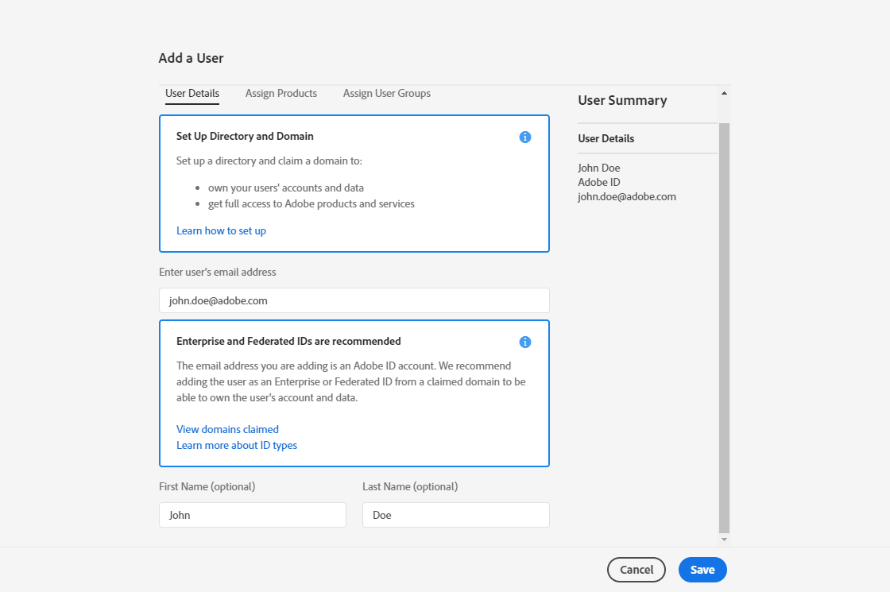
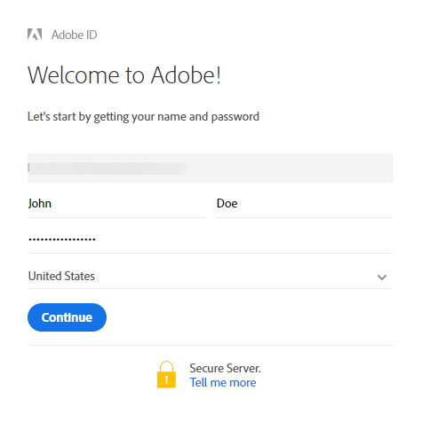

# Gerenciamento de usuários{#users-management}

## Sobre usuários {#about-users}

O Adobe Campaign permite que você atribua um conjunto de funções aos usuários para definir qual parte da interface eles podem acessar.

As funções específicas e as autorizações correspondentes são descritas nas seguintes seções: [compreender funções](../../administration/using/list-of-roles.md) e [autorizações](https://docs.campaign.adobe.com/doc/standard/en/Technotes/AdobeCampaign-ACSRights.pdf).

Os administradores podem gerenciar usuários a partir do Admin Console. Os usuários são sincronizados automaticamente com o Adobe Campaign. For more on this, refer to the [Admin console](https://helpx.adobe.com/enterprise/using/users.html) documentation.

Para exibir os usuários no Adobe Campaign, clique no **[!UICONTROL Adobe Campaign]**logotipo, no canto superior esquerdo, e selecione**[!UICONTROL Administration > Users & Security > Users]**.

Para acessar a interface de gerenciamento de usuários do Adobe Campaign, clique em **[!UICONTROL User administration]**.

**Tópicos relacionados:**

* [Vídeo Gerenciar permissões](https://docs.adobe.com/content/help/en/campaign-learn/campaign-standard-tutorials/getting-started/access-management.html) do usuário
* [Lista de funções](../../administration/using/list-of-roles.md)
* [Lista de autorizações](https://docs.campaign.adobe.com/doc/standard/en/Technotes/AdobeCampaign-ACSRights.pdf)

## Tipo de usuários {#type-of-users}

Essa segmentação de usuário não é obrigatória, é apenas uma representação do uso mais comum do Adobe Campaign.

Esta seção ajudará você a entender os principais tipos de usuários do Adobe Campaign. Aqui, não entraremos em todas as funções específicas que um usuário pode ter (iniciar entregas, exportar, preparar entregas etc.). Para obter mais informações sobre funções, consulte a [Lista de funções](../../administration/using/list-of-roles.md) e [Gerenciamento de grupos e páginas de usuários](../../administration/using/managing-groups-and-users.md) .

Em vez disso, vamos nos concentrar em como as diferentes tarefas no Adobe Campaign são divididas entre três tipos principais de usuários:

* [Administradores](#functional-administrators)funcionais: entre todos os usuários de sua organização, eles são os mais técnicos.
* [Usuários](#advanced-users)avançados: eles configuram todos os elementos de que os comerciantes precisam para enviar e monitorar suas entregas.
* [Usuários](#basic-users)básicos: eles são os comerciantes que personalizam, entregam e monitoram suas campanhas.

>[!NOTE]
>
>Os administradores funcionais são diferentes dos administradores técnicos da Adobe. Os administradores técnicos da Adobe têm uma função interna da Adobe que nenhum cliente pode usar. Eles gerenciam o provisionamento da instância, a hospedagem, o monitoramento e a supervisão da infraestrutura, a solução de problemas técnicos.

### Administradores funcionais {#functional-administrators}

Os administradores funcionais são usuários que podem acessar as partes mais técnicas da interface. Eles assumem a **[!UICONTROL Administration]**função e garantem que a plataforma esteja configurada para que os profissionais de marketing tenham que se concentrar apenas no lançamento de suas campanhas.

Os administradores funcionais são os únicos usuários que podem acessar o **[!UICONTROL Administration]**menu, na interface do Adobe Campaign. Como esses usuários precisam acessar os recursos técnicos, as funções mais avançadas devem ser atribuídas a eles, como as funções**[!UICONTROL Administration]** e **[!UICONTROL Datamodel]**prontas para uso. Essas funções são combinadas no grupo de segurança**[!UICONTROL Administrators]** predefinido. Para obter mais informações, consulte esta [seção](../../administration/using/list-of-roles.md).

Estas são as principais tarefas que podem ser executadas:

* [Gerenciar usuários e permissões](../../administration/using/about-access-management.md): gerencie o acesso à plataforma (usuários, funções, grupos de segurança, unidades).
* [Configure os diferentes canais](../../administration/using/about-channel-configuration.md): configure os diferentes canais da plataforma, bem como o gerenciamento de tipologia e quarentena.
* [Defina as configurações](../../administration/using/external-accounts.md)gerais do aplicativo: configure os diferentes elementos do aplicativo (contas externas, opções, fluxos de trabalho técnicos).
* [Desenvolva novos recursos para aprimorar funcionalidades](../../developing/using/data-model-concepts.md)inovadoras: gerencie seus recursos personalizados e acesse ferramentas de diagnóstico.
* [Configure os parâmetros](../../administration/using/branding.md)de instância: defina suas diferentes marcas e defina suas configurações (logotipo, gerenciamento de rastreamento, domínio de URL para acessar as páginas de aterrissagem, etc.).
* [Exportar e importar pacotes](../../automating/using/managing-packages.md)de dados: troque recursos entre diferentes instâncias do Adobe Campaign por meio de arquivos XML estruturados.
* [Exporte logs](../../automating/using/exporting-logs.md) e [defina modelos](../../automating/using/defining-import-templates.md)de importação.

### Usuários avançados {#advanced-users}

Usuários avançados são usuários de marketing que executam os casos de uso mais técnicos no Adobe Campaign. Eles pré-configuram todos os elementos que os comerciantes usam para enviar e monitorar suas entregas.

Esse tipo de usuário requer funções mais gerais do que administradores funcionais, mas ainda deve ser capaz de executar algumas operações técnicas. Para fazer isso, elas devem ser atribuídas, por exemplo, as funções **[!UICONTROL Export]**,**[!UICONTROL Generic import]** ou **[!UICONTROL Workflow]**prontas para uso. Para obter mais informações, consulte esta[seção](../../administration/using/list-of-roles.md).

Estas são as principais tarefas que podem ser executadas:

* [Crie e execute fluxos de trabalho](../../automating/using/about-data-management-activities.md)complexos de gerenciamento de dados: importe, enriqueça e transforme dados para alimentar seu banco de dados ou exporte os dados necessários em arquivos externos para processá-los em suas próprias ferramentas.
* [Gerenciar modelos](../../start/using/marketing-activity-templates.md): gerencie seus modelos para pré-configurar determinados parâmetros de suas atividades de marketing de acordo com suas necessidades.
* [Crie consultas](../../automating/using/editing-queries.md#about-query-editor) e [gerencie seus públicos-alvo](../../audiences/using/about-audiences.md): crie seus públicos-alvo manualmente usando consultas ou automaticamente usando fluxos de trabalho dedicados.
* [Executar edição](../../automating/using/editing-queries.md#about-query-editor)de expressões avançadas: use funções avançadas para manipular os valores usados para realizar consultas específicas, como datas, strings, campos numéricos, classificação etc.
* [Exportar listas](../../automating/using/exporting-lists.md) e [importar dados usando modelos](../../automating/using/importing-data-with-import-templates.md)de importação existentes.

### Usuários básicos {#basic-users}

Graças ao administrador funcional e aos usuários avançados, os profissionais de marketing podem personalizar, fornecer e monitorar suas campanhas sem se preocupar com a configuração técnica. Para fazer isso, eles devem receber, por exemplo, as funções **[!UICONTROL Prepare deliveries]**,**[!UICONTROL Workflow]** e **[!UICONTROL Start deliveries]**prontos para uso. Essas funções são combinadas no grupo de segurança**[!UICONTROL Standard Users]** predefinido. Para obter mais informações, consulte esta [seção](../../administration/using/list-of-roles.md).

Estas são as principais tarefas que podem ser executadas:

* [Gerenciar programas e campanhas](../../start/using/programs-and-campaigns.md): crie campanhas de marketing incluindo diferentes tipos de atividades (emails, mensagens SMS, notificações por push, fluxos de trabalho, páginas de aterrissagem).
* Gerenciar [perfis](../../audiences/using/about-profiles.md) e perfis [de](../../sending/using/managing-test-profiles-and-sending-proofs.md)teste: gerencie os destinatários identificados e de teste que serão direcionados pelas entregas. Adicione informações como nome, sobrenome, informações de contato, assinaturas, emails etc.
* [Criar e enviar mensagens](../../sending/using/confirming-the-send.md): crie sua mensagem, selecione o público-alvo, defina o conteúdo da mensagem e seus elementos de personalização, envie provas e envie a mensagem final para seu público-alvo.
* [Criar e publicar páginas](../../channels/using/getting-started-with-landing-pages.md)iniciais: crie e gerencie um conjunto de serviços que você deseja oferecer aos seus clientes, por exemplo, formulários de assinatura ou cancelamento de assinatura.
* [Criar e executar fluxos de trabalho](../../automating/using/building-a-workflow.md)de campanha: automatize os processos de sua campanha usando fluxos de trabalho.
* Monitore suas atividades de marketing por meio dos relatórios disponíveis.

## Criar um usuário {#creating-a-user}

Para adicionar um usuário à sua instância, você deve primeiro criá-lo no Admin Console antes de gerenciá-lo no Adobe Campaign Standard.

1. No menu avançado, selecione **[!UICONTROL Administration > Users & Security > Users]**e clique**[!UICONTROL User administration]** para acessar o Admin Console.

   

1. Na guia **[!UICONTROL Admin Console]**, clique na guia**[!UICONTROL Users]** .

1. Clique em **[!UICONTROL Add User]**.

   

1. Na **[!UICONTROL User details]**guia, preencha os detalhes do usuário, como endereço de email, nome e sobrenome.

   

1. Na **[!UICONTROL Assign products]**guia, atribua um ou vários grupos de segurança ao usuário. For more information on security groups, refer to this[page](../../administration/using/managing-groups-and-users.md).

   Clique **[!UICONTROL Save]**ao concluir a configuração.

   

Seu usuário agora é criado e deve receber um redirecionamento por email para a seguinte janela, onde o usuário precisa definir uma senha e, em seguida, aceitar o contrato de termo de uso. Esse usuário poderá se conectar à sua instância do Adobe Campaign Standard.

Seu usuário será sincronizado com o Adobe Campaign Standard assim que ele fizer logon em sua instância.

Você pode verificar se o usuário foi sincronizado corretamente com o Adobe Campaign:

1. No menu avançado, **[!UICONTROL Administration > Users & Security > Users]**selecione o usuário criado anteriormente.

1. Atualize o **[!UICONTROL Mobile]**,**[!UICONTROL Time zone]** ou **[!UICONTROL Regional settings]**, se necessário.

1. Verifique o grupo de segurança do usuário. Aqui, você pode ver que o usuário recebeu o grupo de **[!UICONTROL Administrators]**segurança.

   >[!Nnota]
   >
   >Os grupos de segurança só podem ser removidos ou adicionados a um usuário no Admin Console.

   

1. Verifique **[!UICONTROL Account disabled]**se deseja desativar este usuário.

1. No **[!UICONTROL Authorized connection zone]**campo, selecione a maneira pela qual o usuário se conectará a essa instância, por exemplo, rede interna ou VPN.

1. Clique em **[!UICONTROL Save]**.

Seu usuário agora está pronto para usar o Adobe Campaign Standard.
