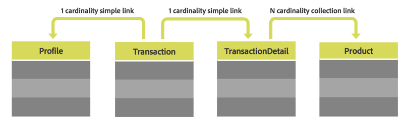

# Recursos personalizados {#custom-resources}

O Adobe Campaign vem com um modelo de dados predefinidos por meio de diferentes recursos. Você pode aprimorar o modelo de dados fornecido estendendo os recursos para adicionar seus próprios campos personalizados ou tabelas personalizadas, como tabelas de produtos ou de compras.

Os recursos personalizados podem ser acessados por meio de APIs usando o ponto de extremidade **/profileAndServicesExt** e o nome do recurso personalizado.

`https://mc.adobe.io/<ORGANIZATION>/campaign/profileAndServicesExt/<resourceName>/`

>[!NOTE]
>
>Para recursos que não estão prontos para uso, sempre use o prefixo <b>&quot;cus&quot;</b> antes do nome do recurso.

Você pode executar qualquer operação com recursos personalizados, desde que eles estejam vinculados à tabela Perfil. Por exemplo, considere a estrutura das tabelas abaixo:



Nesse caso, todos os recursos das tabelas **Transaction**, **TransactionDetails** e **Product** estarão disponíveis desde que estejam vinculados à tabela **Profile**.

<br/>

***Solicitação de exemplo***

Exemplo de solicitação do GET para acessar o recurso profileAndServicesExt estendido.

```
-X GET https://mc.adobe.io/<ORGANIZATION>/campaign/profileAndServicesExt/\
-H 'Content-Type: application/json' \
-H 'Authorization: Bearer <ACCESS_TOKEN>' \
-H 'Cache-Control: no-cache' \
-H 'X-Api-Key: <API_KEY>' \
```

Retorna a lista de todos os recursos personalizados vinculados. Em seguida, você pode usar os URLs de recursos para executar qualquer tarefa de API descrita nesta documentação.

```
{
"apiName": "resourceType",
"cusProduct": {
        "content": ...,
        "data": "/profileAndServicesExt/cusProduct/",
        "help": "Product",
        "href": "https://mc.adobe.io/<ORGANIZATION>/campaign/profileAndServicesExt/cusProduct/metadata",
        "name": "cusProduct",
        "type": "collection"
    },
"cusTransaction": {
        "content": ...,
        "data": "/profileAndServicesExt/cusTransaction/",
        "help": "Product",
        "href": "https://mc.adobe.io/<ORGANIZATION>/campaign/profileAndServicesExt/cusTransaction/metadata",
        "name": "cusProduct",
        "type": "collection"
    },
    ...
}
```

Para obter mais informações sobre a extensão do modelo de dados, consulte a documentação do Campaign:

* [Conceitos do modelo de dados](../../developing/using/data-model-concepts.md)
* [Extensão da API](../../developing/using/about-extending-the-api.md)
* [Definindo links com outros recursos](https://helpx.adobe.com/br/campaign/standard/developing/using/configuring-the-resource-s-data-structure.html#defining-links-with-other-resources)
