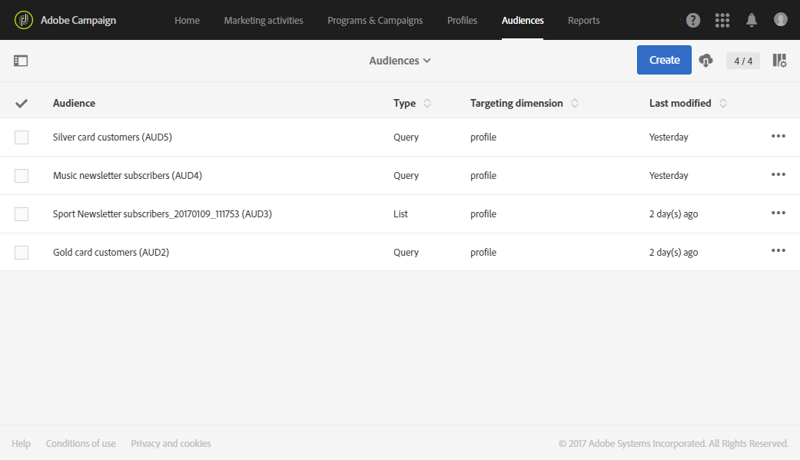
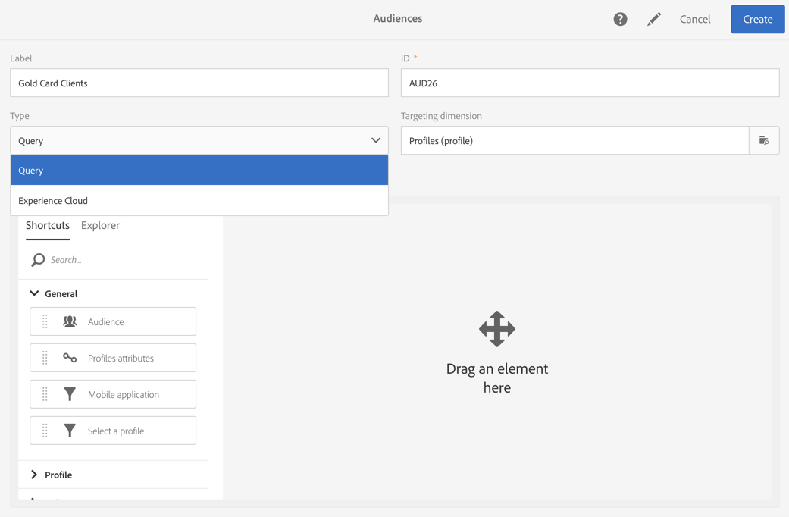

# Sobre públicos-alvos{#about-audiences}

Um público-alvo é uma lista de perfis com base em regras e atributos.

O Adobe Campaign permite criar públicos-alvo manualmente usando consultas ou automaticamente com fluxos de trabalho dedicados. Você também pode usar públicos-alvo compartilhados da Adobe Experience Cloud. Todos os públicos-alvo são agrupados em uma lista que pode ser acessada pelo cartão **[!UICONTROL Audiences]** na home page do Adobe Campaign ou pelo link **[!UICONTROL Audiences]**.

É possível manipular diferentes tipos de público-alvo no Adobe Campaign. O tipo de público-alvo corresponde ao modo como ele foi criado:

* **[!UICONTROL Query]**: indica que o público-alvo foi criado usando uma [consulta](../../automating/using/editing-queries.md#about-query-editor) nos dados do banco de dados do Adobe Campaign através da lista de públicos-alvo. Os públicos-alvo definidos por uma consulta são recalculados a cada novo uso.
* **[!UICONTROL List]**: indica que o público-alvo é uma lista fixa de perfis. Essas listas são criadas em um [fluxo de trabalho](../../automating/using/get-started-workflows.md), no qual a dimensão de dados é conhecida quando o público-alvo é salvo. Por exemplo, após o direcionamento de atividades (principalmente **[!UICONTROL Query]**) ou a reconciliação dos dados importados de um arquivo.
* **[!UICONTROL File]**: indica que o público-alvo foi criado diretamente de um fluxo de trabalho de [importação de arquivo](../../automating/using/load-file.md) e que a dimensão de dados era desconhecida quando o público-alvo foi salvo.
* **[!UICONTROL Experience Cloud]**: indica que o público-alvo foi importado da Adobe Experience Cloud. Essa opção só estará disponível se a funcionalidade de compartilhamento de públicos-alvo tiver sido configurada. Para saber mais, consulte [Importação de um público-alvo da Adobe Experience Cloud](../../integrating/using/sharing-audiences-with-audience-manager-or-people-core-service.md#importing-an-audience).

