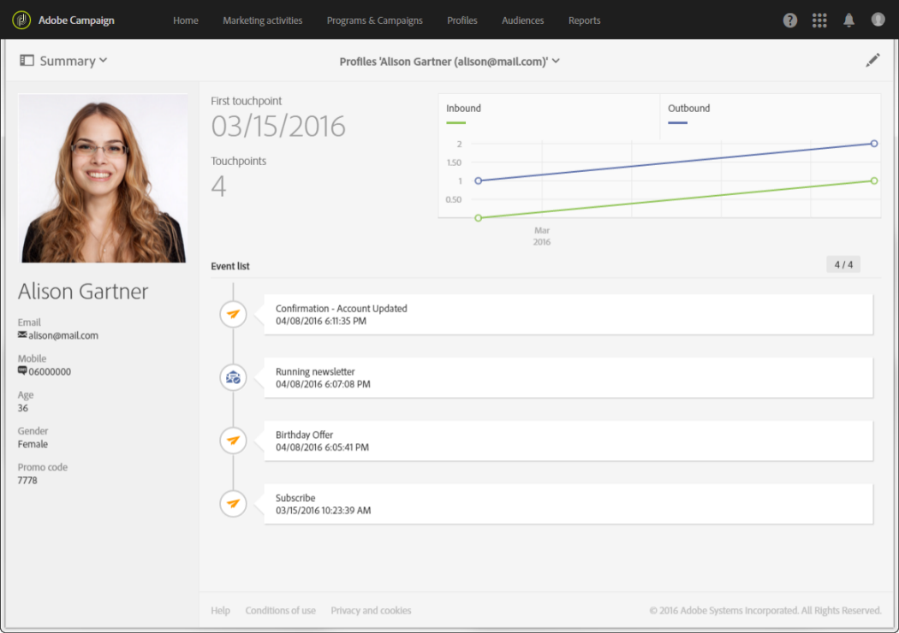

# Sobre perfis{#about-profiles}

O Adobe Campaign permite gerenciar contatos em todo o ciclo de vida: criação, importação, direcionamento, rastreamento de ações, atualizações, etc. Os contatos são armazenados no banco de dados como perfis que contêm as informações vinculadas a eles: sobrenome, nome, endereço, assinaturas, deliveries etc.

>[!NOTE]
>
>Perfis também estão disponíveis usando a API do Adobe Campaign Standard. Para obter mais informações, consulte a [documentação dedicada](../../api/using/retrieving-profiles.md).

Ao criar campanhas, você pode definir o público-alvo das entregas selecionando perfis de acordo com critérios simples ou avançados. Tecnicamente, um perfil é uma entrada no banco de dados que contém todas as informações necessárias para direcionar, qualificar e rastrear comportamentos.

Um perfil pode ser: um cliente, um cliente potencial, uma pessoa inscrita em um informativo, um destinatário, um usuário ou qualquer outra denominação dependendo da organização. Para definir vários tipos de perfis, use [target dimension](../../automating/using/query.md#targeting-dimensions-and-resources).
