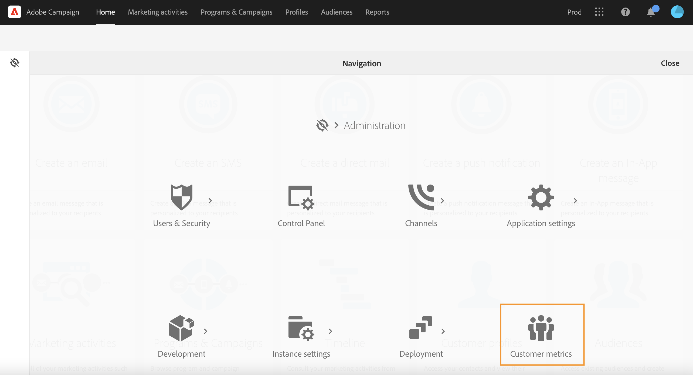
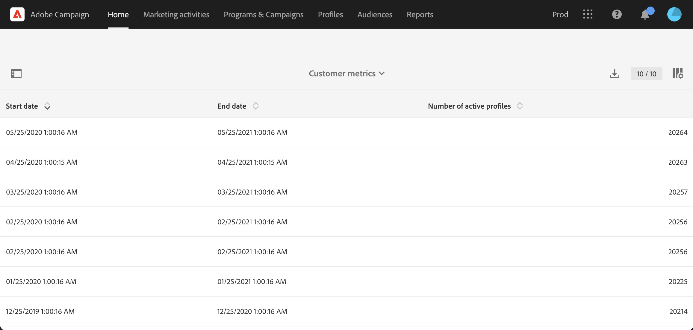

# Perfis ativos{#active-profiles}

Você pode acessar os detalhes dos perfis ativos no relatório **[!UICONTROL Customer metrics]**. Este relatório está disponível somente para administradores funcionais do Campaign. Para acessar este relatório, clique no ícone do Adobe Campaign na parte superior esquerda da [interface de usuário](../../start/using/interface-description.md#advanced-menu) e navegue até **[!UICONTROL Administration > Customer metrics]**.

Este relatório é gerado mensalmente pelo fluxo de trabalho técnico **[!UICONTROL Billing]** e exibe o número de **perfis ativos**. Saiba mais sobre fluxos de trabalho técnicos em [esta página](../../administration/using/technical-workflows.md).

Um &quot;Perfil&quot; é um registro de informações que representam um cliente final, um prospecto ou um cliente potencial. Os perfis são considerados **ativos** se tiverem sido direcionados por uma entrega do Campaign nos últimos 12 meses por meio de qualquer canal.

De acordo com seu contrato, cada uma das instâncias do Campaign é provisionada com um número específico de perfis ativos. Consulte seu contrato de licença para obter uma referência sobre o número de perfis ativos adquiridos.

* Os perfis excluídos durante a preparação do delivery (por regras de tipologia ou mecanismo de quarentena, por exemplo) não são considerados.

* Os recipients de mensagens transacionais são contados para Perfis ativos.

* Um perfil que foi direcionado por várias entregas será contado apenas uma vez.

* Este relatório é apenas informativo, não tem um impacto direto na cobrança.

Na parte inferior da página, os targeting dimensions são listados com o número de perfis para cada um. Os destinatários de mensagens transacionais estão associados à dimensão **Anônimo**.

>[!NOTE]
>
>Como usuário administrador, você também pode monitorar o número de perfis ativos usados em suas instâncias diretamente do Painel de controle do Campaign. Para obter mais informações, consulte a [documentação do Painel de controle](https://experienceleague.adobe.com/docs/control-panel/using/performance-monitoring/active-profiles-monitoring.html?lang=pt-BR).
>
