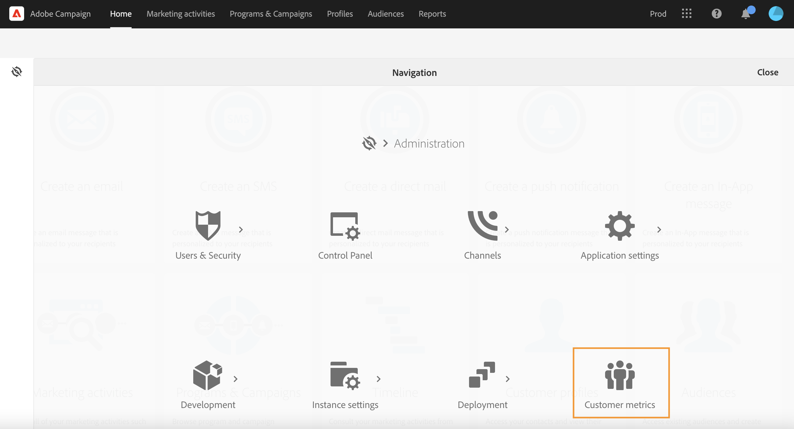

# Perfis ativos{#active-profiles}

Os administradores funcionais de campanha podem acessar o relatório **[!UICONTROL Customer metrics]** de **[!UICONTROL Administration > Customer metrics]**.

Este relatório é gerado todos os meses pelo workflow técnico **[!UICONTROL Billing]** e exibe o número de **perfis ativos**.

Um &quot;Perfil&quot; é um registro de informações que representam um cliente final, um prospecto ou um cliente potencial. Os perfis são considerados **ativos** se tiverem sido direcionados por um delivery de Campanha nos últimos 12 meses por meio de qualquer canal.

De acordo com seu contrato, cada uma das instâncias do Campaign é provisionada com um número específico de perfis ativos. Consulte seu contrato de licença para obter uma referência sobre o número de perfis ativos adquiridos.

* Os perfis excluídos durante a preparação do delivery (por regras de tipologia ou mecanismo de quarentena, por exemplo) não são considerados.

* Os recipients das Mensagens transacionais são contados em Perfis ativos.

* Um perfil que foi direcionado por vários deliveries será contado apenas uma vez.

* Este relatório é apenas informativo, não tem impacto direto na cobrança.

Na parte inferior da página, os targeting dimensions estão listados com o número de perfis para cada. Os recipients de mensagens transacionais são associados à dimensão **Anônimo** .

>[!NOTE]
>
>Como um usuário administrador, você também pode monitorar o número de perfis ativos usados em suas instâncias diretamente do Painel de controle do Campaign. Para obter mais informações, consulte a [documentação do Painel de controle do Campaign](https://experienceleague.adobe.com/docs/control-panel/using/performance-monitoring/active-profiles-monitoring.html?lang=pt-BR).

