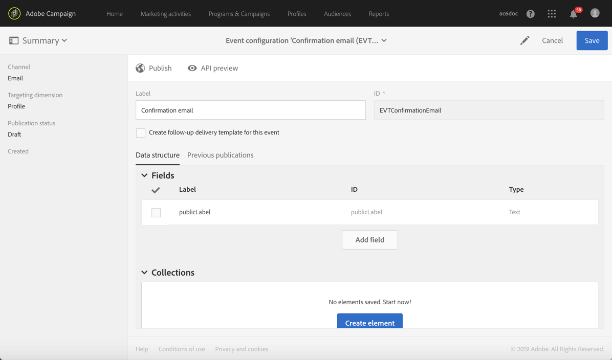
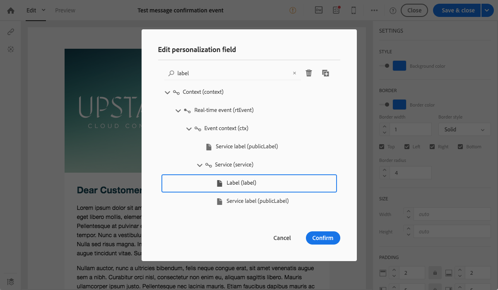
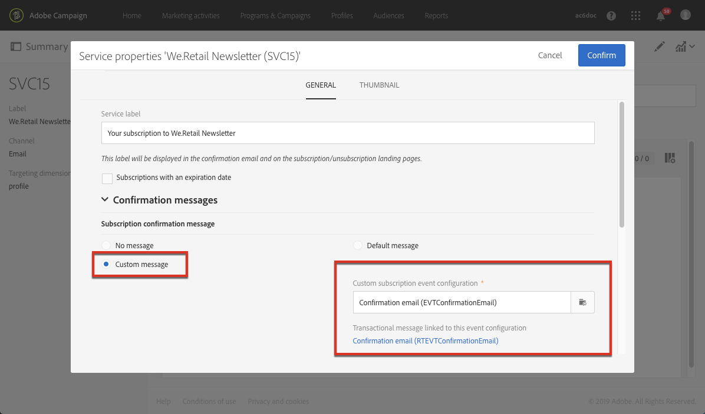
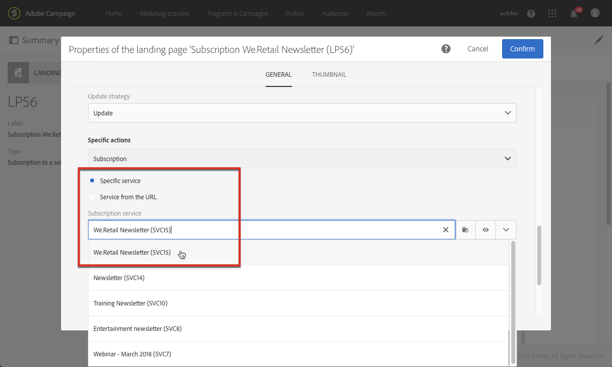

# Confirmação de assinatura de um serviço{#confirming-subscription-to-a-service}

## Sobre o envio de confirmação da assinatura {#sending-subscription-confirmation}

Esta seção descreve como enviar um email de confirmação personalizado automático para os perfis que assinam um serviço específico.

Quando quiser enviar uma mensagem de confirmação para uma assinatura (ou unsubscription) em um serviço, você poderá usar a mensagem padrão ou uma mensagem personalizada. As etapas para selecionar uma mensagem de confirmação são apresentadas na seção [Criação de um serviço](../../audiences/using/creating-a-service.md).

Se você optar por usar a mensagem padrão, é possível editar o conteúdo com as seguintes limitações:
* Você só poderá personalizar o conteúdo da mensagem com campos limitados do contexto do evento.
* A mensagem será a mesma para todos os serviços que usam o modo padrão.

Para enviar um email de confirmação específico para um determinado serviço, você poderá criar uma mensagem personalizada na qual também poderá usar os campos de personalização de outros recursos. Para isso, você deve criar e configurar uma mensagem transacional. Esta mensagem pode ser especificada:
* Do próprio serviço. Para saber mais, consulte [Configuração da mensagem de confirmação de um serviço](#configuring-confirmation-message-from-service).
* De uma landing page de assinatura. Para saber mais, consulte [Configuração da mensagem de confirmação de uma landing page](#configuring-confirmation-message-from-landing-page).

## Configuração da mensagem de confirmação de um serviço {#configuring-confirmation-message-from-service}

Por exemplo, você quer enviar uma mensagem de confirmação automaticamente para os visitantes do seu site quando eles assinarem o informativo da sua marca.

Você precisa configurar um email transacional e fazer referência a essa mensagem do serviço desejado (neste caso, a assinatura no informativo da sua marca). Para enriquecer a mensagem transacional com informações do serviço, você pode definir uma reconciliação ao criar o evento.

Ao configurá-la a partir do serviço, a mensagem transacional de confirmação só será enviada na primeira vez que cada visitante assinar esse serviço. Se um perfil já tiver feito a assinatura, nenhuma mensagem de confirmação será enviada novamente para ele.

### Etapa 1: criar o email de confirmação {#step-1--create-the-confirmation-email-1}

Um email de confirmação será enviado automaticamente para cada perfil que assinar o informativo (em uma landing page ou por qualquer outro meio). A assinatura é considerada um evento, e o email é uma [mensagem transacional](../../channels/using/getting-started-with-transactional-msg.md) que direcionará cada perfil que assinar o serviço.

As etapas para criar o email de confirmação são descritas abaixo. Como a mensagem transacional será especificada no serviço, é necessário criá-la primeiro.

#### Criar o evento {#create-the-event-1}

O email de confirmação é uma mensagem transacional, pois reage a um evento: a assinatura de um serviço. Ela será enviada para confirmar a assinatura no seu informativo.

1. Crie um evento no menu **[!UICONTROL Marketing plans]** > **[!UICONTROL Transactional messages]** > **[!UICONTROL Event configuration]**, acessível pelo logotipo do Adobe Campaign.
1. Insira um rótulo, selecione um targeting dimension e clique em **[!UICONTROL Create]**.

   As etapas de configuração são apresentadas na seção [Configuração de mensagens transacionais](../../administration/using/configuring-transactional-messaging.md).

1. Na seção **[!UICONTROL Fields]**, clique em **[!UICONTROL Create element]** e adicione **[!UICONTROL publicLabel]** à estrutura de dados para ativar a reconciliação.

   

   >[!NOTE]
   >
   >O campo **[!UICONTROL publicLabel]** é obrigatório. Se você não adicioná-lo à estrutura de dados do evento, o Adobe Campaign não poderá executar a reconciliação com o serviço. Na assinatura de um serviço, esse campo será preenchido com o **[!UICONTROL Service label]** do serviço correspondente.

1. Na seção **[!UICONTROL Enrichment]**, clique em **[!UICONTROL Create element]** e selecione o recurso do público-alvo **[!UICONTROL Service]**.

   

1. Na seção **[!UICONTROL Join definition]**, mapeie o campo **[!UICONTROL publicLabel]** do recurso **[!UICONTROL Service]** com o campo **[!UICONTROL publicLabel]** da configuração do evento.

   

   >[!NOTE]
   >
   >Isso permitirá que você use campos de personalização do recurso **[!UICONTROL Service]** na mensagem transacional.

1. Salve a configuração do evento e clique em **[!UICONTROL Publish]** para publicar o evento.

O evento está pronto. Agora você pode criar a mensagem de email transacional.

#### Criar a mensagem de confirmação {#design-the-confirmation-message-1}

O email de confirmação é uma mensagem transacional baseada no evento que você acabou de publicar.

1. No logotipo do Adobe Campaign, selecione **[!UICONTROL Marketing plans]** > **[!UICONTROL Transactional messages]** e clique em **[!UICONTROL Transactional messages]**.
1. Selecione o email transacional correspondente ao evento que você acabou de publicar.

1. Clique na seção **[!UICONTROL Content]** e selecione um template de email. Para saber mais sobre como editar o conteúdo de uma mensagem transacional, consulte [Mensagens transacionais de evento](../../channels/using/event-transactional-messages.md).
1. Como você tem acesso direto a todos os campos do recurso **[!UICONTROL Service]**, é possível selecionar qualquer campo do nó **[!UICONTROL Context]** > **[!UICONTROL Real-time event (rtEvent)]** > **[!UICONTROL Event context (ctx)]** >**[!UICONTROL Service]** para personalizar o conteúdo.

   

   Para saber mais sobre como personalizar uma mensagem transacional, consulte [esta seção](../../channels/using/event-transactional-messages.md#personalizing-a-transactional-message).

1. Pré-visualize a mensagem usando um perfil de teste. Para saber mais, consulte [Definição de um perfil de teste em uma mensagem transacional](../../channels/using/event-transactional-messages.md#defining-a-test-profile-in-a-transactional-message).

1. Clique em **[!UICONTROL Save & close]** para salvar o conteúdo.
1. Publique a mensagem transacional. Consulte [Publicação de uma mensagem transacional](../../channels/using/event-transactional-messages.md#publishing-a-transactional-message).

### Etapa 2: criar e configurar o serviço {#step-2--create-and-configure-the-service-1}

1. No menu avançado, **Perfis e públicos-alvo** > **Serviços**, crie um serviço por meio do logotipo do Adobe Campaign.
1. Vá para a seção **[!UICONTROL Service properties]**, acessada pelo botão  no painel do serviço.
1. Preencha o campo **[!UICONTROL Service label]**.

   

   >[!NOTE]
   >
   >É necessário preencher esse campo para permitir a reconciliação com a mensagem transacional.

1. Na seção **[!UICONTROL Confirmation messages]**, selecione **[!UICONTROL Custom message]**. Esse modo permite fazer referência a uma mensagem de confirmação específica para os perfis que estão assinando seu serviço.
1. Selecione a **[!UICONTROL Custom subscription event configuration]** associada à mensagem transacional que você criou.

   

1. Clique em **[!UICONTROL Confirm]** e salve o serviço.

Agora, sempre que um perfil assinar esse serviço, ele receberá a mensagem transacional que você definiu, com campos personalizados mapeados para o serviço selecionado.

>[!NOTE]
>
>Uma mensagem só será enviada na primeira vez que o usuário fizer a assinatura.

## Configuração da mensagem de confirmação de uma landing page {#configuring-confirmation-message-from-landing-page}

Você também pode fazer referência à mensagem de confirmação de uma landing page de assinatura usando a opção **[!UICONTROL Start sending messages]** da seção **[!UICONTROL Job]** da landing page.

Na referência à mensagem de confirmação da landing page, uma mensagem será enviada sempre que a landing page for enviada (mesmo que o perfil já tenha feito a assinatura).

### Etapa 1: criar o email de confirmação {#step-1--create-the-confirmation-email-2}

Um email de confirmação será enviado automaticamente para cada perfil que assinar o informativo em uma landing page. A assinatura é considerada um evento, e o email é uma [mensagem transacional](../../channels/using/getting-started-with-transactional-msg.md) que direcionará cada perfil que assinar o serviço.

As etapas para criar esses elementos estão descritas abaixo. Como a mensagem transacional será especificada na landing page, é necessário criá-la primeiro.

#### Criar o evento {#create-the-event-2}

O email de confirmação é uma [mensagem transacional](../../channels/using/getting-started-with-transactional-msg.md), pois reage a um evento: a assinatura de um serviço. Ela será enviada para confirmar a assinatura no seu informativo.

1. Crie um evento no menu **[!UICONTROL Marketing plans]** > **[!UICONTROL Transactional messages]** > **[!UICONTROL Event configuration]**, acessível pelo logotipo do Adobe Campaign.
1. Insira um rótulo, selecione um targeting dimension e clique em **[!UICONTROL Create]**.

   As etapas de configuração são apresentadas na seção [Configuração de mensagens transacionais](../../administration/using/configuring-transactional-messaging.md).

1. Na seção **[!UICONTROL Fields]**, clique em **[!UICONTROL Create element]** e adicione **[!UICONTROL serviceName]** à estrutura de dados para ativar a reconciliação.

   

   >[!NOTE]
   >
   >O campo **[!UICONTROL serviceName]** é obrigatório. Se você não adicioná-lo à estrutura de dados do evento, o Adobe Campaign não poderá executar a reconciliação com o serviço assinado.

1. Na seção **[!UICONTROL Enrichment]**, clique em **[!UICONTROL Create element]** e selecione o recurso do público-alvo **[!UICONTROL Service]**.
1. Na seção **[!UICONTROL Join definition]**, mapeie o campo **[!UICONTROL serviceName]** do recurso **[!UICONTROL Service]** com o campo **[!UICONTROL name]** da configuração do evento.

   

   >[!NOTE]
   >
   >Isso permitirá que você use campos de personalização do recurso [!UICONTROL Service] na mensagem transacional.

#### Criar a mensagem de confirmação {#design-the-confirmation-message-2}

As etapas para criar a mensagem transacional são apresentadas nesta [seção](#design-the-confirmation-message-1).

### Etapa 2: criar e configurar o serviço {#step-2--create-and-configure-the-service-2}

1. No menu avançado **[!UICONTROL Profiles & audiences]** > **[!UICONTROL Services]**, crie um serviço por meio do logotipo do Adobe Campaign.
1. Vá para a seção **[!UICONTROL Service properties]**, acessada pelo botão  no painel do serviço.
1. Preencha o campo **[!UICONTROL Service label]**. Esse rótulo será exibido na mensagem de confirmação e na landing page da assinatura.
1. Clique em **[!UICONTROL Confirm]** e salve o serviço.

### Etapa 3: criar e configurar a landing page {#step-3--create-and-configure-the-landing-page}

Crie uma landing page de assinatura que será publicada no seu site.

Para criar e configurar essa landing page, siga as etapas abaixo:

1. Projete uma [nova landing page](../../channels/using/getting-started-with-landing-pages.md) com base no template **[!UICONTROL Subscription]**.
1. Edite as propriedades da landing page. Na seção **[!UICONTROL Job]** > **[!UICONTROL Specific actions]**, selecione a opção **[!UICONTROL Specific service]** e, na lista suspensa, escolha o serviço que você acabou de criar.

   

1. Selecione a opção **[!UICONTROL Start sending message]** e, na lista suspensa, escolha a mensagem transacional que você acabou de criar.

   

1. Personalize o conteúdo da landing page.

1. [Teste e publique](../../channels/using/testing-publishing-landing-page.md) a landing page.

Agora, sempre que um perfil assinar seu informativo enviando a landing page, ele receberá a mensagem transacional que você definiu com campos personalizados mapeados para o serviço.

>[!NOTE]
>
>Uma mensagem será enviada sempre que a landing page for enviada, mesmo que o perfil já tenha feito a assinatura.
