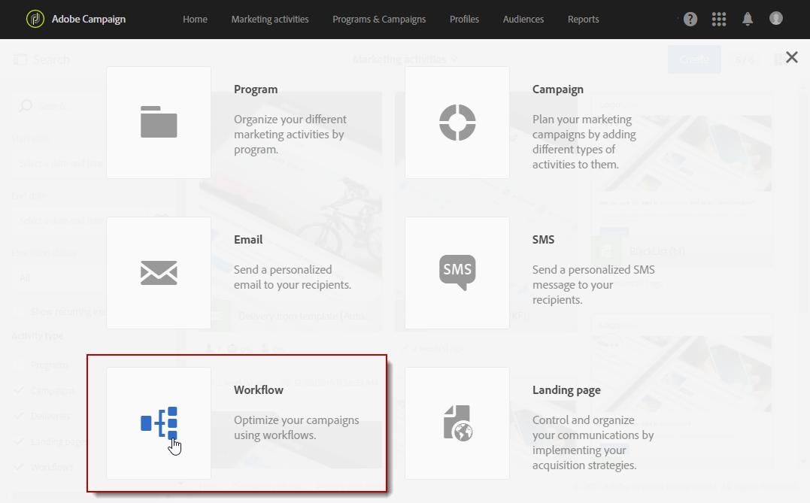
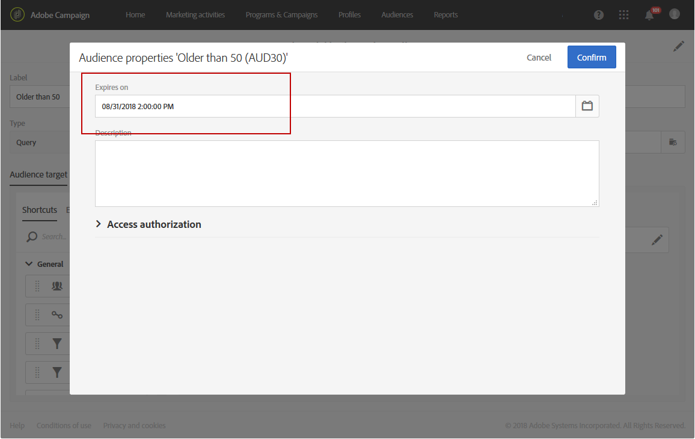

# Criação de públicos-alvo{#creating-audiences}

## Criação de públicos-alvo de query {#creating-query-audiences}

Esta seção descreve como criar um público-alvo do tipo **Query**. Você também pode criar públicos-alvo a partir da importação de um arquivo ou do direcionamento em um [fluxo de trabalho](../../automating/using/get-started-workflows.md).

Na lista de públicos-alvo, é possível criar públicos-alvo executando consultas nos perfis do Adobe Campaign ou importando um público-alvo da Adobe Experience Cloud.

1. Acesse a lista de públicos-alvo por meio da guia ou do cartão **[!UICONTROL Audiences]**.

   

1. Selecione **[!UICONTROL Create]** para acessar a tela e criar um novo público-alvo.

   

1. Atribua um nome ao público-alvo. O rótulo do público-alvo é usado na lista de públicos-alvo e na paleta da ferramenta query.
1. Escolha um tipo de público-alvo **[!UICONTROL Query]**: os públicos-alvo definidos por um query são recalculadas a cada novo uso.

   

1. Em seguida, selecione o **[!UICONTROL Targeting dimension]** que deseja usar para filtrar os clientes. Cada público-alvo é composto por um único targeting dimension. Por exemplo, não é possível criar um público-alvo com perfis de teste e assinantes. Para saber mais sobre targeting dimensions, consulte [esta página](../../automating/using/query.md#targeting-dimensions-and-resources).
1. Crie o query para definir a população do público-alvo. Consulte a seção sobre [edição de consultas](../../automating/using/editing-queries.md).
1. Clique no botão **[!UICONTROL Create]** para salvar o público-alvo.

>[!NOTE]
>
>Você pode adicionar uma descrição a esse público-alvo e definir as autorizações de acesso pelo ícone **[!UICONTROL Edit properties]**.

## Criação de públicos-alvo do tipo Lista {#creating-list-audiences}

Esta seção descreve como criar um público-alvo do tipo **Lista** após o direcionamento em um fluxo de trabalho. Você também pode criar públicos-alvo importando um arquivo para um [fluxo de trabalho](../../automating/using/get-started-workflows.md) ou usando um query do menu **[!UICONTROL Audiences]**.

Para criar um público-alvo do tipo **Lista**, siga estas etapas:

1. Na guia **Marketing activities**, clique em **Create** e selecione **Workflow**.

   

1. Arraste, solte e configure as atividades de direcionamento que permitirão selecionar uma população que tenha uma dimensão **conhecida**. A lista de atividades disponíveis e as configurações relacionadas são detalhadas na seção [Atividades de direcionamento](../../automating/using/about-targeting-activities.md).

   Você pode usar uma atividade **[!UICONTROL Query]** ou importar dados por meio de uma atividade **[!UICONTROL Load file]** antes de uma atividade **[!UICONTROL Reconciliation]** para identificar a dimensão dos dados importados. Neste caso, queremos direcionar os recipients que assinaram o informativo esportivo com uma atividade **[!UICONTROL Query]**.

   

1. Após o direcionamento, arraste e solte uma atividade **[!UICONTROL Save audience]** no fluxo de trabalho. Por exemplo, você pode optar por **[!UICONTROL Create or update an audience]** para criar e atualizar automaticamente o público-alvo com novos dados. Nesse caso, adicione uma atividade **[!UICONTROL Scheduler]** no início do fluxo de trabalho.

   Para saber mais sobre como configurar essa atividade, consulte a seção [Salvar público-alvo](../../automating/using/save-audience.md).

   

1. Salve e inicie o fluxo de trabalho.

   Como a atividade **[!UICONTROL Save audience]** é colocada depois de um direcionamento com uma dimensão conhecida, os públicos-alvo criados por meio dessa atividade são do tipo **Lista**.

   Em seguida, o conteúdo do público-alvo salvo fica disponível na visualização detalhada do público-alvo que pode ser acessada por meio da lista de públicos-alvo. As colunas disponíveis nessa visualização correspondem às da transição de entrada da atividade de salvamento do fluxo de trabalho. Por exemplo, as colunas do arquivo importado e os dados adicionais incluídos de um query.

   

## Criação de públicos-alvo do tipo Arquivo{#creating-file-audiences}

Esta seção detalha como criar um público-alvo do tipo **Arquivo** importando um arquivo para um fluxo de trabalho. Você também pode criar públicos-alvo de uma atividade de direcionamento em um [fluxo de trabalho](../../automating/using/get-started-workflows.md) ou usando um query do menu **[!UICONTROL Audiences]**.

Para criar um público-alvo do tipo **Arquivo**, siga estas etapas:

1. Na guia **Marketing activities**, clique em **Create** e selecione **Workflow**.
1. Arraste, solte e configure uma atividade **[!UICONTROL Load file]** que permitirá importar uma população que tenha uma dimensão **desconhecida** quando o fluxo de trabalho for executado. Para saber mais sobre como configurar essa atividade, consulte a seção [Carregar arquivo](../../automating/using/load-file.md).

   

1. Arraste e solte uma atividade **[!UICONTROL Save audience]** após a atividade **[!UICONTROL Load file]**. Para saber mais sobre como configurar essa atividade, consulte a seção [Salvar público-alvo](../../automating/using/save-audience.md).
1. Salve e inicie o fluxo de trabalho.

   

   Como a **[!UICONTROL Save audience]** é colocada após uma importação, a dimensão de dados é desconhecida e os públicos-alvo criados por meio dessa atividade são do tipo **Arquivo**.

   Em seguida, o conteúdo do público-alvo salvo fica disponível na visualização detalhada do público-alvo que pode ser acessada por meio da lista de públicos-alvo. As colunas disponíveis nessa visualização correspondem às da transição de entrada da atividade de salvamento do fluxo de trabalho. Por exemplo, as colunas do arquivo importado, os dados adicionais incluídos de um query.

   

## Criação de públicos-alvo da Experience Cloud {#creating-experience-cloud-audiences}

O Adobe Campaign permite compartilhar e trocar públicos-alvo com a Adobe Experience Cloud. Um público-alvo do tipo **Experience Cloud** é importado diretamente do serviço principal People para o Adobe Campaign com o fluxo de trabalho técnico **[!UICONTROL Import shared audience]**.

Ao contrário do público-alvo do tipo **Query** que consultará os perfis do Adobe Campaign, o público-alvo da **Experience Cloud** é composto por uma lista de IDs de visitantes.

Para que essa integração funcione, é necessário configurá-la primeiro. Para saber mais sobre configuração e como importar ou exportar públicos-alvo com o serviço principal People, consulte a seguinte [seção](../../integrating/using/sharing-audiences-with-audience-manager-or-people-core-service.md).

## Edição de públicos-alvo {#editing-audiences}

Existem diferentes maneiras de editar um público-alvo dependendo do tipo:

* Para editar um público-alvo do tipo **Query**, acesse a lista de públicos-alvo no menu **[!UICONTROL Audiences]** ou pelo cartão **[!UICONTROL Audiences]** da home page do Adobe Campaign.

   Abra o público-alvo relevante. Todos os elementos de um público-alvo criado anteriormente podem ser editados.

   >[!CAUTION]
   >
   >Se você alterar a **[!UICONTROL Filtering dimension]** no query, as regras que foram definidas anteriormente serão perdidas.

* Para editar um público-alvo do tipo **Lista** ou **Arquivo**, edite o fluxo de trabalho do qual ele foi criado e modifique a atividade **[!UICONTROL Save audience]**. Inicie o fluxo de trabalho para que o público-alvo seja modificado.
* Para editar um público-alvo da **Experience Cloud**, consulte a seção [Importação/exportação de públicos-alvo com o serviço principal People](../../integrating/using/sharing-audiences-with-audience-manager-or-people-core-service.md).

## Exclusão de públicos-alvo {#deleting-audiences}

Há duas maneiras de excluir um ou vários públicos-alvo. Primeiro você pode adicionar uma data de expiração ao público-alvo.

Para fazer isso:

1. Acesse um dos públicos-alvo.
1. Clique no botão  para acessar a configuração do público-alvo.

   

1. No campo **[!UICONTROL Expires on]**, adicione uma data de expiração ao público-alvo.

   

1. Clique em **[!UICONTROL Confirm]** e em **[!UICONTROL Save]**.

A data de expiração está configurada. Assim que essa data for atingida, o público-alvo será automaticamente excluído.

Ou, se for necessário excluir um público-alvo, selecione um ou vários públicos-alvo e clique no botão **[!UICONTROL Delete element]**.

