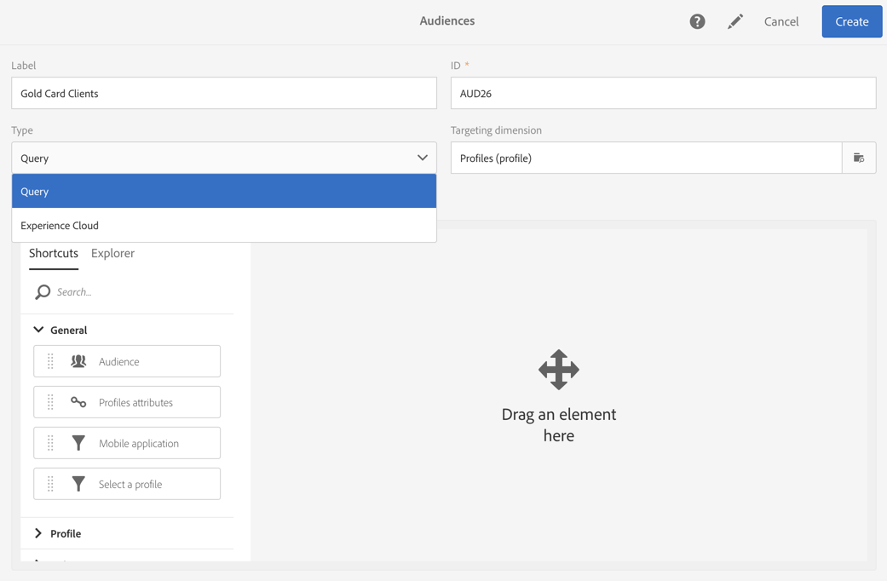

# Criação de públicos-alvo{#creating-audiences}

## Criação de públicos-alvo de consulta {#creating-query-audiences}

Esta seção descreve como criar um público-alvo da **Consulta** . Você também pode criar públicos-alvo a partir da importação de um arquivo ou direcionamento em um [fluxo de trabalho](../../automating/using/discovering-workflows.md).

Na lista de públicos-alvo, você pode criar públicos realizando consultas em perfis do Adobe Campaign ou importando um público-alvo da Adobe Experience Cloud.

1. Vá para a lista de público-alvo por meio da **[!UICONTROL Audiences]** guia ou do cartão.

   

1. Selecione **[!UICONTROL Create]** para acessar a tela para criar um novo público-alvo.

   

1. Dê um nome ao seu público-alvo. O rótulo de público-alvo é usado na lista de públicos-alvo e na paleta da ferramenta de consulta.
1. Escolha um tipo de **[!UICONTROL Query]** público-alvo: os públicos-alvo definidos por uma consulta são recomputados a cada novo uso.

   

1. Em seguida, selecione o **[!UICONTROL Targeting dimension]** que deseja usar para filtrar seus clientes. Cada público-alvo é composto de uma única dimensão de definição de metas. Por exemplo, você não pode criar um público-alvo composto de perfis, perfis de teste e assinantes. For more on targeting dimensions, refer to [this page](../../automating/using/query.md#targeting-dimensions-and-resources).
1. Crie a consulta para definir o público-alvo. Consulte a seção sobre [edição de consultas](../../automating/using/editing-queries.md).
1. Clique no **[!UICONTROL Create]** botão para salvar seu público-alvo.

>[!NOTE]
>
>Você pode adicionar uma descrição para esse público-alvo e definir as autorizações de acesso por meio do **[!UICONTROL Edit properties]** ícone.

## Criação de públicos-alvo da lista {#creating-list-audiences}

Esta seção descreve como criar um público-alvo da **Lista** após a definição de metas em um fluxo de trabalho. Você também pode criar públicos importando um arquivo para um [fluxo de trabalho](../../automating/using/discovering-workflows.md) ou por meio de uma consulta do **[!UICONTROL Audiences]** menu.

To create a **List** audience, the steps are as follows:

1. Na guia Atividades **de** marketing, clique em **Criar** e selecione **Fluxo de trabalho**.

   

1. Arraste e solte e configure as atividades de definição de metas que permitirão selecionar uma população que tenha uma dimensão **conhecida** . A lista de atividades disponíveis e suas configurações são detalhadas na seção Atividades [de](../../automating/using/about-targeting-activities.md) definição de metas.

   Você pode usar uma **[!UICONTROL Query]** atividade ou importar dados usando uma **[!UICONTROL Load file]** atividade antes de usar uma **[!UICONTROL Reconciliation]** atividade para identificar a dimensão dos dados importados. Neste contexto, queremos visar os destinatários que assinaram a Newsletter Sport com uma **[!UICONTROL Query]** atividade.

   

1. Após a definição de metas, arraste e solte uma **[!UICONTROL Save audience]** atividade no seu fluxo de trabalho. Por exemplo, você pode escolher **[!UICONTROL Create or update an audience]**, isso permite criar e atualizar automaticamente seu público-alvo com novos dados. Nesse caso, adicione uma **[!UICONTROL Scheduler]** atividade no início do fluxo de trabalho.

   Para obter mais informações sobre como configurar essa atividade, consulte a seção [Salvar público-alvo](../../automating/using/save-audience.md) .

   

1. Salve e inicie o fluxo de trabalho.

   Como o **[!UICONTROL Save audience]** é colocado depois de uma definição de metas com uma dimensão conhecida, os públicos-alvo criados por meio dessa atividade são públicos-alvo da **Lista** .

   O conteúdo do público-alvo salvo fica disponível na exibição detalhada do público-alvo que pode ser acessado por meio da lista de públicos-alvo. As colunas disponíveis nesta exibição correspondem às colunas da transição de entrada da atividade de salvamento do fluxo de trabalho.  Por exemplo: as colunas do arquivo importado, os dados adicionais adicionados de uma consulta.

   

## Criação de públicos-alvo de arquivos {#creating-file-audiences}

Esta seção detalha como criar um público-alvo de **Arquivo** importando um arquivo para um fluxo de trabalho. Você também pode criar públicos-alvo a partir de uma atividade de definição de metas em um [fluxo de trabalho](../../automating/using/discovering-workflows.md) ou por meio de uma consulta do **[!UICONTROL Audiences]** menu.

To create a **File** audience, the steps are as follows:

1. Na guia Atividades **de** marketing, clique em **Criar** e selecione **Fluxo de trabalho**.
1. Arraste e solte e configure uma **[!UICONTROL Load file]** atividade que permitirá importar uma população que tenha uma dimensão **desconhecida** quando o fluxo de trabalho for executado. Para obter mais informações sobre como configurar essa atividade, consulte a seção [Carregar arquivo](../../automating/using/load-file.md) .

   

1. Arraste e solte uma **[!UICONTROL Save audience]** atividade após a **[!UICONTROL Load file]** atividade. Para obter mais informações sobre como configurar essa atividade, consulte a seção [Salvar público-alvo](../../automating/using/save-audience.md) .
1. Salve e inicie o fluxo de trabalho.

   

   Como o **[!UICONTROL Save audience]** é colocado após uma importação, a dimensão de dados é desconhecida e os públicos-alvo criados por meio dessa atividade são públicos-alvo **de Arquivo** .

   O conteúdo do público-alvo salvo fica disponível na exibição detalhada do público-alvo que pode ser acessado por meio da lista de públicos-alvo. As colunas disponíveis nesta exibição correspondem às colunas da transição de entrada da atividade de salvamento do fluxo de trabalho.  Por exemplo: as colunas do arquivo importado, os dados adicionais adicionados de uma consulta.

   

## Criação de públicos-alvo da Experience Cloud {#creating-experience-cloud-audiences}

O Adobe Campaign permite que você compartilhe e troque públicos-alvo com a Adobe Experience Cloud. Um público-alvo do tipo **Experience Cloud** é importado diretamente do serviço principal de Pessoas para o Adobe Campaign com o fluxo de trabalho **[!UICONTROL Import shared audience]** técnico.

Ao contrário do público-alvo do tipo **Consulta** que consultará perfis do Adobe Campaign, o público-alvo da **Experience Cloud** é composto por uma lista de IDs de visitante.

Para que essa integração funcione, é necessário primeiro configurá-la. Para obter mais informações sobre configuração e como importar ou exportar públicos-alvo com o serviço principal de Pessoas, consulte a seguinte [seção](../../integrating/using/sharing-audiences-with-audience-manager-or-people-core-service.md).

## Editar públicos-alvo {#editing-audiences}

Existem maneiras diferentes de editar um público-alvo, dependendo do tipo de público-alvo:

* Para editar um público-alvo da **Consulta** , vá para a lista de públicos-alvo pelo **[!UICONTROL Audiences]** menu ou o **[!UICONTROL Audiences]** cartão na página inicial do Adobe Campaign.

   Abra o público relevante. Todos os elementos de um público-alvo criado anteriormente podem ser editados.

   >[!CAUTION]
   >
   >Se você alterar a regra **[!UICONTROL Filtering dimension]** na consulta, as regras definidas anteriormente serão perdidas.

* Para editar um público-alvo de **Lista** ou **Arquivo** , edite o fluxo de trabalho do qual ele foi criado e modifique a **[!UICONTROL Save audience]** atividade. Inicie o fluxo de trabalho para que o público-alvo seja modificado.
* Para editar um público-alvo da **Experience Cloud** , consulte a seção [Importando/Exportando públicos-alvo com os principais serviços](../../integrating/using/sharing-audiences-with-audience-manager-or-people-core-service.md) de Pessoas.

## Excluindo públicos {#deleting-audiences}

Há duas maneiras de excluir um ou vários públicos-alvo. Primeiro, você pode adicionar uma data de expiração ao seu público-alvo

Para fazer isso:

1. Acesse um de seus espectadores.
1. Clique no  botão para acessar a configuração de seu público-alvo.

   

1. No **[!UICONTROL Expires on]** campo, adicione uma data de expiração ao seu público-alvo.

   

1. Clique em **[!UICONTROL Confirm]** e em **[!UICONTROL Save]**.

A data de expiração está configurada. Assim que essa data for atingida, seu público-alvo será automaticamente excluído.

Ou se você precisar excluir um público-alvo, basta selecionar um ou vários públicos e clicar no **[!UICONTROL Delete element]** botão.

