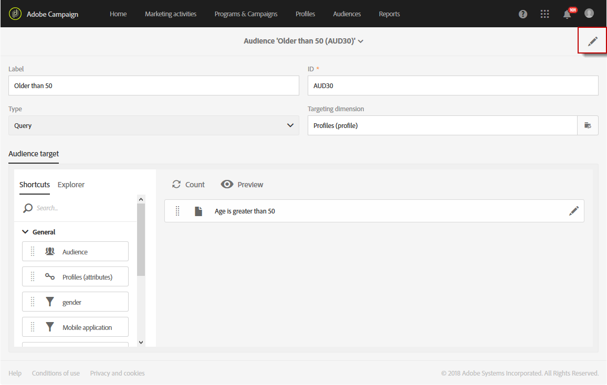

# Creating audiences{#creating-audiences}

## Creating query audiences {#creating-query-audiences}

This section describes how to create a **Query** audience. You can also create audiences from importing a file or targeting in a [workflow](../../automating/using/discovering-workflows.md).

Na lista de público-alvo, você pode criar públicos-alvo executando consultas em perfis do Adobe Campaign ou importando um público-alvo da Adobe Experience Cloud.

1. Go to the audience list via the **[!UICONTROL Audiences]** tab or card.

   

1. Select **[!UICONTROL Create]** to access the screen to create a new audience.

   

1. Dê um nome para seu público. A etiqueta do público-alvo é usada na lista de públicos-alvo e na paleta da ferramenta de consulta.
1. Choose a **[!UICONTROL Query]** audience type: the audiences defined by a query are recomputed at each further use.

   

1. Then select the **[!UICONTROL Targeting dimension]** that you would like to use to filter your customers. Cada público é constituído por uma única dimensão de definição de metas. Por exemplo, não é possível criar um público-alvo composto por perfis, perfis de teste e assinantes. For more on targeting dimensions, refer to [this page](../../automating/using/query.md#targeting-dimensions-and-resources).
1. Crie a consulta para definir a população do público-alvo. Refer to the section on [editing queries](../../automating/using/editing-queries.md).
1. Click the **[!UICONTROL Create]** button to save your audience.

>[!NOTE]
>
>You can add a description to this audience and define the access authorizations via the **[!UICONTROL Edit properties]** icon.

## Creating list audiences {#creating-list-audiences}

This section describes how to create a **List** audience after targeting in a workflow. You can also create audiences by importing a file into a [workflow](../../automating/using/discovering-workflows.md) or via a query from the **[!UICONTROL Audiences]** menu.

To create a **List** audience, the steps are as follows:

1. In the **Marketing activities** tab, click **Create** then select **Workflow**.

   

1. Drag and drop, and then configure the targeting activities which will allow you to select a population that has a **known** dimension. The list of available activities and their configuration are detailed in the [Targeting activities](../../automating/using/about-targeting-activities.md) section.

   You can use a **[!UICONTROL Query]** activity, or import data using a **[!UICONTROL Load file]** activity before using a **[!UICONTROL Reconciliation]** activity to identify the dimension of the data imported. Here, we want to target recipients who subscribed to the Sport Newsletter with a **[!UICONTROL Query]** activity .

   

1. After your targeting, drag and drop a **[!UICONTROL Save audience]** activity into your workflow. For example, you can chose to **[!UICONTROL Create or update an audience]**, this allows you to create then automatically update your audience with new data. In this case, add a **[!UICONTROL Scheduler]** activity at the beginning of your workflow.

   For more information on configuring this activity, refer to the [Save audience](../../automating/using/save-audience.md) section.

   

1. Salve e inicie o fluxo de trabalho.

   As the **[!UICONTROL Save audience]** is placed after a targeting with a known dimension, the audiences created via this activity are **List** audiences.

   O conteúdo do público-alvo salvo fica disponível na exibição detalhada do público-alvo que pode ser acessada pela lista de públicos-alvo. As colunas disponíveis nessa exibição correspondem às colunas da transição de entrada da atividade de salvamento do fluxo de trabalho. Por exemplo: as colunas do arquivo importadas, os dados adicionais adicionados a partir de uma consulta.

   

## Creating file audiences {#creating-file-audiences}

This section details how to create a **File** audience by importing a file into a workflow. You can also create audiences from a targeting activity in a [workflow](../../automating/using/discovering-workflows.md) or via a query from the **[!UICONTROL Audiences]** menu.

To create a **File** audience, the steps are as follows:

1. In the **Marketing activities** tab, click **Create** then select **Workflow**.
1. Drag and drop, and then configure a **[!UICONTROL Load file]** activity which will allow you to import a population that has an **unknown** dimension when the workflow is executed. For more information on configuring this activity, refer to the [Load file](../../automating/using/load-file.md) section.

   

1. Drag and drop a **[!UICONTROL Save audience]** activity after the **[!UICONTROL Load file]** activity. For more information on configuring this activity, refer to the [Save audience](../../automating/using/save-audience.md) section.
1. Salve e inicie o fluxo de trabalho.

   

   As the **[!UICONTROL Save audience]** is placed after an import, the data dimension is unknown and the audiences created via this activity are **File** audiences.

   O conteúdo do público-alvo salvo fica disponível na exibição detalhada do público-alvo que pode ser acessada pela lista de públicos-alvo. As colunas disponíveis nessa exibição correspondem às colunas da transição de entrada da atividade de salvamento do fluxo de trabalho. Por exemplo: as colunas do arquivo importado, os dados adicionais adicionados a partir de uma consulta.

   

## Creating Experience Cloud audiences {#creating-experience-cloud-audiences}

O Adobe Campaign permite compartilhar e trocar públicos-alvo com a Adobe Experience Cloud. An **Experience Cloud** type audience is directly imported from People core service to Adobe Campaign with the **[!UICONTROL Import shared audience]** technical workflow.

Unlike **Query** type audience which will query profiles from Adobe Campaign, the **Experience Cloud** audience is composed of a list of Visitor IDs.

Para que essa integração funcione, primeiro você deverá configurá-la. For more information on configuration and how to import or export audiences with People core service, refer to the following [section](../../integrating/using/sharing-audiences-with-audience-manager-or-people-core-service.md).

## Editing audiences {#editing-audiences}

Há diferentes maneiras de editar um público-alvo, dependendo do tipo de público-alvo:

* To edit a **Query** audience, go to the list of audiences via the **[!UICONTROL Audiences]** menu, or the **[!UICONTROL Audiences]** card from the Adobe Campaign home page.

   Abra o público-alvo relevante. Todos os elementos de um público-alvo criado anteriormente podem ser editados.

   >[!CAUTION]
   >
   >If you change the **[!UICONTROL Filtering dimension]** in the query, the rules that have previously been defined will be lost.

* To edit a **List** or **File** audience, edit the workflow from which it was created and modify the **[!UICONTROL Save audience]** activity. Inicie o fluxo de trabalho para que o público-alvo seja modificado.
* To edit an **Experience Cloud** audience, refer to the [Importing/Exporting audiences with People core service](../../integrating/using/sharing-audiences-with-audience-manager-or-people-core-service.md) section.

## Deleting audiences {#deleting-audiences}

Há duas maneiras de excluir um ou vários públicos. Primeiro, você pode adicionar uma data de expiração ao seu público-alvo

Para fazer isso:

1. Acesse um de seu público.
1. Click the  button to access your audience's configuration.

   

1. In the **[!UICONTROL Expires on]** field, add an expiration date to your audience.

   

1. Click **[!UICONTROL Confirm]** then **[!UICONTROL Save]**.

A data de expiração agora está configurada. Assim que essa data for atingida, seu público será excluído automaticamente.

Or if you need to delete an audience, you can simply select one or several audiences then click the **[!UICONTROL Delete element]** button.

