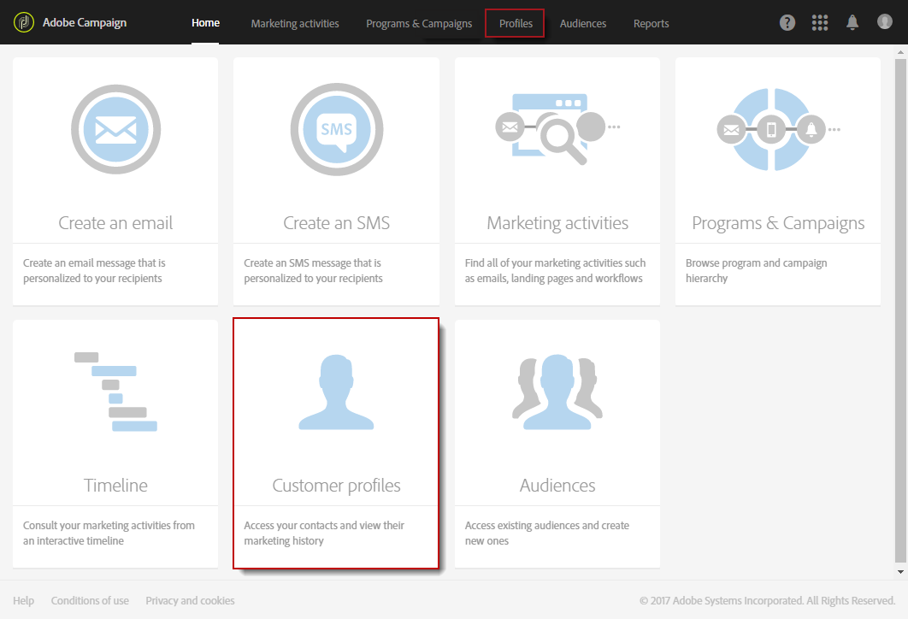
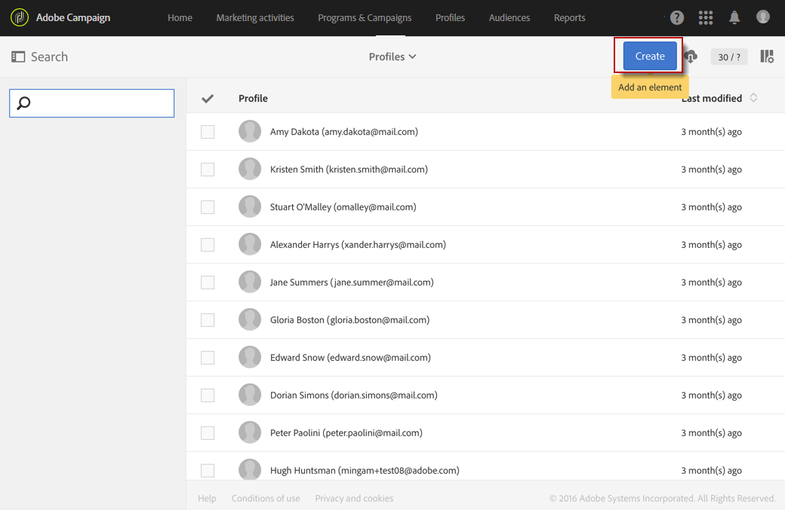
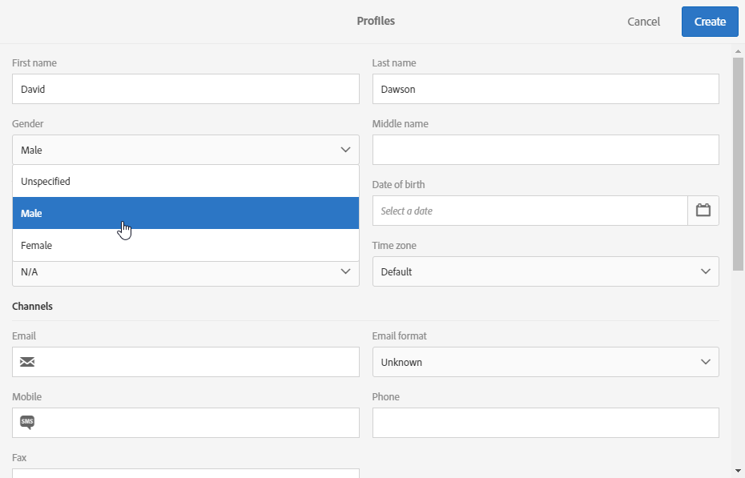

# Criação de perfis{#creating-profiles}

No Adobe Campaign, os perfis são usados por padrão para definir o público-alvo principal das mensagens.

>[!NOTE]
>
>A criação de perfis também é possível usando a API do Adobe Campaign Standard. Para obter mais informações, consulte a [documentação dedicada](../../api/using/creating-profiles-api.md).

 [Saiba como importar perfis usando um fluxo de trabalho em vídeo](#video)

Para criar ou atualizar um perfil no Campaign, você pode:

* Importar uma lista de perfis de um arquivo, por meio de um [fluxo de trabalho](../../automating/using/creating-import-workflow-templates.md)
* Coletar dados online, usando [páginas de destino](../../channels/using/getting-started-with-landing-pages.md)
* Criar um volume em massa por meio da [API REST](../../api/using/get-started-apis.md)
* Sincronizar perfis do [Microsoft Dynamics](../../integrating/using/d365-acs-get-started.md)
* Insira dados usando a interface do usuário, conforme explicado abaixo

Por exemplo, para criar um novo perfil diretamente na interface do usuário, siga as etapas abaixo:

1. Na home page do Adobe Campaign, clique no cartão **Customer Profiles** ou na guia **Profiles** para acessar a lista de perfis.

   

1. Clique em **[!UICONTROL Create]**.

   

1. Insira os dados do perfil.

   

   * As informações de contato, como nome, sobrenome, gênero, data de nascimento, foto, idioma preferencial (para [emails multilíngues](../../channels/using/creating-a-multilingual-email.md)), ajudam a personalizar melhor as entregas.
   * O perfil **[!UICONTROL Time zone]** é usado para enviar entregas no fuso horário do perfil. Para obter mais informações, consulte esta [seção](../../sending/using/sending-messages-at-the-recipient-s-time-zone.md).
   * A categoria **[!UICONTROL Channels]**, que contém o endereço de email, o número do telefone celular e as informações de recusa, informa em qual canal o perfil pode ser acessado.

     >[!NOTE]
     > Os números de telefone celular devem estar sempre no formato internacional (`+<country><number>`) na tabela de perfis.

   * A categoria **[!UICONTROL No longer contact]** é atualizada assim que o perfil cancela a assinatura em um canal.
   * A categoria **[!UICONTROL Address]** contém o CEP que precisa ser preenchido junto com a opção **[!UICONTROL Address specified]** para enviar [correspondência direta](../../channels/using/about-direct-mail.md) para esse perfil. Se a opção **[!UICONTROL Address specified]** não estiver marcada, esse perfil será excluído de todas as entregas de correspondência direta.
   * A categoria **[!UICONTROL Access authorization]** indica as unidades organizacionais do perfil para [gerenciar permissões](../../administration/using/about-access-management.md). Para adicionar os campos organizacionais aos perfis, consulte a seção [Particionamento de perfis](../../administration/using/organizational-units.md#partitioning-profiles).
   * A categoria **[!UICONTROL Traceability]** atualiza automaticamente as informações referentes ao usuário que criou ou modificou o perfil.

1. Clique em **[!UICONTROL Create]** para salvar o perfil.

O perfil agora será exibido na lista.

>[!NOTE]
>O campo de idioma preferencial é usado para selecionar o idioma ao enviar mensagens multilíngues. Para saber mais sobre as mensagens multilíngues, [consulte esta página](../../channels/using/creating-a-multilingual-email.md).

## Tutorial em vídeo {#video}

Este vídeo mostra como importar perfis com um fluxo de trabalho.

>[!VIDEO](https://video.tv.adobe.com/v/24993?quality=12)

Vídeos extras explicativos do Campaign Standard estão disponíveis [aqui](https://experienceleague.adobe.com/docs/campaign-standard-learn/tutorials/overview.html?lang=pt-BR).
