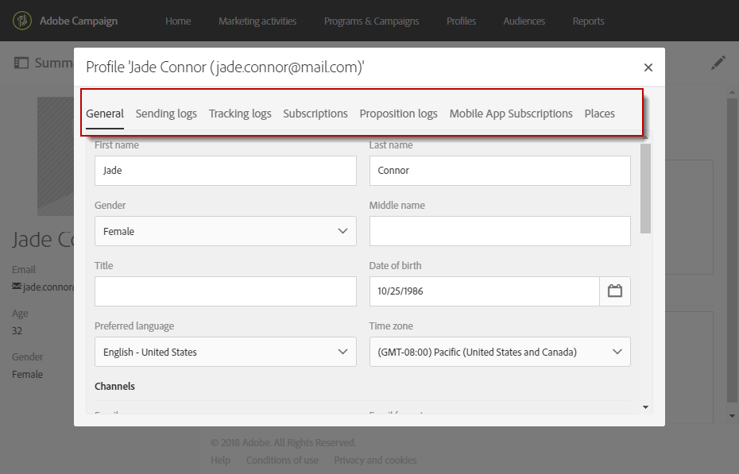

# Editar perfis{#editing-profiles}

## Acessar propriedades do perfil {#accessing-profile-properties}

Para editar um perfil existente e consultar os dados associados a ele, ou modificá-lo, as etapas são as seguintes:

1. No home page Adobe Campaign, clique na placa **[!UICONTROL Customer profiles]** ou na guia **[!UICONTROL Profiles]**.
1. Selecione um contato.
1. Clique no ícone **[!UICONTROL Edit profile properties]** para acessar as informações detalhadas do perfil.

   

   A janela de propriedades do perfil oferta várias guias que concedem acesso a todas as informações do perfil.

   Outras guias também podem ser exibidas dependendo dos recursos personalizados que foram criados ou estendidos no Adobe Campaign. Para obter mais informações sobre recursos personalizados, consulte [Sobre recursos personalizados](../../developing/using/data-model-concepts.md).

   >[!NOTE]
   >
   >Você só pode modificar as informações na guia **[!UICONTROL General]** - exceto para a seção **[!UICONTROL Traceability]**.

A edição de perfis também é possível usando a API do Adobe Campaign Standard. Para obter mais informações, consulte a [documentação dedicada](../../api/using/updating-profiles.md).

Tópicos relacionados:

* [Perfil de cliente integrado](../../audiences/using/integrated-customer-profile.md)
* [Envio no fuso horário do recipient](../../sending/using/sending-messages-at-the-recipient-s-time-zone.md)

## Dados gerais do perfil {#general-profile-data}

A guia **[!UICONTROL General]** agrupa as seguintes informações sobre o perfil:

* Informações de contato, que contêm o nome do recipient, sobrenome, data de nascimento, foto, idioma preferencial (para [emails multilíngues](../../channels/using/creating-a-multilingual-email.md)), etc.
* Canais nos quais o perfil pode ser contatado, que contêm o endereço de email do recipient, o número do telefone celular, as informações de não participação.
* Endereço postal (para [correio direto](../../channels/using/about-direct-mail.md)) e o fuso horário do contato (para [programar mensagens no fuso horário](../../sending/using/sending-messages-at-the-recipient-s-time-zone.md)).
* Autorização de acesso, que indica a unidade organizacional do recipient (para [gerenciar permissões](../../administration/using/about-access-management.md)). Consulte também [Particionamento de perfis](../../administration/using/organizational-units.md#partitioning-profiles).

## Envio e logs de rastreamento {#sending-and-tracking-logs}

As guias **[!UICONTROL Sending logs]** e **[!UICONTROL Tracking logs]** agrupam a lista de delivery que foram enviados para o perfil e todos os dados de rastreamento relacionados.

Para obter mais informações sobre envio e logs de rastreamento, consulte as seções [logs do delivery](../../sending/using/monitoring-a-delivery.md#delivery-logs) e [mensagens de rastreamento](../../sending/using/tracking-messages.md).

## Subscrições {#subscriptions}

As subscrições do contato são listadas na guia correspondente. Para obter mais informações sobre como assinar um serviço, consulte [esta seção](../../audiences/using/about-subscriptions.md).

A guia **[!UICONTROL Mobile App Subscriptions]** refere-se às notificações por push. Para obter mais informações, consulte o canal [Notificação por push](../../channels/using/about-push-notifications.md).
