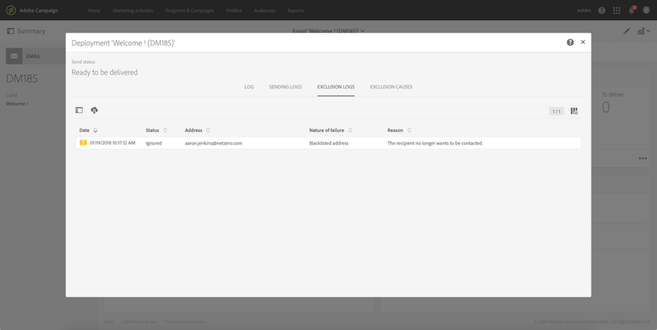

# Identificação de perfis de recusa para uma entrega{#identifying-opt-out-profiles-for-a-delivery}

Os perfis de recusa para uma entrega específica são listados após a fase de preparação, na guia **[!UICONTROL Exclusion logs]** do painel de entrega.

**Tópicos relacionados:**

* [Monitorando uma entrega](../../sending/using/monitoring-a-delivery.md#exclusion-logs).
* [Preparando o envio](../../sending/using/preparing-the-send.md).
