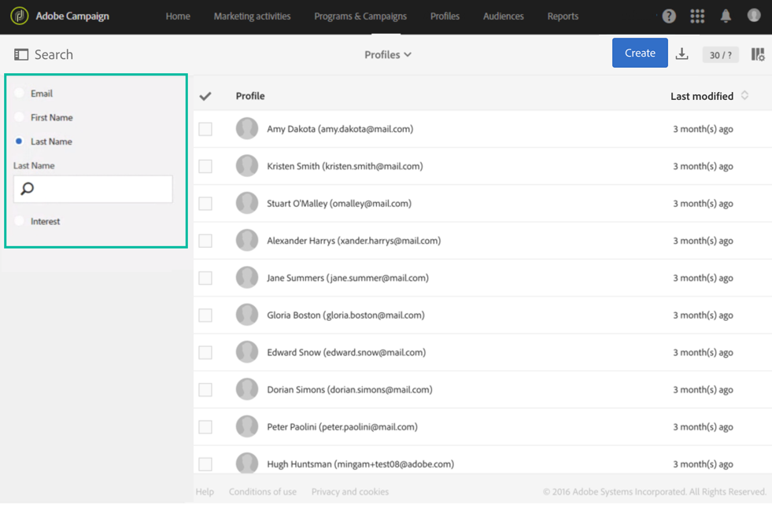
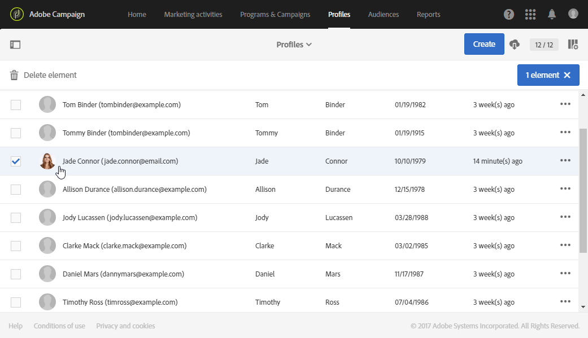
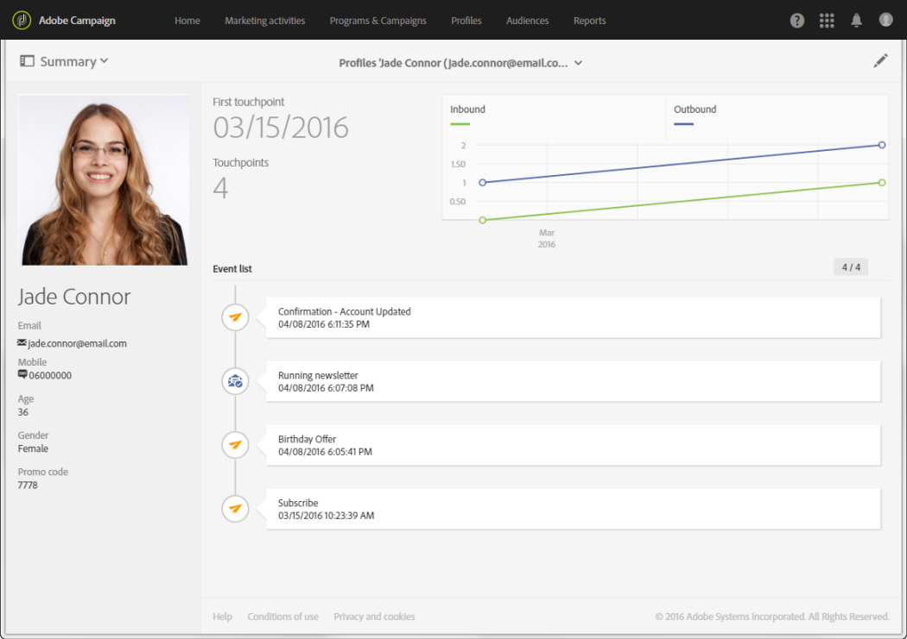

# Perfil de cliente integrado{#integrated-customer-profile}

Um perfil de cliente integrado está disponível para cada contato do banco de dados. Este histórico de marketing combina todas as informações de marketing relevantes relacionadas ao contato com um cliente em uma única visualização. Em seguida, você pode acessar todos os comportamentos digitais e as transações online e offline em um local central: informações de contato, emails recebidos, logs de rastreamento, assinaturas e cancelamento de assinatura etc.

Para acessar o perfil do cliente integrado, siga estas etapas:

1. Na home page do Adobe Campaign, clique no cartão **[!UICONTROL Customer profiles]** ou na guia **Perfis** para exibir a lista de perfis.

1. Para pesquisar um perfil com base em um campo específico, abra o painel de pesquisa e selecione o campo no qual deseja realizar a pesquisa.

   

1. Especifique o valor que deseja pesquisar e pressione Enter.

   >[!NOTE]
   >
   >Observe que as pesquisas podem ser executadas com base nos campos de email, nome e sobrenome, bem como em campos personalizados que foram adicionados ao estender o recurso.
   >
   >As pesquisas diferenciam maiúsculas de minúsculas e são executadas somente em prefixos. Por exemplo, você não poderá procurar um perfil usando as últimas letras do nome.

1. Selecione um contato para abrir seu perfil.

   

Em seguida, você pode acessar o **Histórico de marketing** desse contato.

As informações principais sobre o perfil estão agrupadas nesta página, bem como a lista de eventos.

Clique em um evento na lista para abri-lo: você pode acessar as mensagens que foram enviadas ou os serviços aos quais o perfil se inscreveu.

>[!NOTE]
>
>Também é possível acessar o Histórico de marketing usando a API do Adobe Campaign Standard. Para obter mais informações, consulte a [documentação dedicada](../../api/using/interacting-with-marketing-history.md).
