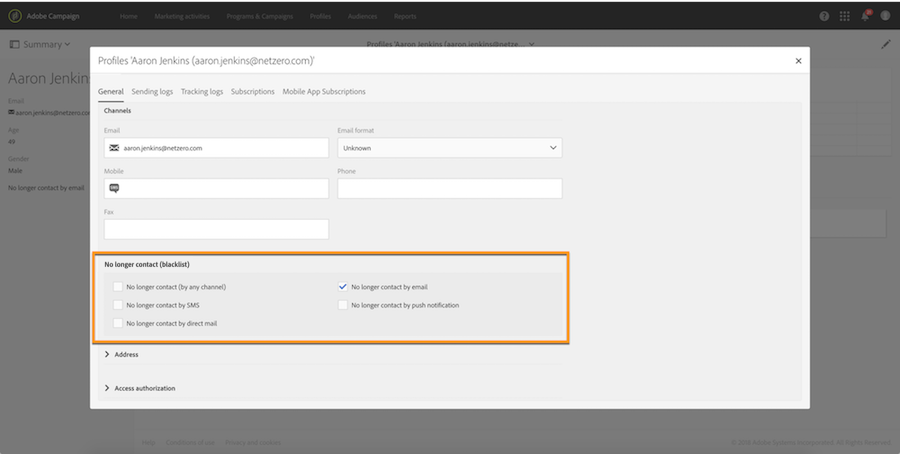
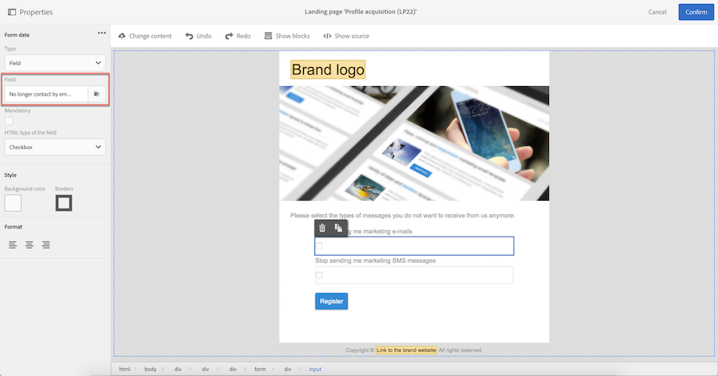
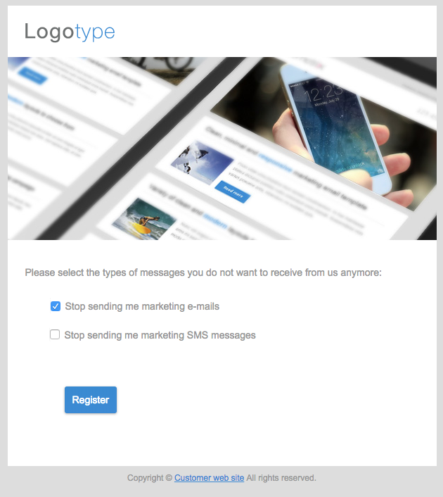
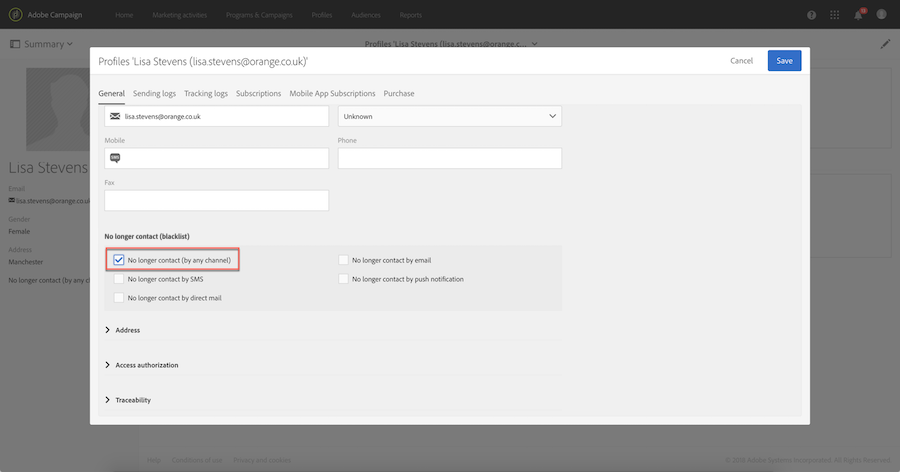

# Gerenciamento de aceitação e recusa no Campaign{#managing-opt-in-and-opt-out-in-campaign}

## Gerenciamento de aceitação e recusa em um perfil {#managing-opt-in-and-opt-out-from-a-profile}

Os usuários podem ser aceitos ou recusados por um operador diretamente na guia **[!UICONTROL General]** do perfil.

Na seção **[!UICONTROL No longer contact (on denylist)]**, as caixas de seleção selecionadas correspondem aos canais dos quais o usuário optou por recusar. Selecione os canais de acordo com as necessidades do usuário.

## Configuração de páginas de aterrissagem de aceitação e recusa {#setting-up-opt-in-and-opt-out-landing-pages}

Para conceder aos usuários a capacidade de aceitar ou recusar, você deve criar e publicar uma página de aterrissagem **[!UICONTROL Profile acquisition]**. Eles poderão selecionar os canais de acordo com suas necessidades. Para fazer isso, siga as etapas abaixo.

Você também pode configurar uma página de aterrissagem **[!UICONTROL Denylist]** que permitirá aos usuários recusar todas as entregas. Para obter mais informações, consulte [Configuração de uma página de aterrissagem para recusar todas as entregas](#setting-up-a-landing-page-to-opt-out-from-all-deliveries).

>[!NOTE]
>
>As landing pages também podem ser usadas para habilitar a assinatura de serviços. Para obter mais informações, consulte [esta página](../../channels/using/configuring-landing-page.md#linking-a-landing-page-to-a-service).

1. Criar uma página de aterrissagem **[!UICONTROL Profile acquisition]** (consulte [esta seção](../../channels/using/getting-started-with-landing-pages.md)).
1. Adicione uma caixa de seleção no conteúdo da landing page para cada canal desejado e vincule-o ao campo correspondente do banco de dados do Campaign.

   

1. Salve a landing page e publique-a.
1. Na página de aterrissagem, as caixas de seleção já estão selecionadas de acordo com a guia do perfil **[!UICONTROL General]**. O usuário pode selecionar ou desmarcar os canais de acordo com suas necessidades e enviar o formulário.

   

1. Depois que o formulário for enviado, a guia do perfil **[!UICONTROL General]** será atualizada de acordo com a seleção do usuário.

   

### Configuração de uma landing page para recusar todos os deliveries {#setting-up-a-landing-page-to-opt-out-from-all-deliveries}

Para permitir que os usuários recusem todas as entregas, é necessário criar e publicar uma página de aterrissagem **[!UICONTROL Denylist]**. Para saber mais sobre a criação de páginas de aterrissagem, consulte [esta página](../../channels/using/getting-started-with-landing-pages.md).

Quando um usuário clica no link da página de aterrissagem, a opção **[!UICONTROL No longer contact (by any channel)]** no perfil é selecionada automaticamente.

