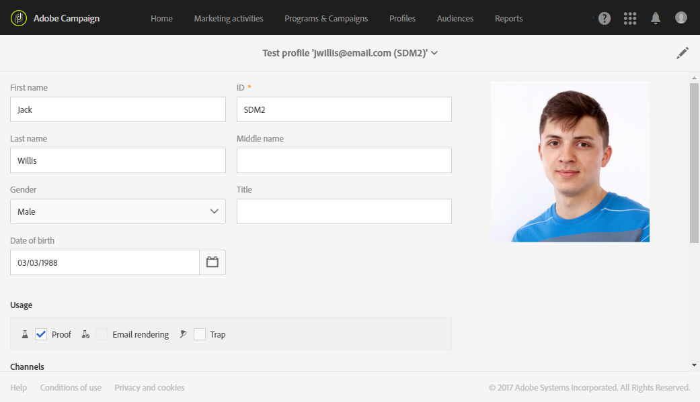

# Gerenciamento de perfis de teste {#managing-test-profiles}

## Sobre perfis de teste {#about-test-profiles}

Os perfis de teste permitem direcionar destinatários adicionais que não correspondem aos critérios de definição de metas definidos. Eles são adicionados ao público-alvo de uma mensagem para detectar qualquer uso fraudulento do banco de dados do destinatário ou para garantir que os e-mails cheguem às caixas de entrada.

Você pode gerenciar seus perfis de teste no menu avançado **[!UICONTROL Profiles & audiences > Test profiles]**.

Um perfil de teste contém informações de contato fictícias, ou informações de contato controladas pelo remetente, que podem ser usadas em uma mensagem nos seguintes contextos:

* Para enviar **provas**: A Prova é uma mensagem específica usada para verificar a mensagem antes de enviar a entrega finalizada para os destinatários. Um perfil de teste de prova é responsável pela verificação da entrega, no que diz respeito ao seu conteúdo e formato. Consulte [Enviar provas](../../sending/using/sending-proofs.md).
* Para renderização **por** email: O perfil de teste de renderização de email é usado para verificar a forma como uma mensagem é exibida de acordo com a caixa de entrada da mensagem que a recebe. Por exemplo, webmail, serviço de mensagens, celular etc. Consulte Renderização [por](../../sending/using/email-rendering.md)email.

   O uso de renderização **por** email é somente leitura. Os perfis de teste com esse uso só estão disponíveis prontamente no Adobe Campaign.

* Como uma **armadilha**: A mensagem é enviada para o perfil de teste da mesma forma que é enviada para o destino principal. Consulte [Uso de armadilhas](../../sending/using/using-traps.md).
* Para **visualizar** mensagens: Um perfil de teste pode ser selecionado ao visualizar uma mensagem para testar os elementos de personalização. Consulte [Visualizar mensagens](/help/sending/using/previewing-messages.md).

## Criação de perfis de teste {#creating-test-profiles}

1. No menu avançado, por meio do logotipo do Adobe Campaign, selecione **Perfis e públicos-alvo > Testar perfis** para acessar a lista de perfis de teste.

   

1. No **[!UICONTROL Test profiles]** painel, clique em **Criar**.

   

1. Insira os dados para este perfil.

   

1. Selecione o uso que você pretende para o seu perfil de teste.

   

1. Digite os canais de contato **[!UICONTROL Email, Telephone, Mobile, Mobile app]**, bem como o endereço do perfil de teste, se necessário.

   >[!NOTE]
   >
   >Você pode definir um formato de email preferencial: **[!UICONTROL Text]** ou **[!UICONTROL HTML]**.

1. Especifique um tipo de evento e os dados para esse evento se desejar usar esse perfil de teste para testar a personalização de uma mensagem transacional.
1. Clique em **[!UICONTROL Create]** para salvar o perfil de teste.

O perfil de teste será então adicionado à lista de perfis.

**Tópico relacionado:**

[Criação de um vídeo de perfil](https://docs.adobe.com/content/help/en/campaign-learn/campaign-standard-tutorials/profiles-and-audiences/test-profiles.html) de teste

## Editar perfis de teste {#editing-test-profiles}

Para editar um perfil de teste e consultar os dados vinculados a ele, ou para modificá-lo:

1. Selecione o perfil de teste que deseja editar clicando na imagem.
1. Consulte ou modifique os campos.

   

1. Clique **[!UICONTROL Save]** se tiver inserido suas alterações ou selecione o nome do perfil de teste e, em seguida, **[!UICONTROL Test profiles]** na seção na parte superior da tela para voltar ao painel de perfis de teste.
