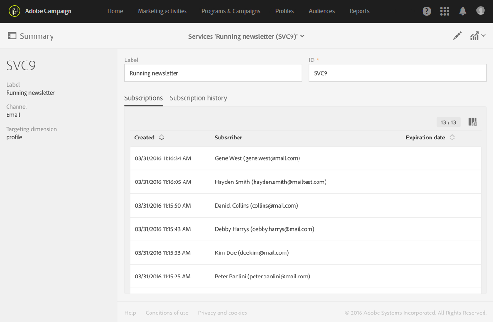
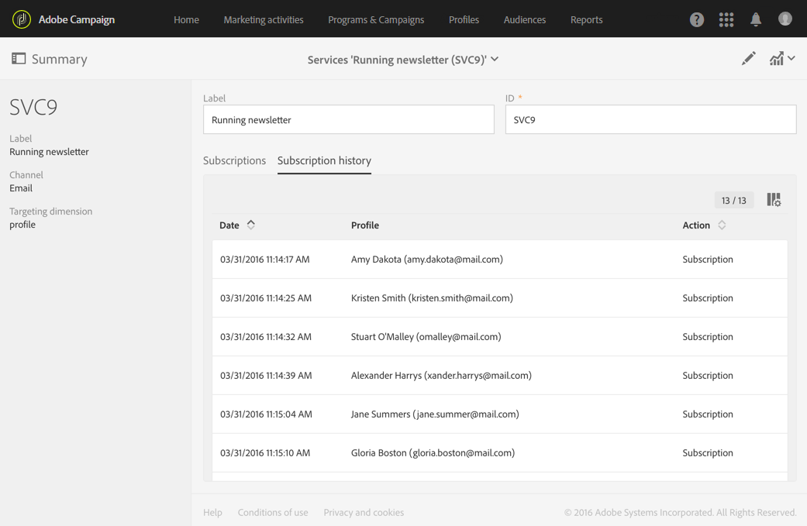
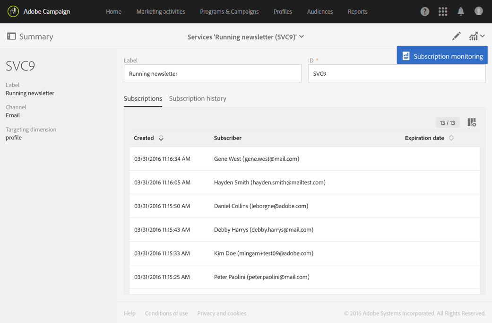
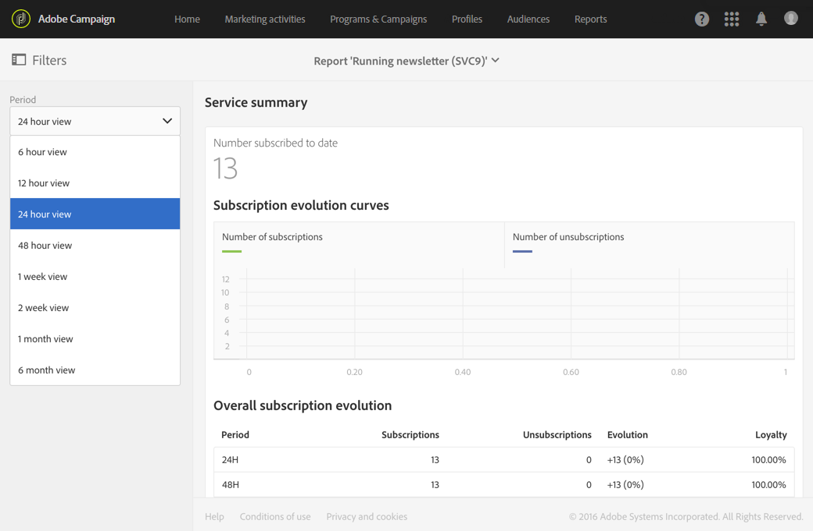
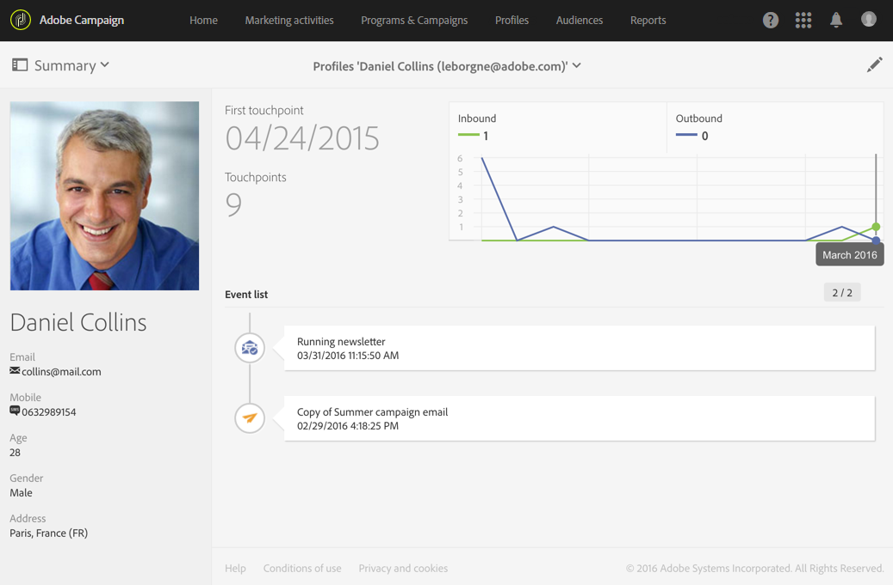

# Monitoramento de subscrições{#monitoring-subscriptions}

Use a interface do Adobe Campaign para rastrear os assinantes e medir o sucesso dos serviços.

Existem várias opções para monitorar assinaturas e cancelamentos de assinaturas:

* Exiba a lista de pessoas que assinaram seu serviço no painel do serviço. Consulte [Painel de serviço](#service-dashboard).
* Consulte o histórico de assinaturas e unsubscriptions da guia **Histórico de assinaturas** no painel do serviço. Consulte [Histórico da assinatura](#subscription-history).
* Exiba um relatório detalhando a evolução das assinaturas e dos cancelamentos de assinaturas no serviço **Relatórios**. Consulte [Relatórios de serviço](#service-reports).
* Localize a lista de serviços que uma pessoa assinou em seu **Perfil**. Consulte [Histórico de eventos vinculados a um perfil](#history-of-events-linked-to-a-profile).

## Painel de serviço {#service-dashboard}

Para exibir a lista de pessoas subscritas em um serviço:

1. Vá para a lista de serviços pelo menu avançado **Perfis e públicos-alvo** > **Serviços**, que pode ser acessado pelo logotipo do Adobe Campaign.
1. Selecione o serviço de sua escolha para exibir o painel correspondente.
1. A lista de pessoas que assinaram o serviço pode ser encontrada na guia **Assinaturas**.

## Histórico de assinatura {#subscription-history}

Para consultar o histórico de subscrição e unsubscription:

1. Vá para a lista de serviços pelo menu avançado **Perfis e públicos-alvo** > **Serviços**, que pode ser acessado pelo logotipo do Adobe Campaign.
1. Selecione o serviço de sua escolha para exibir o painel correspondente.
1. Selecione a guia **Histórico da assinatura** para exibir as datas em que cada pessoa assinou e cancelou a assinatura.

## Relatórios de serviço {#service-reports}

Para exibir um relatório detalhando a evolução das subscrições e unsubscriptions:

1. Vá para a lista de serviços pelo menu avançado **Perfis e públicos-alvo** > **Serviços**, que pode ser acessado pelo logotipo do Adobe Campaign.
1. Selecione o serviço de sua escolha para exibir o painel correspondente.
1. Clique no botão **Relatórios** na barra de ações e depois em **Monitoramento de assinatura** na tela de seleção.

   

1. O relatório de **Resumo do serviço** apresenta o número de assinaturas, a evolução geral das assinaturas e uma curva que mostra o progresso ao longo do tempo.

## Histórico de eventos vinculados a um perfil {#history-of-events-linked-to-a-profile}

Para consultar a lista de serviços que um contato assinou, você pode consultar seu histórico de marketing. Para obter mais informações, consulte a seção [Perfil de cliente integrado](../../audiences/using/integrated-customer-profile.md).

