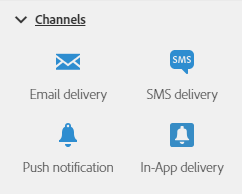

# Sobre as atividades de canal{#about-channel-activities}

Na paleta, no lado esquerdo da tela, expanda a seção **[!UICONTROL Channels]**.

Essas atividades representam os diferentes canais de comunicação disponíveis. É possível combiná-los para criar um fluxo de trabalho entre canais.

A seção **[!UICONTROL Channels]** inclui as seguintes atividades:

* [Entrega por email](../../automating/using/email-delivery.md)
* [Entrega por SMS](../../automating/using/sms-delivery.md)
* [Entrega por notificação por push](../../automating/using/push-notification-delivery.md)
* [Entrega de correspondência direta](../../automating/using/direct-mail-delivery.md)
* [Entrega no aplicativo](../../automating/using/in-app-delivery.md)
