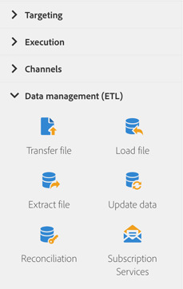

# Sobre atividades de gerenciamento de dados{#about-data-management-activities}

Na paleta, no lado esquerdo da tela, expanda a seção **[!UICONTROL Data management (ETL)]**.

Essas atividades permitem manipular dados. Eles permitem, por exemplo, importar dados, executar atualizações em massa nos campos do banco de dados, receber ou enviar arquivos ou vincular dados não identificados aos recursos existentes.

A seção **[!UICONTROL Data management (ETL)]** inclui as seguintes atividades:

* [Atualizar dados](../../automating/using/update-data.md)
* [Carregar arquivo](../../automating/using/load-file.md)
* [Transferir arquivo](../../automating/using/transfer-file.md)
* [Reconciliação](../../automating/using/reconciliation.md)
* [Extrair arquivo](../../automating/using/extract-file.md)
* [Serviços de subscrição](../../automating/using/subscription-services.md)

**[!UICONTROL Data management (ETL)]** atividades permite definir **códigos de segmento** para suas transições de saída. Em seguida, você poderá criar relatórios com base nesses códigos de segmento para medir a eficiência das suas campanhas de marketing. Para obter mais informações, consulte [esta seção](../../reporting/using/creating-a-report-workflow-segment.md).
