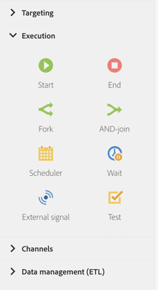

# Sobre atividades de execução{#about-execution-activities}

Na paleta, no lado esquerdo da tela, expanda a seção **[!UICONTROL Execution]**.

As atividades a seguir são específicas para organizar e executar fluxos de trabalho. Sua principal tarefa é coordenar as outras atividades.

A seção **[!UICONTROL Execution]** inclui as seguintes atividades:

* [Início e término](../../automating/using/start-and-end.md)
* [Bifurcação](../../automating/using/fork.md)
* [AND-join](../../automating/using/and-join.md)
* [Scheduler](../../automating/using/scheduler.md)
* [Aguardar](../../automating/using/wait.md)
* [Sinal externo](../../automating/using/external-signal.md)
* [Teste](../../automating/using/test.md)
