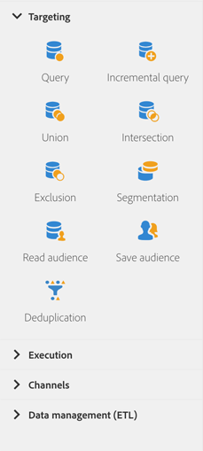

# Sobre as atividades de direcionamento{#about-targeting-activities}

Na paleta, no lado esquerdo da tela, desdobre a **[!UICONTROL Targeting]** seção.

Essas atividades são específicas para segmentação, manipulação de dados de população e filtragem de atividades. Eles permitem que você crie um ou mais públicos alvos definindo conjuntos e dividindo ou combinando esses conjuntos usando operações de interseção, união ou exclusão.

A **[!UICONTROL Targeting]** seção fornece as seguintes atividades:

* [Consulta](../../automating/using/query.md)
* [Consulta incremental](../../automating/using/incremental-query.md)
* [União](../../automating/using/union.md)
* [Interseção](../../automating/using/intersection.md)
* [Exclusão](../../automating/using/exclusion.md)
* [Segmentação](../../automating/using/segmentation.md)
* [Ler público-alvo](../../automating/using/read-audience.md)
* [Salvar público-alvo](../../automating/using/save-audience.md)
* [Eliminação de duplicação](../../automating/using/deduplication.md)
* [Enriquecimento](../../automating/using/enrichment.md)

**[!UICONTROL Targeting]** O atividade permite que você defina **códigos de segmento** para suas transições de saída. Em seguida, você pode criar relatórios com base nesses códigos de segmento para medir a eficiência de suas campanhas de marketing. Para obter mais informações, consulte [esta seção](../../reporting/using/creating-a-report-workflow-segment.md).

## Seleção de dados {#selecting-data}

Você pode selecionar dados usando as seguintes atividades:

* A **[!UICONTROL Query]** atividade permite filtrar e extrair um preenchimento de elementos do banco de dados do Adobe Campaign. Consulte a seção [Query](../../automating/using/query.md) .
* A **[!UICONTROL Incremental query]** atividade permite filtrar e extrair um preenchimento de elementos do banco de dados do Adobe Campaign. Cada vez que essa atividade é executada, os resultados das execuções anteriores são excluídos. Isso permite que você público alvo somente os novos elementos. Consulte o [seção Query incremental](../../automating/using/incremental-query.md) .
* A **[!UICONTROL Read audience]** atividade permite recuperar uma audiência existente e refiná-la aplicando condições de filtragem adicionais.Consulte a seção [Ler audiência](../../automating/using/read-audience.md) .

## Segmentação de dados {#segmenting-data}

Adobe Campaign permite processar conjuntos em dados de entrada. Assim, é possível combinar várias populações, excluir parte dela ou manter apenas os dados comuns a vários públicos alvos.

* A **[!UICONTROL Union]** atividade permite que você reagrupe o resultado de várias atividades em um único público alvo. Consulte a seção [União](../../automating/using/union.md) .
* A **[!UICONTROL Intersection]** atividade permite manter somente os elementos comuns às diferentes populações de entrada na atividade. Consulte a seção [Intersecção](../../automating/using/intersection.md) .
* A **[!UICONTROL Exclusion]** atividade permite excluir elementos de uma população de acordo com determinados critérios. Consulte a seção [Exclusão](../../automating/using/exclusion.md) .
* A **[!UICONTROL Segmentation]** atividade permite criar um ou vários segmentos a partir de uma população calculada por atividades colocadas anteriormente no fluxo de trabalho. No final da atividade, eles podem ser processados em uma única transição ou em transições diferentes. Consulte a seção [Segmentação](../../automating/using/segmentation.md) .

## Enriquecimento de dados {#enriching-data}

Os dados identificados e coletados podem ser enriquecidos, agregados e manipulados para otimizar a construção de target. Você pode simplificar e otimizar os processos de definição de metas, incluindo dados que não são modelados no data mart.

A **[!UICONTROL Additional data]** guia do **[!UICONTROL Query]** e do **[!UICONTROL Incremental query]** atividade permite aprimorar os dados direcionados pelo query e transferir esses dados para as seguintes atividades de fluxo de trabalho, onde podem ser utilizados. Em particular, você pode adicionar:

* Dados simples
* Agregados
* Coleções

**Tópicos relacionados:**

* [Caso de uso: Personalização de um email com dados adicionais](../../automating/using/personalizing-email-with-additional-data.md)
