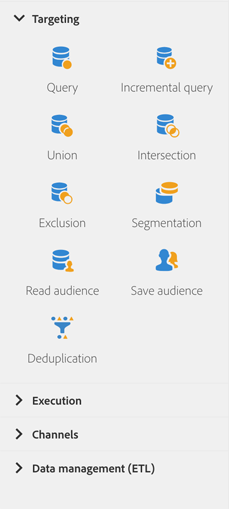

# Sobre atividades de direcionamento{#about-targeting-activities}

Na paleta, no lado esquerdo da tela, expanda a seção **[!UICONTROL Targeting]**.

Essas atividades são específicas para atividades de direcionamento, manipulação de dados de população e filtragem. Eles permitem construir um ou mais targets definindo conjuntos e dividindo ou combinando esses conjuntos usando operações de interseção, união ou exclusão.

A seção **[!UICONTROL Targeting]** inclui as seguintes atividades:

* [Consulta](../../automating/using/query.md)
* [Consulta incremental](../../automating/using/incremental-query.md)
* [União](../../automating/using/union.md)
* [Intersecção](../../automating/using/intersection.md)
* [Exclusão](../../automating/using/exclusion.md)
* [Segmentação](../../automating/using/segmentation.md)
* [Ler público-alvo](../../automating/using/read-audience.md)
* [Salvar público-alvo](../../automating/using/save-audience.md)
* [Desduplicação](../../automating/using/deduplication.md)
* [Enriquecimento](../../automating/using/enrichment.md)

**[!UICONTROL Targeting]** atividades permite definir **códigos de segmento** para suas transições de saída. Em seguida, você poderá criar relatórios com base nesses códigos de segmento para medir a eficiência das suas campanhas de marketing. Para obter mais informações, consulte [esta seção](../../reporting/using/creating-a-report-workflow-segment.md).

## Seleção de dados {#selecting-data}

É possível selecionar dados usando as seguintes atividades:

* A atividade **[!UICONTROL Query]** permite filtrar e extrair uma população de elementos do banco de dados do Adobe Campaign. Consulte a seção [Consulta](../../automating/using/query.md).
* A atividade **[!UICONTROL Incremental query]** permite filtrar e extrair uma população de elementos do banco de dados do Adobe Campaign. Todas as vezes que essa atividade é executada, os resultados das execuções anteriores são excluídos. Isso permite direcionar somente elementos novos Consulte o. Seção de [consulta incremental](../../automating/using/incremental-query.md).
* A atividade **[!UICONTROL Read audience]** permite recuperar um público-alvo para refiná-lo aplicando condições de filtragem adicionais.Consulte a seção [Ler público](../../automating/using/read-audience.md).

## Segmentação de dados {#segmenting-data}

O Adobe Campaign permite processar conjuntos em dados de entrada. Dessa forma, é possível combinar várias populações, excluir parte delas ou manter apenas dados comuns a vários targets.

* A atividade **[!UICONTROL Union]** permite reagrupar o resultado de várias atividades em um único público-alvo. Consulte a seção [União](../../automating/using/union.md).
* A atividade **[!UICONTROL Intersection]** permite manter somente os elementos comuns aos diferentes populações de entrada na atividade. Consulte a seção [Interseção](../../automating/using/intersection.md).
* A atividade **[!UICONTROL Exclusion]** permite excluir elementos de uma população de acordo com determinados critérios. Consulte a seção [Exclusão](../../automating/using/exclusion.md).
* A atividade **[!UICONTROL Segmentation]** permite criar um ou vários segmentos com base em uma população calculada pelas atividades incluídas anteriormente no fluxo de trabalho. No final da atividade, eles podem ser processados em uma única transição ou em transições diferentes. Consulte a seção [Segmentação](../../automating/using/segmentation.md).

## Enriquecimento de dados {#enriching-data}

Os dados identificados e coletados podem ser enriquecidos, agregados e manipulados para otimizar a construção de target. Você pode simplificar e otimizar os processos de segmentação ao incluir dados que não são modelados no data mart.

A guia **[!UICONTROL Additional data]** das atividades **[!UICONTROL Query]** e **[!UICONTROL Incremental query]** permite enriquecer os dados direcionados pela consulta e transferi-los para as seguintes atividades de fluxo de trabalho, onde podem ser utilizados. Você pode adicionar especificamente:

* Dados simples
* Agregados
* Coleções

**Tópicos relacionados:**

* [Caso de uso: personalização de um email com dados adicionais](../../automating/using/personalizing-email-with-additional-data.md)
