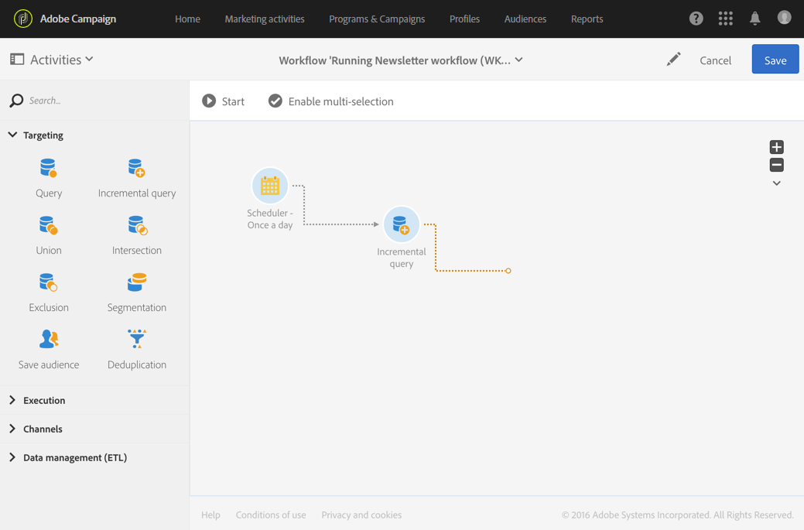
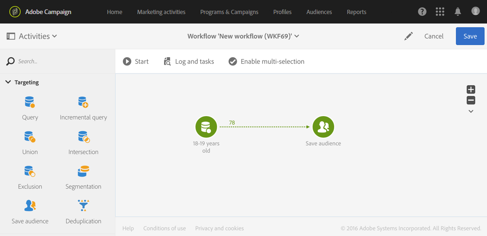

# Sobre a execução de fluxo de trabalho {#about-workflow-execution}

Um fluxo de trabalho é sempre iniciado manualmente. No entanto, uma vez iniciado, ele pode permanecer inativo, dependendo das informações especificadas em uma atividade [Scheduler](../../automating/using/scheduler.md).

>[!IMPORTANT]
>
> A Adobe recomenda que os clientes não executem mais de 20 fluxos de trabalho ativos simultaneamente e priorizem e distribuam a execução do fluxo de trabalho ao longo do tempo. Para obter mais informações, consulte as práticas recomendadas fornecidas em [esta página](../../automating/using/best-practices-workflows.md).

Ações relacionadas à execução (iniciar, parar, pausar etc.) são processos **assíncronos**: o comando é salvo e entrará em vigor assim que o servidor estiver disponível para aplicá-lo.

Em um workflow, o resultado de cada atividade é geralmente enviado para a atividade seguinte por meio de uma transição, representada por uma seta.

Uma transição não é finalizada se não estiver vinculada a uma atividade de destino.

>[!NOTE]
>
>Um fluxo de trabalho que contém transições não finalizadas ainda pode ser executado: uma mensagem de aviso será gerada e o fluxo de trabalho será pausado assim que atingir a transição, mas isso não gerará um erro. Você também pode iniciar um fluxo de trabalho sem ter concluído completamente o design e pode concluí-lo conforme avança.

Depois que uma atividade é executada, o número de registros enviados na transição é exibido acima dela.

É possível abrir transições para verificar se os dados enviados estão corretos durante ou após a execução do fluxo de trabalho. É possível visualizar os dados e a estrutura de dados.

Por padrão, somente os detalhes da última transição do workflow podem ser acessados. Para acessar os resultados das atividades anteriores, você precisa verificar a opção **[!UICONTROL Keep interim results]** na seção **[!UICONTROL Execution]** das propriedades do fluxo de trabalho, antes de iniciar o fluxo de trabalho.

>[!NOTE]
>
>Essa opção consome muita memória e foi projetada para ajudar a criar um workflow e garantir que ele esteja configurado e se comportando corretamente. Deixe-a desmarcada nas instâncias de produção.

Quando uma transição está aberta, você pode editar sua **[!UICONTROL Label]** ou vincular uma **[!UICONTROL Segment code]** a ela. Para fazer isso, edite os campos correspondentes e confirme as modificações.

Usando as APIs REST do Campaign Standard, você pode **iniciar**, **pausar**, **retomar** e **parar** um fluxo de trabalho. Você pode encontrar mais detalhes e exemplos de chamadas REST na [documentação sobre APIs.](../../api/using/controlling-a-workflow.md)
