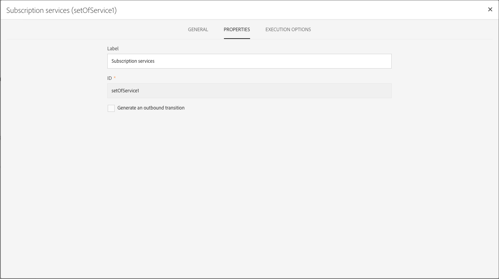

# Gerenciamento de propriedades de atividades {#activity-properties}

## Propriedades globais de uma atividade {#global-properties-of-an-activity}

Cada atividade tem uma guia **[!UICONTROL General]**, que permite modificar parâmetros gerais específicos da atividade.

A guia **[!UICONTROL Properties]** permite modificar os parâmetros globais da atividade, especialmente o rótulo e a ID. Configurar essa guia é opcional.

## Gerenciando transições de saída de atividade {#managing-an-activity-s-outbound-transitions}

Por padrão, certas atividades não têm uma transição de saída. Você pode adicionar um na guia **[!UICONTROL Transitions]** ou na guia atividade **[!UICONTROL Properties]** para aplicar outros processos à sua população no mesmo fluxo de trabalho.

Dependendo das atividades, é possível adicionar vários tipos de transições de saída:

* **Transição** padrão: população calculada pela atividade
* **Transição sem população**: esse tipo de transição de saída pode ser adicionado para continuar o fluxo de trabalho e não contém nenhuma população para não consumir nenhum espaço desnecessário no sistema.
* **Rejeita**: população rejeitada. Por exemplo, se os dados de entrada da atividade não puderam ser processados porque estavam incorretos ou incompletos.
* **Complemento**: população restante após a execução da atividade. Por exemplo, se uma atividade de segmentação estiver configurada para salvar apenas uma porcentagem da população de entrada.

Se aplicável, especifique um **[!UICONTROL Segment code]** para a transição de saída da atividade. Este código de segmento permitirá identificar de onde vêm os subconjuntos da população do público alvo e poderá, posteriormente, servir para fins de personalização de mensagens.

## Opções de execução de atividade {#activity-execution-options}

Na tela de propriedades do atividade, há uma guia **[!UICONTROL Advanced options]** que permite definir o modo e o comportamento de execução do atividade em caso de erros.

Para acessar essas opções, selecione uma atividade em um fluxo de trabalho e abra-a usando o botão  na barra de ações.

O campo **[!UICONTROL Execution]** permite que você defina a ação a ser executada quando a tarefa for iniciada. Há três opções para isso:

* **Normal**: a atividade é executada normalmente.
* **Habilitar, mas não executar**: a atividade é pausada e, como consequência, qualquer processo futuro que se suceda também. Isso pode ser útil se você quiser estar presente quando a tarefa for iniciada.
* **Não ativar**: a atividade não é executada e, consequentemente, nem todas as atividades subsequentes (no mesmo ramo).

O campo **[!UICONTROL In case of error]** permite especificar a ação a ser executada caso a atividade encontre um erro. Há duas opções disponíveis para isso:

* **Suspenda o processo**: o fluxo de trabalho é suspenso automaticamente. O status do fluxo de trabalho é então **Errôneo** e a cor associada fica vermelha. Depois que o problema for resolvido, reinicie o fluxo de trabalho.
* **Ignorar**: a atividade não é executada e, como resultado, nenhuma das atividades a seguir (na mesma ramificação). Isso pode ser útil para tarefas recorrentes. Se a ramificação tiver um scheduler colocado em upstream, isso deverá disparar na próxima data de execução.

O campo **[!UICONTROL Behavior]** permite que você defina o procedimento a ser seguido se tarefas assíncronas forem usadas. Há duas opções disponíveis para isso:

* **Várias tarefas autorizadas**: várias tarefas podem ser executadas ao mesmo tempo, mesmo que a primeira não tenha sido concluída.
* **A tarefa atual tem prioridade**: quando uma tarefa está em andamento, isso tem prioridade. Enquanto uma tarefa estiver em andamento, nenhuma outra tarefa será executada.

O campo **[!UICONTROL Max. execution duration]** permite especificar uma duração, como &quot;30s&quot; ou &quot;1h&quot;. Se a atividade não for concluída após a duração especificada, um alerta será disparado. Isso não afeta o funcionamento do fluxo de trabalho.

O campo **[!UICONTROL Affinity]** permite forçar a execução de um fluxo de trabalho ou de uma atividade de fluxo de trabalho em uma máquina específica. Para fazer isso, você deve especificar uma ou várias afinidades para o fluxo de trabalho ou a atividade em questão.

O campo **[!UICONTROL Time zone]** permite selecionar o fuso horário da atividade. A Adobe Campaign permite gerenciar as diferenças de tempo entre vários países na mesma instância. A configuração aplicada é configurada quando a instância é criada.

>[!NOTE]
>
>Por padrão, se nenhum fuso horário for selecionado, a atividade usará o fuso horário definido nas propriedades do fluxo de trabalho.

O campo **Comentário** é um campo gratuito que permite adicionar uma observação.
