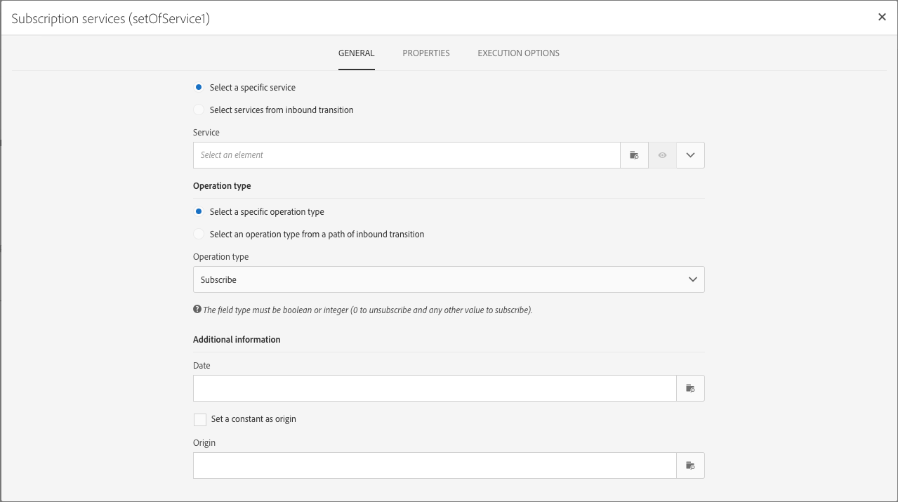
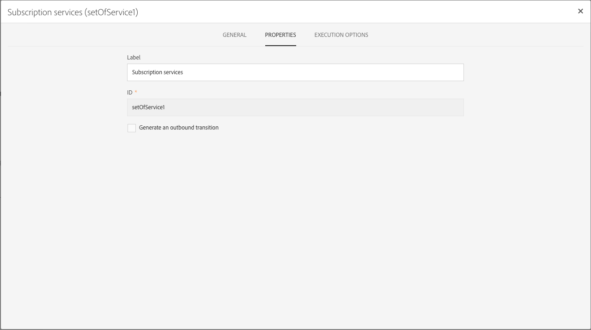
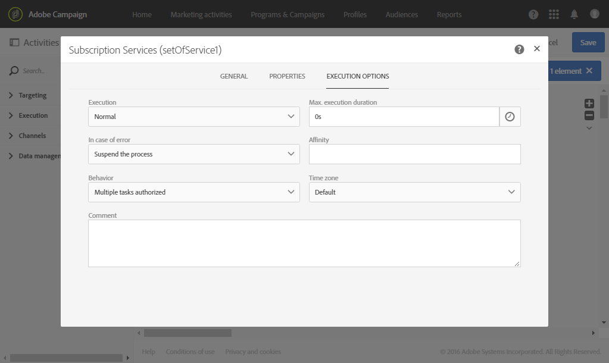

# Gerenciamento de propriedades de atividades {#activity-properties}

## Propriedades globais de uma atividade {#global-properties-of-an-activity}

Cada atividade tem uma guia **[!UICONTROL General]**, que permite modificar parâmetros gerais específicos da atividade.

A guia **[!UICONTROL Properties]** permite modificar os parâmetros globais da atividade, particularmente o rótulo e a ID. A configuração dessa guia é opcional.

## Gerenciamento de transições de saída de uma atividade {#managing-an-activity-s-outbound-transitions}

Por padrão, determinadas atividades não têm uma transição de saída. Você pode adicionar um da guia **[!UICONTROL Transitions]** ou da guia **[!UICONTROL Properties]** da atividade para aplicar outros processos à sua população no mesmo fluxo de trabalho.

Dependendo das atividades, é possível adicionar vários tipos de transições de saída:

* **Transição padrão**: população calculada pela atividade
* **Transição sem população**: esse tipo de transição de saída pode ser adicionado para continuar o fluxo de trabalho e não contém nenhuma população para não consumir espaço desnecessário no sistema.
* **Rejeições**: população rejeitada. Por exemplo, se os dados de entrada da atividade não puderem ser processados por estarem incorretos ou incompletos.
* **Complement**: população restante após a execução da atividade. Por exemplo, se uma atividade de segmentação estiver configurada para salvar apenas uma porcentagem da população de entrada.

Se aplicável, especifique um **[!UICONTROL Segment code]** para a transição de saída da atividade. Esse código de segmento permitirá identificar de onde vêm os subconjuntos da população do target e poderá, posteriormente, servir para fins de personalização de mensagens.

## Opções de execução da atividade {#activity-execution-options}

Na tela de propriedades da atividade, há uma guia **[!UICONTROL Advanced options]** que permite definir o modo de execução e o comportamento da atividade em caso de erros.

Para acessar essas opções, selecione uma atividade em um fluxo de trabalho e abra-a usando o botão  da barra de ações.

O campo **[!UICONTROL Execution]** permite definir a ação a ser executada quando a tarefa for iniciada. Há três opções para isso:

* **Normal**: a atividade é executada normalmente.
* **Habilitar, mas não executar**: a atividade está pausada e, como consequência, os processos futuros a seguir também estão. Isso pode ser útil se você quiser estar presente quando a tarefa for iniciada.
* **Não habilitar**: a atividade não é executada e, como consequência, nem todas as atividades seguintes (na mesma ramificação).

O campo **[!UICONTROL In case of error]** permite especificar a ação a ser executada caso a atividade encontre um erro. Há duas opções disponíveis para isso:

* **Suspender o processo**: o fluxo de trabalho é suspenso automaticamente. O status do fluxo de trabalho é então **Errado** e a cor associada fica vermelha. Depois que o problema for resolvido, reinicie o workflow.
* **Ignorar**: a atividade não é executada e, como resultado, nenhuma das atividades que a seguem (na mesma ramificação). Isso pode ser útil para tarefas recorrentes. Se a ramificação tiver um scheduler colocado upstream, ele deverá ser acionado na próxima data de execução.

O campo **[!UICONTROL Behavior]** permite definir o procedimento a ser seguido se tarefas assíncronas forem usadas. Há duas opções disponíveis para isso:

* **Várias tarefas autorizadas**: várias tarefas podem ser executadas ao mesmo tempo mesmo sem a conclusão da primeira.
* **A tarefa atual tem prioridade**: assim que uma tarefa estiver em andamento, ela terá prioridade. Enquanto uma tarefa ainda estiver em andamento, nenhuma outra tarefa será executada.

O campo **[!UICONTROL Max. execution duration]** permite especificar uma duração, como &quot;30s&quot; ou &quot;1h&quot;. Se a atividade não for concluída após o término da duração especificada, um alerta será acionado. Isso não afeta o funcionamento do fluxo de trabalho.

O campo **[!UICONTROL Affinity]** permite forçar a execução de um fluxo de trabalho ou de uma atividade de fluxo de trabalho em uma máquina específica. Para fazer isso, é necessário especificar uma ou várias afinidades para o workflow ou atividade em questão.

O campo **[!UICONTROL Time zone]** permite selecionar o fuso horário da atividade. O Adobe Campaign permite gerenciar as diferenças de tempo entre vários países na mesma instância. A configuração aplicada é definida quando a instância é criada.

>[!NOTE]
>
>Por padrão, se nenhum fuso horário for selecionado, a atividade usará o fuso horário definido nas propriedades do fluxo de trabalho.

O campo **Comentário** é um campo livre que permite adicionar uma observação.
