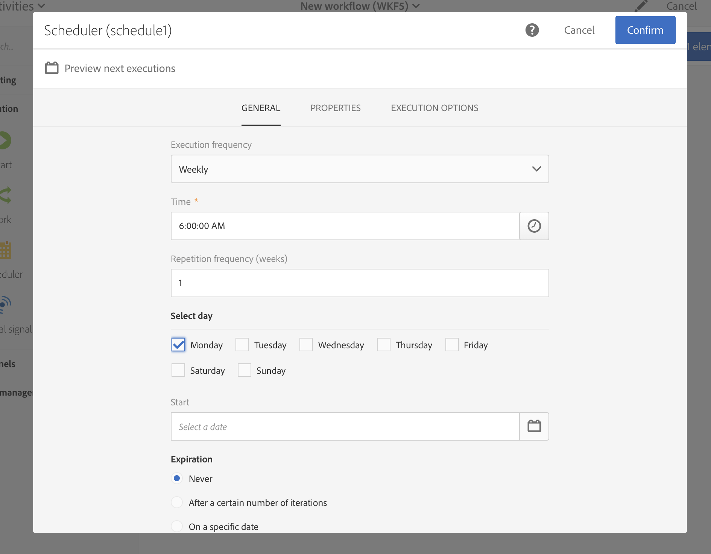

# Práticas recomendadas para workflows{#workflow-best-practices}

Com o Adobe Campaign, você pode configurar todos os tipos de fluxo de trabalho para executar um amplo escopo de tarefas. No entanto, ao projetar e executar fluxos de trabalhos, é necessário ter muito cuidado, pois uma implementação inadequada pode causar baixo desempenho, erros e problemas da plataforma. Abaixo você encontrará uma lista de práticas recomendadas e dicas para solução de problemas.

>[!NOTE]
>
>O design e a execução do fluxo de trabalho devem ser executados por um usuário avançado do Adobe Campaign.

## Nomenclatura{#naming}

Para facilitar a solução de problemas do fluxo de trabalho, a Adobe recomenda nomear e rotular explicitamente seus fluxos de trabalho. Preencha o campo de descrição do fluxo de trabalho para resumir o processo a ser executado para que o operador possa entendê-lo facilmente.
Se o fluxo de trabalho for parte de um processo que envolve vários fluxos de trabalho, você poderá usar números ao inserir um rótulo para organizá-los de maneira clara.

Por exemplo:

* 001 – Importar – Importar recipients
* 002 – Importar – Importar vendas
* 003 – Importar – Importar detalhes de vendas
* 010 – Exportar – Exportar logs de deliveries
* 011 – Exportar – Exportar logs de rastreamento

## Fluxos de trabalho duplicados{#duplicating-workflows}

Você pode duplicar fluxos de trabalho. Em **[!UICONTROL Marketing Activities]**, passe o mouse sobre o fluxo de trabalho e clique em **[!UICONTROL Duplicate element]**. Após a duplicação, as modificações do fluxo de trabalho não são transferidas para a cópia do fluxo de trabalho. A cópia do fluxo de trabalho pode ser editada.

## Execução{#execution}

### Quantidade de fluxos de trabalhos

Por padrão, recomendamos não executar mais de 20 fluxos de trabalho ativos simultaneamente. Após atingir esse limite, os fluxos de trabalho serão enfileirados para não afetar o desempenho. Da mesma forma, a Adobe recomenda que você separe a execução do fluxo de trabalho ao longo do tempo.
Em contextos específicos, talvez seja necessário executar mais de 20 fluxos de trabalho. Isso não se aplica a fluxos de trabalho que estejam aguardando uma execução programada.  Em caso afirmativo, verifique os casos de uso com um especialista do Campaign e entre em contato com o Atendimento ao cliente da Adobe para aumentar o limite.

>[!NOTE]
>
>Antes de iniciar um workflow, [!DNL Campaign Standard] verificará se há memória física do sistema suficiente para executar o workflow. Se não houver memória disponível suficiente, uma mensagem informará que a execução do workflow será adiada até que a carga no servidor seja reduzida e a memória do sistema aumente.

### Frequência

Um fluxo de trabalho não pode ser executado automaticamente mais de uma vez a cada dez minutos.
A frequência de repetição da atividade não pode ser inferior a 10 minutos. Se a frequência de repetição for definida como 0 (também o valor padrão), essa opção não será considerada e o fluxo de trabalho será executado de acordo com a frequência de execução.

### Fluxos de trabalho pausados

Fluxos de trabalho que estão em estado de pausa ou de falha há mais de 7 dias são interrompidos para consumir menos espaço em disco. A tarefa de limpeza é exibida nos logs do fluxo de trabalho.

### Transições

Um fluxo de trabalho que contém transições não finalizadas ainda pode ser executado: uma mensagem de aviso será gerada e o fluxo de trabalho será pausado assim que ele atingir a transição, mas não ocorrerá erro. Você também pode iniciar um fluxo de trabalho sem finalizar o design e concluí-lo conforme avança.

Para mais informações, consulte [Execução de fluxos de trabalho](../../automating/using/about-workflow-execution.md).

### Fuso horário

As propriedades do fluxo de trabalho permitem definir um fuso horário específico que será usado por padrão em todas as atividades. Por padrão, o fuso horário do workflow é aquele definido para o operador atual do Campaign.

## Atividade{#activity}

### Número de atividades por workflow {#number-activities}

Recomendamos usar até 100 atividades em um único workflow. Mais de 100 atividades, você pode encontrar alguns problemas de desempenho ao projetar e configurar seu fluxo de trabalho.

### Design do fluxo de trabalho

Para garantir que o workflow termine corretamente, evite deixar a última transição de um workflow por conta própria usando um **[!UICONTROL End activity]**.

Para acessar a visualização detalhada das transições, marque a opção **[!UICONTROL Keep interim results]**, na seção Execução das propriedades do fluxo de trabalho.

>[!CAUTION]
>
>Essa opção consome bastante espaço do disco e foi projetada para ajudar a criar um fluxo de trabalho e garantir a configuração e o comportamento adequados. Deixe-a desmarcada nas instâncias de produção.

### Atividades de rotulagem{#activity-labeling}

Ao desenvolver o fluxo de trabalho, um nome é gerado para cada atividade, como para todos os objetos do Adobe Campaign. Embora o nome de uma atividade seja gerado pela ferramenta e não possa ser editado, recomendamos que ele seja rotulado com um nome explícito ao configurá-la.

### Duplicação de atividades{#activity-duplicating}

Para duplicar atividades existentes, é possível usar as funções de copiar e colar. Dessa forma, você mantém as configurações que foram originalmente definidas. Para mais informações, consulte [Duplicação de atividades de fluxo de trabalho](../../automating/using/workflow-interface.md).

### Atividade Scheduler{#acheduler-activity}

Ao criar o fluxo de trabalho, use somente uma **[!UICONTROL Scheduler activity]** por ramificação. Se a mesma ramificação de um fluxo de trabalho tiver vários schedulers (vinculados uns aos outros), a quantidade de tarefas a serem executadas será multiplicada exponencialmente, o que sobrecarregará consideravelmente o banco de dados.

Você pode pré-visualizar as próximas dez execuções de seus fluxos de trabalho clicando em **[!UICONTROL Preview next executions]**.

Para mais informações, consulte [Atividade de Scheduler](../../automating/using/scheduler.md).

Ao projetar um workflow agendado que inclui várias atividades, é necessário garantir que o workflow não seja reagendado até sua conclusão. Para fazer isso, é necessário configurar o workflow para impedir a execução se uma ou mais tarefas de uma execução anterior ainda estiverem pendentes. Para obter mais informações, consulte [esta página](../../automating/using/scheduled-workflows-execution.md).

## Chamada de fluxo de trabalho com parâmetros{#workflow-with-parameters}

Certifique-se de que o nome e a quantidade de parâmetros sejam idênticos ao definido ao chamar o workflow (consulte [esta página](../../automating/using/defining-parameters-calling-workflow.md). Os tipos de parâmetros também devem ser consistentes com os valores esperados.

Verifique se todos os parâmetros foram declarados no **[!UICONTROL External signal activity]**. Caso contrário, ocorrerá um erro ao executar a atividade.

Para mais informações, consulte [Chamar um fluxo de trabalho com parâmetros externos](../../automating/using/calling-a-workflow-with-external-parameters.md).

## Exportação de pacotes{#exporting-packages}

Para exportar pacotes, os recursos exportados não devem conter IDs padrão. Portanto, as IDs de recursos exportáveis devem ser alteradas usando um nome diferente dos modelos fornecidos como padrão pelo Adobe Campaign Standard.
Para mais informações, consulte [Gerenciamento de pacotes](../../automating/using/managing-packages.md).

## Exportar listas{#exporting-lists}

A opção Exportar lista permite exportar um máximo de 100 mil linhas por padrão, definidas pela opção **Nms_ExportListLimit**. Essa opção pode ser gerenciada pelo administrador funcional, em **[!UICONTROL Administration]** > **[!UICONTROL Application settings]** > **[!UICONTROL Options]**.
Para mais informações, consulte [Exportação de listas](../../automating/using/exporting-lists.md).

## Solução de problemas{#workflow-troubleshooting}

O Adobe Campaign oferece vários logs para entender melhor seus problemas de fluxo de trabalho.

### Uso de logs de fluxo de trabalho{#using-workflow-logs}

Você pode acessar logs de fluxo de trabalho para monitorar a execução de suas atividades. Eles indicam as operações efetuadas e os erros de execução por ordem cronológica. A guia Logs consiste no histórico da execução de todas ou de algumas atividades selecionadas.
A guia Tasks detalha a sequência de execução das atividades. Para mais informações sobre uma atividade, clique em uma tarefa.
Para mais informações, consulte [Monitoramento da execução do fluxo de trabalho](../../automating/using/monitoring-workflow-execution.md).

#### Resolução de problemas de atividades de gestão de dados{#troubleshooting-data-management-activities}

Você pode analisar consultas SQL na guia Log.

1. Na espaço de trabalho do fluxo de trabalho, clique em **[!UICONTROL Edit properties]**.
1. Em **[!UICONTROL General]** > **[!UICONTROL Execution]**, marque as opções **[!UICONTROL Save SQL queries in the log]** e **[!UICONTROL Execute in the engine]** e clique em **[!UICONTROL Confirm]**.

**Para ver consultas SQL no Log:**
1. Clique em **[!UICONTROL Log and Tasks]**.
1. Na guia **[!UICONTROL Logs]**, abra o painel **[!UICONTROL Search]**.
1. Marque **[!UICONTROL Display SQL logs only]**.

A consulta é exibida na coluna **[!UICONTROL Message]** dos logs.

### Uso de logs do delivery{#using-delivery-logs}

Com os Logs do delivery é possível monitorar o sucesso de seus deliveries. Os logs de exclusão retornam mensagens excluídas durante a preparação do envio. Os logs de envio fornecem o status do delivery para cada perfil.
Para mais informações, consulte [Conhecimento das falhas de delivery](../../sending/using/understanding-delivery-failures.md).

### Uso de alertas de delivery{#delivery-alerting}

O recurso de Alerta de delivery é um sistema de gerenciamento de alertas que permite que um grupo de usuários receba automaticamente notificações contendo informações sobre a execução de seus deliveries.
Para mais informações, consulte [Alertas de delivery](../../sending/using/receiving-alerts-when-failures-happen.md).

**Tópicos relacionados:**

* [Gerenciamento de erros](../../automating/using/monitoring-workflow-execution.md)
