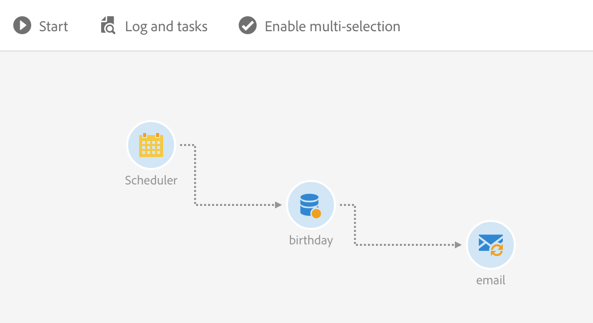
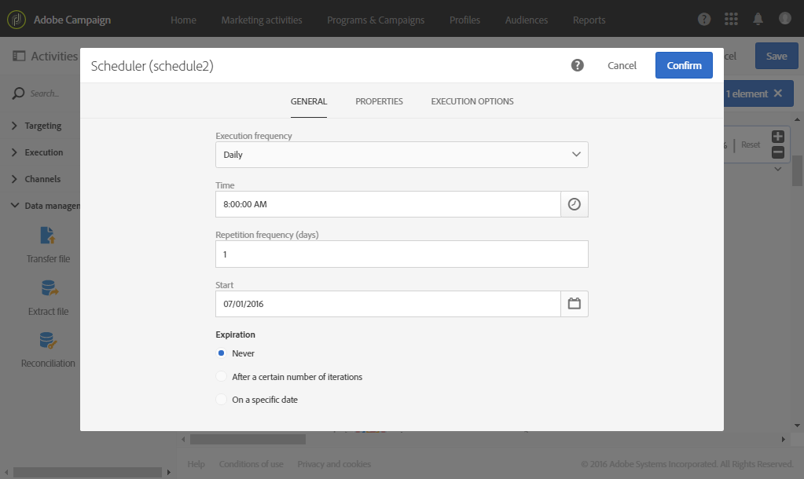
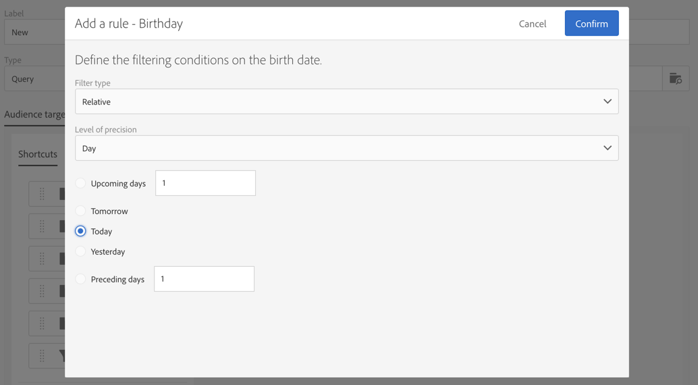
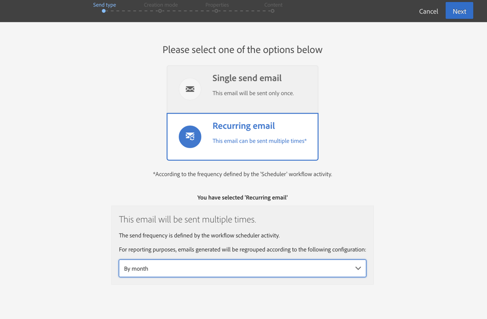

# Entrega de aniversário {#birthday-delivery}

Esse exemplo é um fluxo de trabalho de aniversário. Todos os dias, um email é enviado a perfis cujo aniversário é nesse dia.

Para criar o workflow, siga estas etapas:

* O [Scheduler](../../automating/using/scheduler.md) permite iniciar o fluxo de trabalho todos os dias às 8h.

  

* A atividade [Query](../../automating/using/query.md) permite calcular os perfis que forneceram um email e cujo aniversário é no dia atual, sempre que o fluxo de trabalho é executado. O cálculo do aniversário é executado usando um filtro predefinido, disponível na paleta da ferramenta de edição de consultas.

  

* A [Entrega de email](../../automating/using/email-delivery.md) é recorrente. Os envios são agregados por mês. Assim, todos os emails enviados em um mês são agregados em uma única visualização. Portanto, em um ano, 365 entregas são executadas, mas são agrupadas em 12 visualizações (também chamadas de **execuções recorrentes**) na interface do Adobe Campaign. O histórico e os detalhes do relatório são exibidos todos os meses e não para cada envio.

  
