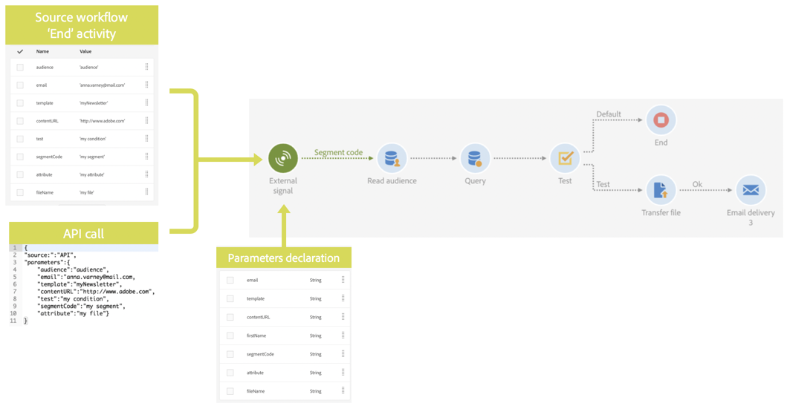

# Visão geral {#calling-a-workflow-with-external-parameters}

O Campaign Standard permite chamar um fluxo de trabalho com parâmetros (um nome de público-alvo para o target, um nome de arquivo para importar, uma parte do conteúdo da mensagem etc.). Dessa forma, você pode integrar facilmente as automações do Campaign ao sistema externo.

Vamos ver o exemplo a seguir, em que queremos enviar emails diretamente de uma CMS. Nesse caso, você pode configurar seu sistema para selecionar o público-alvo e o conteúdo de email na CMS. Clicar em Enviar chamará um fluxo de trabalho de Campanha com esses parâmetros, permitindo que você os use no fluxo de trabalho para definir o público-alvo e o conteúdo de URL a ser usado no delivery.

O processo para chamar um workflow com parâmetros é o seguinte:

1. Declarar os parâmetros na atividade **[!UICONTROL External signal]**. Consulte [Declaração de parâmetros na atividade de sinal externo](../../automating/using/declaring-parameters-external-signal.md).
1. Configure a atividade **[!UICONTROL End]** ou a chamada de API para definir os parâmetros e acionar a atividade **[!UICONTROL External signal]** do fluxo de trabalho. Ver [esta página](../../automating/using/defining-parameters-calling-workflow.md)
1. Depois que o fluxo de trabalho é acionado, os parâmetros são assimilados nas variáveis de eventos do fluxo de trabalho e podem ser usados nele. Consulte [esta página](../../automating/using/customizing-workflow-external-parameters.md).

