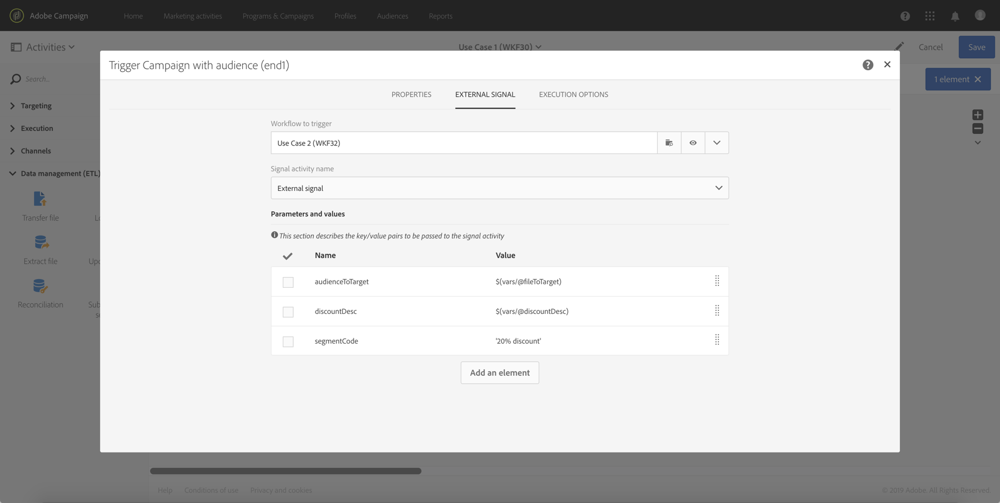

# Chamada de um fluxo de trabalho com parâmetros externos{#calling-a-workflow-with-external-parameters}

O Campaign Standard permite que você chame um fluxo de trabalho com parâmetros (um nome de público-alvo a ser direcionado, um nome de arquivo a ser importado, uma parte do conteúdo da mensagem etc.). Dessa forma, você pode integrar facilmente suas automações do Campaign ao seu sistema externo.

Vejamos o exemplo a seguir, no qual queremos enviar emails diretamente de um CMS. Nesse caso, você pode configurar seu sistema para selecionar o público-alvo e enviar conteúdo por email para o CMS. Clicar em Enviar chamará um fluxo de trabalho de Campanha com esses parâmetros, permitindo que você os use no fluxo de trabalho para definir o público-alvo e o conteúdo do URL a serem usados na entrega.

O processo para chamar um fluxo de trabalho com parâmetros é o seguinte:

1. Declarar os parâmetros na **[!UICONTROL External signal]** atividade. Consulte [Declaração dos parâmetros na atividade](../../automating/using/calling-a-workflow-with-external-parameters.md#declaring-the-parameters-in-the-external-signal-activity)de sinal externo.
1. Configure a **[!UICONTROL End]** atividade ou a chamada da API para definir os parâmetros e acionar a **[!UICONTROL External signal]** atividade do fluxo de trabalho.

Depois que o fluxo de trabalho é acionado, os parâmetros são ingeridos nas variáveis de eventos do fluxo de trabalho e podem ser usados no fluxo de trabalho. Consulte [Personalização de um fluxo de trabalho com parâmetros](../../automating/using/calling-a-workflow-with-external-parameters.md#customizing-a-workflow-with-external-parameters)externos.


## Declaração dos parâmetros na atividade de sinal externo {#declaring-the-parameters-in-the-external-signal-activity}

A primeira etapa para chamar um fluxo de trabalho com parâmetros é declará-los em uma **[!UICONTROL External signal]** atividade.

1. Abra a **[!UICONTROL External signal]** atividade e selecione a **[!UICONTROL Parameters]** guia.
1. Clique no **[!UICONTROL Create element]** botão e especifique o nome e o tipo de cada parâmetro.

   >[!CAUTION]
   >
   >Certifique-se de que o nome e o número de parâmetros sejam idênticos ao definido ao chamar o fluxo de trabalho (consulte [Definição dos parâmetros ao chamar o fluxo de trabalho](../../automating/using/calling-a-workflow-with-external-parameters.md#defining-the-parameters-when-calling-the-workflow)). Além disso, os tipos de parâmetros devem ser compatíveis com os valores esperados.

   

1. Depois que os parâmetros forem declarados, conclua a configuração do fluxo de trabalho e execute-a.

## Definição dos parâmetros ao chamar o fluxo de trabalho {#defining-the-parameters-when-calling-the-workflow}

Esta seção detalha como definir parâmetros ao chamar um fluxo de trabalho. Para obter mais informações sobre como executar essa operação a partir de uma chamada de API, consulte a documentação [](../../api/using/triggering-a-signal-activity.md)REST APIs.

Antes de definir os parâmetros, verifique se:

* Os parâmetros foram declarados na **[!UICONTROL External Signal]** atividade. Consulte [Declaração dos parâmetros na atividade](../../automating/using/calling-a-workflow-with-external-parameters.md#declaring-the-parameters-in-the-external-signal-activity)de sinal externo.
* O fluxo de trabalho que contém a atividade de sinal está em execução.

Para configurar a **[!UICONTROL End]** atividade, siga as etapas abaixo:

1. Abra a **[!UICONTROL End]** atividade e selecione a **[!UICONTROL External signal]** guia.
1. Selecione o fluxo de trabalho e a atividade do sinal externo que você deseja chamar.
1. Clique no **[!UICONTROL Create element]** botão para adicionar um parâmetro e, em seguida, preencha seu nome e valor.

   * **[!UICONTROL Name]**: o nome que foi declarado na **[!UICONTROL External signal]** atividade (consulte [Declaração dos parâmetros na atividade](../../automating/using/calling-a-workflow-with-external-parameters.md#declaring-the-parameters-in-the-external-signal-activity)de sinal externo).
   * **[!UICONTROL Value]**: o valor que você deseja atribuir ao parâmetro. O valor deve seguir a sintaxe **** Padrão, descrita [nesta seção](../../automating/using/advanced-expression-editing.md#standard-syntax).
   

   >[!CAUTION]
   >
   >Verifique se todos os parâmetros foram declarados na **[!UICONTROL External signal]** atividade. Caso contrário, ocorrerá um erro ao executar a atividade.

1. Depois que os parâmetros forem definidos, confirme a atividade e salve seu fluxo de trabalho.

## Monitoramento das variáveis de eventos {#monitoring-the-events-variables}

É possível monitorar as variáveis de eventos disponíveis no fluxo de trabalho, incluindo os parâmetros externos declarados. Para fazer isso, siga as etapas abaixo:

1. Selecione a atividade que segue a **[!UICONTROL External signal]** atividade e clique no **[!UICONTROL Log and tasks]** botão.
1. Na **[!UICONTROL Tasks]** guia, clique no  botão.

   

1. O contexto de execução da tarefa é exibido (ID, status, duração etc.), incluindo todas as variáveis de eventos que agora estão disponíveis para uso no fluxo de trabalho.

   

## Customizing a workflow with external parameters {#customizing-a-workflow-with-external-parameters}

Depois que o fluxo de trabalho é acionado, os parâmetros são ingeridos nas variáveis de eventos e podem ser usados para personalizar as atividades do fluxo de trabalho.

Eles podem, por exemplo, ser usados para definir qual público-alvo ler na **[!UICONTROL Read audience]** atividade, o nome do arquivo a ser transferido na **[!UICONTROL Transfer file]** atividade etc.

As atividades que podem ser personalizadas com variáveis de eventos são detalhadas [nesta seção](../../automating/using/calling-a-workflow-with-external-parameters.md#customizing-activities-with-events-variables).

### Uso de variáveis de eventos {#using-events-variables}

As variáveis de eventos são usadas em uma expressão que deve respeitar a sintaxe **[](../../automating/using/advanced-expression-editing.md#standard-syntax)**Padrão.

A sintaxe para usar variáveis de eventos deve seguir o formato abaixo e usar o nome do parâmetro que foi definido na **[!UICONTROL External signal]** atividade (consulte [Declaração dos parâmetros na atividade](../../automating/using/calling-a-workflow-with-external-parameters.md#declaring-the-parameters-in-the-external-signal-activity)de sinal externo):

```
$(vars/@parameterName)
```

Nessa sintaxe, a função **$** retorna o tipo de dados **de string** . Se desejar especificar outro tipo de dados, use as seguintes funções:

* **$long**: número inteiro.
* **$float**: número decimal.
* **$boolean**: true/false.
* **$datetime**: carimbo de data e hora.

Ao usar uma variável em uma atividade, a interface fornece ajuda para chamá-la.


* : selecione a variável events entre todas as variáveis disponíveis no fluxo de trabalho.

   

* : editar expressões que combinam variáveis e funções. For more on the Expression editor, refer to [this section](../../automating/using/advanced-expression-editing.md).

   

**Tópicos relacionados:**

* [Editar uma expressão](../../automating/using/advanced-expression-editing.md#edit-an-expression)
* [Sintaxe padrão](../../automating/using/advanced-expression-editing.md#standard-syntax)
* [Lista de funções](../../automating/using/list-of-functions.md)

### Personalização de atividades com variáveis de eventos {#customizing-activities-with-events-variables}

As variáveis de eventos podem ser usadas para personalizar várias atividades, listadas na seção abaixo. Para obter mais informações sobre como chamar uma variável de uma atividade, consulte [esta seção](../../automating/using/calling-a-workflow-with-external-parameters.md#using-events-variables).

**[!UICONTROL Read audience]** atividade: defina o público-alvo a ser direcionado com base nas variáveis de eventos.

For more on how to use the activity, refer to the [dedicated section](../../automating/using/read-audience.md).


**[!UICONTROL Test]** atividade: crie condições com base nas variáveis de eventos.

For more on how to use the activity, refer to the [dedicated section](../../automating/using/test.md).


**[!UICONTROL Transfer file]** atividade: personalize o arquivo a ser transferido com base nas variáveis de eventos.

For more on how to use the activity, refer to the [dedicated section](../../automating/using/transfer-file.md).


**[!UICONTROL Query]** atividade: parâmetros podem ser referenciados em uma consulta usando expressões que combinam variáveis e funções de eventos. Para fazer isso, adicione uma regra e clique no **[!UICONTROL Advanced mode]** link para acessar a janela de edição de expressão (consulte Edição [de expressões](../../automating/using/advanced-expression-editing.md)avançadas).

For more on how to use the activity, refer to the [dedicated section](../../automating/using/query.md).


**[!UICONTROL Channels]** atividades: personalize entregas com base nas variáveis de eventos.

>[!NOTE]
>
>Os valores dos parâmetros de entrega são recuperados sempre que a entrega é preparada.
>
>A preparação recorrente das entregas é baseada no período **de** agregação da entrega. Por exemplo, se o período de agregação for &quot;por dia&quot;, a entrega será repreparada apenas uma vez por dia. Se o valor de um parâmetro de entrega for modificado durante o dia, ele não será atualizado na entrega, pois já foi preparado uma vez.
>
>Se você planeja chamar o fluxo de trabalho várias vezes por dia, use a [!UICONTROL No aggregation] opção para que os parâmetros de entrega sejam atualizados sempre. Para obter mais informações sobre a configuração de entregas recorrentes, consulte [esta seção](/help/automating/using/email-delivery.md#configuration).

Para personalizar uma entrega com base nas variáveis de eventos, você deve declarar primeiro na atividade de entrega as variáveis que deseja usar:

1. Selecione a atividade e clique no  botão para acessar as configurações.
1. Selecione a **[!UICONTROL General]** guia e adicione as variáveis de eventos que estarão disponíveis como campos de personalização na entrega.

   

1. Clique no botão **[!UICONTROL Confirm]**.

As variáveis de eventos declaradas agora estão disponíveis na lista de campos de personalização. Você pode usá-los na entrega para executar as ações abaixo:

* Defina o nome do modelo a ser usado para a entrega.

   >[!NOTE]
   >
   >Esta ação está disponível somente para entregas **recorrentes** .

   

* Personalize a entrega: ao selecionar um campo de personalização para configurar uma entrega, as variáveis de eventos estão disponíveis no **[!UICONTROL Workflow parameters]** elemento. Você pode usá-los como qualquer campo de personalização, por exemplo, para definir o assunto da entrega, o remetente etc.

   A personalização da entrega é detalhada [nesta seção](../../designing/using/personalization.md).

   

**Códigos** do segmento: defina o código do segmento com base nas variáveis de eventos.

>[!NOTE]
>
>Essa ação pode ser executada a partir de qualquer atividade que permita definir um código de segmento como, por exemplo, **[!UICONTROL Query]** ou **[!UICONTROL Segmentation]** atividades.


**Rótulo** de entrega: defina o rótulo de entrega com base nas variáveis de eventos.


## Caso de uso {#use-case}

O caso de uso abaixo mostra como chamar o fluxo de trabalho com parâmetros em seus fluxos de trabalho.

O objetivo é acionar um fluxo de trabalho a partir de uma chamada de API com parâmetros externos. Esse fluxo de trabalho carregará dados no banco de dados a partir de um arquivo e criará um público-alvo associado. Depois que o público-alvo for criado, um segundo fluxo de trabalho será acionado para enviar uma mensagem personalizada com os parâmetros externos definidos na chamada da API.

Para executar esse caso de uso, é necessário executar as ações abaixo:

1. **Faça uma chamada** de API para acionar o Workflow 1 com parâmetros externos. Consulte a [Etapa 1: Configuração da chamada](../../automating/using/calling-a-workflow-with-external-parameters.md#step-1--configuring-the-api-call)da API.
1. **Criar fluxo de trabalho 1**: o fluxo de trabalho transferirá um arquivo e o carregará no banco de dados. Em seguida, ele testará se os dados estão vazios ou não e, eventualmente, salvará os perfis em um público-alvo. Finalmente, acionará o Workflow 2. Consulte a [Etapa 2: Configuração do fluxo de trabalho 1](../../automating/using/calling-a-workflow-with-external-parameters.md#step-2--configuring-workflow-1).
1. **Criar fluxo de trabalho 2**: o fluxo de trabalho lerá o público-alvo que foi criado no Fluxo de trabalho 1, em seguida, enviará uma mensagem personalizada para os perfis, com um código de segmento personalizado com os parâmetros. Consulte a [Etapa 3: Configuração do fluxo de trabalho 2](../../automating/using/calling-a-workflow-with-external-parameters.md#step-3--configuring-workflow-2).


### Pré-requisitos {#prerequisites}

Antes de configurar os fluxos de trabalho, é necessário criar o Fluxo de trabalho 1 e 2 com uma **[!UICONTROL External signal]** atividade em cada um deles. Dessa forma, você poderá direcionar essas atividades de sinal ao chamar os fluxos de trabalho.

### Etapa 1: Configurar a chamada de API {#step-1--configuring-the-api-call}

Faça uma chamada de API para acionar o Workflow 1 com parâmetros. Para obter mais informações sobre a sintaxe de chamada da API, consulte a documentação [das APIs REST do](../../api/using/triggering-a-signal-activity.md)Campaign Standard.

Em nosso caso, queremos chamar o fluxo de trabalho com os parâmetros abaixo:

* **fileToTarget**: o nome do arquivo que queremos importar para o banco de dados.
* **discountDesc**: a descrição que queremos exibir na entrega do desconto.

```
-X POST https://mc.adobe.io/<ORGANIZATION>/campaign/<TRIGGER_URL>
-H 'Authorization: Bearer <ACCESS_TOKEN>' 
-H 'Cache-Control: no-cache' 
-H 'X-Api-Key: <API_KEY>' 
-H 'Content-Type: application/json;charset=utf-8' 
-H 'Content-Length:79' 
-i
-d {
-d "source:":"API",
-d "parameters":{
-d "fileToTarget":"profile.txt",
-d "discountDesc":"Running shoes"
-d } 
```

### Etapa 2: Configuração do fluxo de trabalho 1 {#step-2--configuring-workflow-1}

O fluxo de trabalho 1 será criado como abaixo:

* **[!UICONTROL External signal]** atividade: onde os parâmetros externos devem ser declarados para serem usados no fluxo de trabalho.
* **[!UICONTROL Transfer file]** atividade: importa o arquivo com o nome definido nos parâmetros.
* **[!UICONTROL Load file]** atividade: carrega dados do arquivo importado no banco de dados.
* **[!UICONTROL Update data]** atividade: insira ou atualize o banco de dados com dados do arquivo importado.
* **[!UICONTROL Test]** atividade: verifica se há dados importados.
* **[!UICONTROL Save audience]** atividade: se o arquivo contiver dados, salvará os perfis em um público-alvo.
* **[!UICONTROL End activity]** atividade: chama o Workflow 2 com os parâmetros que você deseja usar dentro dele.


Siga as etapas abaixo para configurar o fluxo de trabalho:

1. Declarar os parâmetros que foram definidos na chamada da API. Para fazer isso, abra a **[!UICONTROL External signal]** atividade e adicione os nomes e os tipos dos parâmetros.

   

1. Adicione uma **[!UICONTROL Transfer file]** atividade para importar dados para o banco de dados.Para fazer isso, arraste e solte a atividade, abra-a e selecione a **[!UICONTROL Protocol]** guia.
1. Selecione a **[!UICONTROL Use a dynamic file path]** opção e use o parâmetro **fileToTarget** como o arquivo a ser transferido:

   ```
   $(vars/@fileToTarget)
   ```

   

1. Carregue os dados do arquivo no banco de dados.

   Para fazer isso, arraste e solte uma **[!UICONTROL Load file]** atividade no fluxo de trabalho e configure-a de acordo com suas necessidades.

1. Insira e atualize o banco de dados com dados do arquivo importado.

   Para fazer isso, arraste e solte uma **[!UICONTROL Update data]** atividade e, em seguida, selecione a **[!UICONTROL Identification]** guia para adicionar um critério de reconciliação (no nosso caso, o campo de **email** ).

   

1. Selecione a **[!UICONTROL Fields to update]** guia e especifique os campos a serem atualizados no banco de dados (no nosso caso, os campos **first name** e **email** ).

   

1. Verifique se os dados são recuperados do arquivo. Para fazer isso, arraste e solte uma **[!UICONTROL Test]** atividade no fluxo de trabalho e clique no **[!UICONTROL Add an element]** botão para adicionar uma condição.
1. Nomeie e defina a condição. Em nosso caso, queremos testar se a transição de saída contém dados com a sintaxe abaixo:

   ```
   $long(vars/@recCount)>0
   ```

   

1. Se os dados forem recuperados, salve-os em um público-alvo. Para fazer isso, adicione uma **[!UICONTROL Save audience]** atividade ao **Target e não uma transição vazia** . Em seguida, abra-a.
1. Selecione a **[!UICONTROL Use a dynamic label]** opção e use o parâmetro **fileToTarget** como o rótulo do público-alvo:

   ```
   $(vars/@fileToTarget)
   ```

   

1. Arraste e solte uma **[!UICONTROL End]** atividade que chamará o Workflow 2 com parâmetros e, em seguida, abra-a.
1. Selecione a **[!UICONTROL External signal]** guia e especifique o fluxo de trabalho a ser acionado e a atividade do sinal associada.
1. Defina os parâmetros que você deseja usar dentro do Workflow 2 e seus valores associados.

   Em nosso caso, queremos passar os parâmetros originalmente definidos na chamada da API (**fileToTarget** e **discountDesc**) e um parâmetro **segmentCode** adicional com um valor constante (&quot;desconto de 20%&quot;).

   

O fluxo de trabalho 1 está configurado, agora é possível criar o Fluxo de trabalho 2. Para obter mais informações, consulte [esta seção](../../automating/using/calling-a-workflow-with-external-parameters.md#step-3--configuring-workflow-2).

### Etapa 3: Configuração do fluxo de trabalho 2 {#step-3--configuring-workflow-2}

O fluxo de trabalho 2 será criado como abaixo:

* **[!UICONTROL External signal]** atividade: onde os parâmetros devem ser declarados para serem usados no fluxo de trabalho.
* **[!UICONTROL Read audience]** atividade: lê o público-alvo salvo no Fluxo de trabalho 1.
* **[!UICONTROL Email delivery]** atividade: envia uma mensagem recorrente para o público-alvo, personalizado com parâmetros.


Siga as etapas abaixo para configurar o fluxo de trabalho:

1. Declarar os parâmetros que foram definidos no Workflow 1.

   Para fazer isso, abra a **[!UICONTROL External signal]** atividade e adicione o nome e o tipo de cada parâmetro definido na **[!UICONTROL End]** atividade do Workflow 1.

   

1. Use o público-alvo salvo no Fluxo de trabalho 1. Para fazer isso, arraste e solte uma **[!UICONTROL Read audience]** atividade no fluxo de trabalho e abra-a.
1. Selecione a **[!UICONTROL Use a dynamic audience]** opção e use o parâmetro **fileToTarget** como o nome do público-alvo para ler:

   ```
   $(vars/@fileToTarget)
   ```

   

1. Nomeie a transição de saída de acordo com o parâmetro **segmentCode** .

   Para fazer isso, selecione a **[!UICONTROL Transition]** guia e, em seguida, a **[!UICONTROL Use a dynamic segment code]** opção.

1. Use o parâmetro **segmentCode** como o nome da transição de saída:

   ```
   $(vars/@segmentCode)
   ```

   

1. Arraste e solte uma **[!UICONTROL Email delivery]** atividade para enviar uma mensagem ao público-alvo.
1. Identifique os parâmetros a serem usados na mensagem para personalizá-la com o parâmetro **discountDesc** . Para fazer isso, abra as opções avançadas da atividade e adicione o nome e o valor do parâmetro.

   

1. Agora você pode configurar a mensagem. Abra a atividade e selecione **[!UICONTROL Recurring email]**.

   

1. Selecione o modelo a ser usado e defina as propriedades do email de acordo com suas necessidades.
1. Use o parâmetro **discountDesc** como um campo de personalização. Para fazer isso, selecione-o na lista de campos de personalização.

   

1. Agora você pode concluir a configuração da mensagem e enviá-la como de costume.

   

### Execução dos fluxos de trabalho {#executing-the-workflows}

Depois que os fluxos de trabalho forem criados, você poderá executá-los. Verifique se os dois fluxos de trabalho foram iniciados antes de executar a chamada da API.
